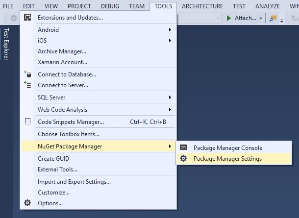
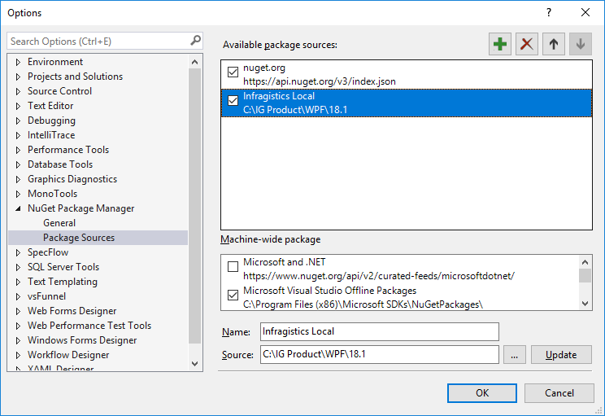
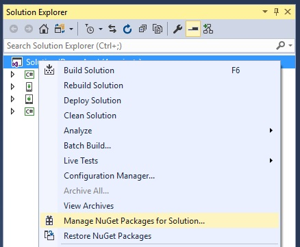
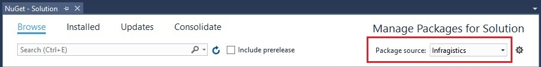

= Infragistics NuGet Package Sources

NuGet is a powerful ecosystem of tools and services. It was introduced in 2010 as an open source package manager for the Microsoft development platform including .NET. NuGet is the easiest way to improve and automate your development practices.

When you install a package via NuGet, it copies the library files to your solution and automatically updates your project. That means adding references, changing config files, replacing old version script files, etc.

Nuget has been included by default since Visual Studio 2012, and for more information on how to get going with it, read the official link:http://docs.nuget.org/ndocs/guides/install-nuget[Nuget documentation].

=== In this topic

This topic contains the following sections:

* <<adding_package_source,Adding a local package source>>
* <<adding_infragistics_feed,Adding the Infragistics NuGet Feed>>
* <<use_in_project,Using packages in your application>>

[[adding_package_source]]
=== Adding a local package source

If you have the NuGet packages stored on your machine in some directory adding a package source that points to that directory is very easy.  In Visual Studio, select Tools -> NuGet Package Manager -> Package Manager Settings.

Next, add a new package source in the Package Sources menu.  Make sure to set the Source field to the location of the directory where your packages are kept.

That's it! The packages are now ready for use.

[[adding_infragistics_feed]]
=== Adding the Infragistics NuGet Feed

Infragistics provides a public NuGet feed for licensed users to consume and add licensed Infragistics Ultimate UI control packages to their applications via the NuGet Package Manager.

In order to use the feed it needs to be added to NuGet Package Manager as a package source.  Navigate to Tools -> NuGet Package Manager -> Package Manager Settings.

In the Package Sources section, add a new package source.  In the *Name* field, provide a name such as "Infragistics" and in the *Source* field provide the address of the Infragistics NuGet feed (URL: https://packages.infragistics.com/nuget/licensed) and click the Update button. 

Note, starting with NuGet protocol version 3, please use this updated feed (URL: https://packages.infragistics.com/nuget/licensed/v3/index.json). For more details on whether to use v3 or older please visit: **https://devblogs.microsoft.com/nuget/nuget-3-what-and-why/**. Protocol v3 is applicable only when using newer versions of NuGet clients (after 2015). Older NuGet clients may or may not be compatible with v3.

image::images/nuget-package-manager-package-sources-ig-server.jpg[]

The Infragistics NuGet feed is now ready to use.

[[use_in_project]]
=== Using packages in your application

Now that your package sources are setup it is time to add them to your project. Open the solution's NuGet package manager.

Select the Infragistics NuGet feed as a package source.

Enter your credentials when prompted.

image::images/nuget-login.jpg[]

Find an Infragistics control package and install it into your solution following these steps:

. Search for an Infragistics control package.
. Select the package when found.
. Select which projects in your solution will have the package installed.
. Select the package version and click Install.

image::images/nuget-manage-packages-ig-server-wpf-vs.jpg[]