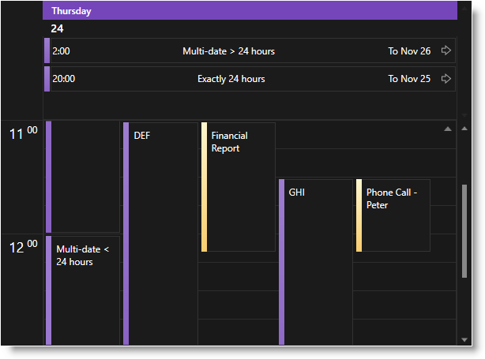
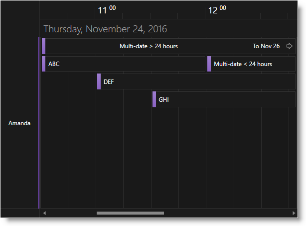
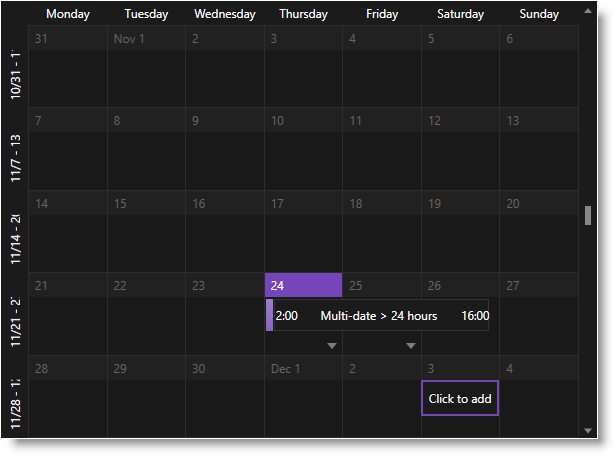
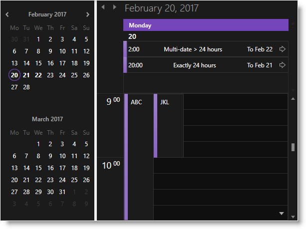
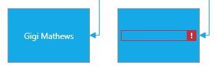
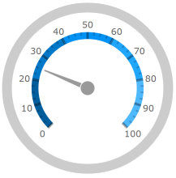
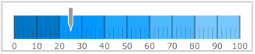

////
|metadata|
{
    "name": "whats-new-in-2017-volume-1",
    "controlName": [""],
    "tags": [],
    "guid": "c8fc4210-e08d-4f52-a9bd-ef7e8eb4b1d8","buildFlags": [],
    "createdOn": "2016-11-23T11:34:48.574014Z"
}
|metadata|
////

= What's New in 2017 Volume 1

== Purpose

This topic gives a brief overview of the new controls and features introduced in the {ProductName} 2017 Volume 1 Release.

== Royal Dark Theme for xamSchedule

There is now a Royal Dark Theme for all views of the _xamSchedule_ control.

*xamDayView:* +
 +
*xamScheduleView:* +
 +
*xamMonthView:* +
 +
*xamOutlookCalendarView and xamDateNavigator:* +
 +

== xamDiagram

==== Restricting User Interactions

The xamDiagram control now supports properties for restricting certain user interactions like entering editing mode, resizing and deleting.

*Related topic:* +
link:xamdiagram-configuring-restricting-user-interactions.html[Configuring User Interactions Restrictions (xamDiagram)]

{empty} +

==== Enter Key Behavior

The xamDiagram control now supports configuring of the behavior when the *Enter* key is pressed in editing mode.

*Related topic:* +
link:xamdiagram-general-overview.html[General Overview (xamDiagram)]

{empty} +

==== Hiding Toolbox Header

The control now supports an easy way to hide the toolbox's header using the link:{ApiPlatform}controls.charts.xamdiagram{ApiVersion}~infragistics.controls.charts.xamdiagramtoolbox~headervisibility.html[HeaderVisibility] property.

*Related topic:* +
link:xamdiagram-configuring-the-toolbox.html[Configuring the Toolbox (xamDiagram)]

{empty} +

==== Line Jumps

The control now supports rendering of "line jumps" in case when two connections are intersecting.

image:images/xamDiagram_LineJumps_Arc.png[]

*Related topic:* +
link:xamdiagram-configuring-connections-line-jumps.html[Configuring the Line Jumps of Diagram Connections (xamDiagram)]

{empty} +

==== New Behavior When Dropping or Copy-Pasting xamDiagram's Items.

There is a change in some properties' behavior when an item is dropped from the toolbox or copy-pasted:

* `DragDropData` - this new property is copied using "shallow copy"
* `Content` - this property is copied using "deep copy"

*Related topic:* +
link:xamdiagram-copy-when-drop-from-toolbox.html[Dropping an Item from the Toolbox (xamDiagram)]

{empty} +

==== IDataErrorInfo Support

The control now supports visualizing of error indicators when the data items are implementing the `IDataErrorInfo` interface.

*Related topic:* +
link:xamdiagram-idataerrorinfo-support.html[IDataErrorInfo Support (xamDiagram)]

== xamEditors

==== Spin Wrap Behavior

The link:{ApiPlatform}editors{ApiVersion}~infragistics.windows.editors.xammaskededitor.html[xamMaskedEditor] and all other editors which extend from it (i.e. link:{ApiPlatform}editors{ApiVersion}~infragistics.windows.editors.xamcurrencyeditor.html[xamCurrencyEditor], link:{ApiPlatform}editors{ApiVersion}~infragistics.windows.editors.xamnumericeditor.html[xamNumericEditor], and link:{ApiPlatform}editors{ApiVersion}~infragistics.windows.editors.xamdatetimeeditor.html[xamDateTimeEditor]) are now exposing a new property - link:{ApiPlatform}editors{ApiVersion}~infragistics.windows.editors.xammaskededitor~spinwrapbehavior.html[SpinWrapBehavior] of type link:{ApiPlatform}editors{ApiVersion}~infragistics.windows.editors.spinwrapbehavior.html[SpinWrapBehavior] which determines the value spinning behavior of the editor. Its default value is `WrapAcrossSections` which breaks the default spin wrap behavior of the editors comparing to the previous versions. This new property replaces the obsolete link:{ApiPlatform}editors{ApiVersion}~infragistics.windows.editors.xammaskededitor.html[xamMaskedEditor]'s `SpinWrap` property.

==== Japanese Imperial Date Support

The _xamDateTimeEditor_ control now supports Japanese Imperial date format.

image:images/xamEditors_JIDS_03.png[]

*Related topics:*

link:xameditors-japanese-imperial-date-support.html[Japanese Imperial Date Support]

== xamNumericSlider and xamNumericRangeSlider

A new property `IsNaNValueSupported` of `bool` type is added to the link:{ApiPlatform}controls.editors.xamslider{ApiVersion}~infragistics.controls.editors.xamnumericslider.html[xamNumericSlider] and link:{ApiPlatform}controls.editors.xamslider{ApiVersion}~infragistics.controls.editors.xamnumericrangeslider.html[xamNumericRangeSlider] controls.

The purpose of this property is to enable the support for `NaN` values and to allow further interactions with the slider. Until now, if a `NaN` value is set to the slider value – interactions using the mouse (thumb dragging, clicking on the +/- buttons for example) and the keyboard were disabled. 

.Note
[NOTE]
====
This property does not change the specified slider value (NaN value) – it just enables keyboard and mouse interactions with the slider.
====

*Related topics:*

link:{ApiPlatform}controls.editors.xamslider{ApiVersion}~infragistics.controls.editors.xamnumericslider~isnanvaluesupported.html[xamNumericSlider.IsNaNValueSupported]

link:{ApiPlatform}controls.editors.xamslider{ApiVersion}~infragistics.controls.editors.xamnumericrangeslider~isnanvaluesupported.html[xamNumericRangeSlider.IsNaNValueSupported]

== xamPropertyGrid

==== Brush Resources Panel

The _xamPropertyGrid_ control now supports a new configurable Brush Resources panel in the brush editor. +
image:images/xamPropertyGrid_Brush_Resources.png[] +
*Related topic:* +
link:xampropertygrid-conf-brush-resources.html[Configuring Brush Resources (xamPropertyGrid)] +

{empty} +

==== Prevent Editing of Bound Dependency Properties

The _xamPropertyGrid_ control now supports a configurable option to hide the value of bound dependency properties.

*Related topic:* +
link:xampropertygrid-features-overview.html[Features Overview (xamPropertyGrid)]

{empty} +

==== Expansion of Custom Editors

The _xamPropertyGrid_ control now exposes a new link:{ApiPlatform}controls.editors.xampropertygrid{ApiVersion}~infragistics.controls.editors.propertygridpropertyitem~allowexpansionwhenusingcustomeditor.html[AllowExpansionWhenUsingCustomEditor] property on the link:{ApiPlatform}controls.editors.xampropertygrid{ApiVersion}~infragistics.controls.editors.propertygridpropertyitem.html[PropertyGridPropertyItem] class which allows you to configure the control to expand properties with custom editors defined via link:{ApiPlatform}controls.editors.xampropertygrid{ApiVersion}~infragistics.controls.editors.propertygrideditordefinition.html[PropertyGridEditorDefinition].

== xamDataChart

==== Property Changes
New properties were added to deprecate properties for enabling chart zooming. The older properties are still useable to support backwards compatibility.

* {DataChartName}.HorizontalZoomable -> link:{DataChartLink}.{DataChartName}{ApiProp}IsHorizontalZoomEnabled.html[{DataChartName}.IsHorizontalZoomEnabled]

* {DataChartName}.VerticalZoomable -> link:{DataChartLink}.{DataChartName}{ApiProp}IsVerticalZoomEnabled.html[{DataChartName}.IsVerticalZoomEnabled]

*Related topic:* +
link:datachart-chart-navigation.html[Chart Navigation]

== xamPieChart

==== Property Changes
New properties were added to make styling various aspects of the pie chart simpler.  These properties are:

* Leader lines
** link:{PieChartLinkBase}.{PieChartBase}{ApiProp}LeaderLineOpacity.html[LeaderLineOpacity]
** link:{PieChartLinkBase}.{PieChartBase}{ApiProp}LeaderLineStroke.html[LeaderLineStroke]
** link:{PieChartLinkBase}.{PieChartBase}{ApiProp}LeaderLineStrokeThickness.html[LeaderLineStrokeThickness]
* Others category
** link:{PieChartLinkBase}.{PieChartBase}{ApiProp}OthersCategoryFill.html[OthersCategoryFill]
** link:{PieChartLinkBase}.{PieChartBase}{ApiProp}OthersCategoryOpacity.html[OthersCategoryOpacity]
** link:{PieChartLinkBase}.{PieChartBase}{ApiProp}OthersCategoryStroke.html[OthersCategoryStroke]
** link:{PieChartLinkBase}.{PieChartBase}{ApiProp}OthersCategoryStrokeThickness.html[OthersCategoryStrokeThickness]
* Selected slices
** link:{PieChartLinkBase}.{PieChartBase}{ApiProp}SelectedSliceFill.html[SelectedSliceFill]
** link:{PieChartLinkBase}.{PieChartBase}{ApiProp}SelectedSliceOpacity.html[SelectedSliceOpacity]
** link:{PieChartLinkBase}.{PieChartBase}{ApiProp}SelectedSliceStroke.html[SelectedSliceStroke]
** link:{PieChartLinkBase}.{PieChartBase}{ApiProp}SelectedSliceStrokeThickness.html[SelectedSliceStrokeThickness]

== xamGeographicMap

==== Property Changes
A new property was added to the Geographic Map imagery called link:{GeoMapLink}.GeographicMapImagery{ApiProp}CacheSize.html[CacheSize].  This property allows control over the maximum number of tiles that get cached by the map.

The property link:{GeoMapLink}.OpenStreetMapImagery{ApiProp}TilePath.html[TilePath] was also added to the OpenStreetMap imagery.  This allows you to specify a URL pointing to the location where the OpenStreetMap tile images are obtained.

== xamRadialGauge, xamLinearGauge and xamBulletGraph
==== Changes to visual defaults
The gauges have had their default visuals updated for this release.

*xamRadialGauge:* +
 +

*xamLinearGauge:* +
 
 +
 +

*xamBulletGraph:* +
image:images/whats_new_2017_1_bulletgraphtheme.png[]