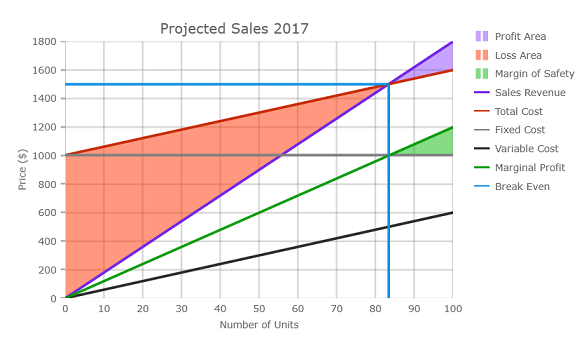
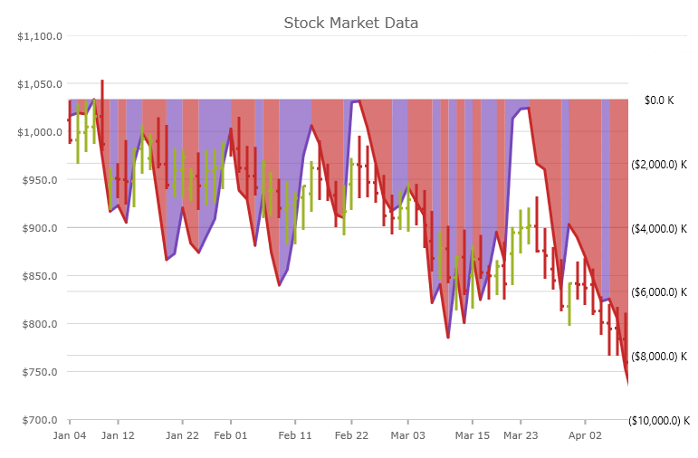
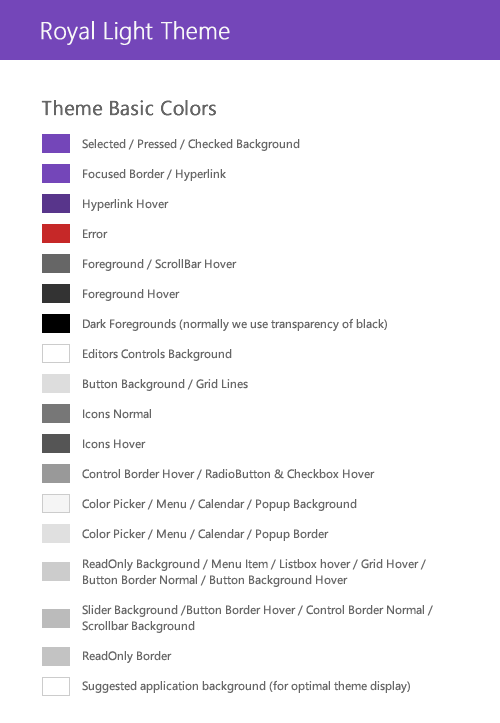
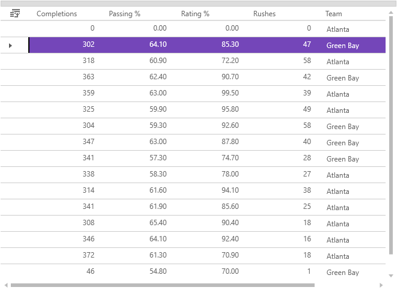
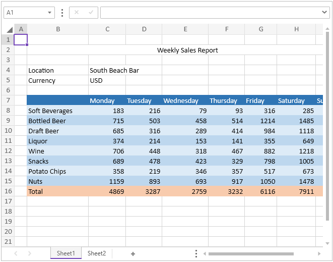
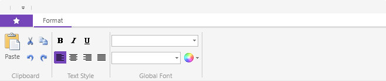

////
|metadata|
{
    "name": "whats-new-in-2017-volume-1",
    "controlName": [""],
    "tags": [],
    "guid": "c8fc4210-e08d-4f52-a9bd-ef7e8eb4b1d8","buildFlags": [],
    "createdOn": "2016-11-23T11:34:48.574014Z"
}
|metadata|
////

= What's New in 2017 Volume 2

== Overview

This topic gives a brief overview of the new controls and features introduced in the {ProductName} 2017 Volume 2 Release. The main features are listed below and the following sections explain them in details.

* New Control - xamShapeChart (RTM)
* New Control - xamScatterChart (CTP)
* New Scatter Series - xamDataChart
* New TimeXAxis - xamDataChart
* New Theme - Royal Light Theme

{empty} +

== Data Presenter Family of Controls

The `SimpleTextBlock` which is found in the editor templates found in cell templates now uses `GlyphRun` instead of `FormattedText`. This leads to significant performance improvements when rendering the cell's text. For more details, please see link:xamdata-performance-optimizations-overview.html[Performance Optimizations Overview (xamDataPresenter)] topic 
  
{empty} +

== xamShapeChart (RTM)

The link:shapechart-overview.html[XamShapeChart] is a lightweight, highly performant chart. This chart can be easily configured to display scatter X/Y points or data items with at least 2 numeric data columns. The chart can also plot data from shape files as either `Polygon` or `Polyline` visualizations. Also, you can plot any custom shape by using an list of lists of `Point` objects with X/Y properties. 

The `XamShapeChart` control is using a smart data adapter in order to analyze bound data and select an appropriate visualization to render.  For example, if the link:{DataChartLink}.XamShapeChart{ApiProp}ChartType.html[ChartType] property is set to `Auto` and the data set contains three numeric data columns named `X`, `Y`, and `Radius` then a bubble chart will be plotted.  Or if the 3d numeric column is `Value` instead of `Radius` then the chart will choose to draw a colored surface using a triangulation of X and Y coordinates with a numeric value assigned to each pixel of the surface.  However, it is possible to specify which chart type the `XamShapeChart` will use by setting the link:{DataChartLink}.XamScatterChart{ApiProp}ChartType.html[ChartType] property to one of the following values: `Area`,`Bubble`,`Contour`,`HighDensity`,`Point`,`Line`, `Spline`, `Polygon`, or `Polyline`. For more details, please see link:shapechart-getting-started-with-shapechart.html[Getting Started with {ShapeChartName}] topic

image:images/shapechart_overview_whats_new.png[Shapechart Visualizations]

In addition, the Shape Chart can render break-even data as long as at least one data item has `FixedCost`, `VariableCost`, `SalesRevenue`, and `SalesUnits` data columns. The following screenshot displays the shape chart control bound to break-even data. For more details, please see link:shapechart-binding-to-break-even-data.html[Binding Break-Even Data in {ShapeChartName}] topic

 
    
== xamScatterChart (CTP)

The link:{DataChartLink}.XamScatterChart.html[xamScatterChart] is also lightweight, high performance chart with an extremely simple and intuitive API. The main difference from the `XamShapeChart` control, is that it does not support complex visualizations such as `Polygon` and `Polyline` but rather just simple visualizations (`Area`,`Bubble`,`Contour`,`HighDensity`,`Point`,`Line`, and `Spline`) that you can use to display X/Y data (either as a collection or a collection of collections) and the chart will take care of everything else.
 
image:images/scatterchart_overview_whats_new.png[]

== xamDataChart Features

==== New Scatter Series
There are 4 new types of scatter series added to the {DataChartName} control. The following image show preview of these series, followed by a table with their description with links to topics that explain them in details.
 
image:images/datachart-new-scatter-series.png[Scatter Series]

[options="header", cols="30a,70a"]
|====
|Series Type |Description

|`ScatterAreaSeries` 
|The link:datachart-scatter-area-series.html[Scatter Area Series] draws a colored surface based on a triangulation of X and Y data with a numeric value assigned to each point. This series is useful for rendering heat maps, magnetic field strength or WiFi strength in an office.

|`ScatterContourSeries` 
|The link:datachart-scatter-contour-series.html[Scatter Contour Series]  draws colored contour lines based on a triangulation of X and Y data with a numeric value assigned to each point. This series is useful for rendering contour maps, changes in magnetic field strength or rendering an overlay on top of `ScatterAreaSeries` .

|`ScatterPolygonSeries` 
|The link:datachart-scatter-polygon-series.html[Scatter Polygon Series] is a visual element that displays data using polygons. This type of series can render any shape that you desire. All you need to do is bind a `List` of `List` of `Point` objects or just load a shape file with polygons using the `ShapefileConverter`.

|`ScatterPolylineSeries` 
|The link:datachart-scatter-polyline-series.html[Scatter Polyline Series]
is a series that displays data using polylines. This type of scatter series is often used where rendering disconnected lines are required such as a network graph or multiple connections between scatter data points. This series has the same data requirements as `ScatterPolygonSeries` does and it also can render data from shape files.

|====

==== New TimeXAxis
A new axis, link:{DataChartLink}.TimeXAxis.html[TimeXAxis], is added to the {DataChartName} this release. By default, this axis will automatically apply label formats which dynamically change as the user zooms into data. In addition, axis breaks may be configured to omit dates within a range.  For example, weekends can be skipped, or any range of dates considered insignificant can be skipped. The axis can also be configured to override the default label-formatting scheme for custom configuration of labels at varying visible date ranges. For more details, please see  link:datachart-using-time-x-axis.html[Using Time X-Axis] topic

 

 
== Royal Light Theme

The Royal Light theme is a consistent and simplified new theme enriched with more visual states, featuring improved UX and light colors. 

{nbsp} +
*Featured Colors:* +

{nbsp} +
*xamDataGrid* +

{nbsp} +
*xamSpreadsheet* +

{nbsp} +
*xamRibbon* +

{nbsp} +
*Related topics:* +
link:designers-guide-using-themes.html[Themes] +
link:ms-controls-implicit-themes.html[MS Controls Implicit Themes]