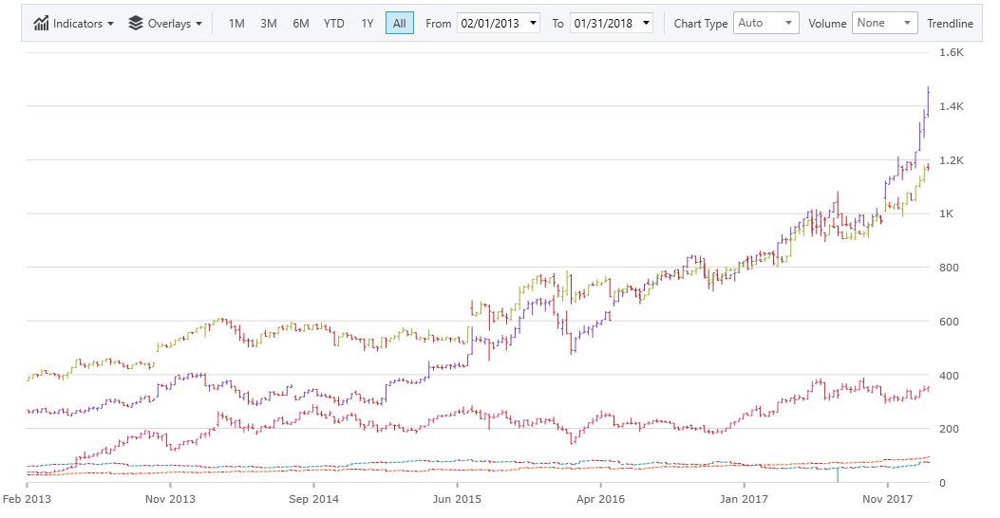
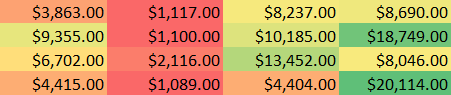
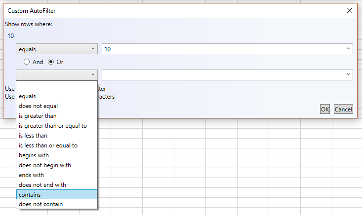
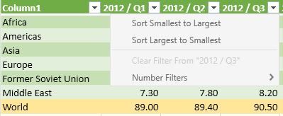
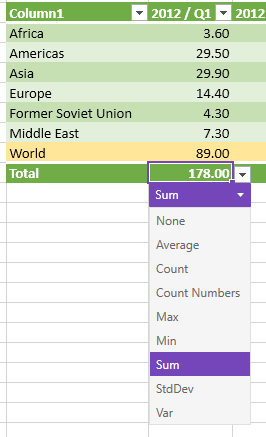

////
|metadata|
{
    "tags": [],
    "controlName": [""]
}
|metadata|
////

= What's New in 2018 Volume 1

This topic gives a brief overview of the new controls and features introduced in the {ProductName} 2018 Volume 1 Release. The main features are listed below and the following sections explain them in details.

toc::[]

== New Control - {FinancialChartName}

The link:{FinancialChartLink}.{FinancialChartName}.html[{FinancialChartName}] is a lightweight, high-performance chart. This chart can be easily configured to display financial data using an extremely simple and intuitive API. All you need to do is bind your data (a collection or a collection of collections) and the chart takes care of everything else.

The chart offers multiple ways for the user to visualize and interpret the data, including several display modes for price and volume, and many financial indicators. The chart also makes use of label formatting to give the data context.

For more information about the {FinancialChartName}, please see the link:financial-chart-gettingstarted.html[Getting Started with {FinancialChartName}] topic.

== Excel Engine Features

=== Auto Fit Width

We have added two new methods to the WorksheetColumn to support auto fit width.

The CalculateAutoFitWidth method returns the width required for a particular WorksheetColumn to fit all of its elements.

The AutoFitWidth method sizes the WorksheetColumn to the width returned by the CalculateAutoFitWidth method.

=== Conditional Formatting
Conditional formatting allows you to automatically apply formatting — such as colors, icons, and data bars — to one or more cells based on the cell value. To do this, you'll need to create a conditional formatting rule. For example, a conditional formatting rule might be if the value is less than $2000, color the cell red. By applying this rule, you would be able to quickly see which cells contain values less than $2000.

You can learn more about conditional formatting in Excel here: link:excelengine-conditional-formatting.html[Excel Engine Conditional Formatting].

=== Worksheet Sorting and Filtering
We already had support in our engine for sorting and filtering within a WorksheetTable. Excel also has the ability to define a single area within the worksheet outside of a table that you can do sorting and filtering within and you can also define one other area within a worksheet that is sorted. Therefore, we added support for these worksheet level sorting and filtering operations to our Excel Engine. In addition we made the icon sorting/filtering classes public. Previously these were internal because the only way to specify an icon is via an iconset conditional format and we didn’t support conditional formatting.

You can learn more about Worksheet filtering in {ExcelEngineName} here: link:excelengine-filtering-worksheet-regions.html[Excel Engine Worksheet Filtering].

You can learn more about Worksheet sorting in {ExcelEngineName} here: link:excelengine-worksheet-level-sorting.html[{ExcelEngineName} Sorting].

=== Support for more Excel functions
The Excel engine now has over 100 supported functions.
link:excelengine-list-of-supported-built-in-functions.html[See the full list here].

== {DataGridName} Features

=== Cell Merging

The {DataGridName} control may now opt-in and detect when adjacent sibling data records for a specific Field contains the same value. While the cells are not in edit mode, the value displays across the data records.

For more about merged cells in the {DataGridName} control, see the following topic: link:xamdatagrid-cell-merging.html[Cell Merging in {DataGridName}].

image:images/xamdatagrid_merged_cells_whats_new.png[]

=== Image Field

The {DataGridName} now has a specific Field element specialized for images. The ImageField can be associated with a property on an underlying data item whose value represents an ImageSource, a Uri instance or string that describes a Uri instance that describes the location of an image, or byte array.

For more about the new ImageField in the {DataGridName} control, see the following topic: link:xamdatagrid-configuring-image-field.html[Configuring Image Field].

image:images/xamdatagrid_image_field_whats_new.png[]

== {SpreadsheetName} Features

=== Conditional Formatting
With the addition of the conditional formatting feature in the Excel Engine, we can now leverage this in the spreadsheet. The spreadsheet supports rendering all conditional formatting features available in Microsoft Excel. Microsoft Excel has several predefined styles — or presets — you can use to quickly apply conditional formatting to your data. They are grouped into three categories:

* Data Bars are horizontal bars added to each cell, much like a bar graph. +
image:images/ConditionalFormattingDataBars.png[]
* Color Scales change the color of each cell based on its value. Each color scale uses a two- or three-color gradient. For example, in the Green-Yellow-Red color scale, the highest values are green, the average values are yellow, and the lowest values are red. +

* Icon Sets add a specific icon to each cell based on its value. +
image:images/ConditionalFormattingIconSets.png[]

Note: Conditional formatting will be copied when copying/pasting within the spreadsheet.

=== Format Cells Dialog
The {SpreadsheetName} lets you change many of the ways it displays data in a cell. For example, you can specify the number of digits to the right of a decimal point, or you can add a pattern and border to the cell. You can access and modify the majority of these settings in the Format Cells dialog box (right-click the cell and select Format Cells).

==== Number Tab
By default, all worksheet cells are formatted with the General number format. With the General format, anything you type into the cell is usually left as-is. For example, if you type 36526 into a cell and then press ENTER, the cell contents are displayed as 36526. This is because the cell remains in the General number format. However, if you first format the cell as a Currency, then the number 36526 will be displayed as $36,526.00.

image:images/Format_Cells_Dialog_Number.png[]

==== Alignment Tab
You can position text and numbers, change the orientation and specify text control in cells by using the Alignment tab

image:images/Format_Cells_Dialog_Alignment.png[]

==== Font Tab
The term font refers to a typeface (for example, Arial), along with its attributes (point size, font style, underlining, color, and effects). Use the Font tab in the Format Cells dialog box to control these settings. You can see a preview of your settings by reviewing the Preview section of the dialog box.

image:images/Format_Cells_Dialog_Font.png[]

==== Border Tab
In Excel, you can put a border around a single cell or a range of cells. You can also have a line drawn from the upper-left corner of the cell to the lower-right corner, or from the lower-left corner of the cell to the upper-right corner.
You can customize these cells' borders from their default settings by changing the line style, line thickness or line color.

image:images/Format_Cells_Dialog_Border.png[]

==== Fill Tab
Use the Fill tab in the Format Cells dialog box to set the background color of the selected cells. You can also use the Pattern list to apply two-color patterns or shading for the background of the cell.

image:images/Format_Cells_Dialog_Fill.png[]

==== Protection Tab
The Protection tab allows you to lock your worksheet to protect your data and formulas. This option does not take effect unless you also protect your worksheet.

image:images/Format_Cells_Dialog_Protection.png[]

You can learn more information about the Format Cells Dialog here: link:spreadsheet-format-cells-dialog.html[Format Cells Dialog]

=== Worksheet Filtering
By filtering information in a worksheet, you can find values quickly. You can filter on one or more columns of data. With filtering, you can control not only what you want to see, but what you want to exclude. You can filter based on choices you make from a list, or you can create specific filters to focus on exactly the data that you want to see.
When you filter data, entire rows are hidden if values in one or more columns don't meet the filtering criteria. You can filter on numeric or text values, or filter by color for cells that have color formatting applied to their background or text.

Filtering options are available on the context menu of cells in the {SpreadsheetName}. After applying a filter, users can select the *Custom Filter...* option in the filter dropdown to open a dialog that has even more filtering options.

=== AutoFilter support
The headers of a WorksheetTable and the header cells of the worksheet level filtering region will display a dropdown button that displays the filter related menu.  The buttons show the sort and filter state and the tooltip displays a friendly description of the filter for that column. The menu displays various options for sorting and filtering. The filter options displayed are dependent on the data types in the column as they are in excel. So you’ll see one of the following:

* Text Filters
* Number Filters
* Date Filters

You can learn more about filtering with {SpreadsheetName} here: link:spreadsheet-uiu-custom-filter-dialog.html[Filter Dialog Interactions (XamSpreadsheet)]

=== Table Improvements
==== Copy/Paste
Tables will now be copied when the source selection encompasses the entire table. So select an entire table (e.g. click in a cell, press ctrl+a two times), copy it to the clipboard and then paste elsewhere and a new copy of that table is created.
Pasting within a WorksheetTable will automatically expand the table to encompass the area of the paste.

==== Editing
Typing/editing immediately adjacent to the bottom/right edge of a WorksheetTable will expand the table (in a separate undoable operation similar to what Excel does).

==== Tab Navigation
Tab Navigation within a table will navigate within the table wrapping to the next/previous row. Similar to Excel the table will also be automatically expanded when tabbing from the last visible cell of the table.

==== Total Row Formulas
In Excel when a cell in total row of a table is active, a dropdown button is displayed that lets you choose a common formula for a table. We differ from Excel in that they include an option to show another dialog for other formulas but it’s still useful without that. It can be shown by clicking the dropdown button or pressing Alt+Down when the cell is active.

==== Context Menu Improvements
Additional context menu items were added. This includes menu items for inserting and adding rows and columns to the table, selecting the table row/column, toggling the total row, converting the table to a range, etc.

The table cell context menu is similar to the cell context menu except it is displayed when the active cell is part of a WorksheetTable. That menu also has a number of new commands that relate to affecting the table. Note there is now an ActiveTable exposed as well when the ActiveCell is part of a table. 

==== List Validation
In Excel you can define a special type of data validation called a list data validation that either contains an explicit list of values or points to a range of cells that contains the values. There is an option on that validation for whether to show a cell dropdown. The data validation class has been in our excel engine for a long time and the spreadsheet has honored using the validation during editing for a while now too but we never showed a list so the end users had to know the list of valid values. Now we support showing a dropdown button (when the ShowDropdown is true) that will display a drop down list of the values. It can be shown by clicking the dropdown button or pressing Alt+Down when the cell is active.

==== Cell Dropdown
There are 2 ways to show the Cell Dropdown. One is via the context menu for a cell using the *Pick From Drop-down List…* item and the other is by pressing Alt+Down. This displays a dropdown of the text/string values immediately above and below the active cell. So you’re not explicitly defining the contents of the list like you do with a list data validation – it’s implicitly populated based on the cells above/below in the same manner as Excel. Note {SpreadsheetName} differs from Excel in that this dropdown will not be shown while in edit mode. As with Excel it ignores numerical values, stops at blanks and table boundaries, etc.

image:images/Spreadsheet_Cell_Dropdown.png[]

== XamRichTextEditor New Properties
Two new properties are added to the XamRichTextEditor control.

* The link:{ApiPlatform}controls.editors.xamrichtexteditor~infragistics.controls.editors.xamrichtexteditor~acceptsreturn.html[AcceptsReturn] property indicates how the text editing control responds when the user presses the ENTER key. 
* The link:{ApiPlatform}controls.editors.xamrichtexteditor~infragistics.controls.editors.xamrichtexteditor~acceptstab.html[AcceptsTab] property indicates how the text editing control responds when the user presses the TAB key.

== Support for Imperial Era Date Formatting

In this release, we added the `EraDisplayMode` property to the link:xamdatetimeeditor.html[XamDateTimeEditor], link:xammonthcalendar.html[XamMonthCalendar], and `DateTimeField` in the link:xamdatagrid.html[XamDataGrid].

This property determines the way that the calendar displays the era information when using imperial dates. For example, if the `EraDisplayMode` property is set to `FirstDayOfMonth`, the era of the first day of the month will be displayed.