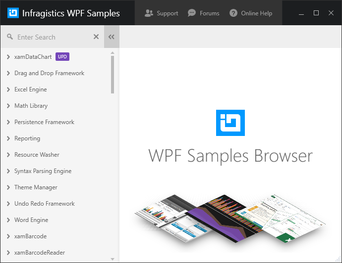

////
|metadata|
{
    "name": "wpf-netadvantage-for-wpf-samples",
    "controlName": [],
    "tags": ["Getting Started"],
    "guid": "{50FD2B15-9778-4E57-90D4-875FE345494F}",
    "buildFlags": [],
    "createdOn": "2012-01-30T19:39:51.5806693Z"
}
|metadata|
////

= {ProductName} Samples

[[Infragistics-WPF-Features-Browser]]
== Samples Browser

The Samples Browser is geared towards the idea of learning by example, by demonstrating the usage of the extensive feature set of the {ProductName} controls. By providing the corresponding source code directly within the browser, you can see what's involved in making the features work.

link:https://github.com/Infragistics/wpf-samples/tree/master[Download Samples Browser]

The Infragistics for WPF Samples Browser is a standalone application that contains samples for all controls provided in the Infragistics WPF product. It exists in the Examples folder in this repository. In order to run it, you can follow these steps:

* Open the .\Examples\Infragistics.Samples.WPF.sln in Visual Studio.
* Restore the NuGet packages that are referenced in each project. The Trial NuGet packages for the Infragistics for WPF product are currently in use for each of the projects in the browser. Visual Studio will try to restore the packages on build. The Trial packages exist on the public NuGet feed, and so you will need to target it in order to restore them.
* When the build finishes, you can start the browser by simply starting the solution from within Visual Studio. An execurable file for the browser app will be placed within the auto-generated .\Examples\Output folder for future runs of the browser.

The samples, by default, use our trial NuGet packages located at link:https://nuget.org[Nuget.org]

