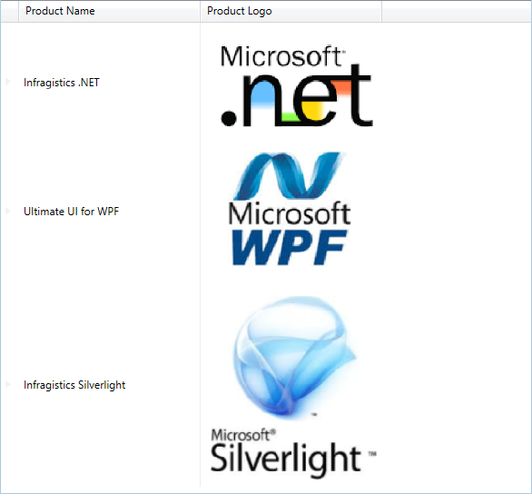

////
|metadata|
{
    "name": "xam-data-grid-displaying-an-image-in-a-field",
    "tags": ["How Do I","Tips and Tricks"],
    "controlName": ["xamDataPresenter","xamDataGrid"],
    "guid": "abd7f799-7823-404d-bc83-55c9a51bd51e",
    "buildFlags": [],
    "createdOn": "2013-10-29T15:30:08.0672652Z"
}
|metadata|
////

= Displaying an Image in a Field

In your xamDataGrid™, you may want a link:{ApiPlatform}datapresenter{ApiVersion}~infragistics.windows.datapresenter.field.html[Field] to display an image. To do this, you need to override the link:{ApiPlatform}datapresenter{ApiVersion}~infragistics.windows.datapresenter.cellvaluepresenter.html[CellValuePresenter]'s template.

The following procedure assumes you have the basic knowledge on how to add a xamDataGrid to a page. For more information, see the link:xamdatagrid-getting-started-with-xamdatagrid.html[Adding _xamDataGrid_ to Your Page] topic.

*To display an image in a field:*

. Create a file in your application named *Products.xml* with the following link:resources-products.html[content], which has a "Logo" attribute pointing to the images that we want to load.
+
.Note
[NOTE]
====
To reflect where the images are located on your machine, you must modify the content of the file to change the path for the logo images.
====

. Create an XmlDataProvider in your page's resources section which will be used as a data source.
+
*In XAML:*
+
[source,xaml]
----
<XmlDataProvider x:Key="ProductsData" Source="/WpfApplication1;component/Data/Products.xml" XPath="/Products" />
----
+
.Note
[NOTE]
====
You may need to change the resource path and the `XPath` value in the definition above depending on your application specific paths.
====

. Create a Style that targets the `CellValuePresenter` class in your page's resources section. You will also need to give the style a Key of "ProductImage". The style should look similar to the following example code.
+
*In XAML:*
+
[source,xaml]
----

----

. Use the following XAML code to create an instance of XamDataGrid and set its data source.
+
*In XAML:*
+
[source,xaml]
----
<igDP:XamDataGrid DataSource="{Binding Source={StaticResource ProductsData}, XPath=Product}">
    ...
</igDP:XamDataGrid>
----

. Inside the XamDataGrid tags, place the following XAML code. This lays out the fields and also sets the "Logo" link:{ApiPlatform}datapresenter{ApiVersion}~infragistics.windows.datapresenter.fieldsettings.html[FieldSettings] to the link:{ApiPlatform}datapresenter{ApiVersion}~infragistics.windows.datapresenter.fieldsettings~cellvaluepresenterstyle.html[CellValuePresenterStyle] to the Style created above.
+
*In XAML:*
+
[source,xaml]
----
<igDP:XamDataPresenter.FieldLayoutSettings>
    <igDP:FieldLayoutSettings AutoGenerateFields="False" />
</igDP:XamDataPresenter.FieldLayoutSettings>

<igDP:XamDataPresenter.FieldLayouts>
    <igDP:FieldLayout>
        <igDP:FieldLayout.Fields>
            <igDP:Field Name="ProductName" Label="Product Name">
                <igDP:Field.Settings>
                    <igDP:FieldSettings CellMinWidth="200" CellWidth="200" />
                </igDP:Field.Settings>
            </igDP:Field> 
            <igDP:Field Name="Logo" Label="Product Logo">
                <igDP:Field.Settings>
                    <igDP:FieldSettings CellMinWidth="200" CellWidth="200" 
                                        CellValuePresenterStyle="{StaticResource ProductImage}" />
                </igDP:Field.Settings>
            </igDP:Field>
        </igDP:FieldLayout.Fields>
    </igDP:FieldLayout>
</igDP:XamDataPresenter.FieldLayouts>
----

. Build and run the project and you should see something similar to the following image.
+

== Related Topics

link:xamdatapresenter-about-data-items-and-data-records.html[About Data Items and Data Records]