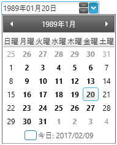

////
|metadata|
{
    "name": "xameditors-japanese-imperial-date-support",
    "controlName": [],
    "tags": ["How Do I"],
    "guid": "{97B54409-E740-488D-8C5A-3E5F967E2EE8}",
    "buildFlags": [],
    "createdOn": "2012-09-05T19:05:30.1729781Z"
}
|metadata|
////

= Japanese Imperial Date Support (xamDateTimeEditor)

== Topic Overview

=== Purpose

This topic explains how to configure the control to show dates in the Japanese Imperial format.

=== Required background

The following topics are prerequisites to understanding this topic:

[options="header", cols="a,a"]
|====
|Topic|Purpose

|link:xameditors-about-xameditors.html[About xamEditors]
|This topic describes the controls in the "xamEditors" group and explains their purpose.

|link:xamdatetimeeditor-about-xamdatetimeeditor.html[About xamDateTimeEditor]
|This topic gives an overview of the control.

|====

== Japanese Imperial Date Support

=== Overview

Besides the Gregorian calendar's date format, the control can also be configured to use the Japanese calendar's date format in which the year is represented by an Era and the year of this Era.

The following table compares the two input date formats side by side:

[options="header", cols="a,a"]
|====
|Gregorian Calendar
|Japanese Calendar
|
|image:images/xamEditors_JIDS_02.png[]
|====

=== Setting the Japanese Calendar

The following code snippet demonstrates how to set the Japanese calendar:

*In C#:*
[source,csharp]
----
CultureInfo ci = new CultureInfo("ja-JP");
Thread.CurrentThread.CurrentCulture = ci;
Thread.CurrentThread.CurrentUICulture = ci;

ci.DateTimeFormat.Calendar = new JapaneseCalendar();
this.xamDateTimeEditor1.FormatProvider = ci;

this.xamDateTimeEditor1.Language =
    XmlLanguage.GetLanguage(ci.IetfLanguageTag);
----

When the Japanese calendar is used the year is no longer represented in the Western format, but as an Era and the year of this Era. When the control is in edit mode and the cursor is in the Era field the user may select a specific Era using the keyboard shortcuts in the following table:

[options="header", cols="30a,30a,30a"]
|====
|Era (Japanese)|Reign Start Date|Keyboard shortcut
|Meiji ( 明治 )|1868 / Sep / 08|*M*, *m* or *1*
|Taishō ( 大正 )|1912 / Jul / 30|*T*, *t* or *2*
|Shōwa ( 昭和 )|1926 / Dec / 25|*S*, *s* or *3*
|Heisei ( 平成 )|1989 / Jan / 08|*H*, *h* or *4*
|====

== Related Topics

The following topics provide additional information related to this topic.

[options="header", cols="a,a"]
|====
|Topic|Purpose

|link:xameditors-overview-of-the-valueeditor-class.html[Overview of the ValueEditor Class]
|This topic gives an overview of the base class of the xamDateTimeEditor control.

|link:xameditors-masks.html[Masks]
|This topic provides an extensive explanation of how to define custom masks.

|link:xamdatetimeeditor-using-xamdatetimeeditor-as-a-field-in-xamdatagrid.html[Using xamDateTimeEditor as a Field in xamDataGrid]
|This topic provides information on how to integrate the xamDateTimeEditor as editor in the xamDataGrid control.

|link:xameditors-working-with-the-isalwaysineditmode-property-and-the-editors.html[Working with the IsAlwaysInEditMode Property and the Editors]
|This topic explains how the control's editing mode behavior changes when used as a stand alone editor or integrated as a xamDataGrid's editor.

|link:xameditors-enabling-right-to-left-support.html[Enabling Right to Left Support]
|This topic explains the right to left support of the control used in some languages.

|link:xamdatetimeeditor-api-overview.html[API Overview]
|This topic provides reference information about the namespaces and classes related to the xamDateTimeEditor control.

|====