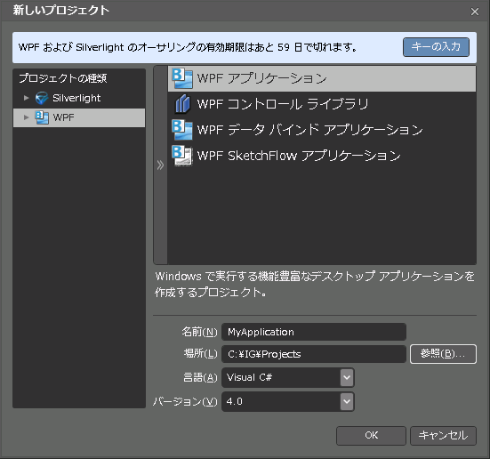
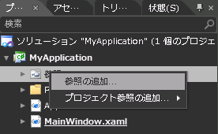
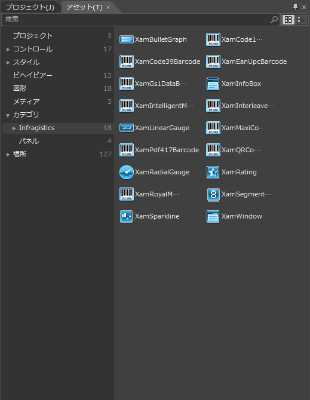

////

|metadata|
{
    "name": "adding-an-assembly-to-an-expression-blend-project",
    "controlName": [],
    "tags": ["Getting Started","How Do I"],
    "guid": "{58D97CF1-7E87-4F59-B7E2-74120B44287F}",  
    "buildFlags": [],
    "createdOn": "2012-01-31T16:16:07.8353347Z"
}
|metadata|
////

= アセンブリを Expression Blend プロジェクトに追加

{ProductName} は、Microsoft® Expression® Blend デザイン サーフェイスをサポートします。

*{ProductName} アセンブリを Expression Blend プロジェクトに追加するには、次の手順に従ってください。*

[start=1]
. Expression Blend を開きます。
[start=2]
. [ファイル] メニューから、*［新しいプロジェクト］* を選択します。
[start=3]
. プロジェクト タイプとして {PlatformName} アプリケーションを選択します。
[start=4]
. プロジェクト名を入力します。
[start=5]
. ドロップダウン リストから *[Visual C#]* (デフォルト) または *[Visual Basic]* のいずれかを選択します。*[OK]* ボタンをクリックします。

[start=6]
. プロジェクト ペインから、*[参照]* フォルダーを右クリックして、*[参照の追加...]* メニュー項目を選択します。

[start=7]
. プロジェクトで使用したい {ProductName} アセンブリを参照します。
[start=8]
. ツールボックスから、*[アセット ライブラリ]* を選択します。
[start=9]
. アセット ライブラリ リストから、*[カテゴリー]* 項目を選択してから *[Infragistics]* を選択します。{ProductName} 製品に含まれるすべてのコントロールが表示されます。

