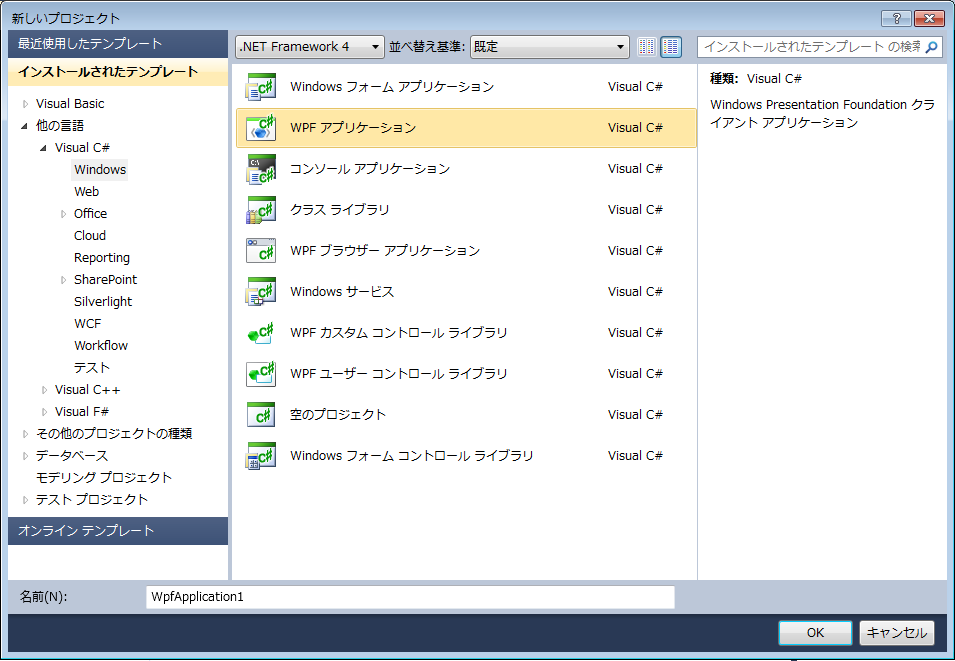

////

|metadata|
{
    "name": "adding-assembly-to-a-visual-studio-project",
    "controlName": [],
    "tags": ["Getting Started","How Do I"],
    "guid": "{80EE1BC5-37C1-4CC1-9F98-07DE3739EA55}",  
    "buildFlags": [],
    "createdOn": "2012-01-31T16:16:07.8383347Z"
}
|metadata|
////

= アセンブリを Visual Studio プロジェクトに追加

{ProductName} は Microsoft® Visual Studio® を完全にサポートしています。Visual Studio でコントロールを使用するには、Microsoft® {PlatformName} プロジェクトに参照としてアセンブリを追加して、アセンブリ参照を XAML ファイルに追加するだけです。

*アセンブリをプロジェクトに追加して、XAML ファイルで参照するには、次の手順に従ってください。*

[start=1]
. Visual Studio で {PlatformName} プロジェクトを作成します。

[start=2]
. ソリューション エクスプローラー ペインから、*[参照]* フォルダーを右クリックして、*[参照の追加...]* を選択します。

image::images/Getting_Started_Adding_Assembly_to_Visual_Studio_Project_01.png[]

[start=3]
. プロジェクトで使用したい {ProductName} アセンブリを参照します。  
[start=4]
. Infragistics コントロールを追加したい XAML ファイルを開きます。

[start=5]
. UserControl の開始タグに Infragistics XML スキーマを追加します。

*XAML の場合:*

[source,xaml]
----
<UserControl
  xmlns:ig="http://schemas.infragistics.com/xaml">
</UserControl>
----
