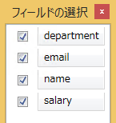

////
|metadata|
{
    "name": "breaking-changes-in-2016-volume-2",
    "controlName": [],
    "tags": ["Breaking Changes"],
    "guid": "d03c1f2a-72f5-44e4-b766-366ce6a89fbc","buildFlags": [],
    "createdOn": "2016-06-02T11:57:27.7825621Z"
}
|metadata|
////

= 2016 Volume 2 の重大な変更

== 重大な変更の概要

以下の表は、{ProductName} 2016 Volume 2 リリースの重大な変更点の概要を示します。問題の詳細な説明は、概要表の後に記載されています。

==== 凡例:
image:images/Yes.png[] - 回避策 +
image:images/No.png[] - 既知の回避策はありません。 +
image:images/Fix.png[] - 既知の回避策はありません。修正予定です。

[options="header", cols="a,a,a"]
|====
|コントロール|問題|状態

|<<_Ref001,xamDataPresenter>>
|<<_Ref002,フィールド選択の外観>>
|image::images/No.png[]

|<<_Ref003,xamDataChart>>
|<<_Ref004,チャート デフォルト値のデザイン更新>>
|image::images/No.png[]

|<<_Ref005,xamPieChart>>
|<<_Ref006,円チャートのデフォルト選択モードが単一選択になりました。>>
|image::images/Yes.png[]

|====

[[_Ref001]]
== xamDataPresenter

[[_Ref002]] 
==== フィールド選択の外観
単一のフィールド レイアウトを持つデータ プレゼンター コントロールのフィールド選択のデフォルト外観は、すべてのフィールドを選択するチェック ボックスが上部に追加されました。

以前の外観

 

新しい外観

image::images/xamDataPresenter_FieldChooser_New.png[] 

==== 関連トピック: 

link:xamdatapresenter-about-the-field-chooser.html[フィールド選択について]

[[_Ref003]]
== xamDataChart
[[_Ref004]]
=== チャート デフォルト値のデザイン更新
[options="header", cols="a,a,a"]
|====
|要素 |以前の値 | 新しい値
|すべての色リソース	
|
|すべての色リソース値が変更され、新しいリソース値が追加されました。
|ブラシ	
|
|大体のブラシ値が更新されました。
|ChartBrushes	
|線状グラデーション ブラシ	
|単色ブラシ
|ChartOutlines	
|線状グラデーション ブラシ	
|単色ブラシ、ChartBrushes と同じブラシ
|マーカー テンプレート (円、三角形、ピラミッド、四角形、ダイアモンド、五角形、六角形、四面体、星形五角形、および六線星形)
|StrokeThickness = 0.5	
|StrokeThickness は、1 値の MarkerStrokeThickness にバインドされます。
|ToolTipStyle, ToolTipNoBadgeStyle, PieChartToolTipStyle	
|ContentControl のプロパティ:
FontSize=12px 

FontFamily=Verdana

Padding Setter Value =5,5,8,5 

BorderThickness Setter Value = 1	
|すべての角の半径を解除しました。

FontSize および FontFamily の新しいセッターを追加しました。

テンプレートで使用されるすべての FontSize および FontFamily プロパティはそのセッターへのテンプレート バインディングがあります。

FontSize Setter: StaticResource = ChartSmallFontSize (value = 11)

FontFamily Setter: StaticResource = ChartFontFamily (value = Verdana)

Padding 値を新しい StaticResource TooltipContentPadding (新しい値 = 5,7) に変更しました。

BorderThickness 値を同じ値を使用して StaticResource TooltipBorderThickness に変換しました。
|CrosshairTooltipItemTemplate	
|FontSize=12px 

FontFamily=Verdana	
|ContentControl で使用されるすべての FontSize および FontFamily プロパティを StaticResource に変換しました。

FontSize: ChartSmallFontSize = 11px

FontFamily: ChartFontFamily = Verdana
|基本の凡例スタイル設定、ItemLegend、ScaleLegend
|Background セッター: StaticResource = LegendBackground

BorderBrush セッター: StaticResource = GenericBorder

BorderThickness セッター Value = 1

Padding セッター値 = 4

Margin セッター値 = 10

ItemsFontFamily、TitleFontFamily セッター = Verdana 

ItemsFontSize、TitleFontSize セッター = 12

凡例テンプレートは以前に矩形を表示しました。
|Background セッターを StaticResource = LegendBackgroundBrush に変更しました。

BorderBrush セッターを StaticResource = LegendBorderBrush (新しいブラシ) に変更しました。

BorderThickness セッター値を LegendBorderThickness (新しいリソース、同じ値) に変更しました。

Padding セッター値を LegendPadding (新しいリソース、同じ値) に変更しました。

Margin セッター値を LegendMargin (新しいリソース、同じ値) に変更しました。

ItemsFontFamily、TitleFontFamily セッターを StaticResource = ChartFontFamily に変更しました。

ItemsFontSize、TitleFontSize セッターを StaticResource = ChartSmallFontSize に変更しました。

凡例テンプレート: 単一の境界線に含まれます。
|ScaleLegend スタイル
|Polygon 要素の塗りつぶしブラシ: インライン LinearGradientBrush
|Polygon 要素の塗りつぶしブラシを StaticResource = LegendScaleFill に変更しました。
|LegendItemTemplate	
|StackPanel で Margin=1 値の設定
|Margin を StaticResource = LegendItemMargin (新しいリソース, Value=4) に変更しました。
|PieChartLegendItemBadgeTemplate, FunnelChartLegendItemBadgeTemplate	
|ContentPresenter 値:
Width=11
Height=11 
Margin=0 0 2 0
ContentTemplate は Rectangle を使用します。	
|ContentPresenter の変更:

Width: StaticResource = LegendItemBadgeWidth (新しいリソース, Value =12)

Height: StaticResource = LegendItemBadgeHeight (新しいリソース, Value =12)

Margin: StaticResource = BadgeRightMargin (新しいリソース, Value =0 0 6 0)

ContentTemplate を Ellipse に変更しました。
|LegendItemRectBadgeTemplate, LegendItemMarkerlessRectBadgeTemplate	
|メイン Grid ラッパー値:
Width=18

Height=16

Margin=0 0 2 0

DataTemplate がパス図形をバッジとしてありました。
パスのディメンション: Width=16, Height=14
|Grid ラッパーの変更:

Width: StaticResource = LegendItemBadgeWidth

Height: StaticResource = LegendItemBadgeHeight 

Margin: StaticResource = BadgeRightMargin

DataTemplate が Ellipse (新しいバッジ図形) に変更しました。

Ellipse のディメンション: Width=LegendItemBadgeWidth, Height=LegendItemBadgeHeight
|LegendItemLineBadgeTemplate	
|メイン Grid ラッパー値:

Width=18

Height=16

Margin=0 0 2 0

ContentPresenter 値:

Width=11

Height=11

Margin=0 0 2 0	
|Grid ラッパーの変更: 

Width: StaticResource = LineBadgeWidth (新しいリソース, 同じ値)

Height: StaticResource = LineBadgeHeight (新しいリソース, 同じ値)

Margin: StaticResource = BadgeRightMargin

ContentPresenter の変更:

Width= LegendItemBadgeWidth

Height= LegendItemBadgeHeight

余白を解除しました。
|LegendItemMarkerlessLineBadgeTemplate	
|メイン Grid ラッパー値:

Width=18

Height=16

Margin=0 0 2 0	
|Grid ラッパーの変更:

Width、Height: StaticResource = LineNoBadgeWidthHeight (新しいリソース, Value =16)

Margin: StaticResource = BadgeRightMargin
|LegendItemPointBadgeTemplate	
|ContentPresenter 値: 

Width=11

Height=11

Margin=0 0 2 0	
|ContentPresenter の変更:

Width= LegendItemBadgeWidth

Height= LegendItemBadgeHeight

Margin = BadgeRightMargin

|LegendItemFinancialBadgeTemplate, LegendItemFinancialIndicatorBadgeTemplate,  LegendItemPositiveNegativeBadgeTemplate, LegendItemHighDensityBadgeTemplate	
|メイン Grid ラッパー値:

Width=18

Height=16

Margin=0 0 2 0

DataTemplate がパス図形をバッジ図形としてありました。

パスのディメンション: Width=16, Height=14

Path (負の値) Stroke が ActualOutline にバインドされます。	
|Grid ラッパーの変更:

Width: StaticResource = FinancialBadgeWidth (新しいリソース, Value =14)

Height: StaticResource = FinancialBadgeHeight (新しいリソース, Value =14)

Margin: StaticResource = BadgeRightMargin

DataTemplate: 矩形の使用に変更しました。

Rectangle のディメンション: Width=LegendItemFinancialBadgeHeight (新しいリソース, Value=7)

Path (負の値) Stroke が NegativeOutline (新しいリソース) にバインドしました。
|LegendItemPositiveNegativeBadgeTemplate	ContentPresenter Values Margin=0 0 2 0	余白を解除しました。
|LegendItemHighDensityBadgeTemplate	
|その他の凡例項目テンプレートで実行される変更もここに適用しますが、このテンプレートに別の単色ブラシがあり、ActualBrush、ActualOutline および NegativeBrush、NegativeOutline の代わりに HeatMaximumColor および HeatMinimumColor を使用します。

|イベントの凡例項目マウス イベント引数の型:

LegendItemMouseLeftButtonUp

LegendItemMouseLeftButtonDown

|DataChartLegendMouseButtonEventArgs
|LegendMouseButtonEventArgs

|イベントの凡例項目マウス イベント引数の型:

LegendItemMouseEnter

LegendItemMouseLeave

LegendItemMouseMove

|ChartLegendMouseEventArgs

|LegendMouseEventArgs

|PreviewPathStyle	
|Fill セッター:

StaticResource = GenericBackground	

Fill セッターを StaticResource = PreviewPathBrush (新しいブラシ) に変更しました

CrosshairLineStyle	

Fill セッター: StaticResource = GenericBorder
StrokeThickness セッター: Value = 1.4

|Fill セッターを変更しました:

StaticResource = CrosshairStroke (新しいブラシ)

StrokeThickness セッター値を StaticResource= CrosshairStrokeThickness (新しいリソース、同じ値) に変更しました。
|XamDataChart スタイル
|TitleFontSize=16

SubtitleFontSize=12

TitleFontFamily,  SubtitleFontFamily=Verdana

PlotAreaBackground セッター: StaticResource = ChartPlotAreaBackgroundBrush

DefaultPlotAreaBorderBrush セッター: StaticResource = GenericBorder

DefaultAxisStroke セッター: StaticResource = AxisBorderBrush

DefaultAxisMajorStroke セッター: StaticResource = AxisMajorBorderBrush

|新しい Background セッター: StaticResource= ChartBackgroundBrush

TitleFontSize セッターを StaticResource = ChartTitleFontSize に変更しました。

SubtitleFontSize セッターを StaticResource = ChartSmallFontSize に変更しました。

TitleFontFamily および SubtitleFontFamily セッターを StaticResource = ChartFontFamily に変更しました。

PlotAreaBackground セッターを StaticResource = PlotAreaBackgroundBrush に変更しました。

DefaultPlotAreaBorderBrush セッターを StaticResource = PlotAreaBorderBrush に変更しました。

DefaultAxisStroke セッター: StaticResource を AxisStrokeBrush に名前変更しました。

DefaultAxisMajorStroke セッター: StaticResource を AxisMajorStrokeBrush に名前変更しました。

|軸のスタイル
|TickStrokeThickness セッター Value = 1

StrokeThickness セッター Value = 1

MajorStrokeThickness セッター Value = 1.00

MinorStrokeThickness セッター Value = 0.7
|TickStrokeThickness セッター値を StaticResource= TickStrokeThickness (新しいリソース、Value=2) に変更しました。

StrokeThickness セッター値を StaticResource= AxisStrokeThickness (新しいリソース、Value=2) に変更しました。

MajorStrokeThickness セッター値を StaticResource= MajorStrokeThickness (新しいリソース、同じ値) に変更しました。

MinorStrokeThickness セッター値を StaticResource= MinorStrokeThickness (新しいリソース、Value=1) に変更しました。
|XAxis、YAxis スタイル設定	
|LabelSettings および TitleSettings セッターの FontSize=12
LabelSettings および TitleSettings セッターの FontFamily=Verdana
|新しいセッター TickLength: Value=0

セッター FontSize を StaticResource = ChartSmallFontSize に変更しました。

セッター FontFamily を StaticResource = ChartFontFamily に変更しました。
|NumericXAxis, NumericYAxis 	
|MajorStroke セッター Value=AxisMajorStroke

|MajorStroke セッター Value=AxisMajorStrokeBrush (リソースが名前変更しました)

|CategoryAngleAxis, NumericAngleAxis, NumericRadiusAxis	
|MajorStroke セッター Value=AxisMajorStroke

LabelSettings セッター FontSize=12

LabelSetting セッター FontFamily=Verdana	
|MajorStroke セッター Value=AxisMajorStrokeBrush

セッター FontSize を StaticResource = ChartSmallFontSize に変更しました。 

セッター FontFamily を StaticResource = ChartFontFamily に変更しました。
|BarSeries  ColumnSeries  RangeColumnSeries  StackedColumnSeries  StackedBarSeries  Stacked100ColumnSeries  Stacked100BarSeries  RadialColumnSeries	
| --	
|新しい  RadiusX セッター: Value=0

新しい  RadiusY セッター: Value=0
|LineSeries  StepLineSeries  SplineSeries  ScatterLineSeries  ScatterSplineSeries  AbsoluteVolumeOscillatorIndicator  AccumulationDistributionIndicator  AverageTrueRangeIndicator  CommodityChannelIndexIndicator  ForceIndexIndicator  MoneyFlowIndexIndicator  OnBalanceVolumeIndicator  PercentagePriceOscillatorIndicator  PercentageVolumeOscillatorIndicator  PriceVolumeTrendIndicator  RateOfChangeAndMomentumIndicator  TypicalPriceIndicator  MarketFacilitationIndexIndicator  RelativeStrengthIndexIndicator  WeightedCloseIndicator  MedianPriceIndicator  DetrendedPriceOscillatorIndicator  EaseOfMovementIndicator  MassIndexIndicator  NegativeVolumeIndexIndicator  PositiveVolumeIndexIndicator  AverageDirectionalIndexIndicator  BollingerBandWidthIndicator  ChaikinVolatilityIndicator  ChaikinOscillatorIndicator  StandardDeviationIndicator  UltimateOscillatorIndicator  WilliamsPercentRIndicator  CustomIndicator  StochRSIIndicator	
|--	
|新しい Thickness セッター: Value=LineSeriesStrokeThickness (新しいリソース, 値=2)
|WaterfallSeries	
|--	
|新しい  RadiusX セッター: Value=0
新しい  RadiusY セッター: Value=0
新しい Outline セッター: Value=OutlineBrush (新しいリソース)
|StackedLineSeries  Stacked100LineSeries  StackedSplineSeries  Stacked100SplineSeries  BollingerBandsOverlay  PriceChannelOverlay	
|Thickness セッター Value = 1
|新しい  Thickness セッター: Value=LineSeriesStrokeThickness
|HighDensityScatterSeries
|
|新しい HeatMaximumColor セッター: Value= StaticResource HotColor

新しい HeatMinimumColor セッター: Value= StaticResource ColdColor
|FinancialPriceSeries	
|Outline セッター Value=#FF222222
Thickness セッター Value = 1	
|新しい NegativeOutline セッター値: StaticResource=NegativeBrush

Outline セッター値: StaticResource=ActualOutline

Thickness セッター値を StaticResource= FinancialSeriesStrokeThickness (新しいリソース、同じ値) に変更しました。

|MovingAverageConvergenceDivergenceIndicator  TRIXIndicator  FastStochasticOscillatorIndicator  SlowStochasticOscillatorIndicator  FullStochasticOscillatorIndicator	
|TrendLineBrush セッター Value=Blue
|TrendLineBrush セッター Value を StaticResource=TrendlineBaseBrush (新しいリソース) に変更しました。

新しい  Thickness セッター: Value=LineSeriesStrokeThickness
|PolarLineSeries  PolarSplineSeries  RadialLineSeries	
|--	
|新しい  Thickness セッター: Value=LineSeriesStrokeThickness
|PolarAreaSeries  PolarSplineAreaSeries	
|セッター MarkerType Value=Automatic	
|セッター MarkerType Value を None に変更しました。
|PointerToolTipStyle	
|ContentControl のプロパティ: 

FontSize=12px

FontFamily=Verdana
"PART_POINTER" Polygon Fill: StaticResource TooltipPointerBackgroundBrush

"PART_POINTEROUTLINE" Polygon Stroke: StaticResource GenericBorder

|FontSize セッター: StaticResource = ChartSmallFontSize

FontFamily セッター: StaticResource = ChartFontFamily

"PART_POINTER" Polygon Fill: StaticResource を TooltipBackgroundBrush に変更しました。
"PART_POINTEROUTLINE" Polygon Stroke: StaticResource を TooltipBorderBrush に変更しました。
|ItemToolTipLayer、CategoryToolTipLayer スタイル設定
|Brush セッター Value=Gray
Outline セッター Value=LightGray
|Brush セッター Value を StaticResource=TooltipLayerBrush に変更しました

Outline セッター Value を StaticResource=TooltipLayerOutline に変更しました。
|PieChartBase	
|ControlTemplate 内の Border: CornerRadius=4
|CornerRadius を解除しました。
|====

[[_Ref005]]
== xamPieChart
[[_Ref006]]
=== xamPieChart の選択の新しいデフォルト値
円チャート コントロールの新しいデフォルト選択値は SingleSelect に変更しました。

既存の円チャート選択ロジックを残るには、SliceSelectionMode プロパティを "Manual" に設定します。