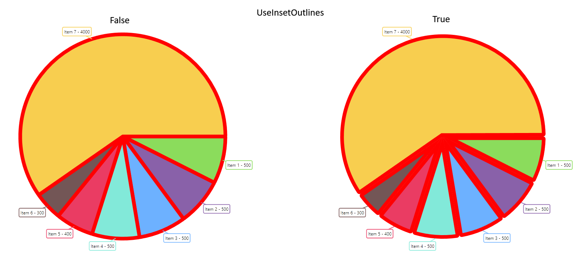

= Ultimate UI for WPF 変更ログ

=== このトピックの内容

このトピックは、以下のセクションで構成されます。

* <<Ref_25_2_59, 25.2.59 (2025 年 12 月)>>
* <<Ref_25_2_45, 25.2.45 (2025 年 11 月)>>
* <<Ref_25_1_117, 25.1.117 (2025 年 10 月)>>
** <<BC_25_1_117,重大な変更 25.2.117 (2025 年 10 月)>>
* <<Ref_25_1_71, 25.1.71 (2025 年 7 月)>>
* <<Ref_25_1_22, 25.1.22 (2025 年)>>
* <<Ref_24_2_93, 24.2.93 (2025 年 2 月)>>
* <<Ref_24_2, 24.2 (2024 年)>>
* <<Ref_24_1_57, 24.1.57 (2024 年 9 月)>>
* <<Ref_24_1_20,24.1.20 (2024 年 8 月)>>
** <<BC_24_1_20,重大な変更 24.1.20 (2024 年 8 月)>>
* <<Ref_23_2_233,23.2.233 (2024 年 6 月)>>
* <<Ref_23_2_157,23.2.157 (2024 年 4 月)>>
* <<Ref_23_2, 23.2 (2023 年)>> 

[[Ref_25_2_59]]

== 25.2.59 (2025 年 12 月)

=== バグ修正

[options="header", cols="a,a,a"]
|====

|バグ番号|コントロール|説明

|`32635`
|XamSyntaxEditor
|全角数字への変換により、対象文字以降の文字が消えることがある。

|`33808`
|XamDataChart
|XamDataChart - TimeAxisInterval の IntervalType Ticks に設定されたスケールが表示されない。

|`34255`
|XamDataChart
|XamDataChart - 0.00001 スケールの目盛りが重なって表示される。

|`37558`
|XamSyntaxEditor
|XamSyntaxEditor - 改行を含む選択テキストを TextBox にドラッグするとエラーが発生する。

|`38510`
|XamDataChart
|Stacked シリーズの AssigningCategoryStyle イベント サポート。

|`39970`
|XamDataChart
|データ ソース内に同一の DateTime 値が複数存在する場合、TimeXAxis 上では元のデータと同じ順序で表示されないことがある。

|====

=== 機能拡張

==== チャート

- TimeXAxisLabelFormat に LabelFormatOverride イベントが追加され、TimeXAxis のすべての時間形式レベルでイベントを使用して書式設定をオーバーライドできるようになりました。

[[Ref_25_2_45]]

== 25.2.45 (2025 年 11 月)

$$.NET 10$$ のサポート

バージョン 2025.2 以降、Ultimate UI for WPF ツールセットは .NET 10 をサポートします。.NET 10 の詳細については、link:https://learn.microsoft.com/ja-jp/dotnet/core/whats-new/dotnet-10/overview[Microsoft サイト]をご確認ください。

詳細については、link:https://learn.microsoft.com/ja-jp/lifecycle/products/microsoft-net-and-net-core[Microsoft .NET ライフサイクル]を参照してください。

$$.NET 6$$ および .NET 7 のサポートは終了しました。

=== Azure Map Imagery は RTM になりました
 
=== 新しいチャート機能

==== 軸注釈の衝突検出 (ベータ版)

軸注釈が自動で衝突を検出し、適切に収まるよう切り詰めます。この機能を有効にするには、次のプロパティを設定します:

- `ShouldAvoidAnnotationCollisions`
- `ShouldAutoTruncateAnnotations`

==== ユーザー注釈レイヤー (ベータ版)

{ProductName} では、新しいユーザー注釈機能を使用して、実行時に `{DataChartName}` にスライス、ストリップ、ポイントの各注釈を追加できます。これにより、エンドユーザーは、スライス注釈を使用して会社の四半期レポートなどの単一の重要イベントを強調したり、ストリップ注釈を使用して期間を持つイベントを示したりするなど、プロットに詳細を追加できます。ポイント注釈またはこれら 3 つの任意の組み合わせを使用して、プロットされたシリーズ上の個々のポイントを呼び出すこともできます。

これは、`XamToolbar` のデフォルトのツールと統合されています。

image::images/data-chart-user-annotation-create.gif[]

=== バグ修正

[options="header", cols="a,a,a"]
|====

|バグ番号|コントロール|説明

|`33439`
|XamRibbon
|RoyalLight テーマを使用している高 DPI 環境で ウィンドウ ヘッダーに線が表示される。

|`36205`
|XamDataChart
|BrushCollection が Equals 関数でエラーをスローする。

|`37976`
|XamDataGrid
|ClearCustomizations メソッドが、ユーザーによって Visibility が変更された Fields に対して何もしない。

|`40136`
|Excel Library
|Excel ワークブック読み込み時に FormulaParseException 例外が発生する。

|`40262`
|XamSpreadsheet
|警告がある場合に #Circularity! が表示される。Excel に合わせて、値 (例: 0) を表示するように改善。

|====

[[Ref_25_1_117]]

== 25.1.117 (2025 年 10 月)

=== XamGeographicMap の Azure マップ画像のサポート (ベータ版)

`XamGeographicMap` は、Azure ベースのマップ画像をサポートし、開発者は複数のアプリケーション タイプにわたって詳細かつ動的なマップを表示できるようになりました。複数のマップ レイヤーを組み合わせて地理データを視覚化し、インタラクティブなマッピング エクスペリエンスを簡単に作成できます。

注: Bing マップ画像のサポートは段階的に廃止されます。既存のエンタープライズ キーは引き続き Bing Maps にアクセスするために利用できるため、Azure Maps へ移行する間も現在のアプリケーションをそのまま利用可能です。

公開されている Azure Maps の一部はこちらをご覧ください: https://azure.microsoft.com/ja-jp/products/azure-maps[Azure Maps]。

image::https://static.infragistics.com/xplatform/images/browsers/azure-maps/azure-gif-main.gif[Azure Maps in action, width=600, align=center, link=""]

=== XamDataChart の新しい軸ラベル イベント (ベータ版)

軸ラベルに対するさまざまな操作を検出できるように、次のイベントが `XamDataChart` に追加されました。

- `LabelMouseDown`
- `LabelMouseUp`
- `LabelMouseEnter`
- `LabelMouseLeave`
- `LabelMouseMove`
- `LabelMouseClick`

=== チャートの対応軸 (ベータ版)

X 軸と Y 軸に `CompanionAxis` プロパティが追加され、既存の軸を簡単に複製できるようになりました。`CompanionAxisEnabled` プロパティを有効にすると、複製された軸はチャートの反対側に配置され、そこから各軸プロパティを設定できます。

=== RadialPieSeries インセット アウトライン (ベータ版)

`RadialPieSeries` のアウトライン描画方法を制御するために `UseInsetOutlines` プロパティが追加されました。`true` に設定すると、アウトラインがスライス形状の内側に描画され、`false` (既定値) に設定すると、アウトラインはスライス形状の端に半分内側・半分外側で描画されます。

=== バグ修正

[options="header", cols="a,a,a"]
|====

|バグ番号|コントロール|説明

|`24054`
|XamDataGrid
|XamDataGrid の数式集計がレポートに印刷されない。

|`26592`
|XamFunnelChart
|FunnelChart が初回レンダリング時に外側ラベルを重複表示する。

|`31124`
|Excel Library
|ワークシート名に全角句読点が含まれると、保存された Excel ファイルが破損する。

|`33861`
|Excel Library
|折れ線チャートを追加すると、ドイツ語カルチャで Excel ファイルが破損する。

|`36790`
|Excel Library
|SUMIFS 関数が正しく計算されない。

|`36912`
|XamDataGrid
|XamDataGrid のフィールド グループの順序が、Visibility を Collapse に設定すると正しくならない。

|`37714`
|XamComboEditor
|タイ語カルチャ使用時に XamComboEditor が argumentException をスローする。

|`37930`
|XamDataChart
|Data Annotation Overlay のテキスト色が機能しない。

|`38006`
|XamDataChart
|軸注釈付きの ValueOverlay を削除すると、軸注釈が残る。

|`39083`
|XamRichTextEditor
|RTF ファイル保存時にエディターが NullReferenceException をスローする。

|====

=== 拡張機能

==== XamBulletGraph

- 新しい `LabelsVisible` プロパティが追加されました。(ベータ版)

==== チャート

- DataToolTipLayer、ItemToolTipLayer、CategoryToolTipLayer にスタイル設定用の新しいプロパティが追加されました: `ToolTipBackground`、`ToolTipBorderBrush`、および `ToolTipBorderThickness`。 (ベータ版)

- DataLegend にスタイル設定用の新しいプロパティが追加されました: `ContentBackground`、`ContentBorderBrush`、および `ContentBorderThickness`。既存の `Background`、`BorderBrush`、および `BorderThickness` プロパティを使用して DataLegend のスタイルを設定することもできますが、新しいプロパティが優先されます。`BorderBrush` と `BorderThickness` はそれぞれ既定で transparent と 0 に設定されているため、境界線を表示するにはこれらのプロパティを設定する必要があります。

- マウスのワールド相対位置を提供する `WorldPosition` という新しいプロパティが `ChartMouseEventArgs` に追加されました。この位置は、軸空間内の X 軸と Y 軸の両方に対して 0 から 1 の間の値になります。

- `SeriesViewer` と `DomainChart` に `HighlightingFadeOpacity` が追加されました。ハイライト表示されたシリーズに適用される不透明度を設定できます。

- ドメイン チャートの `CalloutLabelUpdating` イベントを公開しました。

==== XamLinearGauge

- 新しい `LabelsVisible` プロパティが追加されました。(ベータ版)

[[BC_25_1_117]]
== 重大な変更

=== XamDataChart
`IsSquare` プロパティは内部プロパティになりました。このプロパティは、正しい描画のために正方形のプロット領域を維持する必要がある極座標およびラジアル シリーズでの使用を目的としています。他のシリーズ タイプで使用すると、レイアウトが歪んだり、期待した表示にならない可能性があるため、削除することにしました。同様の視覚効果を得るには、チャートの `ViewPortRect` を測定し、チャートの幅と高さを調整して適切なアスペクト比を維持してください。

[[Ref_25_1_71]]
== 25.1.71 (2025 年 7 月)

=== バグ修正

[options="header", cols="a,a,a"]
|====
|バグ番号|コントロール|説明

|`33253`
|XamDialogWindow
|アラビア語環境でウィンドウ サイズを変更すると ArgumentException が発生する。

|`34316`
|XamDataChart
|異なるスレッドからチャートにシリーズを追加すると NullReferenceException が発生する。

|`34440`
|XamRichTextEditor
|ドキュメントが空の場合、またはすべての内容が選択されている状態で DEL キーを押すと、エディターがドキュメントのフォント設定を変更する。

|`36415`
|XamDataTree
|XamDataTree において、RoyalLight テーマのハイライト前景色が正しく動作しない。

|`36448`
|XamRadialGauge
|ラジアル ラベルの書式設定プロパティ (例: Title、SubTitles) が機能しない。

|`37127`
|XamDataChart
|チャートのズーム レベルを変更すると、エラー バーの範囲が変更される。

|`37244`
|Excel Library
|カスタムの DataValidation が正しく動作しない。

|====

=== 機能拡張

==== XamDataChart

- 軸ラベルに MaximumExtent および MaximumExtentPercentage プロパティを追加しました (ベータ版)。

[[Ref_25_1_22]]
== 25.1.22

=== {DataChartName}

=== データ注釈バンド レイヤー (ベータ版)

link:{DataChartLink}.DataAnnotationBandLayer.html[DataAnnotationBandLayer] は、シリーズ上に表示される新しい注釈レイヤーです。

link:{DataChartLink}.DataAnnotationBandLayer.html[DataAnnotationBandLayer] についての完全なヘルプ トピックは、以下のリンクにあります。

- link:datachart-data-annotation-band-layer.html[{DataChartName} データ注釈バンド レイヤー]

=== データ注釈ライン レイヤー (ベータ版)

link:{DataChartLink}.DataAnnotationLineLayer.html[DataAnnotationLineLayer] は、シリーズ上に表示される新しい注釈レイヤーです。

link:{DataChartLink}.DataAnnotationLineLayer.html[DataAnnotationLineLayer] についての完全なヘルプ トピックは、以下のリンクにあります。

- link:datachart-data-annotation-line-layer.html[{DataChartName} データ注釈ライン レイヤー]

=== データ注釈矩形レイヤー (ベータ版)

link:{DataChartLink}.DataAnnotationRectLayer.html[DataAnnotationRectLayer] は、シリーズ上に表示される新しい注釈レイヤーです。

link:{DataChartLink}.DataAnnotationRectLayer.html[DataAnnotationRectLayer] についての完全なヘルプ トピックは、以下のリンクにあります。

- link:datachart-data-annotation-rect-layer.html[{DataChartName} データ注釈矩形レイヤー]

=== データ注釈スライス レイヤー (ベータ版)

link:{DataChartLink}.DataAnnotationSliceLayer.html[DataAnnotationSliceLayer] は、シリーズ上に表示される新しい注釈レイヤーです。

link:{DataChartLink}.DataAnnotationSliceLayer.html[DataAnnotationSliceLayer] についての完全なヘルプ トピックは、以下のリンクにあります。

- link:datachart-data-annotation-slice-layer.html[{DataChartName} データ注釈スライス レイヤー]

=== データ注釈ストリップ レイヤー (ベータ版)

link:{DataChartLink}.DataAnnotationStripLayer.html[DataAnnotationStripLayer] は、シリーズ上に表示される新しい注釈レイヤーです。

link:{DataChartLink}.DataAnnotationStripLayer.html[DataAnnotationStripLayer] についての完全なヘルプ トピックは、以下のリンクにあります。

- link:datachart-data-annotation-strip-layer.html[{DataChartName} データ注釈ストリップ レイヤー]

=== Data Legend および DataTooltip LayoutMode

`UltraDataLegend` 要素と `DataToolTipLayer` 要素では、凡例をテーブルまたは垂直構造でレイアウトするために使用できる `LayoutMode` プロパティが公開されるようになりました。詳細については、以下のリンク先のこのドキュメントの各トピックを参照してください。

- link:datachart-data-legend.html[データ凡例]
- link:datachart-data-tooltip.html[データ ツールチップ]

=== ドラッグ選択 (ベータ版)

チャートの `DefaultInteraction` プロパティに新しい列挙体 `DragSelect` が追加されました。これにより、チャートのプレビュー矩形を使用してシリーズのポイントが選択されます。

=== オーバーレイ テキスト (ベータ版)

以下のシリーズ タイプでは、新しく追加された `OverlayText` プロパティを使用することで、チャートに追加の注釈としてテキストをオーバーレイ表示できるようになりました。

- link:{DataChartLink}.ValueLayer.html[ValueLayer]
- link:{DataChartLink}.ValueOverlay.html[ValueOverlay]

前述のシリーズ タイプに加えて、上記の新しいデータ注釈レイヤーもこの機能をサポートしています。

OverlayText で始まるプロパティを使用して、このオーバーレイ テキストの表示方法 (角度、色、背景、パディング、マージン、フォントなど) を設定できます。たとえば、`OverlayTextBrush` は色を設定します。

=== トレンドライン レイヤー

`TrendlineLayer` は、特定のシリーズにトレンド ライン レイヤーごとに 1 つのトレンド ラインを適用できる新しいシリーズ タイプです。これにより、チャートに複数の `TrendlineLayer` シリーズ タイプを使用できるため、単一のシリーズで複数のトレンド ラインを使用できるようになります。

=== XamDashboardTile 集計サポート
`XamDashboardTile` では、並べ替え、グループ化、フィルタリング、選択などの集計を DataGrid ビューからチャート視覚化に伝播できるようになりました。これは現在、`XamDashboardTile` の `ItemsSource` を `LocalDataSource` のインスタンスにバインドすることによってサポートされています。

=== 機能拡張

==== XamToolbar
- `XamToolbar` から追加された値レイヤーが凡例に表示されるようになりました。
- ズーム リセット ツールはズーム ドロップダウンに移動されました。

==== XamDataPieChart

- チャートは `GetOthersContext()` メソッドを公開するようになりました。これにより、Others (その他) スライスのコンテンツが返されます。

[[Ref_24_2_93]]
== 24.2.93 (2025 年 2 月)

=== バグ修正

[options="header", cols="a,a,a"]
|====
|バグ番号|コントロール|説明

|`27911`
|XamDataChart
|OlapXAxis を使用した StackedColumnSeries で凡例項目が重複し、一部が空白になる場合がある。

|`30286`
|XamDataChart
|バブルをクリックした後、Bubble Series のツールチップが近くのバブル データの内容に切り替わる。

|`31993`
|XamComboEditor
|ネストされた FieldName を持つ ComboItemFilter を使用すると NullReferenceException が発生する。

|`32906`
|XamDataChart
|チャートの上部に X 軸を配置すると、X 軸が 2 つ表示される。

|`33440`
|XamDataGrid
|LoadCustomizations() を呼び出すと、レイアウト ファイルに存在しないフィールドがある場合、フィールドの順序が正しくない。

|`34053`
|XamRadialGauge
|スケール ラベルの位置がずれる。

|`34483`
|XamDataTree
|大きなノードを使用すると、ScrollNodeIntoView メソッドが断続的に失敗する。

|`35104`
|XamDataGrid
|XamDataGrid でカンマを含む項目が正しくフィルタリングされない。

|`35495`
|Excel
|テンプレート ファイルを読み込むと、セル内の画像が失われる。

|`35496`
|XamSpreadsheet
|Excel に画像付きでスタイルを設定すると System.ArgumentException が発生する。

|`36062`
|XamTextEditor
|編集モードに入るとエディターのサイズが拡大し、高さが増加する。

|`36176`
|Excel
|LET 関数を含む Excel ブックを読み込むと XamlParseException が発生する。

|`36297`
|XamDataGrid
|RefreshCellValue を呼び出すと、RecordPresenter の割り当てでメモリのパフォーマンスが低下する。

|====

[[Ref_24_2]]
== 24.2 (2024 年リリース)

=== .NET 9 のサポート

バージョン 2024.2 以降、Ultimate UI for WPF ツールセットは .NET 9 をサポートします。NET 9 の詳細については、link:https://learn.microsoft.com/ja-jp/dotnet/core/whats-new/dotnet-9/overview[Microsoft サイト]をご確認ください。

このリリースでは、link:https://dotnet.microsoft.com/ja-jp/platform/support/policy/dotnet-core[Microsoft .NET ライフサイクル]に従い、.NET 3.1、.NET 5、.NET 7 はサポートされなくなりました。

=== XamDashboardTile (ベータ版)

link:xamdashboardtile.html[XamDashboardTile] コンポーネントは、バインドされた ItemsSource コレクションまたは単一のポイントを分析および視覚化し、データのスキーマとカウントに基づいて適切なデータ視覚化を返すコンテナー コントロールです。このコントロールは、組み込みの link:xamtoolbar.html[XamToolbar] コンポーネントを利用して、実行時に視覚化を変更できるようにし、最小限のコードでデータのさまざまな視覚化を表示できるようにします。

image:images/xamdashboardtile.png[]

=== XamColorEditor & Toolbar の ToolAction (ベータ版)

この新しいエディターはスタンドアロンのカラー ピッカーとして使用でき、実行時に視覚化を更新するために link:xamtoolbar.html[XamToolbar] コンポーネントに統合されました。

image:images/color-editor.png[]

[[Ref_24_1_57]]
== 24.1.57 (2024 年 9 月)

=== バグ修正

[options="header", cols="a,a,a"]
|====
|バグ番号|コントロール|説明

|`26559`
|XamDataGrid
|DataRecordPresenterStyle (キー付き) - IsExpanded のバインディングが正しく機能しない。

|`28377`
|XamDataChart
|ItemsSource の GroupBy クラスは .NET 6 では使用できない。

|`29638`
|XamDoughnutChart
|凡例に正しいラベルと色が表示されない。

|`29721`
|XamRibbonWindow
|TaskBar が左揃えの場合、CaptionButtonWidth のサイズが適切ではない。

|`31317`
|XamDataGrid
|XamDataGrid の IN/Not IN フィルターがスラッシュ '/' でデータをフィルター処理しない。

|`31702`
|XamDataChart
|XamDataChart の Y 軸ラベルがタブを変更すると消える。

|`31745`
|XamDataChart
|XamDataChart ツールチップが表示されず、軸ラベルが消える。

|`32889`
|XamDataChart
|XamDataChart が位置 (0,0) にポイント マーカーを描画しない。

|====

[[Ref_24_1_20]]
== 24.1.20 (2024 年 8 月)

=== {DataPieChartName}

link:{DataPieChartLink}.{DataPieChartName}.html[{DataPieChartName}] は、円チャートを表示する新しいコンポーネントです。このコンポーネントは、link:{CategoryChartLink}.{CategoryChartName}.html[{CategoryChartName}] と同様に動作し、基になるデータ モデルのプロパティを自動的に検出しながら、ItemLegend コンポーネントを介して選択、強調表示、アニメーション、凡例のサポートを可能にします。

link:{DataPieChartLink}.{DataPieChartName}.html[{DataPieChartName}] の完全なドキュメントは、以下のリンクから参照できます。

- link:data-pie-chart.html[{DataPieChartName}]

=== データ凡例 & データ ツールチップのグループ化

新しい link:{DataChartLink}.{DataChartName}.html[{DataChartName}] グループ化機能が追加されました。`GroupRowVisible` プロパティは、各シリーズのグループ化を切り替え、オプトインすると `DataLegendGroup` プロパティを介してグループ テキストを割り当てることができます。同じ値が複数のシリーズに適用されている場合、それらはグループ化されて表示されます。すべてのユーザー向けに分類および整理する必要がある大規模なデータセットに役立ちます。

=== チャート選択

新しいシリーズ選択。これは、link:{CategoryChartLink}.{CategoryChartName}.html[{CategoryChartName}] および link:{DataChartLink}.{DataChartName}.html[{DataChartName}] のすべてのカテゴリ、財務、およびラジアル シリーズに広く採用されています。シリーズはクリックして異なる色で表示したり、明るくしたり、薄くしたり、フォーカスのアウトラインを表示したりできます。色は、`SelectionBrush` および FocusBrush` プロパティで変更できます。個々のシリーズまたはデータ項目全体を通じて影響を受ける項目を管理します。複数のシリーズとマーカーがサポートされています。特定のデータ項目の値間のさまざまな相違点や類似点を示すのに役立ちます。また、`SelectedSeriesItemsChanged` イベントと `SelectedSeriesItems` は、選択内容に基づいたデータ分析を行うポップアップやその他の画面など、アプリケーション内で実行できるその他のアクションを取り巻く堅牢なビジネス要件を構築するための追加の支援として利用できます。さらに、`SelectedSeriesItems` コレクションで選択した項目を読み取ることができます。

=== 比例カテゴリ角度軸

link:{DataChartLink}.{DataChartName}.html[{DataChartName}] のラジアル円シリーズの新しい軸により、データ チャートのすべての追加機能を使用して強力な視覚化を可能にする円チャートの作成が可能になります。

=== ラジアル ゲージのプロパティ

ハイライト針の新しいラベル。`HighlightLabelText` と `HighlightLabelSnapsToNeedlePivot` および、その他の HighlightLabel の多くのスタイル関連プロパティが追加されました。

=== Toolbar 

選択した特定のツールの周囲に境界線を描くための ToolAction の新しい IsHighlighted オプション。

[[BC_24_1_20]]
== 重大な変更

=== ラジアル/極座標シリーズ
極座標およびラジアル シリーズのプロット領域は、チャート全体のスペースに広がるように拡張され、正方形に制約されなくなりました。これにより、ラベルがブリード領域に拡張できるようになります。

[[Ref_23_2_233]]
== 23.2.233 (6 月リリース)

[options="header", cols="a,a,a"]
|====
|バグ番号|コントロール|説明

|`23553`
|XamDataChart
|NumericYAxis ラベルのコンバーターを使用すると、無限ループが発生する。 

|`23611`
|XamTileManager
|モニターが 100% 以外に拡大縮小されると、タイル マネージャー スプリッターの強調表示が正しい場所に表示されない。

|`23703`
|XamDataGrid
|XamDataGrid のカスタム フィルター演算子は、FilterUIType を LabelIcons に設定すると保持されない。

|`25125`
|XamDataChart
|UseEnhancedIntervalManagement が Axis 上で正しくスケーリングしない場合がある。

|`25500`
|XamScatterSurface3D
|LogarithmicAxis が間違ったツールヒントを表示する。

|`25502`
|XamDataTree
|子ノードが追加され、同時に親ノードが展開されると、ノードは前のノードの子として表示される。

|`26627`
|XamDataGrid
|データ ソースがクリアされても SelectedDataItems はクリアされない。

|`27174`
|Excel ライブラリ
|Worksheet.Shapes.AddChart に X 軸ラベルが表示されない。

|`27917`
|XamDataGrid
|データ ソースが空のコレクションに置き換えられても FieldLayout が更新されない。

|`27935`
|XamDataGrid
|Owner プロパティが設定または初期化されても、FieldGroup はプロパティ変更通知を発生しない。

|`27936`
|XamDataGrid
|FieldBinding は FieldGroup では使用できない。

|`28325`
|XamRichTextEditor
|テーブルを含む docx ファイルを読み込むと、すべてのデータが表示されない。

|`29363`
|XamDataGrid
|スクロールが正しく動作しない。

|`29721`
|XamRibbon
|TaskBar が残っていると CaptionButtonWidth のサイズが適切ではない。

|`30718`
|Excel ライブラリ
|数値列に乱数が生成される。

|`31317`
|XamDataGrid
|In/NotIn フィルターがスラッシュ '/' でデータをフィルター処理しない。

|`31392`
|XamDataChart
|Tooltip が ArgumentOutOfRangeException を発生する。

|====

[[Ref_23_2_157]]
== 23.2.157 (4 月リリース)

=== ファンネル チャートの強調表示

4 月 23.2 リリース以降、link:{FunnelChartLink}.{FunnelChartName}.html[{FunnelChartName}] に強調表示オーバーレイがあります。このオーバーレイは、`HighlightedItemsSource`、`HighlightValueDisplayMode`、`HighlightedValueMemberPath`、および `HighlightingOpacity` という複数の強調表示プロパティを通じて公開されます。

`HighlightValueDisplayMode` が `Overlay` に設定されている場合、これは `HighlightedItemsSource` および `HighlightedValueMemberPath` と連携して、チャートの `ItemsSource` と `HighlightedItemsSource` の値の差を表示する強調表示されたオーバーレイを提供します。`HighlightingOpacity` プロパティを使用して、強調表示 オーバーレイの不透明度を制御できます。

=== ゲージの強調表示機能

link:{RadialGaugeLink}.{RadialGaugeName}.html[{RadialGaugeName}]、link:{LinearGaugeLink}.{LinearGaugeName}.html[{LinearGaugeName}]、と link:{BulletGraphLink}.{BulletGraphName}.html[{BulletGraphName}] は、`HighlightValue` と `HighlightValueDisplayMode` プロパティを公開するようになりました。

`{RadialGaugeName}` および `{LinearGaugeName}` では、値と `Overlay` の `HighlightValueDisplayMode` を指定すると、メインの針が薄く表示され、追加の針が表示されます。

`{BulletGraphName}` では、`HighlightValueDisplayMode` が `Overlay` に設定されている場合、パフォーマンス バーに値と `HighlightValue` の差が反映されるようになりました。強調表示された値には、フィルター処理された/サブセット測定されたパーセンテージが塗りつぶされた色で表示され、残りのバーの外観は割り当てられた値にフェードアウトされます。

=== ラジアル チャートのラベル モード

link:{DataChartLink}.{DataChartName}.html[{DataChartName}] の `CategoryAngleAxis` は、ラベルの位置をさらに構成できる `LabelMode` プロパティを公開するようになりました。これにより、`Center` 列挙型を選択してデフォルト モードを切り替えることも、ラベルを円形のプロット領域に近づける新しいモード `ClosestPoint` を使用することもできます。

=== ラジアル ゲージのオプティカル スケーリング

link:{RadialGaugeLink}.{RadialGaugeName}.html[{RadialGaugeName}] には、ラベル、サブタイトル、タイトルのスケーリングを変更できる機能が追加されました。これは、`OpticalScalingEnabled` プロパティを true に設定することで行われます。次に、ラベルが 100% のオプティカル スケーリングを持つサイズを管理する `OpticalScalingSize` を設定できます。基本的に、ゲージのサイズが大きくなると、ラベルのフォントも大きくなります。

たとえば、このプロパティが 500 に設定され、ゲージのサイズが 1000 の場合、ラベルのフォント サイズは 200% 大きくなります。

=== ラジアル ゲージのタイトルとサブタイトル

link:{RadialGaugeLink}.{RadialGaugeName}.html[{RadialGaugeName}] の新しいタイトルとサブタイトルのプロパティが利用できるようになりました。`TitleText` と `SubtitleText` は、ゲージの下部近くに対応するタイトルを表示します。さらに、`TitleFontSize`、`TitleFontFamily`、`TitleFontStyle`、`TitleFontWeight`、`TitleExtent` など、さまざまなタイトルとサブタイトルのフォント プロパティが追加されました。最後に、新しい `TitleDisplaysValue` により、値を針の位置に対応させることができます。

=== バグ修正

[options="header", cols="a,a,a"]
|====
|バグ番号|コントロール|説明

|`25125`
|{DataChartName}
|UseEnhancedIntervalManagement が Axis 上で正しくスケーリングしない場合がある問題。

|`28521`
|一般
|最新の .NET SDK でコンパイルすると、アセンブリ内のソース リンクが正しくない問題。

|`29365`
|XamToolbar
|ツールバーのズーム ツールにカーソルを合わせたり、ズーム ツールを操作したりすると、InvalidOperationException が発生する問題。

|`29489`
|XamPropertyGrid
|XamPropertyGrid は、基になるコレクションが INotifyCollectionChanged を実装している場合でも、新しく追加された子要素を表示しない問題。

|`30270`
|XamSpreadsheet
|同じワークブック内の別のセルを参照する数式を持つセルをコピーすると、XamSpreadsheet に正しく貼り付けられない問題。

|`262777`
|{DataChartName}
|凡例を使用すると System.Windows.Data エラーが発生する問題。

|`274908`
|{DataChartName}
|テーマを使用する場合、ツールチップに 「Infragistics.Controls.Charts.DataContext」 が表示される問題。

|`275207`
|XamDataTree
|IsDropTarget = false に設定されていても、空の XamDataTree をドラッグできる問題。

|====

[[Ref_23_2]]
== 23.2 (2023 年リリース)

=== .NET 8.0 のサポート

バージョン 2023.2 以降、Ultimate UI for WPF ツールセットは .NET 8 をサポートします。.NET 8 の詳細については、link:https://learn.microsoft.com/ja-jp/dotnet/core/whats-new/dotnet-8[Microsoft サイト]をご確認ください。

=== チャート強調表示フィルター

link:{CategoryChartLink}.{CategoryChartName}.html[{CategoryChartName}] と link:{DataChartLink}.{DataChartName}.html[{DataChartName}] は、データのサブセットの内外で強調表示およびアニメーション化する方法を公開するようになりました。この強調表示の表示はシリーズのタイプによって異なります。列およびエリア シリーズの場合、サブセットはデータの合計セットの上に表示され、サブセットはシリーズの実際のブラシによって色付けされ、合計セットは不透明度を下げます。折れ線シリーズの場合、サブセットは点線で表示されます。

image:images/chart-highlight-filter.png[]

この機能には、link:{CategoryChartLink}.{CategoryChartName}.html[{CategoryChartName}] で使用できる OData に似た新しいフィルター構文が含まれています。

次のドキュメントでは、チャート コントロールに強調表示フィルターを適用するさまざまな方法について説明します。

- link:datachart-highlight-filter.html[{DataChartName} 強調表示フィルター]
- link:categorychart-highlight-filter.html[{CategoryChartName} 強調表示フィルター]