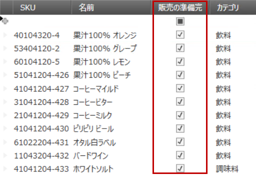
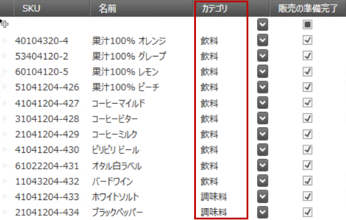
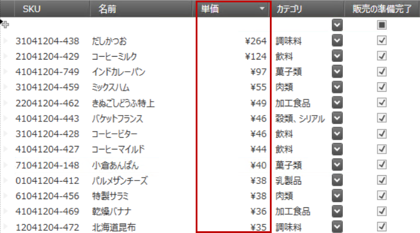
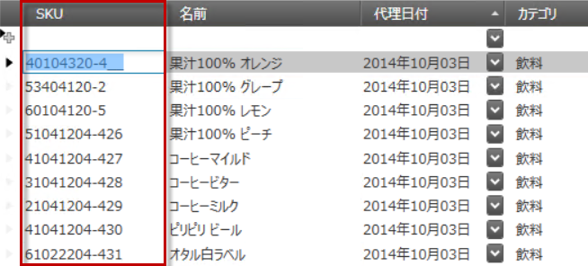
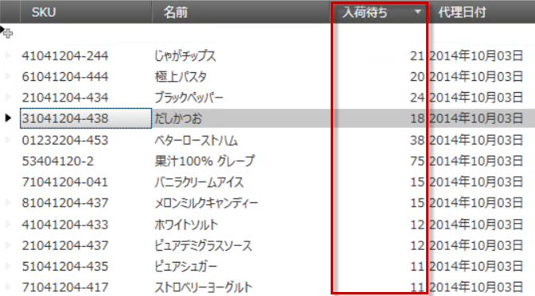
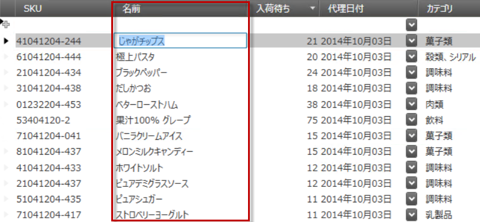

////

|metadata|
{
    "name": "configuring-specific-editor-fields",
    "controlName": [],
    "tags": [],
    "guid": "eea3a925-b003-444a-8249-d75591d3a97a",  
    "buildFlags": [],
    "createdOn": "2014-06-26T13:32:28.1905416Z"
}
|metadata|
////

== トピックの概要

=== 目的

このトピックでは、_xamDataPresenter_™ コントロールのさまざまなデータ タイプに対し、特定のエディター フィールドを簡単に構成する方法を説明します。

=== 前提条件

このトピックをより理解するために、以下のトピックを参照することをお勧めします。

[options="header", cols="a,a"]
|====
|トピック|目的

| link:wpf-terms-and-concepts.html[用語と概念]
|このセクションでは、Data Presenter Family のコントロールを構成する主要な要素を定義します。

| link:xamdatagrid-getting-started-with-xamdatagrid.html[xamDataGrid をページに追加]
|このトピックでは、 _xamDataGrid_ コントロールをページに追加する方法について説明します。

| link:xamdata-generating-fields-manually-versus-automatically.html[フィールドの生成、手動と自動]
|このトピックでは、 _xamDataGrid_ コントロールで FieldLayout および Field を手動で指定する方法を説明します。

|====

=== このトピックの内容

このトピックは、以下のセクションで構成されます。

* <<_Ref388889864, 特定のエディター フィールドの概要 >>
* <<_Ref388887194, チェックボックス フィールドの構成 >>
* <<_Ref388887204, コンボ ボックス フィールドの構成 >>
* <<_Ref388887214, 通貨フィールドの構成 >>
* <<_Ref388887220, 日付/時刻フィールドの構成 >>
* <<_Ref388887226, マスクされたテキスト フィールドの構成 >>
* <<_Ref388887231, 数値フィールドの構成 >>
* <<_Ref388887237, テキスト フィールドの構成 >>
* <<_Ref388889910, 関連コンテンツ >>

** <<_Ref388889914,トピック>>

[[_Ref388889864]]
== 特定のエディター フィールドの概要

=== 特定のエディター フィールドの概要

_xamDataPresenter_   コントロールは、フィールドを自動または手動で定義する方法を提供しています。ほとんどの場合、特定のエディターを指定する方法をお勧めします。

さまざまなエディター フィールドは、特定のデータ タイプを処理するための特定のエディターを簡単に指定する手段となります。

=== 特定のエディター フィールドの概要表

以下の表は、 _xamDataPresenter_   コントロールで構成できるエディター フィールドを簡単に説明し、それらを関連するクラスにマップします。詳細は、表の後に記載されています。

[options="header", cols="a,a,a"]
|====
|構成可能な項目|詳細|クラス

|<<_Ref388887194,チェックボックス フィールドの構成>>
|`CheckBoxField` を使用して、ブール データ型を _xamCheckEditor_ コントロールを介して編集します。
|
* link:{ApiPlatform}datapresenter{ApiVersion}~infragistics.windows.datapresenter.checkboxfield_members.html[CheckBoxField] 

|<<_Ref388887204,コンボ ボックス フィールドの構成>>
|`ComboBoxField` を使用して、項目のコレクションを _xamComboEditor_ コントロールを介して編集します。
|
* link:{ApiPlatform}datapresenter{ApiVersion}~infragistics.windows.datapresenter.comboboxfield_members.html[ComboBoxField] 

|<<_Ref388887214,通貨フィールドの構成>>
|`CurrencyField` を使用して、通貨データを _xamCurrencyEditor_ コントロールを介して編集します。
|
* link:{ApiPlatform}datapresenter{ApiVersion}~infragistics.windows.datapresenter.currencyfield_members.html[CurrencyField] 

|<<_Ref388887220,日付/時刻フィールドの構成>>
|`DateTimeField` を使用して、`DateTime` のデータ型を _xamDateTimeEditor_ コントロールを介して編集します。
|
* link:{ApiPlatform}datapresenter{ApiVersion}~infragistics.windows.datapresenter.datetimefield_members.html[DateTimeField] 

|<<_Ref388887226,マスクされたテキスト フィールドの構成>>
|`MaskedTextField` を使用して、データを _xamMaskedEditor_ コントロールを介して編集します。
|
* link:{ApiPlatform}datapresenter{ApiVersion}~infragistics.windows.datapresenter.maskedtextfield_members.html[MaskedTextField] 

|<<_Ref388887231,数値フィールドの構成>>
|`NumericField` を使用して、数値データを _xamNumericEditor_ コントロールを介して編集します。
|
* link:{ApiPlatform}datapresenter{ApiVersion}~infragistics.windows.datapresenter.numericfield_members.html[NumericField] 

|<<_Ref388887237,テキスト フィールドの構成>>
|`TextField` を使用して、データを _xamTextEditor_ コントロールを介して編集します。
|
* link:{ApiPlatform}datapresenter{ApiVersion}~infragistics.windows.datapresenter.textfield_members.html[TextField] 

|====

[[_Ref388887194]]
== チェックボックス フィールドの構成

[[_Hlk368069110]]

=== 概要

link:{ApiPlatform}datapresenter{ApiVersion}~infragistics.windows.datapresenter.checkboxfield_members.html[CheckBoxField] は、 _xamDataPresenter_   コントロールでブール値データを表すために使用します。

この場合、 _xamCheckEditor_   コントロールが埋め込みエディターです。このコントロールの詳細は、 link:xamcheckeditor.html[xamCheckEditor] のトピックを参照してください。

基本的な link:{ApiPlatform}datapresenter{ApiVersion}~infragistics.windows.datapresenter.field_members.html[Field] プロパティの詳細は、 link:xamdata-terms-fields.html[Fields] のトピックを参照してください。特定のエディター フィールドの一部のプロパティを、以下の*プロパティ設定* で説明します。

=== プロパティ設定

以下の表は、任意の構成とそれを管理するプロパティ設定のマップを示します。

[options="header", cols="a,a,a"]
|====
|目的:|使用するプロパティ:|設定値:

|チェックボックス エディターで複数の選択状態を受け付けるかどうかの指定
| link:{ApiPlatform}datapresenter{ApiVersion}~infragistics.windows.datapresenter.checkboxfield~isthreestate.html[IsThreeState]
|`bool`? 

デフォルトでは、定義済みの 2 つの状態 (選択および非選択) が使用できます。

|====

[[_Hlk337817761]]

=== 例

以下のスクリーンショットは、 _xamDataGrid_   コントロールで定義された `CheckBoxField` を示します。

以下のコードはこの例を実装します。

*XAML の場合:*

[source,xaml]
----
<igDP:CheckBoxField  Name="ReadyForSale" Label="Ready For Sale" />
----

[[_Ref388887204]]
== コンボ ボックス フィールドの構成

=== 概要

link:{ApiPlatform}datapresenter{ApiVersion}~infragistics.windows.datapresenter.comboboxfield_members.html[ComboBoxField] は、 _xamDataPresenter_   コントロールで項目コレクションを表すために使用します。

この場合、 _xamComboEditor_   コントロールが埋め込みエディターです。このコントロールの詳細は、 link:xamcomboeditor.html[xamComboEditor] のトピックを参照してください。

基本的な link:{ApiPlatform}datapresenter{ApiVersion}~infragistics.windows.datapresenter.field_members.html[Field] プロパティの詳細は、 link:xamdata-terms-fields.html[Fields] のトピックを参照してください。特定のエディター フィールドの一部のプロパティを、以下の*プロパティ設定* で説明します。

=== プロパティ設定

以下の表は、任意の構成とそれを管理するプロパティ設定のマップを示します。

[options="header", cols="a,a,a"]
|====
|目的:|使用するプロパティ:|設定値:

|_xamComboEditor_ でどの値を表示するかを示すデータ項目プロパティへのパスの指定
| link:{ApiPlatform}datapresenter{ApiVersion}~infragistics.windows.datapresenter.comboboxfield~displaymemberpath.html[DisplayMemberPath]
|`string`

|_xamComboEditor_ の編集部分にテキストまたは値を表示するかどうかの指定
| link:{ApiPlatform}datapresenter{ApiVersion}~infragistics.windows.datapresenter.comboboxfield~displayvaluesource.html[DisplayValueSource]
| link:{ApiPlatform}editors{ApiVersion}~infragistics.windows.editors.displayvaluesource.html[DisplayValueSource]? 

デフォルトでは、`DisplayText` が表示されます。

|_xamComboEditor_ のドロップダウン ボタンを表示するタイミングの指定
| link:{ApiPlatform}datapresenter{ApiVersion}~infragistics.windows.datapresenter.comboboxfield~dropdownbuttondisplaymode.html[DropDownButtonDisplayMode]
| link:{RootAssembly}{ApiVersion}~infragistics.controls.editors.dropdownbuttondisplaymode.html[DropDownButtonDisplayMode]? 

デフォルトでは、ドロップダウン ボタンの表示状態は `Always` に設定されています。他のオプションは、`Focused`、`MouseOver` および `OnlyInEditMode` です。

|_xamComboEditor_ ドロップダウンのサイズ変更を、ユーザーに許可するかどうかの指定
| link:{ApiPlatform}datapresenter{ApiVersion}~infragistics.windows.datapresenter.comboboxfield~dropdownresizemode.html[DropDownResizeMode]
| link:{RootAssembly}{ApiVersion}~infragistics.windows.controls.popupresizemode.html[PopupResizeMode]? 

デフォルトでは、ユーザーはドロップダウンのサイズを水平方向と垂直方向の`両`方向で変更できます。

|_xamComboEditor_ でテキストが編集できるかどうかの指定
| link:{ApiPlatform}datapresenter{ApiVersion}~infragistics.windows.datapresenter.comboboxfield~iseditable.html[IsEditable]
|`bool?`

|_xamComboEditor_ の項目コレクションの指定
| link:{ApiPlatform}datapresenter{ApiVersion}~infragistics.windows.datapresenter.comboboxfield~itemssource.html[ItemsSource]
|`IEnumerable` 

注: 

[NOTE] 

==== 

ComboBoxItemsProvider は、ルックアップが最適化されるようにItemsSource をラップするために、内部で作成されます。   

====

|項目ソースへの項目のユーザー入力を制限するかどうかの指定
| link:{ApiPlatform}datapresenter{ApiVersion}~infragistics.windows.datapresenter.comboboxfield~limittolist.html[LimitToList]
|`bool?` 

_xamComboEditor_ はデフォルトで編集できます。したがって、ユーザーは項目コレクションでは使用できない項目を入力できます。入力した項目が項目コレクションに有る場合は、選択されます。 

ユーザー入力を制限するには、`LimitToList` を `true` に設定します。ユーザーが無効な値でエディターを終了しようとしたときのエディターの動作を、 link:{ApiPlatform}datapresenter{ApiVersion}~infragistics.windows.datapresenter.field~invalidvaluebehavior.html[InvalidValueBehavior] プロパティを使用して指定します。

|値が null の場合に表示するテキストの指定
| link:{ApiPlatform}datapresenter{ApiVersion}~infragistics.windows.datapresenter.textfieldbase~nulltext.html[NullText]
|`string`

|ドロップダウンの最大高さの指定
| link:{ApiPlatform}datapresenter{ApiVersion}~infragistics.windows.datapresenter.comboboxfield~maxdropdownheight.html[MaxDropDownHeight]
|`double?`

|ドロップダウンの最大幅の指定
| link:{ApiPlatform}datapresenter{ApiVersion}~infragistics.windows.datapresenter.comboboxfield~maxdropdownwidth.html[MaxDropDownWidth]
|`double?`

|ドロップダウンの最小幅の指定
| link:{ApiPlatform}datapresenter{ApiVersion}~infragistics.windows.datapresenter.comboboxfield~mindropdownwidth.html[MinDropDownWidth]
|`double?`

|項目が選択されたときにどの値を返すかを示すデータ項目プロパティへのパスの指定
| link:{ApiPlatform}datapresenter{ApiVersion}~infragistics.windows.datapresenter.comboboxfield~valuepath.html[ValuePath]
|`string`

|表示テキストと値の変換に使用するコンバーターの指定
| link:{ApiPlatform}datapresenter{ApiVersion}~infragistics.windows.datapresenter.textfieldbase~valuetodisplaytextconverter.html[ValueToDisplayTextConverter]
|`IValueConverter`

|====

=== 例

以下のスクリーンショットは、 _xamDataGrid_   コントロールで定義された `ComboBoxField` を示します。

以下のコードはこの例を実装します。

*XAML の場合:*

[source,xaml]
----
<igDP:ComboBoxField Name="Category" Label="Category"
                    ItemsSource="{Binding Source={StaticResource categories}}"
                    DisplayMemberPath="Name" />
----

[[_Ref388887214]]
== 通貨フィールドの構成

=== 概要

link:{ApiPlatform}datapresenter{ApiVersion}~infragistics.windows.datapresenter.currencyfield_members.html[CurrencyField] は、 _xamDataPresenter_   コントロールで通貨データを表すために使用します。

この場合、 _xamCurrencyEditor_   コントロールが埋め込みエディターです。このコントロールの詳細は、 link:xamcurrencyeditor.html[xamCurrencyEditor] のトピックを参照してください。

基本的な link:{ApiPlatform}datapresenter{ApiVersion}~infragistics.windows.datapresenter.field_members.html[Field] プロパティの詳細は、 link:xamdata-terms-fields.html[Fields] のトピックを参照してください。

注:

[NOTE]
====
link:{ApiPlatform}datapresenter{ApiVersion}~infragistics.windows.datapresenter.currencyfield_members.html[CurrencyField] は link:{ApiPlatform}datapresenter{ApiVersion}~infragistics.windows.datapresenter.maskedtextfield_members.html[MaskedTextField] から派生しているため、そのすべてのプロパティを継承します。
====

=== 例

以下のスクリーンショットは、 _xamDataGrid_   コントロールで定義された `CurrencyField` を示します。

以下のコードはこの例を実装します。

*XAML の場合:*

[source,xaml]
----
<igDP:CurrencyField Name="UnitPrice" Label="Unit Price" />
----

[[_Ref388887220]]
== 日付/時刻フィールドの構成

=== 概要

link:{ApiPlatform}datapresenter{ApiVersion}~infragistics.windows.datapresenter.datetimefield_members.html[DateTimeField] は、 _xamDataPresenter_   コントロールで `DateTime` データを表すために使用します。

この場合、 _xamDateTimeEditor_   コントロールが埋め込みエディターです。このコントロールの詳細は、 link:xamdatetimeeditor.html[xamDateTimeEditor] のトピックを参照してください。

基本的な link:{ApiPlatform}datapresenter{ApiVersion}~infragistics.windows.datapresenter.field_members.html[Field] プロパティの詳細は、 link:xamdata-terms-fields.html[Fields] のトピックを参照してください。特定のエディター フィールドの一部のプロパティを、以下の*プロパティ設定* で説明します。

注:

[NOTE]
====
link:{ApiPlatform}datapresenter{ApiVersion}~infragistics.windows.datapresenter.datetimefield_members.html[DateTimeField] は link:{ApiPlatform}datapresenter{ApiVersion}~infragistics.windows.datapresenter.maskedtextfield_members.html[MaskedTextField] から派生しているため、そのすべてのプロパティを継承します。
====

=== プロパティ設定

以下の表は、任意の構成とそれを管理するプロパティ設定のマップを示します。

[options="header", cols="a,a,a"]
|====
|目的:|使用するプロパティ:|設定値:

|日付の選択に使用するドロップダウン カレンダーの表示の指定
| link:{ApiPlatform}datapresenter{ApiVersion}~infragistics.windows.datapresenter.datetimefield~allowdropdown.html[AllowDropDown]
|`bool?`

|_xamDateTimeEditor_ のドロップダウン ボタンを表示するタイミングの指定
| link:{ApiPlatform}datapresenter{ApiVersion}~infragistics.windows.datapresenter.datetimefield~dropdownbuttondisplaymode.html[DropDownButtonDisplayMode]
| link:{ApiPlatform}editors{ApiVersion}~infragistics.windows.editors.dropdownbuttondisplaymode.html[DropDownButtonDisplayMode]? 

デフォルトでは、ドロップダウン ボタンの表示状態は `Always` に設定されています。他のオプションは、`Focused`、`MouseOver` および `OnlyInEditMode` です。

|====

=== 例

以下のスクリーンショットは、 _xamDataGrid_   コントロールで定義された `DateTimeField` を示します。

image::images/Configuring_Editor_Specific_Fields_4.png[]

以下のコードはこの例を実装します。

*XAML の場合:*

[source,xaml]
----
<igDP:DateTimeField Name="SupplyDate" Label="Supply Date"  />
----

[[_Ref388887226]]
== マスクされたテキスト フィールドの構成

=== 概要

link:{ApiPlatform}datapresenter{ApiVersion}~infragistics.windows.datapresenter.maskedtextfield_members.html[MaskedTextField] は、 _xamDataPresenter_   コントロールでマスクされたデータを表すために使用します。

この場合、 _xamMaskedEditor_   コントロールが埋め込みエディターです。このコントロールの詳細は、 link:xammaskededitor.html[xamMaskedEditor] のトピックを参照してください。

基本的な link:{ApiPlatform}datapresenter{ApiVersion}~infragistics.windows.datapresenter.field_members.html[Field] プロパティの詳細は、 link:xamdata-terms-fields.html[Fields] のトピックを参照してください。特定のエディター フィールドの一部のプロパティを、以下の*プロパティ設定* で説明します。

=== プロパティ設定

以下の表は、任意の構成とそれを管理するプロパティ設定のマップを示します。

[options="header", cols="a,a,a"]
|====
|目的:|使用するプロパティ:|設定値:

|文字を削除する場合に、セクションの境界を超えて文字を移動させるかどうかの指定
| link:{ApiPlatform}datapresenter{ApiVersion}~infragistics.windows.datapresenter.maskedtextfield~allowshiftingacrosssections.html[AllowShiftingAcrossSections]
|`bool?` 

デフォルト値は `true` です。

|ユーザーがエディターの終了を試行した場合に、空の日付を自動的に塗りつぶすどうかの指定
| link:{ApiPlatform}datapresenter{ApiVersion}~infragistics.windows.datapresenter.maskedtextfield~autofilldate.html[AutoFillDate]
| link:{ApiPlatform}controls.editors.xammaskedinput{ApiVersion}~infragistics.controls.editors.autofilldate.html[AutoFillDate]? 

デフォルト値は `None` です。

|データ マスキングが有効な場合に、エディターのコンテンツをどのようにクリップボードにコピーするかの指定
| link:{ApiPlatform}datapresenter{ApiVersion}~infragistics.windows.datapresenter.maskedtextfield~clipmode.html[ClipMode]
| link:{ApiPlatform}editors{ApiVersion}~infragistics.windows.editors.maskmode.html[MaskMode]?

|データ マスキングが有効な場合に、データ ソースがエディターのコンテンツを保存する方法の指定
| link:{ApiPlatform}datapresenter{ApiVersion}~infragistics.windows.datapresenter.maskedtextfield~datamode.html[DataMode]
| link:{ApiPlatform}editors{ApiVersion}~infragistics.windows.editors.maskmode.html[MaskMode]?

|コントロールが編集モードではなく、データ マスキングが有効な場合に、エディターのコンテンツをどのように表示するかの指定
| link:{ApiPlatform}datapresenter{ApiVersion}~infragistics.windows.datapresenter.maskedtextfield~displaymode.html[DisplayMode]
| link:{ApiPlatform}editors{ApiVersion}~infragistics.windows.editors.maskmode.html[MaskMode]?

|値が null の場合に表示するテキストの指定
| link:{ApiPlatform}datapresenter{ApiVersion}~infragistics.windows.datapresenter.textfieldbase~nulltext.html[NullText]
|`string`

|コントロール データに提供するマスクの指定
| link:{ApiPlatform}datapresenter{ApiVersion}~infragistics.windows.datapresenter.maskedtextfield~mask.html[Mask]
|`string`

|埋め込み文字として使用する文字の指定
| link:{ApiPlatform}datapresenter{ApiVersion}~infragistics.windows.datapresenter.maskedtextfield~padchar.html[PadChar]
|`char` 

デフォルトの埋め込み文字は、スペース文字 (「 」) です。

|プロンプト文字の指定
| link:{ApiPlatform}datapresenter{ApiVersion}~infragistics.windows.datapresenter.maskedtextfield~promptchar.html[PromptChar]
|`char` 

デフォルトのプロンプト文字は、アンダースコア (＿) です。

|「すべてのテキストを選択する」操作を実行する場合に、入力した文字のみを選択、またはすべての文字 (プロンプト文字を含む) を選択のいずれかの指定
| link:{ApiPlatform}datapresenter{ApiVersion}~infragistics.windows.datapresenter.maskedtextfield~selectallbehavior.html[SelectAllBehavior]
| link:{ApiPlatform}editors{ApiVersion}~infragistics.windows.editors.maskselectallbehavior.html[MaskSelectAllBehavior]? 

デフォルト値は `SelectAllCharacters` です。

|エディターのスピン ボタンを表示するタイミングの指定
| link:{ApiPlatform}datapresenter{ApiVersion}~infragistics.windows.datapresenter.maskedtextfield~spinbuttondisplaymode.html[SpinButtonDisplayMode]
| link:{ApiPlatform}controls.editors.xammaskedinput{ApiVersion}~infragistics.controls.editors.spinbuttondisplaymode.html[SpinButtonDisplayMode]? 

デフォルトでは、スピン ボタンは表示`されません`。他のオプションは、`Always`、`MouseOver`、`Focused` および `OnlyInEditMode` です。

|スピン アップ ボタンまたはスピン ダウン ボタンをクリックしたときに、エディターの値を増加 / 減少する値の指定
| link:{ApiPlatform}datapresenter{ApiVersion}~infragistics.windows.datapresenter.maskedtextfield~spinincrement.html[SpinIncrement]
|`object` 

増加 / 減少のタイプは、コントロールで編集するデータ型に基づきます。

|スピン ボタンがエディター値をラップするかどうかの指定
| link:{ApiPlatform}datapresenter{ApiVersion}~infragistics.windows.datapresenter.maskedtextfield~spinwrap.html[SpinWrap]
|`bool?` 

デフォルト値は `False` です。

|数値マスクの少数部から不要なゼロをトリミングするかどうかの指定
| link:{ApiPlatform}datapresenter{ApiVersion}~infragistics.windows.datapresenter.maskedtextfield~trimfractionalzeros.html[TrimFractionalZeros]
|`bool?` 

デフォルト値は `False` です。

|表示テキストと値の変換に使用するコンバーターの指定
| link:{ApiPlatform}datapresenter{ApiVersion}~infragistics.windows.datapresenter.textfieldbase~valuetodisplaytextconverter.html[ValueToDisplayTextConverter]
|`IValueConverter`

|====

=== 例

以下のスクリーンショットは、 _xamDataGrid_   コントロールで定義された `MaskedTextField` を示します。

以下のコードはこの例を実装します。

*XAML の場合:*

[source,xaml]
----
<igDP:MaskedTextField Name="SKU" Label="SKU" Mask="########-###"/>
----

[[_Ref388887231]]
== 数値フィールドの構成

=== 概要

link:{ApiPlatform}datapresenter{ApiVersion}~infragistics.windows.datapresenter.numericfield_members.html[NumericField] は、 _xamDataPresenter_   コントロールで数値データを表すために使用します。

この場合、 _xamNumericEditor_   コントロールが埋め込みエディターです。このコントロールの詳細は、 link:xamnumericeditor.html[xamNumericEditor] のトピックを参照してください。

基本的な link:{ApiPlatform}datapresenter{ApiVersion}~infragistics.windows.datapresenter.field_members.html[Field] プロパティの詳細は、 link:xamdata-terms-fields.html[Fields] のトピックを参照してください。特定のエディター フィールドの一部のプロパティを、以下の*プロパティ設定* で説明します。

注:

[NOTE]
====
link:{ApiPlatform}datapresenter{ApiVersion}~infragistics.windows.datapresenter.numericfield_members.html[NumericField] は link:{ApiPlatform}datapresenter{ApiVersion}~infragistics.windows.datapresenter.maskedtextfield_members.html[MaskedTextField] から派生しているため、そのすべてのプロパティを継承します。
====

=== 例

以下のスクリーンショットは、 _xamDataGrid_   コントロールで定義された `NumericField` を示します。

以下のコードはこの例を実装します。

*XAML の場合:*

[source,xaml]
----
<igDP:NumericField Name="UnitsOnOrder" Label="Units On Order"
                   SpinButtonDisplayMode="Always"
                   SpinIncrement="5"/>
----

[[_Ref388887237]]
== テキスト フィールドの構成

=== 概要

_xamDataPresenter_   コントロールでデータを表すには、 link:{ApiPlatform}datapresenter{ApiVersion}~infragistics.windows.datapresenter.textfield_members.html[TextField] を使用します。

この場合、 _xamTextEditor_   コントロールが埋め込みエディターです。このコントロールの詳細は、 link:xamtexteditor.html[xamTextEditor] のトピックを参照してください。

基本的な link:{ApiPlatform}datapresenter{ApiVersion}~infragistics.windows.datapresenter.field_members.html[Field] プロパティの詳細は、 link:xamdata-terms-fields.html[Fields] のトピックを参照してください。特定のエディター フィールドの一部のプロパティを、以下の*プロパティ設定* で説明します。

=== プロパティ設定

以下の表は、任意の構成とそれを管理するプロパティ設定のマップを示します。

[options="header", cols="a,a,a"]
|====
|目的:|使用するプロパティ:|設定値:

|`リターン` キーを押した場合に改行を挿入するかどうかの指定
| link:{ApiPlatform}datapresenter{ApiVersion}~infragistics.windows.datapresenter.textfield~acceptsreturn.html[AcceptsReturn]
|`bool?`

|`Tab` キーを押した場合にタブ文字を挿入する、またはフォーカスを移動するのいずれかの指定
| link:{ApiPlatform}datapresenter{ApiVersion}~infragistics.windows.datapresenter.textfield~acceptstab.html[AcceptsTab]
|`bool?`

|水平スクロール バーの可視性の指定
| link:{ApiPlatform}datapresenter{ApiVersion}~infragistics.windows.datapresenter.textfield~horizontalscrollbarvisibility.html[HorizontalScrollBarVisibility]
|`ScrollBarVisibility?`

|値が null の場合に表示するテキストの指定
| link:{ApiPlatform}datapresenter{ApiVersion}~infragistics.windows.datapresenter.textfieldbase~nulltext.html[NullText]
|`string`

|水平方向のテキストの配置の指定
| link:{ApiPlatform}datapresenter{ApiVersion}~infragistics.windows.datapresenter.textfield~textalignment.html[TextAlignment]
|`TextAlignment?`

|テキストの折り返す方法の指定
| link:{ApiPlatform}datapresenter{ApiVersion}~infragistics.windows.datapresenter.textfield~textwrapping.html[TextWrapping]
|`TextWrapping?`

|垂直スクロール バーの可視性の指定
| link:{ApiPlatform}datapresenter{ApiVersion}~infragistics.windows.datapresenter.textfield~verticalscrollbarvisibility.html[VerticalScrollBarVisibility]
|`ScrollBarVisibility`

|表示テキストと値の変換に使用するコンバーターの指定
| link:{ApiPlatform}datapresenter{ApiVersion}~infragistics.windows.datapresenter.textfieldbase~valuetodisplaytextconverter.html[ValueToDisplayTextConverter]
|`IValueConverter`

|====

=== 例

以下のスクリーンショットは、 _xamDataGrid_   コントロールで定義された `TextField` を示します。

以下のコードはこの例を実装します。

*XAML の場合:*

[source,xaml]
----
<igDP:TextField Name="Name" Label="Name"/>
----

[[_Ref388889910]]
== 関連コンテンツ

[[_Ref388889914]]

=== トピック

このトピックの追加情報については、以下のトピックも合わせてご参照ください。

[options="header", cols="a,a"]
|====
|トピック|目的

| link:xamdatapresenter-define-a-field-layout.html[フィールド レイアウトの定義]
|このトピックでは、表示するフィールドを指定し、 _xamDataPresenter_ コントロールでこれらのフィールドに関連するプロパティを設定するために、フィールドのレイアウトを定義する方法を説明します。

| link:xamdatapresenter-configuring-template-field.html[テンプレート フィールドの構成]
|このトピックでは、カスタム表示のフィールドを作成し、 _xamDataPresenter_ コントロールの TemplateField を使用してテンプレートを編集する方法を説明します。

| link:xamdata-generating-fields-manually-versus-automatically.html[フィールドの生成、手動と自動]
|このトピックでは、 _xamDataPresenter_ コントロールによるフィールドの自動生成と手動生成の違いを説明します。

| link:xamdatapresenter-manually-assigning-a-field-layout-to-xamdatapresenter.html[フィールド レイアウトの xamDataPresenter への手動割り当て]
|このトピックでは、 _xamDataPresenter_ コントロールに対する複数の FieldLayouts を作成する方法を説明します。

| link:xam-data-grid-displaying-an-image-in-a-field.html[フィールドへの画像の表示]
|このトピックでは、画像を表示させるフィールドを追加し、 _xamDataPresenter_ コントロールで CellValuePresenter のテンプレートをオーバーライドする方法を説明します。

| link:xamdatapresenter-load-field-customizations.html[フィールドのカスタマイズの読み込み]
|このトピックでは、 _xamDataPresenter_ コントロール用にカスタマイズされたフィールドを読み込む方法を説明します。

| link:xamdatapresenter-save-field-customizations.html[フィールドのカスタマイズの保存]
|このトピックでは、 _xamDataPresenter_ コントロール用にカスタマイズされたフィールドを保存する方法を説明します。

| link:xamdatagrid-changing-the-default-column-and-row-definitions.html[デフォルトの行および列定義の変更]
|このトピックでは、各フィールドの Row、Column、ColumnSpan または RowSpan をカスタマイズして、レコードを一層使いやすくなるようにレイアウトを変更する方法を説明します。

| link:xamdatagrid-changing-the-record-orientation.html[レコードの方向の変更]
|このトピックでは、レコードの方向を変更する方法について説明します。

| link:xamdata-enabling-right-to-left-support.html[右から左へのサポートの有効化]
|このトピックでは、内容のフロー方向を変更する方法について説明します。

| link:xamdatagrid-fields-editors-configuration-.html[フィールドのエディター構成]
|このトピックでは、データ プレゼンター フィールド エディターのコントロールを構成する方法を説明します。

|====