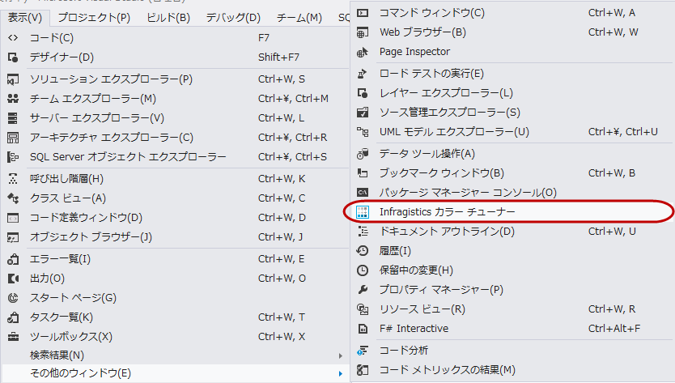
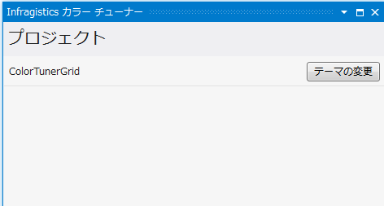
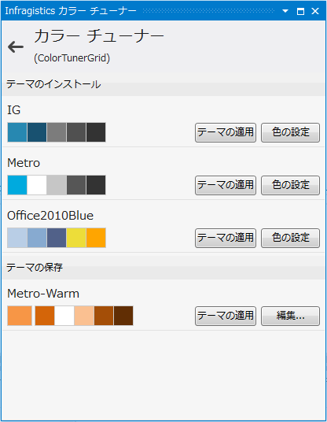
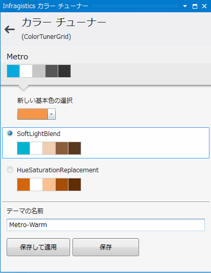
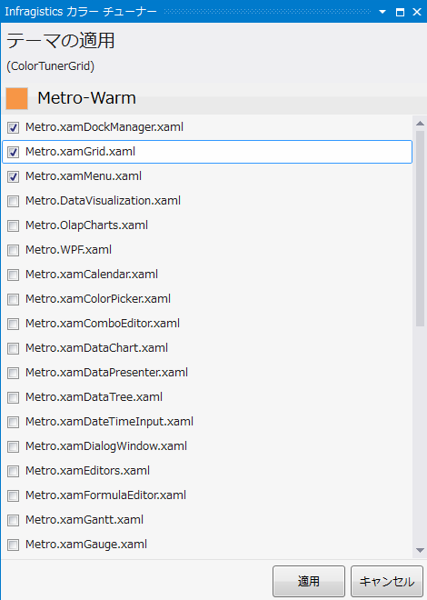
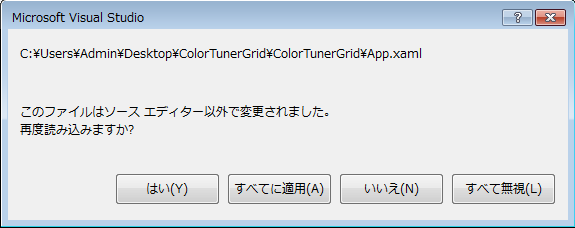

////

|metadata|
{
    "name": "creating-and-applying-color-tuning-configurations",
    "controlName": ["Infragistics Color Tuner"],
    "tags": [],
    "guid": "ae166377-91e4-41b4-89d0-27bf2a99fb70",  
    "buildFlags": [],
    "createdOn": "2016-05-25T18:22:00.2914054Z"
}
|metadata|
////

= 色調整の構成を作成および適用

=== 目的

このトピックは、 Infragistics Color Tuner を使用してカスタム カラー調整されたテーマを作成および適用する方法を説明します。

=== 前提条件

以下の表は、このトピックを理解するための前提条件として必要なトピックを示しています。

[options="header", cols="a,a"]
|====
|トピック|目的

| link:reswash-using.html[リソース ウォッシャーの使用]
|このトピックでは、 _ResourceWasher_ コンポーネントを紹介します。これを使用して、アプリケーションの配色全体を変更することができます。

| link:using-infragistics-color-tuner.html[Infragistics Color Tuner の使用]
|このトピックは、Visual Studio 2010 の拡張機能である、Infragistics カラー チューナーを説明します。XAML カラー チューナーによって、便利な UI を使用して、 WPF コントロールの XAML テーマを適用して色を調節できます。

|====

=== このトピックの内容

このトピックは以下のセクションからなります。

* <<_Ref318799981, カスタム調整されたテーマの作成 >>

** <<_Ref318799988,はじめに>>

** <<_Ref318799994,要件>>

** <<_Ref318800001,概要>>

** <<_Ref318800010,手順>>

* <<_Ref318800020, 関連コンテンツ >>

[[_Ref318799981]]
== カスタム調整されたテーマの作成

[[_Ref318799988]]

=== はじめに

ここでは、カスタム カラー調整されたテーマを作成して、アプリケーション レベルで特定の Infragistics® コントロールのテーマに適用するために必要な手順を説明します。

[[_Ref318799994]]

=== 要件

手順を完了するためには、Infragistics コントロールを使用した作業中のプロジェクトが必要です。「 link:xamgrid-adding-xamgrid-to-your-page.html[xamGrid をページに追加]」 のトピックに従い、プロジェクトを簡単に作成できます。

注:

[NOTE]
====
Infragistics Color Tuner を使用するためには、{ProductName} アセンブリが含まれるプロジェクトが必要です。この手順は、Infragistics Color Tuner の使用を紹介するために `xamGrid` コントロールを使用します。同じように、他の Infragistics コントロールにもカラー チューニングを提供できます。
====

[[_Ref318800001]]

=== 概要

このトピックは、カスタムカラー調整されたテーマのを作成および適用を手順ごとに説明します。以下はプロセスの概念的概要です。

[start=1]
. *テーマを適用せずにアプリケーションをプレビュー* 
[start=2]
. *新しいテーマを作成* 
[start=3]
. *テーマを適用* 
[start=4]
. *テーマを適用してアプリケーションをプレビュー* 

[[_Ref318800010]]

=== 手順

=== テーマを適用せずにアプリケーションをプレビュー

以下の画像はテーマなしのプロジェクトの描画を表示します。「 link:xamgrid-adding-xamgrid-to-your-page.html[xamGrid をページに追加]」のトピックの説明に沿って進むと、プロジェクトは同様になります。

image::images/Create_and_appy_custom_tuned_theme_1.png[]

=== 新しいテーマを作成

[start=1]
. Microsoft® Visual Studio™ を使用してカラー調整されたテーマを作成するには、[表示] $$->$$ [その他のウィンドウ] $$->$$ [Infragistics Color Tuner] の順に指定し、Infragistics Color Tuner を開始します。

[テーマを修正] ボタンが付けられてプロジェクト名を表示するプロジェクト ウィンドウが表示します。

[start=2]
. [テーマを修正] ボタンを押します。

ウィンドウのインストールされたテーマ領域で複数のデフォルト テーマをリストするテーマ ウィンドウが表示されます。デフォルトのテーマ名の右側に、[使用…] ボタンと [カラー チューン…] ボタンがあります。_Metro_   テーマで、[カラー チューン…] ボタンをクリックします。

テーマ ウォッシャー ウィンドウが表示します。

[start=3]
. テーマのベース カラー、カラー ウォッシュ モード、名前を選択します。チュートリアルでは、オレンジの Base カラー (#FFF79646)、HueSaturationReplacement ウォッシュ モードおよび Metro-Warm という名前が使用されます。

[start=4]
. [保存] ボタンをクリックして変更を保存します。

テーマ ウィンドウが表示されます。[インストールされたテーマ] のそばに、[保存されたテーマ] という別のセクションがあり、カスタム調整されたテーマが表示されます。

=== テーマを適用

[start=1]
. すべての使用可能な control .xaml テーマ ファイルのリストとともに表示する [テーマを適用] ウィンドウから、テーマを適用したい control .xaml のチェックボックスにチェックを付けます。

この手順は  _xamGrid_  、 _xamMenu_  、および  _xamDockManager_   を使用します。リストから Metro.xamGrid.xaml、Metro.xamMenu.xaml、および Metro.xamDockManager.xaml を選択します。

[start=2]
. 確認するために、[適用] ボタンをクリックします。

Infragistics Color Tuner は  _App.xaml_   プロジェクト ファイルに選択を書き込みます。開いているファイルの中に App.xaml ファイルが含まれている場合、Microsoft Visual Studio ダイアログ ウィンドウが表示され、変更した App.xaml ファイルを再読み込みするかどうか確認します。[はい] を選択します。

=== テーマを適用してアプリケーションをプレビュー

以下はカスタム調整されたテーマを適用したプロジェクトの表示です。

image::images/Create_and_appy_custom_tuned_theme_8.png[]

[[_Ref318800020]]
== 関連コンテンツ

=== トピック

このトピックについては、以下のトピックも参照してください。

[options="header", cols="a,a"]
|====
|トピック|目的

| link:sharing-color-tuning-configuration.html[カラー調整の構成を共有]
|このトピックはカラー調整の構成を共有するための説明を行います。

| link:reswash-using.html[リソース ウォッシャーの使用]
|このトピックでは、 _ResourceWasher_ コンポーネントを紹介します。これを使用して、アプリケーションの配色全体を変更することができます。

| link:using-infragistics-color-tuner.html[Infragistics Color Tuner の使用]
|このトピックは、Visual Studio 2010 の拡張機能である、Infragistics カラー チューナーを説明します。Infragistics Color Tuner の便利な UI では、WPF コントロールの XAML テーマを適用して色を調節できます。

|====