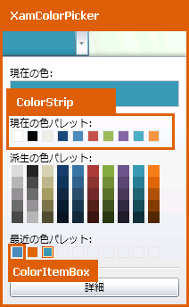
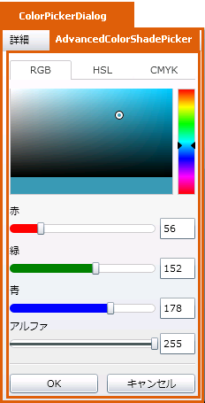

////

|metadata|
{
    "name": "designers-guide-styling-points-for-xamcolorpicker",
    "controlName": [],
    "tags": ["Layouts","Styling","Theming"],
    "guid": "14ee6dac-fb2b-4c4f-82d8-2bb7f63a6169",  
    "buildFlags": ["wpf","sl"],
    "createdOn": "2012-01-30T16:46:26.9448012Z"
}
|metadata|
////

= xamColorPicker のスタイリング ポイント

== xamColorPicker プロパティ

以下の図は、xamColorPicker によって使用されるさまざまなコントロールを取り上げます。特定の項目を再スタイルするには、最初に図で TargetType を識別し、次にその後の表で対応する Style プロパティを識別します。

以下の表は xamColorPicker コントロールによって使用されるさまざまなセル コントロールをリストし、カスタム スタイルを設定するために使用できるプロパティを識別します。

[options="header", cols="a,a,a"]
|====
|TargetType|Style プロパティ|説明

|xamColorPicker
|xamColorPicker.Style
|xamColorPicker コントロールのスタイルを設定します。

|ColorStrip
|ColorStrip.Style
|カラー ストリップ領域のスタイルを設定します。

|ColorItemBox
|ColorItemBox.Style
|カラー アイテム ボックス領域のスタイルを設定します。

|====

以下の表は xamColorPicker コントロールによって使用されるさまざまなセル コントロールをリストし、カスタム スタイルを設定するために使用できるプロパティを識別します。

[options="header", cols="a,a,a"]
|====
|TargetType|Style プロパティ|説明

|AdvancedColorShadePicker
|AdvancedColorShadePicker.Style
|詳細エディター領域のスタイルを設定します。

|====