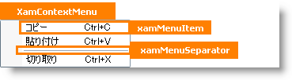

////

|metadata|
{
    "name": "designers-guide-styling-points-for-xamcontextmenu",
    "controlName": [],
    "tags": ["Styling","Templating"],
    "guid": "{F4187634-BB36-4266-B1F9-A4A98709352C}",  
    "buildFlags": ["sl","wpf"],
    "createdOn": "2012-01-30T16:46:26.9508012Z"
}
|metadata|
////

= xamContextMenu のスタイリング ポイント

== xamContextMenu プロパティ

以下の図は、xamContextMenu によって使用されるさまざまなコントロールを取り上げます。特定の項目を再スタイルするには、最初に図で TargetType を識別し、次にその後の表で対応する Style プロパティを識別します。

== xamContextMenu スタイル プロパティおよび TargetType

以下の表は xamContextMenu コントロールによって使用されるさまざまなセル コントロールをリストし、カスタム スタイルを設定するために使用できるプロパティを識別します。

[options="header", cols="a,a,a"]
|====
|TargetType|Style プロパティ|説明

|xamContextMenu
|xamContextMenu.Style
|xamSlider コントロールをスタイルします。

|xamMenuSeperator
|xamMenuSeparator.Style
|メニュー セパレーター コントロールをスタイルします。

|xamMenuItem
|xamContextMenu.Style
|メニュー項目コントロールをスタイルします。

|
|xamContextMenu.ItemContainerStyle
|メニュー コントロールのすべての項目コントロールをスタイルします。

|====