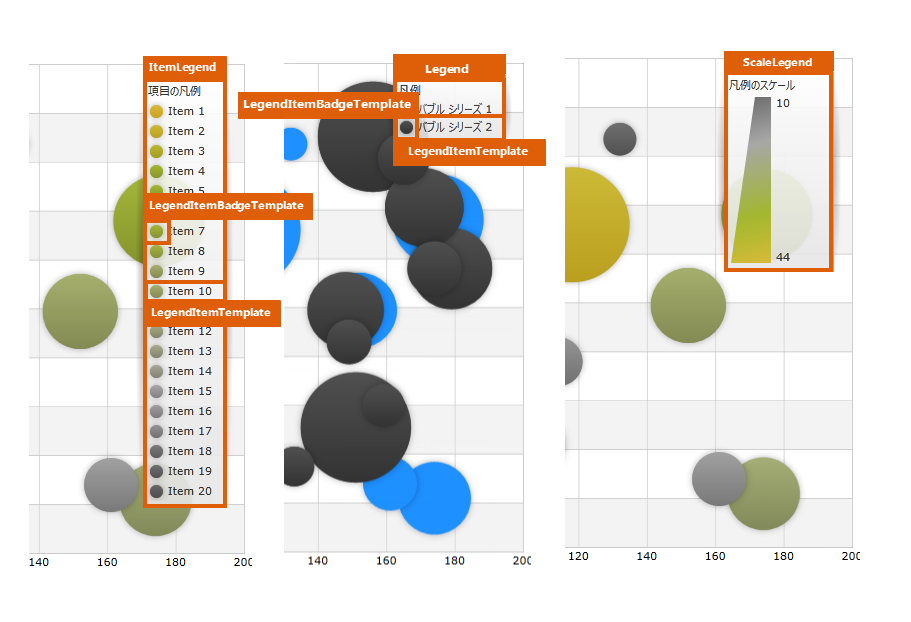

////

|metadata|
{
    "name": "designers-guide-styling-points-for-xamdatachart",
    "controlName": [],
    "tags": ["Charting","Styling","Templating"],
    "guid": "3ffb894d-4402-4322-8e83-442d907b7ec4",  
    "buildFlags": [],
    "createdOn": "2012-04-05T16:16:17.0942759Z"
}
|metadata|
////

= xamDataChart のスタイリング ポイント

== トピックの概要

=== 目的

このトピックは、 link:{ApiPlatform}controls.charts.xamdatachart{ApiVersion}~infragistics.controls.charts.xamdatachart.html[xamDataChart]™ コントロールのスタイリング ポイントをデザイナーに提供します。

[[_Ref320651776]]
== スタイリング ポイント

=== xamDataChart プロパティ

以下の図は、 _xamDataChart_   コントロールが使用するさまざまなコントロールを示しています。特定の項目を再スタイルするには、最初に図で TargetType を識別し、次にその後の表で対応する Style プロパティを識別します。

image::images/Designers_Guide_Styling_Points_for_xamDataChart_1.png[]

image::images/Designers_Guide_Styling_Points_for_xamDataChart_3.png[]

以下の表で、 _xamDataChart_   コントロールの視覚要素をスタイリングするためのプロパティを簡単に説明します。

[options="header", cols="a,a,a"]
|====
|TargetType|Style プロパティ|説明

| link:{ApiPlatform}controls.charts.xamdatachart{ApiVersion}~infragistics.controls.charts.xamdatachart.html[xamDataChart]
| link:{ApiPlatform}controls.charts.xamdatachart{ApiVersion}~infragistics.controls.charts.xamdatachart.html[xamDataChart]. link:http://msdn.microsoft.com/ja-jp/library/system.windows.frameworkelement.style.aspx[Style]
|_xamDataChart_ コントロールのスタイルを指定します。

ifdef::wpf,sl[]
| link:{ApiPlatform}datavisualization{ApiVersion}~infragistics.controls.xamzoombar.html[xamZoombar]
| link:{ApiPlatform}controls.charts.xamdatachart{ApiVersion}~infragistics.controls.charts.xamdatachart.html[xamDataChart]. link:{ApiPlatform}controls.charts.xamdatachart{ApiVersion}~infragistics.controls.seriesviewer~zoombarstyle.html[ZoombarStyle]
|_xamDataChart_ コントロールのズームバーのスタイルを指定します。
endif::wpf,sl[]

ifdef::wpf,sl[]
| link:{ApiPlatform}datavisualization{ApiVersion}~infragistics.controls.xamoverviewplusdetailpane_members.html[xamOverviewPlusDetailPane]
| link:{ApiPlatform}controls.charts.xamdatachart{ApiVersion}~infragistics.controls.charts.xamdatachart.html[xamDataChart]. link:{ApiPlatform}controls.charts.xamdatachart{ApiVersion}~infragistics.controls.seriesviewer~overviewplusdetailpanestyle.html[OverviewPlusDetailPaneStyle]
|_xamDataChart_ コントロールのチャート概要ペインのスタイルを指定します。
endif::wpf,sl[]

| link:http://msdn.microsoft.com/ja-jp/library/system.windows.shapes.line.aspx[Line]
| link:{ApiPlatform}controls.charts.xamdatachart{ApiVersion}~infragistics.controls.charts.xamdatachart.html[xamDataChart]. link:{ApiPlatform}controls.charts.xamdatachart{ApiVersion}~infragistics.controls.seriesviewer~crosshairlinestyle.html[CrosshairLineStyle]
|_xamDataChart_ コントロールの十字ポインターのスタイルを指定します。

| link:{ApiPlatform}controls.charts.xamdatachart{ApiVersion}~infragistics.controls.charts.axis_members.html[Axis] (軸のすべてのタイプ) 
| link:{ApiPlatform}controls.charts.xamdatachart{ApiVersion}~infragistics.controls.charts.xamdatachart.html[xamDataChart]. link:{ApiPlatform}controls.charts.xamdatachart{ApiVersion}~infragistics.controls.charts.xamdatachart~axes.html[Axes][x]. link:http://msdn.microsoft.com/ja-jp/library/system.windows.frameworkelement.style.aspx[Style]
|_xamDataChart_ コントロールの軸のスタイルを指定します。

| link:{ApiPlatform}controls.charts.xamdatachart{ApiVersion}~infragistics.controls.charts.axislabelsettings_members.html[AxisLabelSettings]
| link:{ApiPlatform}controls.charts.xamdatachart{ApiVersion}~infragistics.controls.charts.xamdatachart.html[xamDataChart]. link:{ApiPlatform}controls.charts.xamdatachart{ApiVersion}~infragistics.controls.charts.xamdatachart~axes.html[Axes][x]. link:{ApiPlatform}controls.charts.xamdatachart{ApiVersion}~infragistics.controls.charts.axis~labelsettings.html[LabelSettings]
|軸のラベル設定のスタイルを指定します。

| link:{ApiPlatform}controls.charts.xamdatachart{ApiVersion}~infragistics.controls.seriesviewer~series.html[Series] (すべてのシリーズ タイプ) 

例： 

* link:{ApiPlatform}controls.charts.xamdatachart{ApiVersion}~infragistics.controls.charts.areaseries_members.html[AreaSeries] 

* link:{ApiPlatform}controls.charts.xamdatachart{ApiVersion}~infragistics.controls.charts.columnseries_members.html[ColumnSeries] 

* link:{ApiPlatform}controls.charts.xamdatachart{ApiVersion}~infragistics.controls.charts.barseries_members.html[BarSeries] 

* link:{ApiPlatform}controls.charts.xamdatachart{ApiVersion}~infragistics.controls.charts.stackedbarseries_members.html[StackedBarSeries] 

* link:{ApiPlatform}controls.charts.xamdatachart{ApiVersion}~infragistics.controls.charts.stacked100barseries_members.html[Stacked100BarSeries] 

* link:{ApiPlatform}controls.charts.xamdatachart{ApiVersion}~infragistics.controls.charts.bubbleseries_members.html[BubbleSeries] 

* link:{ApiPlatform}controls.charts.xamdatachart{ApiVersion}~infragistics.controls.charts.scatterseries_members.html[ScatterSeries] 

* link:{ApiPlatform}controls.charts.xamdatachart{ApiVersion}~infragistics.controls.charts.polarsplineseries_members.html[PolarSplineSeries] 

* link:{ApiPlatform}controls.charts.xamdatachart{ApiVersion}~infragistics.controls.charts.polarscatterseries_members.html[PolarScatterSeries] 

* link:{ApiPlatform}controls.charts.xamdatachart{ApiVersion}~infragistics.controls.charts.radialareaseries_members.html[RadialAreaSeries] 

* link:{ApiPlatform}controls.charts.xamdatachart{ApiVersion}~infragistics.controls.charts.radialpieseries_members.html[RadialPieSeries] 

* link:{ApiPlatform}controls.charts.xamdatachart{ApiVersion}~infragistics.controls.charts.valueoverlay_members.html[ValueOverlay] 

* link:{ApiPlatform}controls.charts.xamdatachart{ApiVersion}~infragistics.controls.charts.financialpriceseries_members.html[FinancialPriceSeries] 

* link:{ApiPlatform}controls.charts.xamdatachart{ApiVersion}~infragistics.controls.charts.massindexindicator_members.html[MassIndexIndicator] 

* link:{ApiPlatform}controls.charts.xamdatachart{ApiVersion}~infragistics.controls.charts.typicalpriceindicator_members.html[TypicalPriceIndicator] 

| link:{ApiPlatform}controls.charts.xamdatachart{ApiVersion}~infragistics.controls.charts.xamdatachart.html[xamDataChart]. link:{ApiPlatform}controls.charts.xamdatachart{ApiVersion}~infragistics.controls.seriesviewer~series.html[Series][x]. link:http://msdn.microsoft.com/ja-jp/library/system.windows.frameworkelement.style.aspx[Style] 

link:{ApiPlatform}controls.charts.xamdatachart{ApiVersion}~infragistics.controls.charts.xamdatachart.html[xamDataChart]. link:{ApiPlatform}controls.charts.xamdatachart{ApiVersion}~infragistics.controls.seriesviewer~series.html[Series][x]. link:{ApiPlatform}controls.charts.xamdatachart{ApiVersion}~infragistics.controls.charts.series~legenditemtemplate.html[LegendItemTemplate] 

link:{ApiPlatform}controls.charts.xamdatachart{ApiVersion}~infragistics.controls.charts.xamdatachart.html[xamDataChart]. link:{ApiPlatform}controls.charts.xamdatachart{ApiVersion}~infragistics.controls.seriesviewer~series.html[Series][x]. link:{ApiPlatform}controls.charts.xamdatachart{ApiVersion}~infragistics.controls.charts.series~legenditembadgetemplate.html[LegendItemBadgeTemplate]
|_xamDataChart_ コントロールの link:{ApiPlatform}controls.charts.xamdatachart{ApiVersion}~infragistics.controls.seriesviewer~series.html[Series] コレクションでシリーズのスタイルを指定します。 

_xamDataChart_ コントロールの link:{ApiPlatform}controls.charts.xamdatachart{ApiVersion}~infragistics.controls.seriesviewer~series.html[Series] コレクションでシリーズの凡例項目と凡例レッテル テンプレートのスタイルを指定します。

| link:{ApiPlatform}controls.charts.xamdatachart{ApiVersion}~infragistics.controls.charts.marker_members.html[Marker]
| link:{ApiPlatform}controls.charts.xamdatachart{ApiVersion}~infragistics.controls.charts.markerseries_members.html[MarkerSeries]. link:{ApiPlatform}controls.charts.xamdatachart{ApiVersion}~infragistics.controls.charts.markerseries~markerstyle.html[MarkerStyle] 

(継承するシリーズに適用)
| link:{ApiPlatform}controls.charts.xamdatachart{ApiVersion}~infragistics.controls.charts.markerseries_members.html[MarkerSeries] クラスを継承するシリーズのマーカーのスタイルを指定します (たとえば、 link:{ApiPlatform}controls.charts.xamdatachart{ApiVersion}~infragistics.controls.charts.lineseries_members.html[LineSeries])。

| link:{ApiPlatform}controls.charts.xamdatachart{ApiVersion}~infragistics.controls.charts.legend_members.html[Legend]
| link:{ApiPlatform}controls.charts.xamdatachart{ApiVersion}~infragistics.controls.charts.legend_members.html[Legend]. link:http://msdn.microsoft.com/ja-jp/library/system.windows.frameworkelement.style.aspx[Style]
| link:{ApiPlatform}controls.charts.xamdatachart{ApiVersion}~infragistics.controls.seriesviewer~series.html[Series] オブジェクトのすべてのタイプで使用される _xamDataChart_ コントロールの Legend のスタイルを指定します。

| link:{ApiPlatform}controls.charts.xamdatachart{ApiVersion}~infragistics.controls.charts.itemlegend_members.html[ItemLegend]
| link:{ApiPlatform}controls.charts.xamdatachart{ApiVersion}~infragistics.controls.charts.itemlegend_members.html[ItemLegend]. link:http://msdn.microsoft.com/ja-jp/library/system.windows.frameworkelement.style.aspx[Style]
| link:{ApiPlatform}controls.charts.xamdatachart{ApiVersion}~infragistics.controls.charts.bubbleseries_members.html[BubbleSeries] で使用される _xamDataChart_ コントロールの link:{ApiPlatform}controls.charts.xamdatachart{ApiVersion}~infragistics.controls.charts.itemlegend_members.html[ItemLegend] のスタイルを指定します。

| link:{ApiPlatform}controls.charts.xamdatachart{ApiVersion}~infragistics.controls.charts.scalelegend_members.html[ScaleLegend]
| link:{ApiPlatform}controls.charts.xamdatachart{ApiVersion}~infragistics.controls.charts.scalelegend_members.html[ScaleLegend]. link:http://msdn.microsoft.com/ja-jp/library/system.windows.frameworkelement.style.aspx[Style]
| link:{ApiPlatform}controls.charts.xamdatachart{ApiVersion}~infragistics.controls.charts.bubbleseries_members.html[BubbleSeries]で使用される _xamDataChart_ コントロールの link:{ApiPlatform}controls.charts.xamdatachart{ApiVersion}~infragistics.controls.charts.scalelegend_members.html[ScaleLegend] のスタイルを指定します。

|====

[[_Ref320185294]]
== 関連コンテンツ

=== トピック

以下のトピックでは、このトピックに関連する情報を提供しています。

[options="header", cols="a,a"]
|====
|トピック|目的

| link:datachart-axes.html[軸]
|_xamDataChart_ コントロールで軸を使用する上での情報を提供します。

| link:datachart-legends.html[凡例]
|_xamDataChart_ コントロールで凡例を使用する上での情報を提供します。

| link:datachart-series-types.html[シリーズのタイプ]
|_xam_ _DataChart_ コントロールのサポートされているタイプについての情報を提供します。

|====