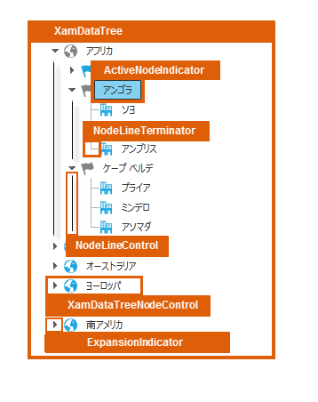

////

|metadata|
{
    "name": "designers-guide-styling-points-for-xamdatatree",
    "controlName": [],
    "tags": ["Styling","Templating"],
    "guid": "1bd57d3f-89dc-4e97-95f7-d50678098427",  
    "buildFlags": ["sl","wpf"],
    "createdOn": "2012-01-30T16:46:26.9528012Z"
}
|metadata|
////

= xamDataTree のスタイリング ポイント

== xamDataTree プロパティ

以下の図は、xamDataTree コントロールによって使用されるさまざまなコントロールを取り上げます。特定の項目を再スタイルするには、最初に図で TargetType を識別し、次にその後の表で対応する Style プロパティを識別します。

== xamDataTree スタイル プロパティおよび TargetType

以下の表は xamDataTree によって使用されるさまざまなコントロールをリストし、カスタム スタイルを設定するために使用できるプロパティを識別します。

[options="header", cols="a,a,a"]
|====
|TargetType|Style プロパティ|説明

|XamDataTree
|xamDataTree.Style
|xamDataTree コントロールをスタイルします。

|ActiveNodeIndicator
|ActiveNodeIndicator.Style
|アクティブ ノード インジケーターをスタイルします。

|NodeLineTerminator
|NodeLineTerminator.Style
|ノード行のターミネータをスタイルします。

|NodeLineControl
|NodeLineControl.Style
|ノード行のコントロールをスタイルします。

|XamDataTreeNodeControl
|XamDataTreeNode.Style
|xamDataTreeNode コントロールをスタイルします。

|ExpansionIndicator
|ExpansionIndicator.Style
|展開インジケーターをスタイルします。

|====