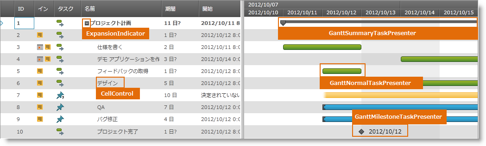
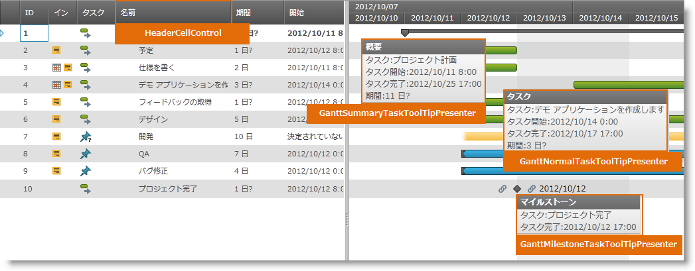
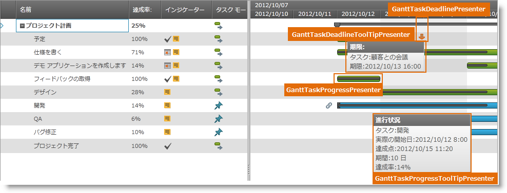
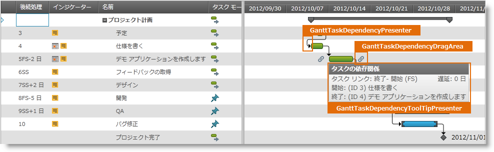
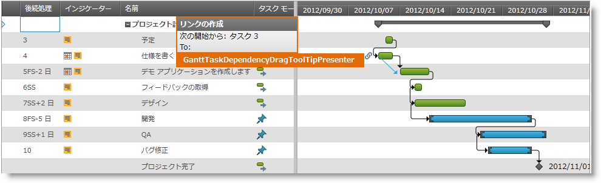
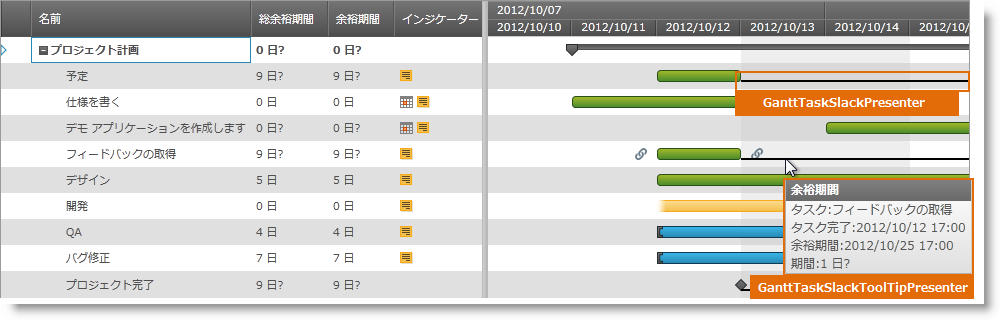
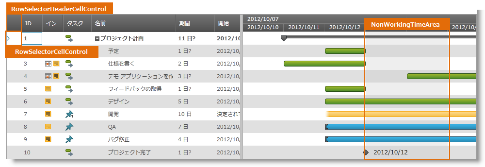
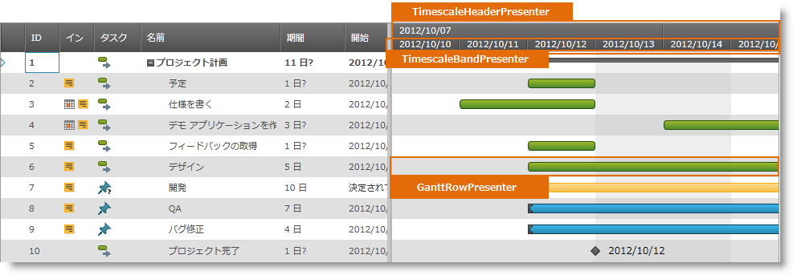
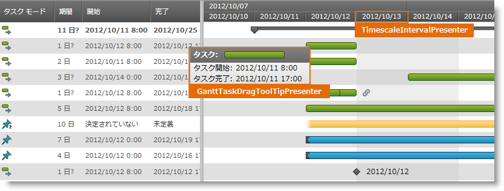

////

|metadata|
{
    "name": "designers-guide-styling-points-for-xamgantt",
    "controlName": [],
    "tags": ["Charting","Data Presentation","Scheduling","Styling","Templating"],
    "guid": "47cbc157-10e6-4e7c-8410-21b6679751ac",  
    "buildFlags": ["sl","wpf"],
    "createdOn": "2012-09-28T14:08:42.3861893Z"
}
|metadata|
////

= xamGantt のスタイリング ポイント

=== はじめに

_xamGantt_ コントロールを使用し、コントロール プロパティを介してターゲット タイプのデフォルトのルック アンド フィールをカスタマイズします。

=== プレビュー

以下の画像は、_xamGantt_ コントロールのプロパティを使用して構成可能なさまざまなターゲットの種類を識別します。これによって、必要なスタイルを使用して、このコントロールに関連するターゲットの種類をカスタマイズできます。

image::images/styling_points_6.png[]

== _xamGantt_ スタイリング プロパティ

[options="header", cols="a,a,a"]
|====
|ターゲットの種類|プロパティ|説明
|TextBlock
|xamGantt.ManualValueTextBlockStyle
|値が手動/なテキスト値 (ManualStart、ManualFinish、ManualDuration などの) を表す 場合、xamGantt グリッドの TextBlock のスタイルを設定します。
|ExpansionIndicator
|xamGantt.ExpansionIndicatorStyle
|*タスク名*列内のサマリー タスクを展開または縮小するために使用される要素をスタイルします。
|XamGantt
|xamGantt.Style
|xamGantt のさまざまなビジュアル要素をスタイルします。
 
|ProjectGridSplitter
|-
|xamGantt のグリッドおよびチャート セクションを分割しサイズ変更するグリッド スプリッターを表します。
 
|CellControl
|ProjectTableGrid.CellStyle
|xamGantt のグリッド セクションのすべての規格のセルを表します。
 
|RowSelectorCellControl
|ProjectTableGrid.RowSelectorCellStyle
|xamGantt のグリッド行の行セレクターを表します。

|HeaderCellControl
|ProjectTableGrid.HeaderStyle
|xamGantt のグリッド セクションのヘッダー行のすべての規格のセルを表します。
 
|RowSelectorHeaderCellControl
|ProjectTableGrid.RowSelectorHeaderStyle
|ヘッダー行の行セレクターを表します。
 
|GanttTimescaleArea
|-
|xamGantt のチャート セクションを表します。
 
|TimescaleHeaderPresenter
|-
|xamGantt のチャート セクションのタスク バーの上にタイムスケール情報を含むヘッダー領域を表します。
 
|TimescaleBandPresenter
|-
|xamGantt のチャート セクションの link:{ApiPlatform}controls.schedules.xamgantt{ApiVersion}~infragistics.controls.schedules.primitives.timescaleheaderpresenter.html[TimescaleHeaderPresenter] 内の link:{ApiPlatform}controls.schedules.xamgantt{ApiVersion}~infragistics.controls.schedules.timescaleBandBase.html[TimescaleBandBase] を表します。

|GanttRowPresenter
|-
|xamGantt のチャート セクションの各の link:{ApiPlatform}controls.schedules.xamgantt{ApiVersion}~infragistics.controls.schedules.projecttask.html[ProjectTask] 項目の背景領域を表します。
 
|NonWorkingTimeArea
|-
|解決された link:{ApiPlatform}controls.schedules.xamgantt{ApiVersion}~infragistics.controls.schedules.projectviewsettings.html[ProjectViewSettings] link:{ApiPlatform}controls.schedules.xamgantt{ApiVersion}~infragistics.controls.schedules.projectviewsettings~nonworkingtimehighlightstyle.html[NonWorkingTimeHighlightStyle] に基づいて xamGantt のチャート セクションの非稼働時間を拡張表示する背景領域を表します。

|GanttTaskDragArea
|-
|デフォルトでは、この要素はビジュアル外観がありませんが、UI でインタラクティブな xamGantt タスク バーの領域を表します。
 
|GanttTaskDependencyToolTipPresenter
|-
|GanttTaskDependencyPresenter のツールチップのコンテンツを表します。
 
|GanttTaskDependencyPresenter
|-
|xamGantt のチャート領域内の link:{ApiPlatform}controls.schedules.xamgantt{ApiVersion}~infragistics.controls.schedules.projecttaskdependency.html[ProjectTaskDependency] (2 つのタスクの間の先行タスク / 後続タスクの関係) を表します。
 
|GanttTaskDependencyDragToolTipPresenter
|-
|新しい link:{ApiPlatform}controls.schedules.xamgantt{ApiVersion}~infragistics.controls.schedules.projecttaskdependency.html[ProjectTaskDependency] を作成するために link:{ApiPlatform}controls.schedules.xamgantt{ApiVersion}~infragistics.controls.schedules.primitives.gantttaskdependencydragarea.html[GanttTaskDependencyDragArea] をドラッグしているときに表示されるツールチップのコンテンツを表します。
 
|GanttTaskDependencyDragArea
|-
|関連付けられた link:{ApiPlatform}controls.schedules.xamgantt{ApiVersion}~infragistics.controls.schedules.projecttask.html[ProjectTask] の開始または終了 link:{ApiPlatform}controls.schedules.xamgantt{ApiVersion}~infragistics.controls.schedules.projecttaskdependency.html[ProjectTaskDependency] を作成する xamGantt タスク バーの前と後に表示される要素を表します。
 
|TimescaleIntervalPresenter
|-
|TimescaleBandPresenter 内の特定の link:{ApiPlatform}controls.schedules.xamgantt{ApiVersion}~infragistics.controls.schedules.timescaleBandBase.html[TimescaleBandBase] の単一の日付範囲を表します。
 
|ProjectTableGrid
|-
|xamGantt のグリッド領域を表します。
 
|GanttTaskDragToolTipPresenter
|-
|xamGantt タスク バーをドラッグするか、サイズ変更しているときに表示されるツールチップのコンテンツを表します。
 
|GanttTaskProgressToolTipPresenter
|-
|GanttTaskProgressPresenter の上にマウスをホバーしているときに表示されるツールチップのコンテンツを表します。
 
|GanttTaskProgressPresenter
|-
|xamGantt のチャート セクション内の link:{ApiPlatform}controls.schedules.xamgantt{ApiVersion}~infragistics.controls.schedules.projecttask.html[ProjectTask] 進行状況バーを表します。 +
表しはタスクの達成点日付の位置に基づきます。
 
|GanttTaskSlackToolTipPresenter
|-
|GanttTaskSlackPresenter の上にマウスをホバーしているときに表示されるツールチップのコンテンツを表します。
 
|GanttTaskSlackPresenter
|-
|xamGantt のチャート セクションの各 link:{ApiPlatform}controls.schedules.xamgantt{ApiVersion}~infragistics.controls.schedules.projecttask.html[ProjectTask] の計算された余裕期間を表します。 +
link:{ApiPlatform}controls.schedules.xamgantt{ApiVersion}~infragistics.controls.schedules.projectviewsettings.html[ProjectViewSettings] link:{ApiPlatform}controls.schedules.xamgantt{ApiVersion}~infragistics.controls.schedules.projectviewsettings~isslackvisible.html[IsSlackVisible] プロパティが True に設定される場合に表示されます。
 
|GanttTaskDeadlineToolTipPresenter
|-
|GanttTaskDeadlinePresenter の上にマウスをホバーしているときに表示されるツールチップのコンテンツを表します。
 
|GanttTaskDeadlinePresenter
|-
|xamGantt のチャート セクション内の期限を表します。
 
|GanttMilestoneTaskToolTipPresenter
|-
|GanttMilestoneTaskPresenter の上にマウスをホバーしているときに表示されるツールチップのコンテンツを表します。
 
|GanttMilestoneTaskPresenter
|-
|xamGantt のチャート セクション内のマイルストーンの link:{ApiPlatform}controls.schedules.xamgantt{ApiVersion}~infragistics.controls.schedules.projecttask.html[ProjectTask] を表します。 
 
|GanttNormalTaskToolTipPresenter
|-
|GanttNormalTaskPresenter の上にマウスをホバーしているときに表示されるツールチップのコンテンツを表します。
 
|GanttNormalTaskPresenter
|-
|xamGantt のチャート セクション内のマイルストーンおよびサマリーではない link:{ApiPlatform}controls.schedules.xamgantt{ApiVersion}~infragistics.controls.schedules.projecttask.html[ProjectTask] を表します。
 
|GanttSummaryTaskToolTipPresenter
|- 
|GanttSummaryTaskPresenter の上にマウスをホバーしているときに表示されるツールチップのコンテンツを表します。
 
|GanttSummaryTaskPresenter
|-
|xamGantt のチャート セクション内でマイルストーン以外のサマリー link:{ApiPlatform}controls.schedules.xamgantt{ApiVersion}~infragistics.controls.schedules.projecttask.html[ProjectTask] を表します。
|====