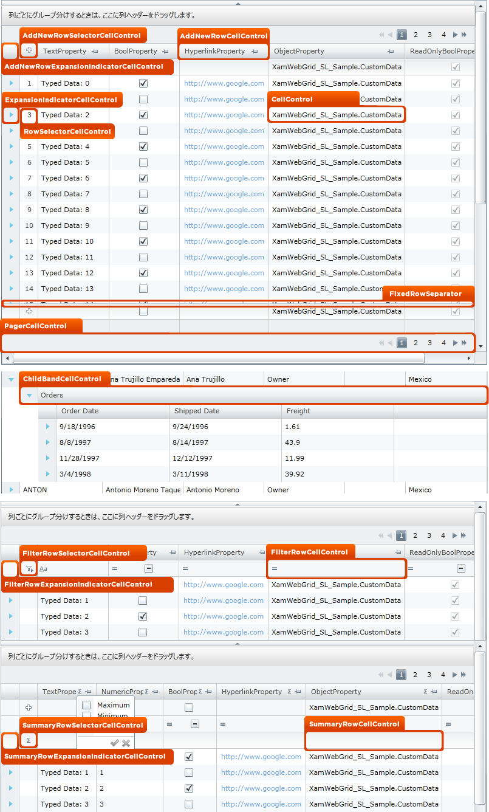

////

|metadata|
{
    "name": "designers-guide-styling-points-for-xamgrid",
    "controlName": [],
    "tags": [],
    "guid": "{B9FAF699-2E97-42CA-9A73-6F68B91BB65A}",  
    "buildFlags": ["sl","wpf","win-rt"],
    "createdOn": "2012-01-30T16:46:26.9618012Z"
}
|metadata|
////

= xamGrid のスタイリング ポイント

== xamGrid プロパティ

以下の図は、xamGrid コントロールによって使用されるさまざまなコントロールを取り上げます。特定の項目を再スタイルするには、最初に図で TargetType を識別し、次にその後の表で対応する Style プロパティを識別します。

image::images/SL_DesignersGuide_Styling_Points_for_xamGrid_01.png[]

[options="header", cols="a,a,a"]
|====
|TargetType|Style プロパティ|説明

|GroupByHeaderCellControl
|xamGrid.GroupBySettings.GroupByHeaderStyle
|xamGrid ですべての Columns の GroupByHeader をスタイルします。

|
|xamGrid.ColumnLayouts[x].GroupBySettings.GroupByHeaderStyle
|特定の ColumnLayout ですべての Columns の GroupByHeader を設定します。

|GroupByColumnLayoutHeaderCellControl
|xamGrid.GroupBySettings.GroupByColumnLayoutHeaderStyle
|xamGrid ですべての ColumnLayouts の GroupByColumnLayoutHeader をスタイルします。

|
|xamGrid.ColumnLayouts[x].GroupBySettings.GroupByColumnLayoutHeaderStyle
|特定の ColumnLayout の GroupByColumnLayoutHeader をスタイルします。

|GroupByCellControl
|xamGrid.GroupBySettings.GroupByRowStyle
|xamGrid ですべての ColumnLayouts の GroupByRow をスタイルします。

|
|xamGrid.ColumnLayouts[x].GroupBySettings.GroupByRowStyle
|特定の ColumnLayout の GroupByRow をスタイルします。

|GroupByAreaCellControl
|xamGrid.GroupBySettings.GroupByAreaStyle
|xamGrid の GroupByArea をスタイルします。

|====

[options="header", cols="a,a,a"]
|====
|TargetType|Style プロパティ|説明

|AddNewRowExpansionIndicatorCellControl
|xamGrid.AddNewRowSettings.ExpansionIndicatorStyle
|xamGrid ですべての ColumnLayouts の AddNewRow にある ExpansionIndicator をスタイルします。

|
|xamGrid.ColumnLayouts[x].AddNewRowSettings.ExpansionIndicatorStyle
|xamGrid で特定の ColumnLayout の AddNewRow にある ExpansionIndicator をスタイルします。

|AddNewRowSelectorCellControl
|xamGrid.AddNewRowSettings.RowSelectorStyle
|xamGrid ですべての ColumnLayouts の AddNewRow にある RowSelector をスタイルします。

|
|xamGrid.ColumnLayouts[x].AddNewRowSettings.RowSelectorStyle
|xamGrid で特定の ColumnLayout の AddNewRow にある RowSelector をスタイルします。

|AddNewRowCellControl
|xamGrid.AddNewRowSettings.Style
|xamGrid ですべての ColumnLayouts の AddNewRow にあるすべての Standard Cell オブジェクトをスタイルします。

|
|xamGrid.ColumnLayouts[x].AddNewRowSettings.Style
|xamGrid で特定の ColumnLayout の AddNewRow にあるすべての Standard Cell オブジェクトをスタイルします。

|ExpansionIndicatorCellControl
|xamGrid.ExpansionIndicatorSettings.Style
|xamGrid ですべての ColumnLayouts のすべての Rows にある ExpansionIndicator をスタイルします。

|
|xamGrid.ColumnLayouts[x].ExpansionIndicatorSettings.Style
|xamGrid で特定の ColumnLayout のすべての Rows にある ExpansionIndicator をスタイルします。

|RowSelectorCellControl
|xamGrid.RowSelectorSettings.Style
|xamGrid ですべての ColumnLayouts のすべての Rows にある RowSelector をスタイルします。

|
|xamGrid.ColumnLayouts[x].RowSelectorSettings.Style
|xamGrid で特定の ColumnLayout のすべての Rows にある RowSelector をスタイルします。

|CellControl
|xamGrid.CellStyle
|xamGrid ですべての ColumnLayouts にあるすべての Standard Cells をスタイルします。

|
|xamGrid.Columns[x].CellStyle
|xamGrid で特定の Column にあるすべての Standard Cells をスタイルします。

|
|xamGrid.ColumnLayouts[x].CellStyle
|xamGrid で特定の ColumnLayout にあるすべての Standard Cells をスタイルします。

|
|xamGrid.Rows[x].CellStyle
|xamGrid で特定の Row にあるすべての Standard Cells をスタイルします。

|
|xamGrid.Rows[x].Cells[x].Style
|特定の Cell をスタイルします。

|FixedRowSeparator
|xamGrid.FixedRowSeparatorStyle
|xamGrid で固定行を分離する Separator をスタイルします。

|PagerCellControl
|xamGrid.PagerSettings.Style
|xamGrid ですべての ColumnLayouts の PagerRow を構成する Cell をスタイルします。

|
|xamGrid.ColumnLayout[x].PagerSettings.Style
|xamGrid で特定の ColumnLayout の PagerRow を構成する Cell をスタイルします。

|ChildBandCellControl
|xamGrid.ChildBandHeaderStyle
|xamGrid ですべての ColumnLayouts の ChildBand Headerを構成する Cell をスタイルします。

|
|xamGrid.ColumnLayouts[x].ChildBandHeaderStyle
|xamGrid で特定の ColumnLayout の ChildBand Header を構成する Cell をスタイルします。

|FilterRowExpansionIndicatorCellControl
|XambWebGrid.FilteringSettings.ExpansionIndicatorStyle
|xamGrid ですべての ColumnLayouts の FilterRow にある ExpansionIndicator をスタイルします。

|
|xamGrid.ColumnLayouts[x].FilteringSettings.ExpansionIndicatorStyle
|xamGrid で特定の ColumnLayout の FilterRow にある ExpansionIndicator をスタイルします。

|FilterRowSelectorCellControl
|XambWebGrid.FilteringSettings.RowSelectorStyle
|xamGrid ですべての ColumnLayouts の FilterRow にある RowSelector をスタイルします。

|
|xamGrid.ColumnLayouts[x].FilteringSettings.RowSelectorStyle
|xamGrid で特定の ColumnLayout の FilterRow にある RowSelector をスタイルします。

|FilterRowCellControl
|XambWebGrid.FilteringSettings.Style
|xamGrid ですべての ColumnLayouts の FilterRow にあるすべての Standard Cell オブジェクトをスタイルします。

|
|xamGrid.ColumnLayouts[x].FilteringSettings.Style
|xamGrid で特定の ColumnLayout の FilterRow にあるすべての Standard Cell オブジェクトをスタイルします。

|SummaryRowExpansionIndicatorCellControl
|XambWebGrid.SummaryRowSettings.ExpansionIndicatorStyle
|xamGrid ですべての ColumnLayouts の SummaryRow にある ExpansionIndicator をスタイルします。

|
|xamGrid.ColumnLayouts[x].SummaryRowSettings.ExpansionIndicatorStyle
|xamGrid で特定の ColumnLayout の SummaryRow にある ExpansionIndicator をスタイルします。

|SummaryRowSelectorCellControl
|XambWebGrid.SummaryRowSettings.RowSelectorStyle
|xamGrid ですべての ColumnLayouts の SummaryRow にある RowSelector をスタイルします。

|
|xamGrid.ColumnLayouts[x].SummaryRowSettings.RowSelectorStyle
|xamGrid で特定の ColumnLayout の SummaryRow にある RowSelector をスタイルします。

|SummaryRowCellControl
|XambWebGrid.SummaryRowSettings.Style
|xamGrid ですべての ColumnLayouts の SummaryRow にあるすべての Standard Cell オブジェクトをスタイルします。

|
|xamGrid.ColumnLayouts[x].SummaryRowSettings.Style
|xamGrid で特定の ColumnLayout の SummaryRow にあるすべての Standard Cell オブジェクトをスタイルします。

|====

image::images/SL_DesignersGuide_Styling_Points_for_xamGrid_03.png[]

[options="header", cols="a,a,a"]
|====
|TargetType|Style プロパティ|説明

|ExpansionIndicatorHeaderCellControl
|xamGrid.ExpansionIndicatorSettings.HeaderStyle
|xamGrid ですべての ColumnLayouts の HeaderRow にある ExpansionIndicator をスタイルします。

|
|xamGrid.ColumnLayouts[x].ExpansionIndicatorSettings.HeaderStyle
|xamGrid で特定の ColumnLayout の HeaderRow にある ExpansionIndicator をスタイルします。

|RowSelectorHeaderCellControl
|xamGrid.RowSelectorSettings.HeaderStyle
|xamGrid ですべての ColumnLayouts の HeaderRow にある RowSelector をスタイルします。

|
|xamGrid.ColumnLayouts[x].RowSelectorSettings.HeaderStyle
|xamGrid で特定の ColumnLayout の HeaderRow にある RowSelector をスタイルします。

|HeaderCellControl
|xamGrid.HeaderStyle
|xamGrid ですべての ColumnLayouts の HeaderRow にあるすべての Standard Cell オブジェクトをスタイルします。

|
|xamGrid.ColumnLayouts[x].HeaderStyle
|xamGrid で特定の ColumnLayout の HeaderRow にあるすべての Standard Cell オブジェクトをスタイルします。

|ExpansionIndicatorFooterCellControl
|xamGrid.ExpansionIndicatorSettings.FooterStyle
|xamGrid ですべての ColumnLayouts の FooterRow にある ExpansionIndicator をスタイルします。

|
|xamGrid.ColumnLayouts[x].ExpansionIndicatorSettings.FooterStyle
|xamGrid で特定の ColumnLayout の FooterRow にある ExpansionIndicator をスタイルします。

|RowSelectorFooterCellControl
|xamGrid.RowSelectorSettings.FooterStyle
|xamGrid ですべての ColumnLayouts の FooterRow にある RowSelector をスタイルします。

|
|xamGrid.ColumnLayouts[x].RowSelectorSettings.FooterStyle
|xamGrid で特定の ColumnLayout の FooterRow にある RowSelector をスタイルします。

|FooterCellControl
|xamGrid.FooterStyle
|xamGrid ですべての ColumnLayouts の FooterRow にあるすべての Standard Cell オブジェクトをスタイルします。

|
|xamGrid.ColumnLayouts[x].FooterStyle
|xamGrid で特定の ColumnLayout の FooterRow にあるすべての Standard Cell オブジェクトをスタイルします。

|====

image::images/SL_DesignersGuide_Styling_Points_for_xamGrid_04.png[]

[options="header", cols="a,a,a"]
|====
|TargetType|Style プロパティ|説明

|GroupByMovingIndicator
|xamGrid.GroupBySettings.GroupByMovingIndicatorStyle
|xamGrid ですべての ColumnLayouts の GroupByAreaPanel にある GroupByHeaderCellControls を再配置する時に表示されるインジケーターをスタイルします。

|
|xamGrid.ColumnLayouts[x].GroupBySettings.GroupByMovingIndicatorStyle
|xamGrid で特定の ColumnLayout の GroupByAreaPanel にある GroupByHeaderCellControls を再配置する時に表示されるインジケーターをスタイルします。

|DropAreaIndicator
|xamGrid.FixedColumnSettings.FixedDropAreaLeftStyle
|xamGrid ですべての ColumnLayouts の xamGrid の左側に固定されるように列をドラッグする時に表示される Drop 領域をスタイルします。

|
|xamGrid.ColumnLayouts[x].FixedColumnSettings.FixedDropAreaLeftStyle
|xamGrid で特定の ColumnLayout の xamGrid の左側に固定されるように列をドラッグする時に表示される Drop 領域をスタイルします。

|
|xamGrid.FixedColumnSettings.FixedDropAreaRightStyle
|xamGrid ですべての ColumnLayouts の xamGrid の右側に固定されるように列をドラッグする時に表示される Drop 領域をスタイルします。

|
|xamGrid.ColumnLayouts[x].FixedColumnSettings.FixedDropAreaRightStyle
|xamGrid で特定の ColumnLayout の xamGrid の右側に固定されるように列をドラッグする時に表示される Drop 領域をスタイルします。

|MovingIndicator
|xamGrid.ColumnMovingSettings.IndicatorStyle
|xamGrid ですべての ColumnLayouts の HeaderRow にある Columns を再配置する時に表示されるインジケーターをスタイルします。

|
|xamGrid.ColumnLayouts[x].ColumnMovingSettings.IndicatorStyle
|xamGrid で特定の ColumnLayout の HeaderRow にある Columns を再配置する時に表示されるインジケーターをスタイルします。

|FixedBorderHeaderCellControl
|xamGrid.FixedColumnSettings.FixedBorderHeaderStyle
|xamGrid ですべての ColumnLayouts の HeaderRow にある非固定列から FixedColumns を分離するセパレーターをスタイルします。

|
|xamGrid.ColumnLayouts[x].FixedColumnSettings.FixedBorderHeaderStyle
|xamGrid で特定の ColumnLayout の HeaderRow にある非固定列から FixedColumns を分離するセパレーターをスタイルします。

|FixedBorderCellControl
|xamGrid.FixedColumnSettings.FixedBorderStyle
|xamGrid ですべての ColumnLayouts の Row にある非固定列から FixedColumns を分離するセパレーターをスタイルします。

|
|xamGrid.ColumnLayouts[x].FixedColumnSettings.FixedBorderStyle
|xamGrid で特定の ColumnLayout の Row にある非固定列から FixedColumns を分離するセパレーターをスタイルします。

|FixedBorderFooterCellControl
|xamGrid.FixedColumnSettings.FixedBorderFooterStyle
|xamGrid ですべての ColumnLayouts の FooterRow にある非固定列から FixedColumns を分離するセパレーターをスタイルします。

|
|xamGrid.ColumnLayouts[x].FixedColumnSettings.FixedBorderFooterStyle
|xamGrid で特定の ColumnLayout の FooterRow にある非固定列から FixedColumns を分離するセパレーターをスタイルします。

|ResizingIndicator
|xamGrid.ColumnResizeSettings.IndicatorStyle
|xamGrid ですべての ColumnLayouts の Columns をリサイズする時に表示されるインジケーターをスタイルします。

|
|xamGrid.ColumnLayouts[x].ColumnResizeSettings.IndicatorStyle
|xamGrid で特定の ColumnLayout の Columns をリサイズする時に表示されるインジケーターをスタイルします。

|====