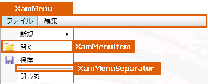

////

|metadata|
{
    "name": "designers-guide-styling-points-for-xammenu",
    "controlName": [],
    "tags": ["Styling","Templating"],
    "guid": "{8FA1676A-3C67-4BB0-9E3A-B36238713AA2}",  
    "buildFlags": ["sl","wpf"],
    "createdOn": "2012-01-30T16:46:26.9658012Z"
}
|metadata|
////

= xamMenu のスタイリング ポイント

== xamMenu プロパティ

以下の図は、xamMenu コントロールによって使用されるさまざまなコントロールを取り上げます。特定の項目を再スタイルするには、最初に図で TargetType を識別し、次にその後の表で対応する Style プロパティを識別します。

== xamMenu スタイル プロパティおよび TargetType

以下の表は xamMenu によって使用されるさまざまなコントロールをリストし、カスタム スタイルを設定するために使用できるプロパティを識別します。

[options="header", cols="a,a,a"]
|====
|TargetType|Style プロパティ|説明

|xamMenuSeparator
|xamMenuSeparator.Style
|メニュー セパレーター コントロールをスタイルします。

|xamMenu
|xamMenu.Style
|メニュー コントロールをスタイルします。

|xamMenuItem
|xamMenuItem.Style
|メニュー項目コントロールをスタイルします。

|
|xamMenu.ItemContainerStyle
|メニュー コントロールのすべての項目コントロールをスタイルします。

|====