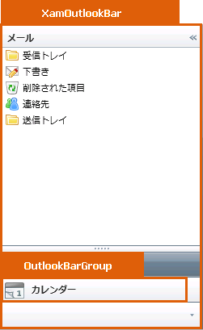

////

|metadata|
{
    "name": "designers-guide-styling-points-for-xamoutlookbar",
    "controlName": [],
    "tags": ["Styling","Templating"],
    "guid": "{AC8B869D-76B7-4670-BDBD-7E3F5E87AC87}",  
    "buildFlags": ["sl"],
    "createdOn": "2012-01-30T16:46:26.9718012Z"
}
|metadata|
////

= xamOutlookBar のスタイリング ポイント

== xamOutlookBar プロパティ

以下の図は、xamOutlookBar コントロールによって使用されるさまざまなコントロールを取り上げます。特定の項目を再スタイルするには、最初に図で TargetType を識別し、次にその後の表で対応する Style プロパティを識別します。

== xamOutlookBar スタイル プロパティおよび TargetType

以下の表は xamOutlookBar によって使用されるさまざまなセル コントロールをリストし、カスタム スタイルを設定するために使用できるプロパティを識別します。

[options="header", cols="a,a,a"]
|====
|TargetType|Style プロパティ|説明

|xamOutlookBar
|xamOutlookBar.Style
|xamOutlookBar コントロールをスタイルします。

|OutlookBarGroup
|OutlookBarGroup.Style
|OutlookBarGroup をスタイルします。

|
|xamOutlookBar.GroupContainerStyle
|xamOutlookBar のすべての OutlookBarGroups をスタイルします。

|====