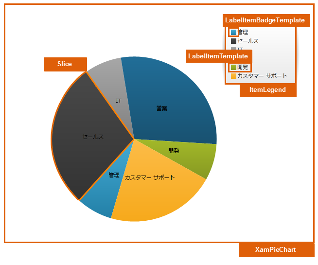

////

|metadata|
{
    "name": "designers-guide-styling-points-for-xampiechart",
    "controlName": [],
    "tags": ["Styling"],
    "guid": "e6489d64-84f9-40a3-a577-92f2c5a53349",  
    "buildFlags": ["sl","wpf","win-phone"],
    "createdOn": "2012-04-05T14:24:53.8945042Z"
}
|metadata|
////

= xamPieChart のスタイリング ポイント

=== 概要

xamPieChart コントロールを使用して、コントロールのプロパティを介してターゲットの種類のデフォルトのルック アンド フィールをカスタマイズします。

=== プレビュー

以下の写真は、xamPieChart コントロールのプロパティを使用して構成可能なさまざまなターゲットの種類を識別します。これによって、希望するスタイルを使用して、このコントロールに関連するターゲットの種類をカスタマイズできます。

== xamPieChart スタイリング プロパティ

_xamPieChart_   _™_   コントロールのスタイリング プロパティ。

[options="header", cols="a,a,a"]
|====
|ターゲットの種類|Style プロパティ|説明

|`XamPieChart`
|XamPieChart.Style
|XamPieChart コントロールをスタイルします。

|`Slice`
|Slice.Style
|PieChart でスライスをスタイルします。

|`ItemLegend`
|ItemLegend.Style
|Legend コントロールをスタイルします。

|`LegendItemBadgeTemplate`
|LegendItemBadgeTemplate
|Legend の項目レッテルをスタイルします。

|`LegendItemTemplate`
|LegendItemTemplate
|Legend の項目をスタイルします。

|====

== 関連コンテンツ

=== トピック

以下のトピックでは、このトピックに関連する情報を提供しています。

[options="header", cols="a,a"]
|====
|トピック|目的

| link:piechart.html[xamPieChart]
|円チャートを描画する特別なコントロールである _xamPieChart_ __ を紹介します。円チャートは、各セクションの円弧の長さが基になるデータ値に比例してセクションに分割された円の領域で構成されます。

|====