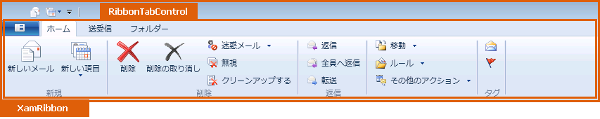

////

|metadata|
{
    "name": "designers-guide-styling-points-for-xamribbon",
    "controlName": [],
    "tags": ["Styling"],
    "guid": "{772A2C4C-925E-436B-89DB-009FC04108B5}",  
    "buildFlags": ["sl"],
    "createdOn": "2012-01-30T16:46:26.9748012Z"
}
|metadata|
////

= xamRibbon のスタイリング ポイント

== xamRibbon プロパティ

以下の図は、xamRibbon コントロールによって使用されるさまざまなコントロールを取り上げます。特定の項目を再スタイルするには、最初に図で TargetType を識別し、次にその後の表で対応する Style プロパティを識別します。

== image::images/DesignersGuide_xamRibbon_01.png[]

== image::images/DesignersGuide_xamRibbon_02.png[]

== image::images/DesignersGuide_xamRibbon_03.png[]

== image::images/DesignersGuide_xamRibbon_04.png[]

== xamRibbon スタイル プロパティおよび TargetTypes

以下の表は xamRibbon によって使用されるさまざまなセル コントロールをリストし、カスタム スタイルを設定するために使用できるプロパティを識別します。

[options="header", cols="a,a,a"]
|====
|TargetType|Style プロパティ|説明

|ButtonToolControl
|ButtonTool.Style
|ボタン ツールをスタイルします。

|CheckBoxToolControl
|CheckBoxTool.Style
|チェックボックスをスタイルします。

|GalleryItemControl
|GalleryItem.Style
|ギャラリー項目をスタイルします。

|GalleryItemGroupControl
|GalleryItemGroup.Style
|ギャラリー グループをスタイルします。

|GalleryToolControl
|GalleryTool.Style
|ギャラリー ツールをスタイルします。

|KeyTip
|KeyTip.Style
|キーチップをスタイルします。

|MenuToolControl
|MenuTool.Style
|メニューをスタイルします。

|QATMenu
|QATMenu.Style
|クイック アクセス ツールバー メニューをスタイルします。

|QuickAccessToolbar
|QuickAccessToolbar.Style
|クイック アクセス ツールバーをスタイルします。

|RadioButtonToolControl
|RadioButtonTool.Style
|ラジオ ボタンをスタイルします。

|RibbonGroupControl
|RibbonGroup.Style
|リボン グループをスタイルします。

|RibbonTabControl
|RibbonTab.Style
|リボン タブをスタイルします。

|SegmentedStateMenuToolControl
|SegmentedStateMenuTool.Style
|セグメント化された状態のメニューをスタイルします。

|SegmentedMenuToolControl
|SegmentedMenuTool.Style
|セグメント化されたメニュー ツールをスタイルします。

|SeparatorToolControl
|SeparatorTool.Style
|セパレーターをスタイルします。

|xamRibbon
|xamRibbon.Style
|xamRibbon コントロールをスタイルします。

|xamRibbonApplicationMenu
|xamRibbonApplicationMenu.Style
|アプリケーション メニューをスタイルします。

|xamRibbonContextualTab
|xamRibbonContextualTab.Style
|コンテキスト タブをスタイルします。

|xamRibbonTabItem
|xamRibbonTabItem.Style
|タブ項目をスタイルします。

|====