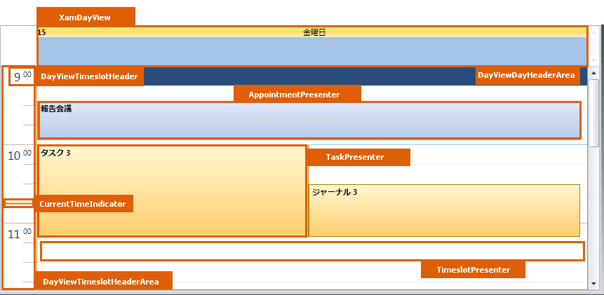
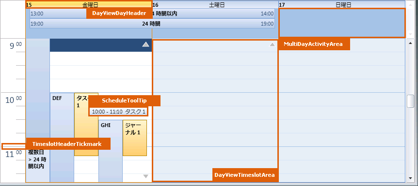
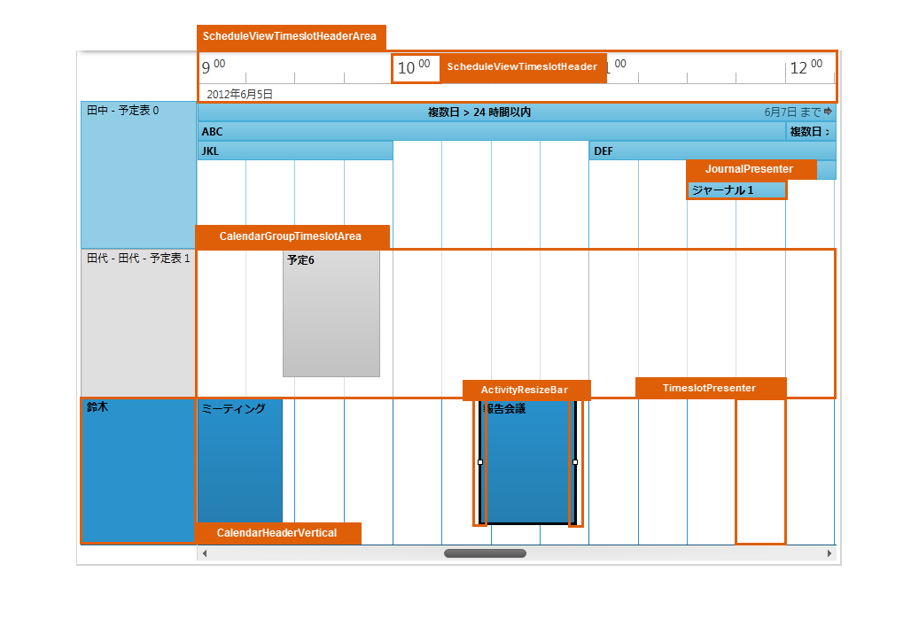
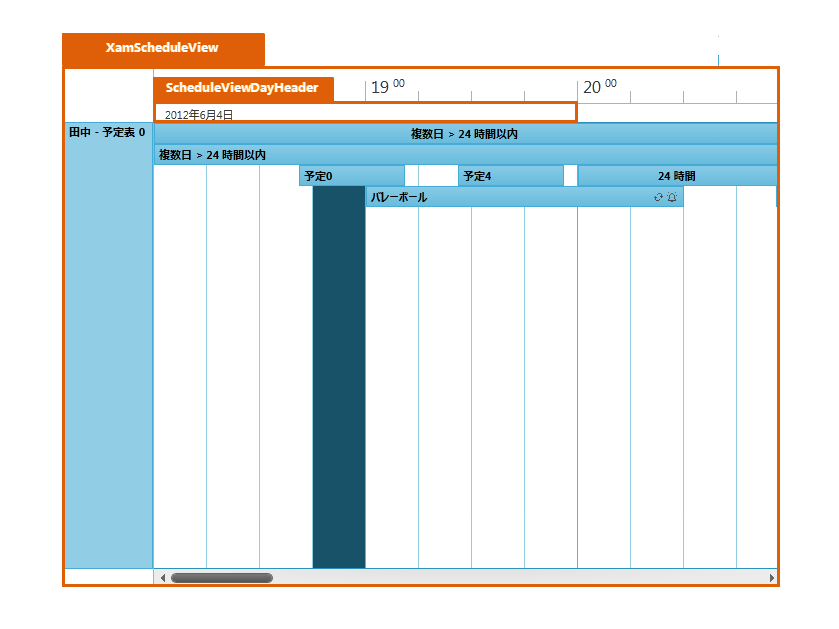

////

|metadata|
{
    "name": "designers-guide-styling-points-for-xamschedule",
    "controlName": [],
    "tags": ["Styling","Templating"],
    "guid": "14c4b55d-69db-4096-a2a9-a34ac710e7c1",  
    "buildFlags": ["sl","wpf"],
    "createdOn": "2012-01-30T16:46:26.9768012Z"
}
|metadata|
////

= xamSchedule のスタイリング ポイント

== xamSchedule のビュー プロパティ

以下の図は、xamSchedule™ コントロールが使用するさまざまなコントロールを示しています。特定の項目を再スタイルするには、最初に図で TargetType を識別し、次にその後の表で対応する Style プロパティを識別します。

image::images/xamSchedule_Styling_xamMonthView.png[]

== xamSchedule スタイル プロパティおよび TargetType

以下の表は xamSchedule によって使用されるさまざまなセル コントロールをリストし、カスタム スタイルを設定するために使用できるプロパティを識別します。

[options="header", cols="a,a,a"]
|====
|TargetType|Style プロパティ|説明

|ActivityResizeBar
|ActivityResizeBar.Style
|アクティビティのリサイズ バーをスタイルします

|AppointmentPresenter
|AppointmentPresenter.Style
|予定アクティビティ プレゼンターをスタイルします

|CalendarGroupTimeslotArea
|CalendarGroupTimeslotArea.Style
|カレンダー グループ タイムスロット領域をスタイルします

|CalendarHeaderArea
|CalendarHeaderArea.Style
|カレンダー ヘッダー領域をスタイルします

|CalendarHeaderHorizontal
|CalendarHeaderHorizontal.Style
|水平方向のカレンダー ヘッダーをスタイルします

|CalendarHeaderVertical
|CalendarHeaderVertical.Style
|垂直方向のカレンダー ヘッダーをスタイルします

|ClickToAddActivityElement
|ClickToAddActivityElement.Style
|アクティビティを追加するために使用されるボタンをスタイルします

|CurrentTimeIndicator
|CurrentTimeIndicator.Style
|現在の時刻のインジケーターをスタイルします

|DayViewDayHeader
|DayViewDayHeader.Style
|xamDayView 日ヘッダーをスタイルします

|DayViewDayHeaderArea
|DayViewDayHeaderArea.Style
|xamDayView 日ヘッダー領域をスタイルします

|DayViewTimeslotArea
|DayViewTimeslotArea.Style
|xamDayView タイムスロット領域をスタイルします

|DayViewTimeslotHeader
|DayViewTimeslotHeader.Style
|xamDayView タイムスロット ヘッダーをスタイルします

|DayViewTimeslotHeaderArea
|DayViewTimeslotHeaderArea.Style
|xamDayView タイムスロット ヘッダー領域をスタイルします

|JournalPresenter
|JournalPresenter.Style
|履歴アクティビティ プレゼンターをスタイルします

|MonthViewDay
|MonthViewDay.Style
|xamMonthView 日をスタイルします

|MonthViewDayHeader
|MonthViewDayHeader.Style
|xamMonthView 日ヘッダーをスタイルします

|MonthViewDayOfWeekHeader
|MonthViewDayOfWeekHeader.Style
|xamMonthView 曜日ヘッダーをスタイルします

|MonthViewTimeslotArea
|MonthViewTimeslotArea.Style
|xamMonthView タイムスロット領域をスタイルします

|MonthViewWeekHeader
|MonthViewWeekHeader.Style
|xamMonthView 週ヘッダーをスタイルします

|MoreActivityIndicator
|MoreActivityIndicator.Style
|より多くのアクティビティを表示するために使用されるインジケーターをスタイルします

|MultiDayActivityArea
|MultiDayActivityArea.Style
|複数日アクティビティ領域をスタイルします

|TaskPresenter
|TaskPresenter.Style
|タスク アクティビティ プレゼンターをスタイルします

|TimeslotHeaderTickmark
|TimeslotHeaderTickmark.Style
|タイムスロット ヘッダー目盛をスタイルします

|TimeslotPresenter
|TimeslotPresenter.Style
|タイムスロットをスタイルします

|ScheduleToolTip
|ScheduleToolTip.Style
|xamSchedule ビューによって表示されるツールチップをスタイルします

|ScheduleViewDayHeader
|ScheduleViewDayHeader.Style
|xamScheduleView 日ヘッダーをスタイルします

|ScheduleViewTimeslotHeader
|ScheduleViewTimeslotHeader.Style
|xamScheduleView タイムスロット ヘッダーをスタイルします

|ScheduleViewTimeslotHeaderArea
|ScheduleViewTimeslotHeaderArea.Style
|xamScheduleView タイムスロット ヘッダー領域をスタイルします

|XamDayView
|XamDayView.Style
|xamDayView コントロールをスタイルします

|XamMonthView
|XamMonthView.Style
|xamMonthView コントロールをスタイルします

|XamScheduleView
|XamScheduleView.Style
|xamScheduleView コントロールをスタイルします

|====