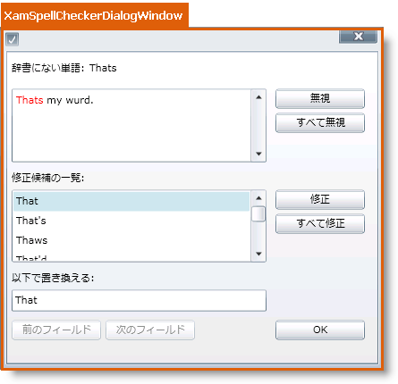

////

|metadata|
{
    "name": "designers-guide-styling-points-for-xamspellchecker",
    "controlName": [],
    "tags": ["Styling"],
    "guid": "{11F9343C-4EB7-44C2-835B-D8F1B607A5FB}",  
    "buildFlags": ["sl","wpf"],
    "createdOn": "2012-01-30T16:46:26.9828012Z"
}
|metadata|
////

= xamSpellChecker のスタイリング ポイント

== xamSpellCheckerDialogWindow プロパティ

以下の図は、xamSpellCheckerDialogWindow コントロールによって使用されるさまざまなコントロールを取り上げます。特定の項目を再スタイルするには、最初に図で TargetType を識別し、次にその後の表で対応する Style プロパティを識別します。

== xamSpellCheckerDialogWindow スタイル プロパティおよび TargetType

以下の表は xamSpellCheckerDialogWindow コントロールによって使用されるさまざまなコントロールをリストし、カスタム スタイルを設定するために使用できるプロパティを識別します。

[options="header", cols="a,a,a"]
|====
|TargetType|Style プロパティ|説明

|xamSpellCheckerDialogWindow
|xamSpellChecker.DialogSettings.SpellCheckDialogStyle
|スペルチェッカー ダイアログ ウィンドウをスタイルします。

|====