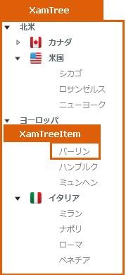

////

|metadata|
{
    "name": "designers-guide-styling-points-for-xamtree",
    "controlName": [],
    "tags": ["Styling","Templating"],
    "guid": "{A13EE67D-ABB9-4483-A9A7-9A068FE635CD}",  
    "buildFlags": ["sl"],
    "createdOn": "2012-01-30T16:46:26.9958012Z"
}
|metadata|
////

= xamTree のスタイリング ポイント

== xamTree プロパティ

以下の図は、xamTree コントロールによって使用されるさまざまなコントロールを取り上げます。特定の項目を再スタイルするには、最初に図で TargetType を識別し、次にその後の表で対応する Style プロパティを識別します。

== xamTree スタイル プロパティおよび TargetType

以下の表は xamTree によって使用されるさまざまなコントロールをリストし、カスタム スタイルを設定するために使用できるプロパティを識別します。

[options="header", cols="a,a,a"]
|====
|TargetType|Style プロパティ|説明

|xamTree
|xamTree.Style
|ツリー コントロールをスタイルします。

|xamTreeItem
|xamTreeItem.Style
|ツリー項目コントロールをスタイルします。

|
|xamTree.ItemContainerStyle
|ツリー コントロールのすべての項目コントロールをスタイルします。

|====