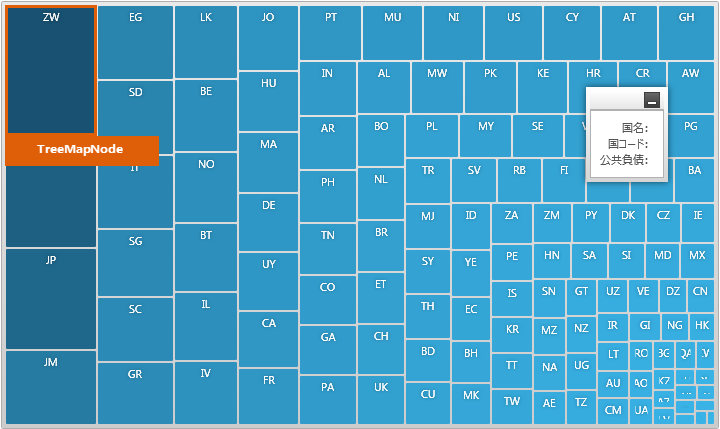

////

|metadata|
{
    "name": "designers-guide-styling-points-for-xamtreemap",
    "controlName": [],
    "tags": ["Styling","Templating"],
    "guid": "6aafe9e6-b2cf-4347-8dc8-482b809a4e53",  
    "buildFlags": ["sl","wpf","win-phone"],
    "createdOn": "2012-04-05T14:23:22.5295042Z"
}
|metadata|
////

= xamTreeMap のスタイリング ポイント

=== 概要

コントロール プロパティとスタイリング ポイントのターゲットの種類を使用して、コントロールのデフォルト スタイルをカスタマイズします。

=== プレビュー

以下の画像は、スタイリング ポイント、機能プロパティおよびコントロール プロパティの両方またはどちらか一方のさまざまな要素を説明します。これらによって、希望する外観でコントロールのセクションをカスタマイズできます。

== xamTreemap スタイリング プロパティ

xamTreeMap コントロールのスタイリング プロパティ

[options="header", cols="a,a,a"]
|====
|ターゲットの種類|Style プロパティ|説明

|`XamTreemap`
|XamTreemap.Style
|_XamTreemap_ コントロールをスタイルします。

|`TreemapNode`
|TreemapNode.Style
|_xamTreemap_ コントロールのノードをスタイリングします。

|====

== 関連コンテンツ

=== トピック

以下のトピックでは、このトピックに関連する情報を提供しています。

[options="header", cols="a,a"]
|====
|トピック|目的

| link:xamtreemap.html[xamTreeMap]
|Treemap は階層データをネストされるノードのセットとして表示します。

|====