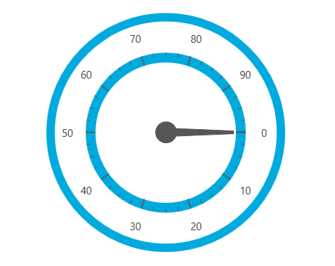

////

|metadata|
{
    "name": "designers-guide-using-themes",
    "controlName": [],
    "tags": ["How Do I","Styling"],
    "guid": "4c1bb5d7-ed56-49aa-9247-86721f57cc57",  
    "buildFlags": ["sl","wpf"],
    "createdOn": "2012-01-30T16:50:12.2138012Z"
}
|metadata|
////

= テーマの使用

デフォルトのテーマに加え、すべての {ProductName} コントロールにカスタム テーマが提供されます。このトピックは、{PlatformName} アプリケーションのすべてのコントロールまたは個別にカスタム テーマを適用する方法を説明します。

== 使用可能なテーマ

{ProductName} コントロール スイートには 4 つのテーマが含まれます。

* Office 2010 Blue テーマ - {ProductName} コントロールは、新しいカラフルな外観を作成できます。このスタイルは、Microsoft Office® 2010 アプリケーション スイートのインターフェイスをモデルにしています。
* Office 2013 テーマ - MS Office 2013 のルック アンド フィール。
* Royal Dark テーマ - 視覚状態が追加された統一感のあるシンプルなテーマで UX を向上する暗い色のテーマです。
* Royal Light テーマ - 視覚状態が追加された統一感のあるシンプルなテーマで UX を向上する明るい色のテーマです。
* IG テーマ - 黒、白、強調表示とアクセント カラーとして青、およびいくつかのグレーを使用したモノクロ。
* Metro テーマ - タッチ フレンドリーのテーマです。白、グレー、黒色を使用しています。このコントロールは、簡単に使用できるようにタッチ領域が大きくなっています。
* Metro ダーク テーマ - タッチ フレンドリーのテーマです。ダークグレー、青色、黒色を使用しています。このコントロールは、簡単に使用できるようにタッチ領域が大きくなっています。

== テーマの実装

インフラジスティックス テーマは、物理的なファイルのセットにラップされたリソース ディクショナリです。すべてのコントロールには、外部ファイルとして出荷される固有の Office 2010 Blue テーマ、IG テーマ、および Metro テーマのリソースファイルがあります。各リソース ディクショナリには、{ProductName} コントロールのすべてのコンポーネントをターゲットとするスタイルのコレクションが含まれます。(link:{ApiPlatform}controls.maps.xammap{ApiVersion}~infragistics.controls.maps.xammap.html[xamMap] コントロールの link:{ApiPlatform}controls.maps.xammap{ApiVersion}~infragistics.controls.maps.mapnavigationpane.html[MapNavigationPane] 要素など)。XAML とコード ビハインドの両方でテーマ リソースを操作できます。

== テーマの場所

テーマ ファイルは、link:https://github.com/Infragistics/wpf-resources/tree/main/Themes[WPF Resources  GitHub リポジトリ]で公開されています。

テーマ パックとリソース ファイルは、以下の名前の対応するフォルダーに配置されます。

[options="header", cols="a,a"]
|====
|テーマ名|テーマ リソース ファイルの命名規則

|Office 2010 Blue テーマ
|Office2010Blue.[コントロール名].xaml

|Office 2013 テーマ
|Office2013.[コントロール名].xaml

|Royal Dark テーマ
|RoyalDark.[コントロール名].xaml

|Royal Light テーマ
|RoyalLight.[コントロール名].xaml

|IG テーマ
|IG.[コントロール名].xaml

|Metro テーマ
|Metro.[コントロール名].xaml

|Metro ダーク テーマ
|MetroDark.[コントロール名].xaml

|====

== テーマの適用

この例は、Metro テーマを xamRadialGauge コントロールに適用する方法を示します。ただし、同じ手順に従って、{ProductName} 製品のその他のコントロールにテーマを適用することができます。 同様に、IG または Office 2010 Blue テーマを xamRadialGauge またはその他のコントロールに適用できます。

.注:
[NOTE]
====
注: 以下の例は、プロジェクトで xamRadialGauge コントロールのためにアセンブリ参照をすでに追加したことが前提となっています。アプリケーションの xamRadialGauge コントロールで以前設定したスタイルおよび外観プロパティがある場合に、明示的または暗示的に削除する必要があります。そうでない場合、Metro テーマは正しく適用されません。
====

[start=1]
. プロジェクトに新しいフォルダーを追加して Themes という名前をつけます。
[start=2]
. Metro Theme フォルダーを Themes フォルダーにドラッグ アンド ドロップします。これで、Metro テーマのすべてのテーマ リソース ファイルがプロジェクトに追加されますが、アプリケーションで使用されないリソース ディクショナリを削除できます。Metro Theme フォルダーは、前述のリポジトリ内の Themes フォルダーにあります。そのフォルダー内に、Metro テーマのすべてのテーマ ファイルが含まれている Metro フォルダーがあります。

.注:
[NOTE]
====
*注:* テーマ リソース ファイルと同じフォルダーにコピーする 3 つの共有ファイルがあります - *[ThemeName].Theme.Colors.xaml*、*[ThemeName].Styles.xaml*、および *[ThemeName].WPF.xaml*。このファイルはコントロールのテーマに参照される可能性があります。
====

.注:
[NOTE]
====
*注* : テーマ リソース ファイルは、Content または Resource としてプロジェクトに組み込むことができます。これは Visual Studio – Build Action プロパティの FileProperties ウィンドウで指定されます。
====

** テーマのリソース ファイルが Content として組み込まれる場合、それはアプリケーション パッケージに含まれ、テーマ フォルダーへの相対パスを設定する必要があります。
** テーマ リソース ファイルが Resource としてアプリケーション アセンブリに組み込まれる場合、Source プロパティはアプリケーションのアセンブリ名を前に付ける必要があります。

以下の表は、テーマ リソース ファイルを組み込むために選択されたさまざまなビルド アクションに基づいたソース パスの例を示します。

[options="header", cols="a,a"]
|====
|ビルド アクション|テーマ リソース ファイルのソース パス

|ページ
|/Themes/MetroTheme/Metro.xamGauges.xaml

|リソース
|/AppAssemblyName;component/Themes/MetroTheme/Metro.xamGauges.xaml

|====

.注:
[NOTE]
====
注: Application レベルでコントロールのテーマ リソース ファイルを結合してプロジェクトのコントロールのすべてのインスタンスにテーマを適用できます。または Page、Window または Control レベルで結合して、プロジェクトのコントロールの単一のインスタンスにテーマを適用できます。
====

[start=3]
. アプリケーションに xamRadialGauge コントロールの Metro テーマを適用します。

*XAML の場合:*
[source,xaml]
----
<Application.Resources>
    <ResourceDictionary>
        <ResourceDictionary.MergedDictionaries>
            <ResourceDictionary Source="/Themes/MetroTheme/Metro.xamGauges.xaml"/>
        </ResourceDictionary.MergedDictionaries>
    </ResourceDictionary>
</Application.Resources>
----

*Visual Basic の場合:*
[source,vb]
----
Dim resource As New ResourceDictionary()
resource.Source = New Uri("/Themes/MetroTheme/Metro.xamGauges.xaml", UriKind.Relative)
Application.Current.Resources.MergedDictionaries.Add(resource)
----

*C# の場合:*
[source,csharp]
----
ResourceDictionary resource = new ResourceDictionary();
resource.Source = new Uri("/Themes/MetroTheme/Metro.xamGauges.xaml", UriKind.Relative);
Application.Current.Resources.MergedDictionaries.Add(resource);
----

[start=4]
. プロジェクトを保存して実行します。以下の画像は、Metro テーマが適用された xamRadialGauge コントロールを示しています。

== 複合コントロールでテーマを適用

xamGeographicMap コントロールは複合コントロールです。テーマを適用するには、アプリケーションおよび MergedDictionaries コレクションに以下のファイルを含める必要があります。

* [テーマ名].xamGeographicMap.xaml
* [テーマ名].DataVisualization.xaml

*XAML の場合:*

[source,xaml]
----
<Application.Resources>
    <ResourceDictionary>
        <ResourceDictionary.MergedDictionaries>
            <ResourceDictionary Source="/Themes/IgTheme/IG.DataVisualization.xaml"/>
            <ResourceDictionary Source="/Themes/IgTheme/IG.xamGeographicMap.xaml"/>
        </ResourceDictionary.MergedDictionaries>
    </ResourceDictionary>
</Application.Resources>
----

xamDataChart コントロールもまた複合コントロールです。以下のテーマ リソースファイルをアプリケーションに含み結合する必要があります。

* [テーマ名].xamDataChart.xaml
* [テーマ名].DataVisualization.xaml

*XAML の場合:*

[source,xaml]
----
<Application.Resources>
    <ResourceDictionary>
        <ResourceDictionary.MergedDictionaries>
            <ResourceDictionary Source="/Themes/IgTheme/IG.DataVisualization.xaml"/>
            <ResourceDictionary Source="/Themes/IgTheme/IG.xamDataChart.xaml"/>
        </ResourceDictionary.MergedDictionaries>
    </ResourceDictionary>
</Application.Resources>
----

== 関連トピック:

link:designers-guide-what-is-a-theme.html[テーマとは?]

link:designersguide-styling-ig-controls.html[Infragistics コントロールのスタイル]
