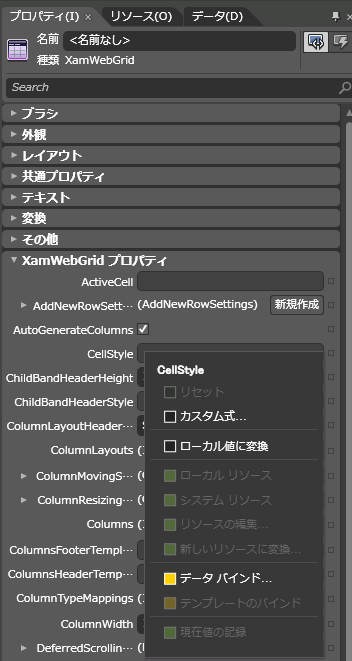
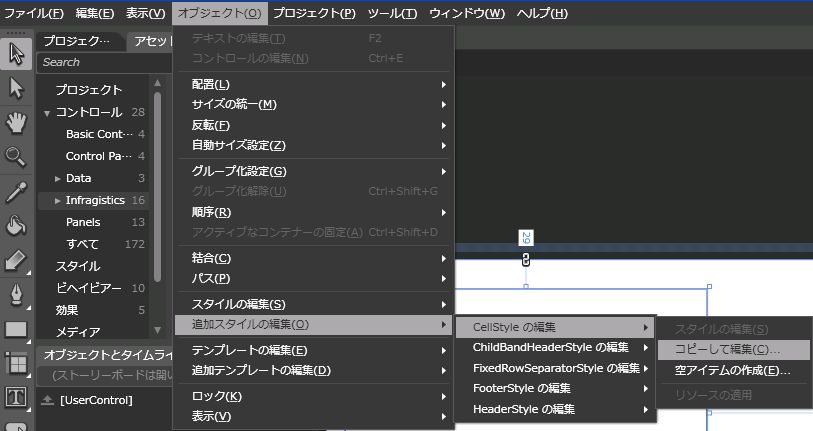
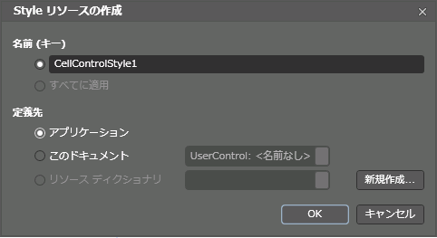
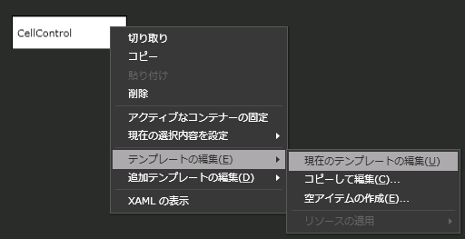
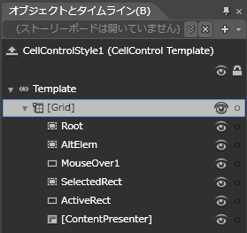
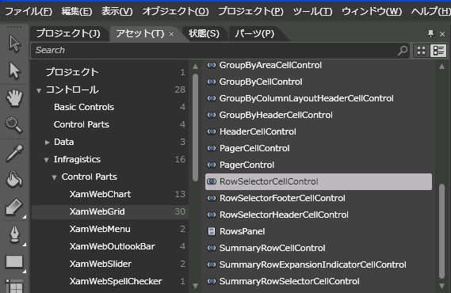
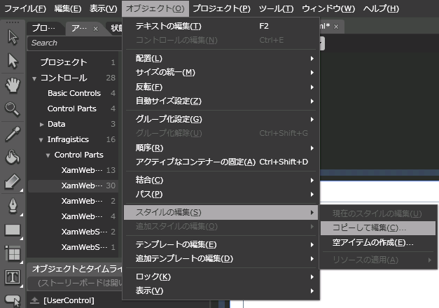
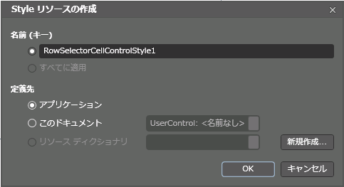
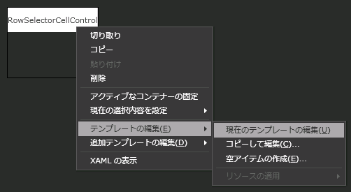
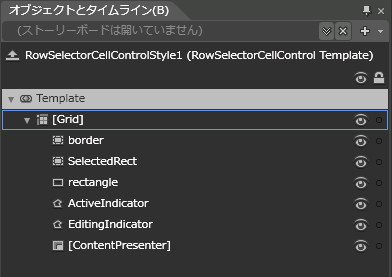

////

|metadata|
{
    "name": "designersguide-editing-style-properties-using-expression-blend",
    "controlName": [],
    "tags": [],
    "guid": "{8EB7EDB2-1F7D-439C-9800-270A0C439A12}",  
    "buildFlags": ["sl","wpf","win-rt"],
    "createdOn": "2012-01-30T16:46:26.9378012Z"
}
|metadata|
////

= Expression Blend を使用してスタイル プロパティを編集

== 始める前に

Microsoft® Expression® Blend を使用して既存のコントロール スタイルのコピーを素早く簡単に変更できます。これによって、さまざまな {ProductName} コントロールに指定できる固有のカスタム スタイルを作成できます。

コントロールの構成はスタイルを変更するために使用する手順を決定します。たとえば、xamGrid™ コントロールは link:{ApiPlatform}controls.grids.xamgrid{ApiVersion}~infragistics.controls.grids.cellcontrol.html[CellControl] オブジェクトなどの一般的に使用されるコントロールのためのスタイル プロパティを公開します。ただし、 link:{ApiPlatform}controls.grids.xamgrid{ApiVersion}~infragistics.controls.grids.primitives.rowselectorcellcontrol.html[RowSelectorCellControl] オブジェクトなどのその他のネストされたコントロールには xamWebGrid コントロールによって直接公開される対応するスタイル プロパティがありません。代わりに、xamGrid コントロール内のネストされたオブジェクトは適切なスタイル プロパティを公開します。この特別なケースで、 link:{ApiPlatform}controls.grids.xamgrid{ApiVersion}~infragistics.controls.grids.rowselectorsettings.html[RowSelectorSettings] オブジェクトは RowSelectorCellControl オブジェクトのスタイル プロパティを公開します。

このトピックは、ページ上に xamGrid コントロールをすでに持っていることを前提とします。

== 達成すること

固有のカスタム スタイルを作成するために、xamGrid™ コントロールのコピーを編集する技法をいくつか学習します。固有のカスタム スタイルを作成するためにその他の {ProductName} コントロールにその技法を適用できます。最初の技法は、xamGrid コントロールによって直接公開されるプロパティのスタイルを作成する方法を示します。2 番目の技法は、xamGrid コントロールによって直接公開される対応するスタイル プロパティを持たないネストされたコントロールのスタイルを作成する方法を示します。

== 以下の手順を実行します。

== xamGrid の CellStyle プロパティを編集

[start=1]
. Expression Blend を使用して、プロパティ パネルで xamGrid コントロールの link:{ApiPlatform}controls.grids.xamgrid{ApiVersion}~infragistics.controls.grids.xamgrid~cellstyle.html[CellStyle] プロパティを見つけます。

プロパティ パネルで直接 CellStyle プロパティを編集できないことが分かります。幸運なことに、Expression Blend は以下のメニュー項目にナビゲートすることによってこれらのプロパティをスタイルする機能を提供します:

[オブジェクト] $$->$$ [他のスタイルの編集] $$->$$ ［セル スタイルの編集］ - > [コピーの編集]

[start=2]
. セル スタイルのコピーを作成します。スタイルのコピーを作成すると、Expression Blend はブラシやその他のオブジェクトをはじめとするスタイル全体を generic.xaml ファイルから自動的にコピーします。

.. [オブジェクト] メニューを開きます。
.. [他のスタイルの編集] メニュー項目を展開します。[他のスタイルの編集] メニュー項目を有効にするには、Expression Blend のビジュアル デザイン サーフェイスで xamGrid コントロールを選択する必要があります。xamGrid コントロールによって直接公開されるスタイル プロパティはサブメニューに対応するメニュー項目があります。
.. [セル スタイルの編集] メニュー項目を展開します。
.. [コピーの編集] を選択します。

[start=3]
. [アプリケーション] オプションを選択し、[OK] ボタンをクリックして、アプリケーションのリソース ディクショナリにスタイルのコピーを追加します。

スタイルをアプリケーションのリソース ディクショナリに追加するとページはクリーンのままであり、アプリケーション内の他のページでこのスタイルを再利用することが可能となります。

[start=4]
. この時点で、Expression Blend はそれ自身で CellControl を含むビジュアル デザイン サーフェースをロードします。

image::images/SL_Designers_Guide_Editing_Style_Properties_Using_Expression_Blend_04.png[]

[start=5]
. これで CellControl オブジェクトの既存のコントロール テンプレートを変更する機会ができます。

.. CellControl オブジェクトを右クリックします。
.. [テンプレートの編集] メニュー項目を展開します。
.. [カレントの編集] を選択します。

[start=6]
. この時点で、CellControl オブジェクトを構成する要素を表示するツリーが表示されるはずです。探しているスタイルを取得するためにこのテンプレートを編集できます。追加のおまけとして、テンプレートの編集が完了したら、アプリケーションを実行するだけで結果を確認することができます。Expression Blend が CellStyle プロパティを自動的に設定するからです。

== ネストされたコントロールのスタイルの編集

[start=1]
. スタイルを付けたいネストされたコントロールのインスタンスをページにドラッグします。

この例では、 link:{ApiPlatform}controls.grids.xamgrid{ApiVersion}~infragistics.controls.grids.stylesettingsbase~style.html[xamGrid.RowSelectorSettings.Style] プロパティを編集するために RowSelectorCellControl オブジェクトを使用します。[コントロール] $$->$$ [Infragistics] $$->$$ [コントロールのパーツ] - > [xamGrid] の下にあるアセット パネルでこのコントロールを見つけることができます。

[start=2]
. RowSelectorCellControl オブジェクトのスタイルのコピーを作成します。

.. [オブジェクト] メニューを開きます。
.. [スタイルの編集] メニュー項目を展開します。
.. [コピーの編集] を選択します。

[start=3]
. CellControl オブジェクトのスタイルを作成した時に表示されたのと同じダイアログが表示されます。このダイアログを使用してスタイル名を指定するだけでなく、アプリケーションのリソース ディクショナリに配置します。

[start=4]
. CellControl オブジェクトのテンプレートを編集するために以前使用したのと同じ技法を使用してコントロールのテンプレートを編集できます。

.. RowSelectorCellControl オブジェクトを右クリックします。
.. [テンプレートの編集] メニュー項目を展開します。
.. [カレントの編集] を選択します。

[start=5]
. コントロールの特定の要素を変更することが可能となります。

[start=6]
. 新たに作成したスタイルを行セレクターに適用するために今ひとつ追加の手順が必要となります。RowSelectorSettings オブジェクトの Style プロパティを作成したばかりのスタイルに設定する必要があります。

*XAML の場合:*

----
<ig:XamGrid>
    <ig:XamGrid.RowSelectorSettings>
        <ig:RowSelectorSettings Style="{StaticResource RowSelectorCellontrolStyle1}" />
    </ig:XamGrid.RowSelectorSettings>
</ig:XamGrid>
----