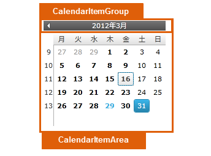
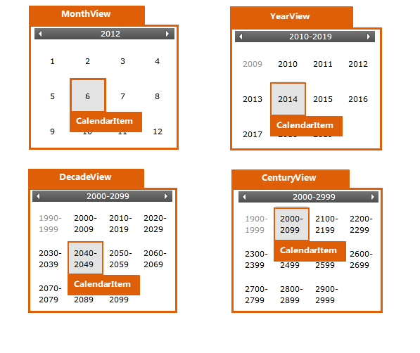
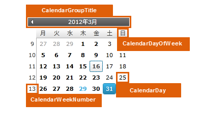

////

|metadata|
{
    "name": "designersguide-styling-points-for-xamcalendar",
    "controlName": [],
    "tags": ["Styling"],
    "guid": "f5757588-9090-46b8-9cfc-c08e24fbd5c2",  
    "buildFlags": ["sl","wpf","win-rt"],
    "createdOn": "2012-04-05T20:05:23.912337Z"
}
|metadata|
////

= xamCalendar のスタイリング ポイント

=== 概要

_xamCalendar_   _™_   コントロールを使用して、コントロールのプロパティを介してターゲットの種類のデフォルトのルック アンド フィールをカスタマイズします。

=== プレビュー

以下の画像は、 _xamCalendar_   コントロールのプロパティを使用して構成可能なさまざまなターゲットの種類を識別します。これによって、表示したいように、このコントロールに関連するターゲットの種類を描画できます。

== xamCalendar スタイリング プロパティ

_xamCalendar_   コントロールのスタイリング プロパティ。

[options="header", cols="a,a,a"]
|====
|ターゲットの種類|Style プロパティ|説明

|`CalendarItemGroup`
|CalendarItemGroup.Style
|_xamCalendar_ コントロール内に含まれる項目の外観をカスタマイズできます。

|`CalendarItemarea`
|CalendarItemArea.Style
|_xamCalendar_ コントロールで項目の四角形領域の外観をカスタマイズできます。

|`CalendarItem`
|CalendarItem.Style
|カレンダー ビューで項目 (月、年、10 年、または世紀) の外観をカスタマイズできます。

|`CalendarItemGroupTitle`
|CalendarItemGroupTitle.Style
|_xamCalendar_ コントロールでタイトルの外観をカスタマイズできます。

|`CalendarDayOfWeek`
|CalendarDayOfWeek.Style
|_xamCalendar_ コントロールで曜日の外観をカスタマイズできます。

|`CalendarDay`
|CalendarDay.Style
|_xamCalendar_ コントロールで月の日付の外観をカスタマイズできます。

|`CalendarWeekNumber`
|CalendarWeekNumber.Style
|_xamCalendar_ コントロールで年間の週の数の外観をカスタマイズできます。

|====

== 関連コンテンツ

=== トピック

以下のトピックでは、このトピックに関連する情報を提供しています。

[options="header", cols="a,a"]
|====
|トピック|目的

| link:xamcalendar.html[xamCalendar]
|_xamCalendar_ コントロールの概要。

|====