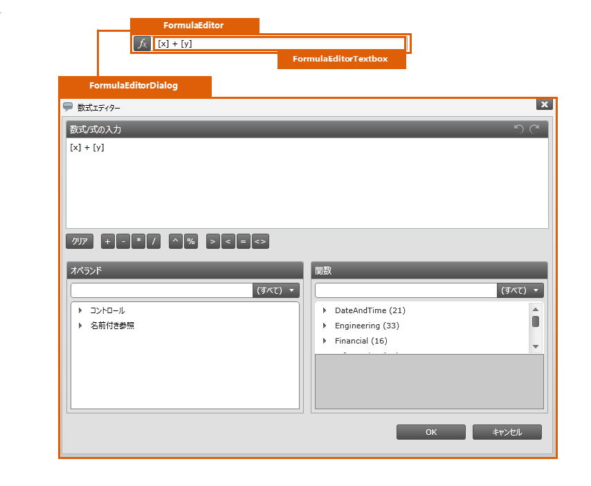

////

|metadata|
{
    "name": "designersguide-styling-points-for-xamformulaeditor",
    "controlName": [],
    "tags": ["Styling","Templating"],
    "guid": "4a18bc78-d8fd-493c-98fd-3fd056074035",  
    "buildFlags": ["sl","wpf"],
    "createdOn": "2012-04-05T20:04:36.883337Z"
}
|metadata|
////

= xamFormulaEditor のスタイリング ポイント

=== 概要

_xamFormulaEditor_™ コントロールを使用して、コントロールのプロパティを介してターゲットの種類のデフォルトのルック アンド フィールをカスタマイズします。

=== プレビュー

以下の写真は、xamFormulaEditor コントロールのプロパティを使用して構成可能なさまざまなターゲットの種類を識別します。これによって、希望するスタイルを使用して、このコントロールに関連するターゲットの種類をカスタマイズできます。

== xamFormulaEditor スタイリング プロパティ

以下の表では、 _xamFormulaEditor_   コントロールのスタイリング プロパティを示しています。

[options="header", cols="a,a,a"]
|====
|ターゲットの種類|Style プロパティ|説明

|`FormulaEditor`
|FormulaEditor.Style
|FormulaEditor コントロールをスタイルします。

|`FormulaEditorTextBox`
|FormlaEditorTextBox.Style
|_xamFormulaEditor_ コントロールでテキスト ボックスをスタイルします。

|`FormulaEditorDialog`
|FormulaEditorDialog.Style
|_xamFormulaEditor_ コントロールのドロップダウン ダイアログ ウィンドウをスタイルします。

|====

== 関連コンテンツ

=== トピック

以下のトピックでは、このトピックに関連する情報を提供しています。

[options="header", cols="a,a"]
|====
|トピック|目的

| link:xamformulaeditor.html[xamFormulaEditor]
|_xamFormulaEditor_ コントロールについての広範囲な情報を提供します。このトピックは、このコントロールで何ができるのかという紹介から始まり、アプリケーションに実装する理由などに踏み込んでいきます。手順ごとの説明で、このコントロールを使用して一般的な作業をどのように達成できるかを解説します。

|====