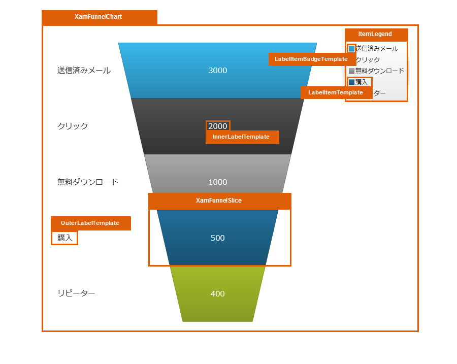

////

|metadata|
{
    "name": "designersguide-styling-points-for-xamfunnelchart",
    "controlName": [],
    "tags": ["Styling","Templating"],
    "guid": "d7e12328-2aa3-4e7a-b642-d57adb9b597b",  
    "buildFlags": ["sl","wpf","win-phone"],
    "createdOn": "2012-04-06T19:15:07.1173746Z"
}
|metadata|
////

= xamFunnelChart のスタイリング ポイント

=== 概要

_xamFunnelChart_   コントロールを使用し、コントロール プロパティを介してターゲットの種類のデフォルトのルック アンド フィールをカスタマイズします。

=== プレビュー

以下の画像は、 _xamFunnelChart_   のコントロール プロパティを使用して構成可能な、さまざまなターゲットの種類を示しています。これによって、希望するスタイルを使用して、このコントロールに関連するターゲットの種類をカスタマイズできます。

== xamFunnelChart スタイリング プロパティ

以下の表は、 _xamFunnelChart_   _™_   コントロールのスタイリング プロパティを示しています。

[options="header", cols="a,a,a"]
|====
|ターゲットの種類|Style プロパティ|説明

|`XamFunnelChart`
|XamFunnelChart.Style
|XamFunnelChart コントロールをスタイルします。

|`XamFunnelSlice`
|XamFunnelSlice.Style
|xamFunnelChart コントロールのスライスをスタイルします。

|`InnerLabelTemplate`
|InnerLabelTemplate
|コントロール テンプレートでスライス内のラベルをスタイルします。

|`OuterLabelTemplate`
|OuterLabelTemplate
|コントロール テンプレートでスライス外に配置されたラベルをスタイルします。

|`ItemLegend`
|ItemLegend.Style
|Legend コントロールをスタイルします。

|`LegendItemBadgeTemplate`
|LegendItemBadgeTemplate
|コントロール テンプレートで Legend の項目レッテルをスタイルします。

|`LegendItemTemplate`
|LegendItemTemplate
|コントロール テンプレートで Legend の項目をスタイルします。

|====

== 関連コンテンツ

=== トピック

以下のトピックでは、このトピックに関連する情報を提供しています。

[options="header", cols="a,a"]
|====
|トピック|目的

| link:funnelchart.html[xamFunnelChart]
|ファンネル チャートは全体に対するパーセントとして量を表示するタイプのチャートで、円チャートに非常に似ています。

|====