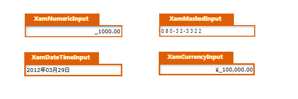

////

|metadata|
{
    "name": "designersguide-styling-points-for-xaminputs",
    "controlName": [],
    "tags": ["Editing","Styling","Templating"],
    "guid": "55052c03-c011-4573-b36b-cf1bb1a8379c",  
    "buildFlags": [],
    "createdOn": "2012-04-06T19:17:13.6670295Z"
}
|metadata|
////

= xamInputs のスタイリング ポイント

=== 概要

_xamInputs_   コントロールを使用し、コントロール プロパティを介してターゲット タイプのデフォルトのルック アンド フィールをカスタマイズします。

=== プレビュー

以下の画像は、 _xamInputs_   のコントロール プロパティを使用して構成可能な、さまざまなターゲット タイプを示しています。これによって、希望するスタイルを使用して、これらのコントロールに関連するターゲットの種類をカスタマイズできます。

== xamInputs スタイリング プロパティ

以下の表は、 _xamInputs_   _™_   コントロールのスタイリング プロパティを示しています。

[options="header", cols="a,a,a"]
|====
|ターゲットの種類|Style プロパティ|説明

|`XamNumericInput`
|XamNumericInput.Style
|XamNumericInput コントロールをスタイルします。

|`XamMaskedInput`
|XamMaskedInput.Style
|XamMaskedInput コントロールをスタイルします。

|`XamDateTimeInput`
|XamDateTimeInput.Style
|XamDateTimeInput コントロールをスタイルします。

|`XamCurrencyInput`
|XamCurrencyInput.Style
|XamCurrencyInput コントロールをスタイルします。

|====

== 関連コンテンツ

=== トピック

以下のトピックでは、このトピックに関連する情報を提供しています。

[options="header", cols="a,a"]
|====
|トピック|目的

| link:xaminputs.html[xamInputs]
|このトピックは、xamInputs グループのコントロールを紹介します。

|====