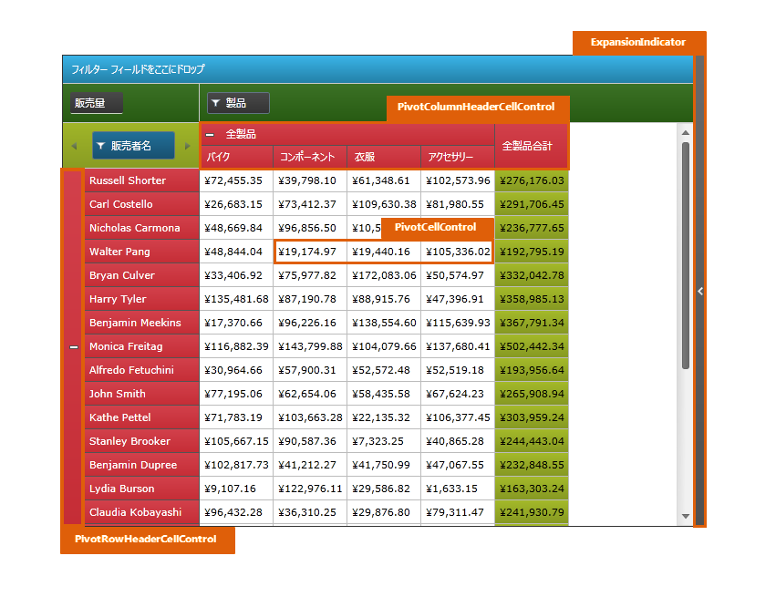
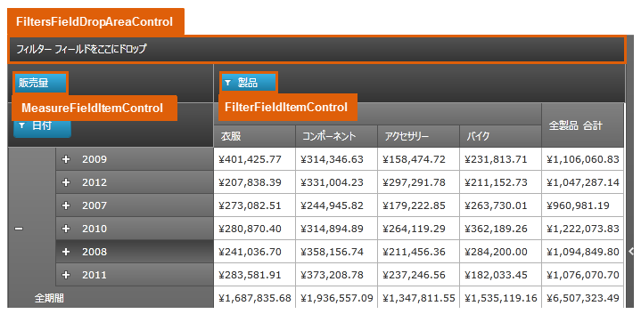

////

|metadata|
{
    "name": "designersguide-styling-points-for-xampivotgrid",
    "controlName": [],
    "tags": ["Styling","Templating"],
    "guid": "ce6963f4-fde1-431d-b6ba-e24c555b73d3",  
    "buildFlags": ["sl","wpf"],
    "createdOn": "2012-04-05T20:01:50.686337Z"
}
|metadata|
////

= xamPivotGrid のスタイリング ポイント

=== 概要

_xamPivo_  _t_  _Grid_  コントロールを使用して、コントロールのプロパティを介してターゲットの種類のデフォルトのルック アンド フィールをカスタマイズします。

=== プレビュー

以下の画像は、 _xamPivotGrid_  のコントロール プロパティを使用して構成可能な、さまざまなターゲットの種類を示しています。これによって、希望するスタイルを使用して、このコントロールに関連するターゲットの種類をカスタマイズできます。

image::images/xamPivorGrid_StylingPoints_3.png[]

== xamPivotGrid スタイリング プロパティ

_xamPivotGrid_   _™_   コントロールのスタイリング プロパティ。

[options="header", cols="a,a,a"]
|====
|ターゲットの種類|Style プロパティ|説明

|`PivotRowHeaderCellControl`
|PivotRowHeaderCellControl.Style
|XamPivotGrid コントロールの行ヘッダー セルをスタイルします。

|`PivotColumnHeaderCellControl`
|PivotColumnHeaderCellControl.Style
|XamPivotGrid コントロールの列ヘッダー セルをスタイルします。

|`PivotCellControl`
|PivotCellControl.Style
|XamPivotGrid コントロールのセルをスタイルします。

|`FiltersFieldDropAreaControl`
|FiltersFieldDropAreaControl.Style
|データ選択領域からこの領域にドロップしたフィルタリングされたフィールド領域をスタイルするか、この領域に表示するためにコードで設定します。

|`ColumnFieldDropAreaControl`
|ColumnFieldDropAreaControl.Style
|データ選択領域からこの領域にドロップした列のフィールド領域をスタイルするか、この領域に表示するためにコードで設定します。

|`RowFieldDropAreaControl`
|RowFieldDropAreaControl.Style
|データ選択領域からこの領域にドロップした行のフィールド領域をスタイルするか、この領域に表示するためにコードで設定します。

|`MeasureFieldItemControl`
|MeasureFieldItemControl.Style
|データ選択領域からこの領域にドロップしたメジャーの領域をスタイルするか、この領域に表示するためにコードで設定します。

|`FilterFieldItemControl`
|FilterFieldItemControl.Style
|データ選択領域からこの領域にドロップした行または列などのフィールド用の領域をスタイルするか、この領域に表示するためにコードで設定します。

|====

== 関連コンテンツ

=== トピック

以下のトピックでは、このトピックに関連する情報を提供しています。

[options="header", cols="a,a"]
|====
|トピック|目的

| link:xampivotgrid.html[xamPivotGrid]
|_xamPivotGrid_ コントロールを使用する場合の概要。

|====