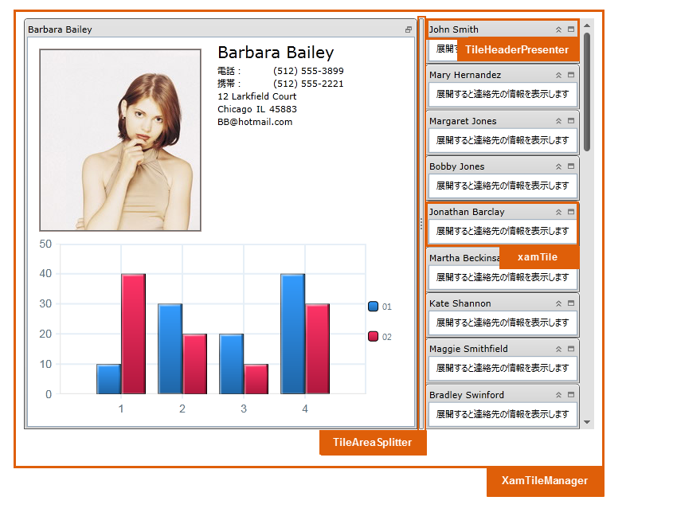

////

|metadata|
{
    "name": "designersguide-styling-points-for-xamtilemanager",
    "controlName": [],
    "tags": ["Styling","Templating"],
    "guid": "68dbe742-8df8-4298-8106-422f3f21db6c",  
    "buildFlags": ["sl","wpf"],
    "createdOn": "2012-04-05T19:59:41.172337Z"
}
|metadata|
////

= xamTileManager のスタイリング ポイント

=== 概要

このトピックは、 _xamTileManager_™ コントロールのスタイリング ポイントをデザイナーに紹介します。

=== プレビュー

以下の画像は、 _xamTileManager_   のコントロール プロパティを使用して構成可能な、さまざまなターゲット タイプを示しています。これによって、希望するスタイルを使用して、このコントロールに関連するターゲットの種類をカスタマイズできます。

== xamTileManager スタイリング プロパティ

_xamTileManager_   _™_   コントロールのスタイリング プロパティ。

[options="header", cols="a,a,a"]
|====
|ターゲットの種類|Style プロパティ|説明

|`XamTileManager`
|XamTileManager.Style
|_XamTileManager_ コントロールをスタイルします。

|`XamTile`
|XamTile.Style
|XamTile コントロールをスタイルします。

|`TileAreaSplitter`
|TileAreaSplitter.Style
|タイル スプリッターの領域をスタイルします (タイル間)。

|`TileHeaderPresenter`
|TileHeaderPresenter.Style
|タイルのヘッダー領域をスタイルします。

|====

== 関連コンテンツ

=== トピック

本トピックの追加情報

[options="header", cols="a,a"]
|====
|トピック|目的

| link:xamtilemanager.html[xamTileManager]
|_xamTileManager_ に関する情報を提供します。これは、コントロールが行うことや、アプリケーションでのコントロールの使用手順の提供までの広範囲を対象とします。

|====