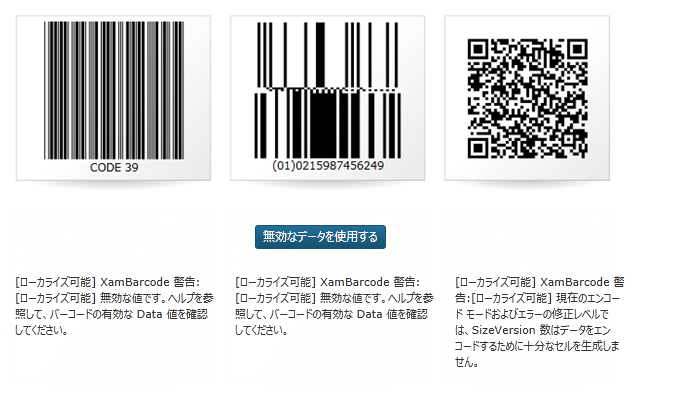
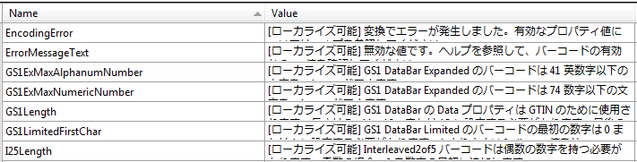

////

|metadata|
{
    "name": "developers-guide-customizing-resource-strings",
    "controlName": [],
    "tags": ["How Do I","Localization","Resource Strings"],
    "guid": "ee8c34fc-f216-4cca-91b1-29c5d97464fd",  
    "buildFlags": [],
    "createdOn": "2012-01-30T15:17:19.5896008Z"
}
|metadata|
////

= リソース文字列のカスタマイズ

このトピックは、{ProductName} コントロールのリソース文字列のカスタマイズ方法を説明します。

トピックは以下のとおりです。

* <<Introduction,概要>>
* <<SupportControl,コントロール単位でサポートされる文字列のカスタマイズ>>
* <<Modifying,リソース ファイルの修正>>

** <<Register,カスタマイズされたリソース ファイルの登録>>
** <<Reset,デフォルトのリソース文字列の再設定>>

[[Introduction]]

== 概要

{ProductName} コントロールがエンドユーザーに対して表示する文字列の値をカスタマイズできます。これらの文字列には、ダイアログ ボックスのキャプション、警告メッセージ、フィルター オプションおよびアラームなどがあります。これによって、アプリケーションのローカライズがより簡単かつ直接的に行うことができます。

以下の図で、xamBarcode コントロールにはカスタマイズされたリソース文字列があります。

図 1: カスタマイズされたリソース文字列がある xamBarcode コントロール

[[SupportControl]]
== コントロール単位でサポートされる文字列のカスタマイズ

UI 文字列のカスタマイズは、以下のコントロールでサポートされます。

* xamCalendar
* xamColorPicker
* xamDockManager
* xamGrid
* xamMap
* XamOutlookBar
* xamPivotGrid
* xamRibbon
* xamSchedule (ScheduleControlBase クラスで)
* xamScheduleDialogs (ScheduleDialogFactory で)
* xamSpellChecker (xamSpellChecker クラスで)

エラー メッセージのカスタマイズは以下のコントロールでサポートされます。

* xamBarcode
* xamComboEditor
* xamDataTree
* xamNetworkNode
* xamTimeline
* xamTreemap
* xamMenu
* xamMaskedInput

[[Modifying]]
== リソース ファイルの修正

コントロールのリソース ファイルは、アセンブリと同じ命名規則に従います。たとえば、xamBarcode コントロールのリソース ファイルは {ApiPlatform}Controls.Barcodes.xamBarcode.resx という名前になります。

コントロールのリソース ファイルは、link:https://github.com/Infragistics/wpf-resources/tree/main/Themes[WPF Resources  GitHub リポジトリ]で公開されています。

[NOTE]
====
*注:* {PlatformName} プロジェクトでリソース文字列を使う場合、.csproj/.vbproj ファイルを手動で編集して、.proj ファイルの SupportedCultures ノードにロケールを追加する必要があります。
====

[[Register]]
== カスタマイズされたリソース ファイルの登録

各コントロールには、リソース ファイルを登録するために使用される RegisterResources() メソッドがあります。このメソッドでは以下の 2 つのパラメーターを使用できます。

* 最初のパラメーターは、使用されるリソースを含む埋め込みリソース ファイルの名前です。一般的にフォーマットは以下のようになります。

デフォルトの名前空間 + パス + ファイル名。

[NOTE]
====
*注:* ファイル名には拡張子 (.resx または .resouce) を使用しないでください。
====

* もうひとつのパラメーターは、リソース ファイルが埋め込まれるアセンブリです。

カスタマイズされたリソース ファイルを登録するには以下の手順に従ってください。

[start=1]
. 新しい Resources File (.resx) ファイルをプロジェクトに追加します。埋め込まれていることを確認してください。
[start=2]
. コントロールの実際のキーに対応する文字列のキーでカスタマイズされた文字列を追加します。たとえば、xamBarcode コントロールの実在のキーを使って、データの読み込みに関連付けられた文字列を変更することができます。これは以下のスクリーンショットに示されています。

*Visual Basic の場合:*

[source,vb]
----
XamBarcode.RegisterResources("BarcodeResourceStringsSample",GetType(MainWindow).Assembly)
----

*C# の場合:*

[source,csharp]
----
XamBarcode.RegisterResources("BarcodeResourceStringsSample", typeof(MainWindow).Assembly);
----

[NOTE]
====
*注:* リソース文字列は、InitializeComponent() が呼び出される前に適用する必要があります。コントロールが初期化された後は更新されません。
====

コントロールで使用できるすべての文字列に文字列値を供給する必要はありません。カスタマイズしたい文字列を選択できます。複数のリソース ファイルを登録し、それらに同じ文字列が含まれている場合、最後に登録されるリソース ファイルはエンド ユーザーに表示されるリソース ファイル文字列値よりも優先されます。

[[Reset]]
== デフォルトのリソース文字列の再設定

カスタマイズされたリソース文字列の登録を解除して、コントロールのデフォルトのリソース文字列を再設定することもできます。これはコントロールの UnregisterResources() メソッドを呼び出すことによって実行できます。

このメソッドは 1 つのパラメーターを取ります。

* 以前に登録した埋め込みリソース ファイルの名前です。

*Visual Basic の場合:*

[source,vb]
----
XamBarcode.UnregisterResources("BarcodeResourceStringsSample")
----

*C# の場合:*

[source,csharp]
----
XamBarcode.UnregisterResources("BarcodeResourceStringsSample");
----