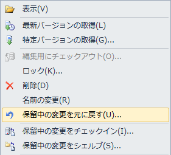
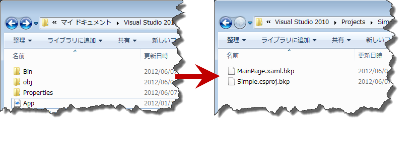

////

|metadata|
{
    "name": "developers-guide-restoring-version-upgrade-utility-backup-undoing-upgrade",
    "controlName": [],
    "tags": ["How Do I"],
    "guid": "955b597e-bd23-4088-939c-640ef264ba6b",  
    "buildFlags": ["wpf","sl"],
    "createdOn": "2012-01-30T15:17:19.5866005Z"
}
|metadata|
////

= バージョン アップグレード ユーティリティ バックアップの復元

Infragistics のバージョン アップグレード ユーティリティは、変更前にアップブレード対象の各ファイルのバックアップを作成します。この機能は、構成設定を介して無効にできます。このユーティリティでアップブレードされる前のアプリケーションの状態を復元したい場合があります。

*ソース管理の使用*

アプリケーションのソース コードがソース管理システム (Microsoft® Team Foundation Server®、Microsoft® Visual Source Safe® など) で管理されている環境で作業する場合、アプリケーションのソースコードを復元する最も良い方法は、アップブレードを実行したときの変更を元に戻すことです。ソース管理システムを使用してアプリケーションのソース コードを復元する手順および変更を元に戻す手順については、ソース管理システムのドキュメントを参照するか、ご自分のソース管理のアドミニストレーターに確認してください。

*Infragistics バージョン ユーティリティの使用*

アプリケーションがソース管理システムで管理されていない場合は、次のガイドに従って、アプリケーションを復元し、バージョン ユーティリティが行った変更を元に戻す必要があります。バージョン ユーティリティがアップブレードしたアプリケーションを復元するのは簡単で、\Backup フォルダにあるファイルをコピーして、プロジェクト内のファイルを上書きするだけです。この処理は、Microsoft® Visual Studio® の中ではなく、ファイル システム レベルで実行してください。バージョンユーティリティでバックアップされたファイルでアプリケーションのファイルを置換したら、Microsoft Visual Studio でプロジェクトを開けるようになります。すべて問題ないことを確認してください。

