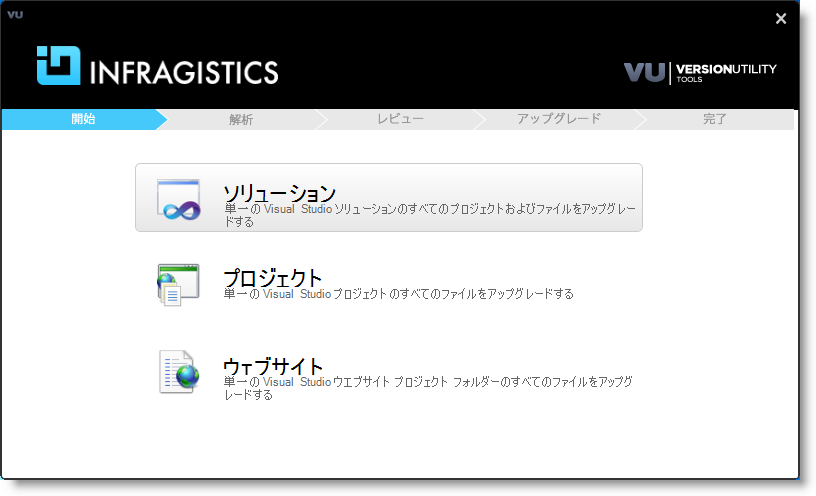
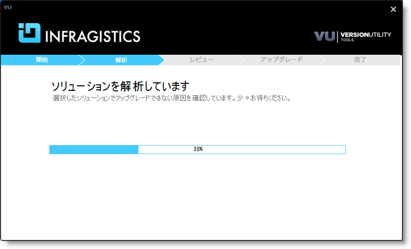
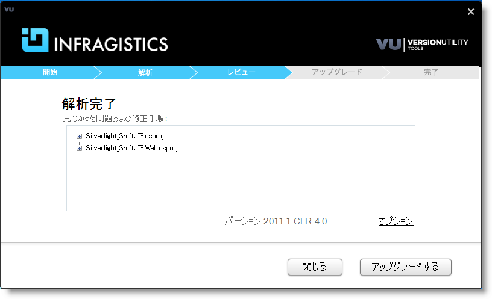
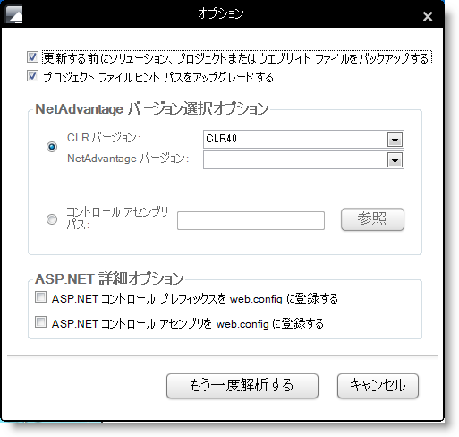
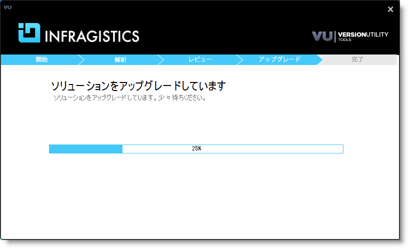
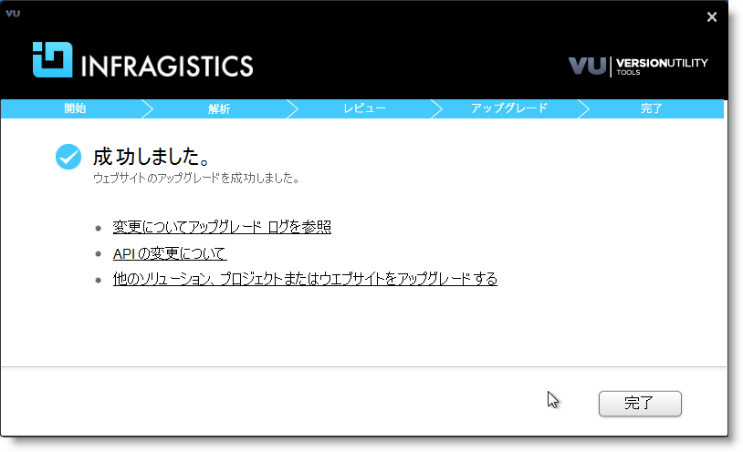
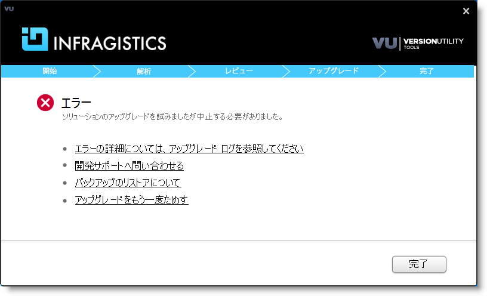

////
|metadata|
{
    "name": "developers-guide-upgrading-to-11-1-using-version-utility",
    "controlName": [],
    "tags": ["Deployment","Getting Started","How Do I","Summaries"],
    "guid": "35c04d64-69ab-49d3-9e1b-eebd1171cc22",
    "buildFlags": ["wpf","sl"],
    "createdOn": "2012-01-30T15:17:19.5805999Z"
}
|metadata|
////

= バージョン ユーティリティを使用してプロジェクトを {ProductNameVersion} へアップグレード

Infragistics は、「バージョン ユーティリティ」と呼ばれる特別なツールを提供しています。このツールによって、既存のソリューションを Infragistics のボリュームに簡単にアップグレードできます。

[NOTE]
====
**注:** バージョン ユーティリティは、Infragistics 11.1 以降にプロジェクトをアップグレードするために設計されました。以前のバージョンの Infragistics (たとえば、10.3) のいずれかにアップグレードする必要がある場合、そのボリュームに同梱されているバージョン ユーティリティを使用してください。
====

そのバージョン ユーティリティで以下をアップグレードできます:

* ソリューション

単一の Visual Studio™ ソリューションのすべてのプロジェクトおよびプロジェクト ファイルをアップグレードする

* プロジェクト

単一の Visual Studio プロジェクトに含まれるすべてのファイルをアップグレードする

* Web サイト

単一の Visual Studio Web サイト プロジェクト フォルダー内のすべてのファイルをアップグレードする

使用されるインターフェイス (コマンド ライン インターフェイス、アドイン インターフェイス、およびスタンドアロン アプリケーション) に基づいてユーティリティには 3 つのエディションがあります。これらすべては、同じコアを使用しているので、希望に応じてひとつを選択できます。アップグレード中に行われた変更は、使用されるインターフェイスに関係なく、ログ ファイルに書き込まれます。

このトピックはスタンドアロン インターフェイスの使用方法について説明します。

== 始める前に

コンテンツをアップグレードする前に、以下の点に留意してください:

* Visual Studio のあるバージョンから別のバージョンにソリューションを移行する場合、ユーティリティを使用する前に Visual Studio のアップグレードを実行してください。サポートされる Visual Studio のバージョンは 2008 以降で、このユーティリティは、Infragistics バージョン 2005 以降をアップグレードできます。
* プロジェクトの .Net バージョンをアップグレードする場合には、バージョン ユーティリティを使用する前にこれを実行してください。
* バージョン ユーティリティを実行する前に、ソリューションのファイルが読み取り専用になっていないことを確認してください。ファイルがソース コントロール下にある場合、ユーティリティを起動する前にファイルを確認してください。
* アップグレードしたい Infragistics 製品のバージョンが、アップグレードを実行するために使用するコンピューターにインストールされていることも確認してください。インストールされていない場合は、アップグレードを実行できません。

== 概要

以下は、アップグレード手順の概要です。

[start=1]
. <<StartingUtility,ユーティリティの起動>>
[start=2]
. <<SelectingContent,コンテンツ タイプの選択>>
[start=3]
. <<ReviewingFiles,アップグレードするファイルの確認>>
[start=4]
. <<CustomizingUpgrade,アップグレードのカスタマイズ (オプション) >>
[start=5]
. <<PerformingUpgrade,アップグレードの実行>>
[start=6]
. <<FinalizingProcess,プロセスの完了>>

== 手順

[[StartingUtility]]
[start=1]
. *ユーティリティの起動*

ユーティリティの最初の画面が開きます。選択してください。
[[SelectingContent]]
[start=2]
. *コンテンツ タイプの選択*

アップグレードしたいコンテンツのタイプを選択し、ナビゲートして読み込みます。

図 1: バージョン ユーティリティの選択手順

コンテンツが読み込まれたら、バージョン ユーティリティは解析を開始します。解析中は次のような画面が表示します。解析してください。

図 2: バージョン ユーティリティの解析手順

解析が完了すると、ユーティリティはタスク リストを作成します。これには処理される必要があるファイルの概要を示します。次にステップに進みます。
[[ReviewingFiles]]
[start=3]
. *アップグレードするファイルの確認*

各リスト項目を展開してタスクを確認します。

図 3: バージョン ユーティリティの確認手順
[[CustomizingUpgrade]]
[start=4]
. *アップグレードのカスタマイズ (オプション) *

アップグレードをカスタマイズするには、[アップグレード オプション] リンクをクリックします。これによって、[アップグレード オプション] ダイアログが開きます。

図 4: [アップグレード オプション] ダイアログ

.注:
[NOTE]
====

** [コントロール アセンブリ パス] オプションを使用して、すべての必要なアセンブリがひとつのフォルダー内にあることを確認します。このユーティリティによって、アセンブリを含むひとつのフォルダーを選択できます。サブフォルダーの再帰的検索はありません。
** カスタム アップブレード オプションを使用したい場合、ユーザーが選択した設定に基づいて新しい解析が実行されます。
====

[[PerformingUpgrade]]
[start=5]
. *アップグレードの実行*

解析が完了したら、[アップグレード] ボタンをクリックします。アップグレード処理が開始されます。

図 5: バージョン ユーティリティのアップグレード手順

このユーティリティは、ソリューションをアップグレードするために必要なファイルだけを変更します。ソリューション内の以下のファイルだけが変更されます:

** プロジェクト ファイル
** .aspx
** .ascx
** web.config
** .master
** .skin
** .xaml
** .licx
** .cs & .vb
** .resx
** .datasource

処理が完了したら、ユーティリティの最後のステップに進みます。
[[FinalizingProcess]]
[start=6]
. *プロセスの完了*

** 変換の成功

すべての識別されたアップグレード タスクが成功すると、バージョン ユーティリティは成功したことを通知し、また変更のログ ファイルへのリンクを提供します。

図 6: バージョン ユーティリティの完了手順 - アップグレードの成功

バックアップを許可するオプションが有効になっていれば、すべての変更されたファイルはユーティリティの Backup フォルダーにバックアップされています。

[NOTE]
====
*注:*

[その他のソリューション、プロジェクト、またはウエブサイトをアップグレードする] オプションでは、同じ変換オプションを使用して別のソリューションを変換するための簡単な方法が提供されます。ただし、アップグレード処理に異なる設定が必要な場合には、アプリケーションを終了して新たに実行する必要があります。

この時点で、アプリケーションのソース コードに変更が行われた時に通常講じるのと同じ措置を講じる必要があります。つまり、Microsoft® Visual Studio でアプリケーションを開き、ソース コードを確認して、コンパイルし、そしてテストすることです。
====

** 変換の失敗

ユーティリティが処理できない状態に遭遇した場合、エラーが発生した時点でアップグレード処理を停止し、状況を通知します。

図 7: バージョン ユーティリティの完了手順 - アップグレードの失敗

この時点で、ログ ファイルを使用してどのようなエラーが発生したかを識別して、エラーを手動で解決することができます。ログ ファイルに報告されているエラーを解決したら、アップグレード処理を再試行すると、ユーティリティは完了していないアップグレード タスクを処理することができます。もちろん、この方法の代わりに、アプリケーションを手動でアップグレードすることができます。

== 関連トピック

* link:developers-guide-upgrading-your-project.html[プロジェクトのアップグレード]
* link:developers-guide-restoring-version-upgrade-utility-backup-undoing-upgrade.html[バージョン アップグレード ユーティリティ バックアップの復元]