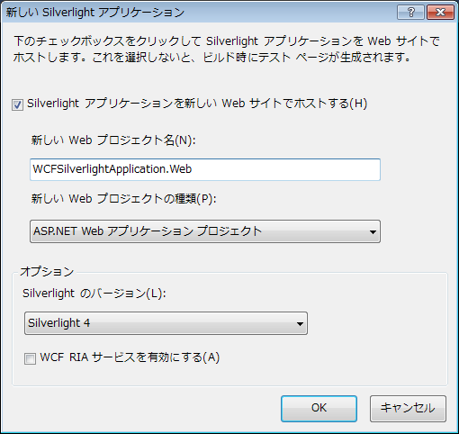
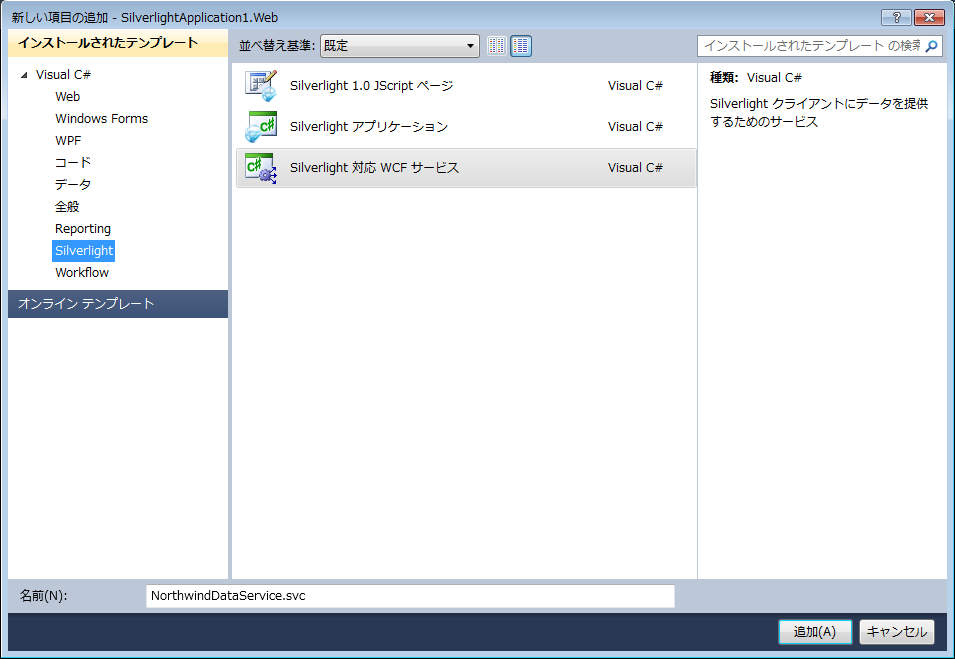
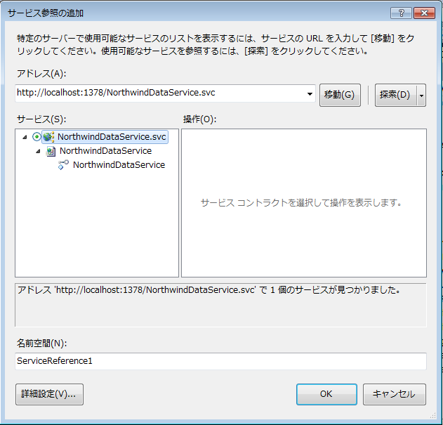

////

|metadata|
{
    "name": "generalprogrammingconcepts-creating-a-wcf-service-with-visual-studio-2010",
    "controlName": [],
    "tags": ["Application Scenarios"],
    "guid": "{98434E83-AC5C-492B-9969-B2AED68A6A48}",  
    "buildFlags": ["sl"],
    "createdOn": "2012-02-01T16:05:27.0095728Z"
}
|metadata|
////

= プログラミングの基本概念

このセクションでは、プログラミングの重要な概念と原則について説明します。

== Visual Studio 2010 で WCF サービスを作成し、xamGrid コントロールで抽出データを生成

== 始める前に

データ主導の Microsoft® Silverlight アプリケーションで、Web サービスを介してデータを公開する必要があります。Silverlight は Web サービスへのクロスドメイン コールをサポートしないため、 link:http://msdn.microsoft.com/ja-jp/library/cc197955(VS.95).aspx[クロスドメイン ポリシー]を使用する、または Silverlight アプリケーションをホストしている Web サイトまたは Web アプリケーション プロジェクトに Web サービスを追加する必要があります。

== 達成すること

この例では、Silverlight で WCF サービスを作成および実行する方法を説明します。

* Visual Studio 2010 で Silverlight 対応 WCF サービスを作成
* データベースへ接続 (Northwind サンプル データベース)
* サービスから返されたデータを実行し、 xamGrid コントロールを生成して結果を視覚化します。

== 次の手順を実行します

== Visual Studio 2010 で Silverlight 対応 WCF サービスを作成

[start=1]
. Visual Studio で新しい Silverlight アプリケーションを作成します (WCFSilverlightApplication と名付けます)。

Silverlight アプリケーションを新しい Web サイトでホストするオプションを選択します。

[start=2]
. WCFSilverlightApplication.Web プロジェクト名を右クリックして、[新しい項目] をメニュー項目から選択します。[インストールされたテンプレート] から 「Silverlight 対応 WCF サービス」を選択します

== Northwind サンプル データベースへ接続

[start=3]
. Web プロジェクトの Web.config ファイルに接続文字列を追加します。connectionStrings 要素は、構成ノードの直接の子です。

*Web.config の場合:*

----
<connectionStrings>
    <add name="NorthwindConnectionString"          connectionString="Data Source=<Server Name>;         Initial Catalog=Northwind;         Integrated Security=True" />
</connectionStrings>
----

== サービスから返されたデータを実行し、 xamGrid コントロールを生成して結果を視覚化

[start=4]
. サービスを NorthwindDataService と名付けた場合、Visual Studio は 2 つのファイル (NorthwindDataService.svc および NorthwindDataService.svc.cs) を作成します。NorthwindDataService.svc.cs ファイルにはサービス コードが含まれます。
[start=5]
. NorthwindDataService.svc.cs ファイルに以下のコードを追加します。

*Visual Basic の場合:*

----
Imports System.ServiceModel
Imports System.ServiceModel.Activation
Imports System.Collections.Generic
Imports System.Data.SqlClient
Imports System.Data
Imports System.Configuration
Namespace WCFSilverlightApplication.Web
<ServiceContract([Namespace] := "")> _
<AspNetCompatibilityRequirements(RequirementsMode := AspNetCompatibilityRequirementsMode.Allowed)> _
Public Class NorthwindDataService
  <OperationContract> _
  Public Function ProductList() As List(Of Product)
    Dim products As New List(Of Product)()
    ' アプリケーション構成から ConnectionStrings プロパティを取得します
    Dim connectionStr As String = ConfigurationManager.ConnectionStrings("NorthwindConnectionString").ConnectionString
    Using connection As New SqlConnection(connectionStr)
      Const queryString As String = "SELECT ProductName, QuantityPerUnit, UnitPrice, UnitsInStock, UnitsOnOrder FROM Products"
      connection.Open()
      Using sqlCommand As New SqlCommand(queryString, connection)
        Dim reader As SqlDataReader = sqlCommand.ExecuteReader(CommandBehavior.CloseConnection)
        If reader IsNot Nothing Then
          While reader.Read()
            Dim product As New Product()
            product.ProductName = reader.GetString(0)
            product.QuantityPerUnit = reader.GetString(1)
            product.UnitPrice = reader.GetDecimal(2)
            product.UnitsInStock = reader.GetInt16(3)
            product.UnitsOnOrder = reader.GetInt16(4)
            products.Add(product)
          End While
        End If
      End Using
    End Using
    Return products
  End Function
  ' ここにその他の操作を追加して <OperationContract> と共にマークします
End Class
Public Class Product
  Public Property ProductName() As String
    Get
      Return m_ProductName
    End Get
    Set(ByVal value As String)
      m_ProductName = Value
    End Set
  End Property
  Private m_ProductName As String
  Public Property QuantityPerUnit() As String
    Get
      Return m_QuantityPerUnit
    End Get
    Set(ByVal value As String)
      m_QuantityPerUnit = Value
    End Set
  End Property
  Private m_QuantityPerUnit As String
  Public Property UnitPrice() As Decimal
    Get
      Return m_UnitPrice
    End Get
    Set(ByVal value As Decimal)
      m_UnitPrice = Value
    End Set
  End Property
  Private m_UnitPrice As Decimal
  Public Property UnitsInStock() As Short
    Get
      Return m_UnitsInStock
    End Get
    Set(ByVal value As Short)
      m_UnitsInStock = Value
    End Set
  End Property
  Private m_UnitsInStock As Short
  Public Property UnitsOnOrder() As Short
    Get
      Return m_UnitsOnOrder
    End Get
    Set(ByVal value As Short)
      m_UnitsOnOrder = Value
    End Set
  End Property
  Private m_UnitsOnOrder As Short
    End Class
End Namespace
----

*C# の場合:*

----
using System.ServiceModel;
using System.ServiceModel.Activation;
using System.Collections.Generic;
using System.Data.SqlClient;
using System.Data;
using System.Configuration;
namespace WCFSilverlightApplication.Web
{
  [ServiceContract(Namespace = "")]
  [AspNetCompatibilityRequirements(RequirementsMode = AspNetCompatibilityRequirementsMode.Allowed)]
  public class NorthwindDataService
  {
    [OperationContract]
    public List<Product> ProductList()
    {
      List<Product> products = new List<Product>();
      // アプリケーション構成から ConnectionStrings プロパティを取得します
      string connectionStr = ConfigurationManager.ConnectionStrings["NorthwindConnectionString"].ConnectionString;
      using(SqlConnection connection = new SqlConnection(connectionStr))
      {
        // Product テーブルから複数列を選択するための SQL クエリを作成します
        const string queryString = "SELECT ProductName, QuantityPerUnit, UnitPrice, UnitsInStock, UnitsOnOrder FROM Products";
        connection.Open();
        using(SqlCommand sqlCommand = new SqlCommand(queryString, connection))            
        { 
          SqlDataReader reader = sqlCommand.ExecuteReader(CommandBehavior.CloseConnection);
          if(reader != null)
          {
            while(reader.Read())
            {
              Product product = new Product();
              product.ProductName = reader.GetString(0);
              product.QuantityPerUnit = reader.GetString(1);
              product.UnitPrice = reader.GetDecimal(2);
              product.UnitsInStock = reader.GetInt16(3);
              product.UnitsOnOrder = reader.GetInt16(4);
              products.Add(product);
             }
           }
         }
       }
       return products;
     }
     // ここにその他の操作を追加して [OperationContract] と共にマークします
  }
  public class Product 
  {
    public string ProductName {get;set;}
    public string QuantityPerUnit {get;set;}
    public decimal UnitPrice {get;set;}
    public short UnitsInStock {get;set;}
    public short UnitsOnOrder {get;set;}
  }
}
----

[start=6]
. 次にクライアント Silverlight プロジェクト WCFSilverlightApplication を右クリックします。メニューから [サービス参照の追加...] を選択します。[サービス参照の追加] で [探索] をクリックして NorthwindDataService.svc を選択します。

注:サービス コードの実装を変更する場合、クライアント Silverlight アプリケーションのサービス参照を更新する必要があります。サービス参照 NorthwindServiceReference を右クリックして [サービス参照の更新] を選択します。
[start=7]
. 以下の NuGet パッケージ参照をプロジェクトに追加します。

** Infragistics.WPF.Controls.Grids.XamGrid

+
NuGet フィードのセットアップと NuGet パッケージの追加の詳細については、link:nuget-feeds.html[NuGet フィード] ドキュメントを参照してください。

[start=8]
. XAML 名前空間宣言を追加します。

*XAML の場合:*

----
xmlns:ig="http://schemas.infragistics.com/xaml"
----

[start=9]
. xamGrid コントロールを追加してSilverligth ページにある Product テーブルのデータを視覚化します。

*XAML の場合:*

----
<Grid x:Name="LayoutRoot">
  <ig:XamGrid Width="600" Height="450" x:Name="igGrid"               ColumnWidth="*" AutoGenerateColumns="True" >
    <ig:XamGrid.PagerSettings>
      <ig:PagerSettings AllowPaging="Bottom" PageSize="15" />
    </ig:XamGrid.PagerSettings>
  </ig:XamGrid>
</Grid>
----

[start=10]
. InitializeComponent メソッドの後でページ コンストラクターに以下のコードを追加します。

*Visual Basic の場合:*

----
Dim client As New NorthwindDataServiceClient()
client.ProductListCompleted += New EventHandler(Of ProductListCompletedEventArgs)(serviceRef_ProductListCompleted)
client.ProductListAsync()
----

*C# の場合:*

----
NorthwindDataServiceClient client = new NorthwindDataServiceClient();
client.ProductListCompleted += new EventHandler<ProductListCompletedEventArgs>(serviceRef_ProductListCompleted);
client.ProductListAsync();
----

[start=11]
. serviceRef_ProductListCompleted という名前の ProductListCompleted のイベント ハンドラーを実装します。

*Visual Basic の場合:*

----
Private Sub serviceRef_ProductListCompleted(ByVal sender As Object,                                             ByVal e As ProductListCompletedEventArgs)
Try
    igGrid.ItemsSource = e.Result
  Catch err As Exception
    MessageBox.Show("Web service error.")
End Try
End Sub
----

*C# の場合:*

----
void serviceRef_ProductListCompleted(object sender, ProductListCompletedEventArgs e)
{
  try
  {
    igGrid.ItemsSource = e.Result;
  }
  catch (Exception err)
  {
    MessageBox.Show("Web service error.");  
  }
}
----

[start=12]
. アプリケーションを保存して実行します。

[NOTE]
====
注:アプリケーションをビルドせずにサービス参照を Silverlight プロジェクトに追加するとエラーが発生する場合があります。
====

以下はプロジェクト構造です。

image::images/SL_WCFApp_FileStructure.png[]

[start=13]
. アプリケーションを実行すると、xamGrid コントロールは Northwind Product テーブルからデータを生成します。

image::images/SL_WCFPopulatedXamGrid.png[]