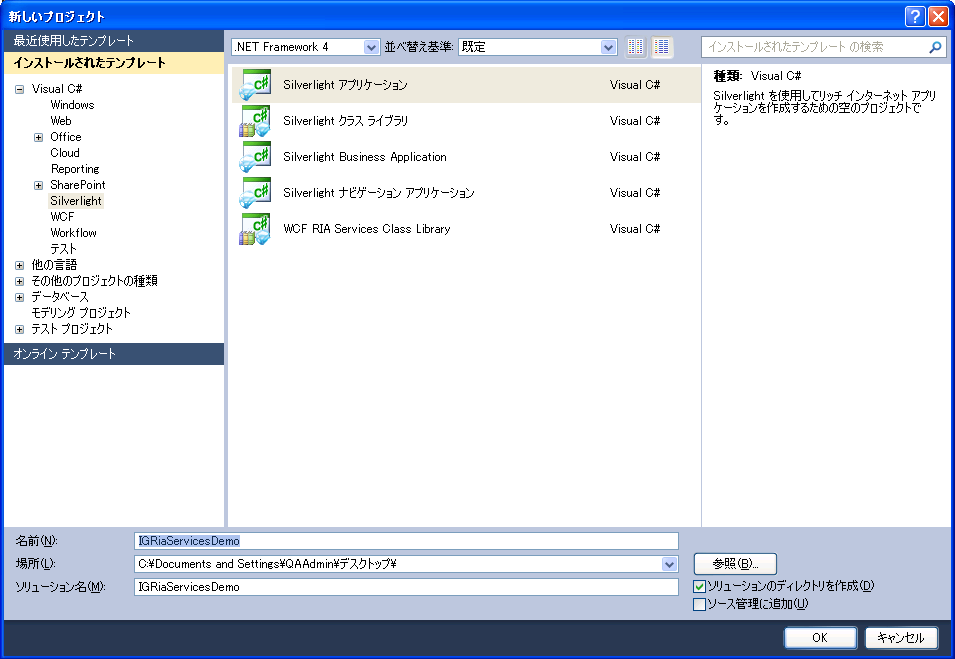
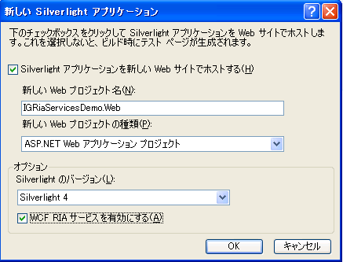
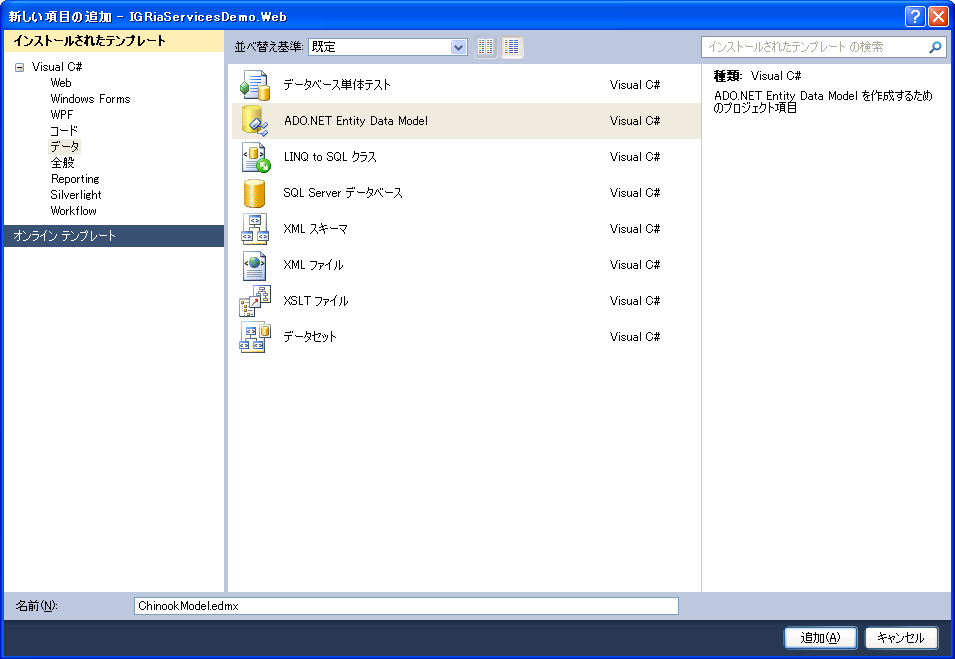
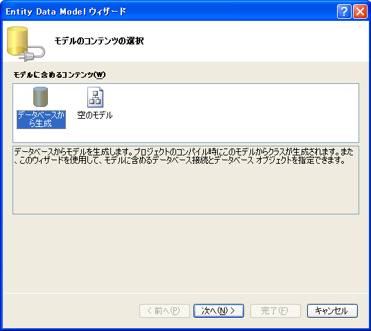
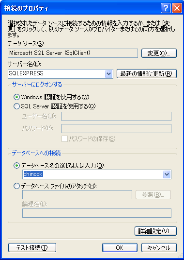
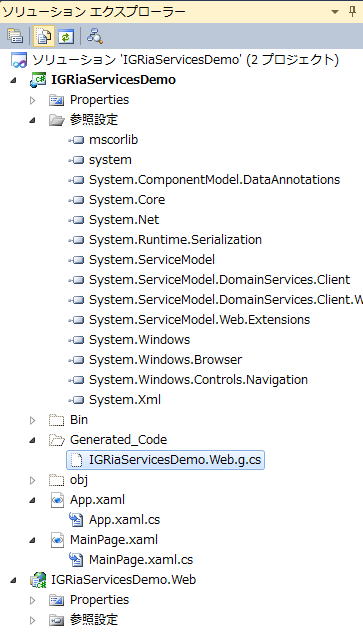
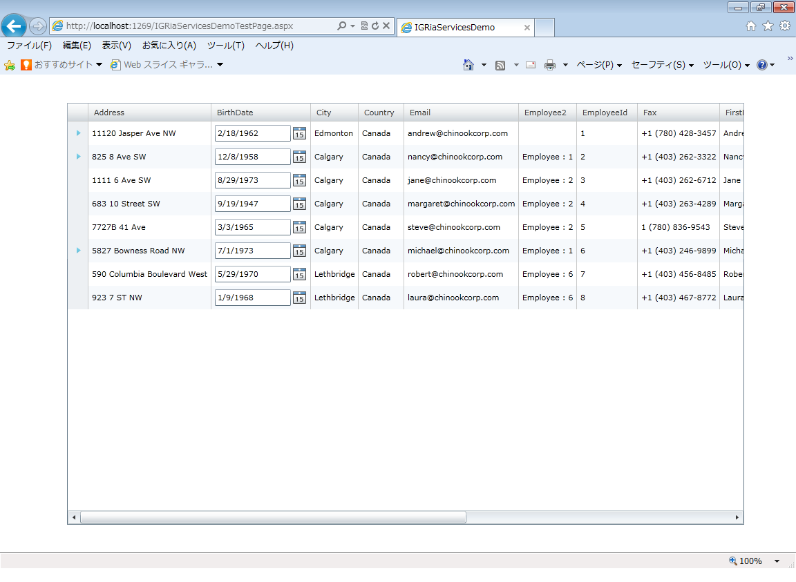

////

|metadata|
{
    "name": "generalprogrammingconcepts-using-wcf-ria-and-xamgrid",
    "controlName": [],
    "tags": ["Data Binding","Data Presentation","How Do I"],
    "guid": "72e52452-d1fc-412a-a119-2e0c20d6fc3f",  
    "buildFlags": ["sl"],
    "createdOn": "2012-02-06T14:16:14.6909709Z"
}
|metadata|
////

= xamGrid で WCF RIA の使用

提供した手順に従えば、 link:http://go.microsoft.com/fwlink/?LinkID=169231[WCF RIA] を使用して xamGrid をデータベースへバインドし、コードを書くことなくデータを取得および視覚化できます。

以下のソフトウェアをインストールする必要があります。

* Microsoft Visual Studio 2010/2012
* link:http://go.microsoft.com/fwlink/?LinkID=229318[Silverlight 5 Tools] (WCF RIA サービスが含まれる)

最初に、Silverlight 5 プロジェクトを作成し、"IGRiaServicesDemo" と名前を付ける必要があります。

WCF RIA サービスのチェックボックスを有効にして [OK] をクリックします。

次に、Chinook データベースからのデータを表す ADO.NET Entity クラスを作成します。これは link:http://chinookdatabase.codeplex.com/releases/view/21111[ここ]からダウンロードできます。[ソリューション エクスプローラー] ウィンドウで、サーバー プロジェクト (IGRiaServicesDemo.Web) を右クリックして [追加] を選択し、次に [新しい項目...] を選択します。[新しい項目の追加] ダイアログボックスが表示します。分類項目リストで、[データ] および [ADO.NET Entity Data Model] を選択します。新しいファイルに "ChinookModel.edmx" と名前を付けます。

以下のスクリーンショットで示すように、データベースから Entity Data Model の生成を確認します。

[データ接続を選択] 画面で、データベースへのデータ接続を作成します。

image::images/ria_07.png[]

[新しい接続] ボタンをクリックし、以下のように構成します。

[OK] でダイアログを閉じ、次の画面の [次へ] を選択します。

[データベース オブジェクトを選択] 画面で、Tables ノードを展開し Customer テーブルと Employee テーブルを選択します。Entity モデルがテーブルに対して作成されます。

image::images/ria_08.png[]

[終了] をクリックし、ソリューションを保存およびビルドします。

ドメイン サービスを中間層プロジェクトに追加します。ドメイン サービスは、サーバー プロジェクトのデータ エンティティおよび操作をクライアント プロジェクトに公開します。ドメイン サービスにビジネス ロジックを追加して、どのようにクライアントをデータと対応させるかを管理できます。

サーバー プロジェクトを右クリックし、[追加] および [新しい項目] を選択します。分類項目のリストで、[Web] そして [ドメイン サービス クラス] テンプレートを選択します。クラスに "ChinookDomainService.cs" と名前を付けて、[追加] をクリックします。

image::images/ria_09.png[]

[カスタマー] および [社員] エンティティを選択し、両方のテーブルで [編集を有効] オプションを確認し、 [OK] ボタンを押します。

image::images/ria_10.png[]

ドメイン サービス クラスが作成されます。保存して、ソリューションを再ビルドする必要があります。

RIA Services リンクはクライアント プロジェクトとサーバー プロジェクト間に存在するので、ソリューションをビルドするとクライアント プロキシ クラスが作成されます。これらのプロキシ クラスによって、クライアントからデータにアクセスできます。

"Generated_Code" という非表示のフォルダーがあり、生成されたコード ファイルが含まれます。"WebContext"、"ChinookDomainContext"、"Employee" および "Customer" などのクラスもあります。

次に、デフォルト コントロールとして Customer および Employee クラスにバインドされている Infragistics xamGrid を設定します。クライアント プロジェクトの XAML ページをダブルクリックすると [データ ソース] ダイアログが表示します。非表示の場合、[データ] メニューから開きます。各テーブルの [データ ソース] ウィンドウで右クリックして、[カスタマイズ] オプションを選択します。

image::images/ria_12.png[]

xamGrid を選択し、デフォルト コントロールとして設定します。

image::images/ria_13.png[]

結果は、ソリューション エクスプローラーの [DataSources] ノードで作成した "ChinookDomainContext" インスタンスで、これで xamGrid は Customer および Employee クラスのデフォルト コントロールになります。

image::images/ria_14.png[]

[データ ソース] ウィンドウから Employee クラスを Silverlight クライアント アプリケーションのレイアウトにドラッグします。

XAML で、この DomainDataSource にバインドされた ItemsSource で DomainDataSource インスタンスと xamGrid オブジェクトが追加されます。

image::images/ria_15.png[]

ここでアプリケーションを保存して実行します。

