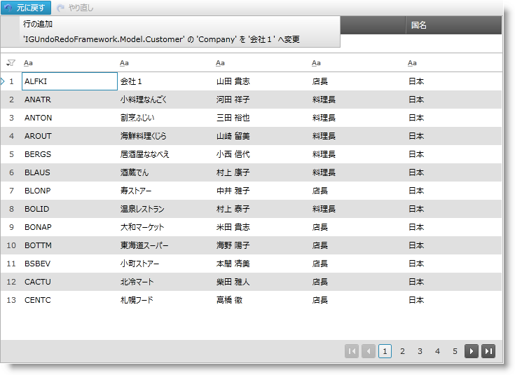

////
|metadata|
{
    "name": "implementing-undo-redo-crud-operations-in-xamgrid-control",
    "controlName": ["IG Undo Redo Framework"],
    "tags": ["Editing","Getting Started","Grids","How Do I"],
    "guid": "93099dbc-60c9-4905-bf09-ca581c0bfc97",
    "buildFlags": [],
    "createdOn": "2016-05-25T18:21:54.2091026Z"
}
|metadata|
////

= xamGrid コントロールで CRUD 操作の元に戻す/やり直しを実装

== トピックの概要

=== 目的

このトピックでは、xamGrid™ コントロールで Infragistics Undo/Redo Framework™ を使用する方法を紹介します。

=== 前提条件

以下の表に、このトピックを理解するための前提条件として求められるトピックをリストします。

[options="header", cols="a,a"]
|====
|トピック|目的

| link:undomanager-properties-and-methods-reference.html[UndoManager プロパティおよびメソッド参照]
|このトピックは、UndoManager クラスの重要なプロパティおよびメソッドをいくつかリストします。

| link:undohistoryitem-properties-and-methods-reference.html[UndoHistoryItem プロパティおよびメソッド参照]
|このトピックは、UndoHistoryItem クラスのプロパティおよびメソッドをリストします。

| link:observablecollectionextendedwithundo-properties-reference.html[ObservableCollectionExtendedWithUndo プロパティ参照]
|このトピックは、ObservableCollectionExtendedWithUndo クラスの重要なプロパティおよびメソッドをいくつかリストします。

|====

=== 本トピックの内容

このトピックには次のセクションがあります。

* <<_implementing, xamGrid コントロールでエンドユーザーによる元に戻す/やり直し操作を実装 >>

** <<_Introduction,概要>>
** <<_Preview,プレビュー>>
** <<_Requirements,要件>>
** <<_Overview,概要>>
** <<_Steps,手順>>

* <<_Examples, コード例 >>

** <<_Product,コード例:  _Product_   クラス>>
** <<_ProductViewModel,コード例:  _ProductViewModel_   クラス>>
** <<_ProductCollection,コード例:  _ProductCollection_   クラス>>
** <<_xamMenu,コード例: xamMenu コントロールで元に戻す/やり直し履歴を表示>>
** <<_xamGrid,コード例: ページに xamGrid コントロールを追加>>
** <<_RowAdding,コード例: xamGrid RowAdding イベントを処理>>

* <<_Related, 関連コンテンツ >>

[[_implementing]]
== xamGrid コントロールでエンドユーザーによる元に戻す/やり直し操作を実装

[[_Introduction]]

=== 概要

Infragistics Undo/Redo Framework はエンドユーザーによる元に戻す/やり直し操作のサポートを提供します。以下の例は、xamGrid コントロールと共にこの機能を実装できる方法を示します。新しい行を追加、セルの編集、行の削除などの一般的な操作を元に戻すことができます。

[[_Preview]]

=== プレビュー

以下のスクリーンショットは最終結果のプレビューです。

[[_Requirements]]

=== 要件

この手順を実行するには、以下が必要です。

* 以下の NuGet パッケージ参照を追加します。

** Infragistics.WPF.Undo
** Infragistics.WPF.Controls.Grids.XamGrid

* 追加された link:resources-data.html[Data.xml] ファイル (アプリケーションで提供される)

NuGet フィードのセットアップと NuGet パッケージの追加の詳細については、link:nuget-feeds.html[NuGet フィード] ドキュメントを参照してください。

[[_Overview]]

=== 概要

このトピックで、xamGrid コントロールでエンドユーザーによる元に戻す/やり直し操作を実装するための手順ごとの説明を提供します。以下はプロセスの概念的概要です。

[start=1]
. <<_dataModel, Product という名前の元に戻す/やり直し操作をサポートするデータ モデルを作成します。 >>
[start=2]
. <<_viewModel, ProductViewModel という名前の元に戻す/やり直し操作をサポートする viewmodel クラスを作成します。 >>
[start=3]
. <<_collection, ProductCollection という名前の ObservableCollectionExtendedWithUndo<T> クラスから派生するコレクション クラスを作成します。 >>
[start=4]
. <<_dataContext, DataContext プロパティを設定します。 >>
[start=5]
. <<_addingMenu, 元に戻す/やり直し履歴項目を表示する xamMenu コントロールを追加して、元に戻す/やり直しコマンドを実行します。 >>
[start=6]
. <<_addingGrid, 行の追加と削除およびセルの編集を可能にする xamGrid コントロールを追加します。 >>
[start=7]
. <<_event, xamGrid コントロールの RowAdding イベントを処理します。 >>

[[_Steps]]

=== 手順

以下の手順は、xamGrid コントロールでエンドユーザーによる元に戻す/やり直し操作を実装する方法を提供します。

[[_dataModel]]
1. Product という名前の元に戻す/やり直し操作をサポートするデータ モデルを作成します。

`Product` データ モデルは、`INotifyPropertyChanged` を実装する `ObservableModel` クラスを継承します。

プロパティの変更ごとに、`UndoUnit` インスタンスが作成されます。

詳細については、<<_Product,コード例:  _Product_   クラス>>を参照してください。

[[_viewModel]]
[start=2]
2. ProductViewModel という名前の元に戻す/やり直し操作をサポートする viewmodel クラスを作成します。

このクラスで、XML データは読み込まれ、`ObservableCollectionExtendedWithUndo` クラスから派生する `ProductCollection` に保存されます。

詳細については、<<_ProductViewModel,コード例:  _ProductViewModel_   クラス>>を参照してください。

[[_collection]]
[start=3]
3. ProductCollection という名前の ObservableCollectionExtendedWithUndo クラスから派生するコレクション クラスを作成します。

このクラスでは、`InsertItem` および `RemoveItem` メソッドがオーバーライドされ、コレクションは `UndoManager` インスタンスに関連付けられます。

詳細については、<<_ProductCollection,コード例:  _ProductCollection_   クラス>>を参照してください。

[[_dataContext]]
[start=4]
4. DataContext プロパティを設定します。

`ProductViewModel` をインスタンス化して、`DataContext` プロパティに設定します。

*C# の場合:*

[source,csharp]
----
this.DataContext = new ProductViewModel();
----

*Visual Basic の場合:*

[source,vb]
----
Me.DataContext = New ProductViewModel()
----

[[_addingMenu]]
[start=5]
5. 元に戻す/やり直し履歴項目を表示する xamMenu コントロールを追加して、元に戻す/やり直しコマンドを実行します。

履歴項目を表示する xamMenu コントロールを追加して、元に戻す/やり直しコマンドを使用します。

詳細については、<<_xamMenu,コード例: xamMenu コントロールで元に戻す/やり直し履歴を表示>>を参照してください。

[[_addingGrid]]
[start=6]
6. 行の追加と削除およびセルの編集を可能にする xamGrid コントロールを追加します。

新しい行の追加、編集および削除機能を有効にして xamGrid コントロールを追加します。

詳細については、<<_xamGrid,コード例: ページに xamGrid コントロールを追加>>を参照してください。

[[_event]]
[start=7]
7. xamGrid コントロールの RowAdding イベントを処理します。

RowAdding イベント ハンドラーで、複数の操作がトランザクションを使用する 1 つの操作に結合されます。このように、ユーザーは新しい行の追加を 1 つの操作として元に戻す/やり直すことができます。

詳細については、<<_RowAdding,コード例: xamGrid RowAdding イベントを処理>>を参照してください。

[[_Examples]]
== コード例

=== 概要

以下の表には、このトピックのコード例が示されています。

[options="header", cols="a,a"]
|====
|例|説明

|<<_Product,コード例: _Product_ クラス>>
|プロパティの変更の元に戻す/やり直しをサポートするデータ モデル クラス。

|<<_ProductViewModel,コード例: _ProductViewModel_ クラス>>
|コレクションでの変更の記録をサポートする `Viewmodel` クラス。

|<<_ProductCollection,コード例: _ProductCollection_ クラス>>
|`ObservableCollectionExtendedWithUndo` クラスからの派生クラス。

|<<_xamMenu,コード例: xamMenu コントロールで元に戻す/やり直し履歴を表示>>
|元に戻す/やり直し機能が実装された xamMenu コントロールを追加するための XAML コード。

|<<_xamGrid,コード例: ページに xamGrid コントロールを追加>>
|xamGrid コントロールを追加するための XAML コード。

|<<_RowAdding,コード例: xamGrid RowAdding イベントを処理>>
|`RowAdding` イベントを処理します。

|====

[[_Product]]
== コード例:  _Product_   クラス

=== 説明

プロパティの変更の元に戻す/やり直しをサポートするデータ モデル クラス。

=== コード

*C# の場合:*

[source,csharp]
----
public class Product : ObservableModel
{
    private object _owner;
    internal object Owner
    {
        get { return _owner; }
        set { _owner = value; }
    }
    private int _productID;
    public int ProductID
    {
        get { return _productID; }
        set { this.SetField(ref _productID, value, "ProductID"); }
    }
    private string _productName;
    public string ProductName
    {
        get { return _productName; }
        set { this.SetField(ref _productName, value, "ProductName"); }     
    }
    private decimal _unitPrice;
    public decimal UnitPrice
    {
        get { return _unitPrice; }
        set { this.SetField(ref _unitPrice, value, "UnitPrice"); }
    }
    private int _unitsInStock;
    public int UnitsInStock
    {
        get { return _unitsInStock; }
        set { this.SetField(ref _unitsInStock, value, "UnitsInStock"); }
    }
    private int _unitsOnOrder;
    public int UnitsOnOrder
    {
        get { return _unitsOnOrder; }
        set { this.SetField(ref _unitsOnOrder, value, "UnitsOnOrder"); }
    }
    protected bool SetField<T>(ref T member, T newValue, string propertyName)
    {
        if (EqualityComparer<T>.Default.Equals(member, newValue))
            return false;
        if (_owner != null)
            UndoManager.FromReference(_owner).AddPropertyChange(this, propertyName, member, newValue);
        member = newValue;
        this.NotifyPropertyChanged(propertyName);
        return true;
    }
} 
public class ObservableModel : INotifyPropertyChanged
{
    public event PropertyChangedEventHandler PropertyChanged;
    protected void NotifyPropertyChanged(String info)
    {
        if (PropertyChanged != null)
        {
            PropertyChanged(this, new PropertyChangedEventArgs(info));
        }
    }
}
----

*Visual Basic の場合:*

[source,vb]
----
Public Class Product
    Inherits ObservableModel
    Private _owner As Object
    Friend Property Owner() As Object
        Get
            Return _owner
        End Get
        Set(value As Object)
            _owner = value
        End Set
    End Property
    Private _productID As Integer
    Public Property ProductID() As Integer
        Get
            Return _productID
        End Get
        Set(value As Integer)
            Me.SetField(_productID, value, "ProductID")
        End Set
    End Property
    Private _productName As String
    Public Property ProductName() As String
        Get
            Return _productName
        End Get
        Set(value As String)
            Me.SetField(_productName, value, "ProductName")
        End Set
    End Property
    Private _unitPrice As Decimal
    Public Property UnitPrice() As Decimal
        Get
            Return _unitPrice
        End Get
        Set(value As Decimal)
            Me.SetField(_unitPrice, value, "UnitPrice")
        End Set
    End Property
    Private _unitsInStock As Integer
    Public Property UnitsInStock() As Integer
        Get
            Return _unitsInStock
        End Get
        Set(value As Integer)
            Me.SetField(_unitsInStock, value, "UnitsInStock")
        End Set
    End Property
    Private _unitsOnOrder As Integer
    Public Property UnitsOnOrder() As Integer
        Get
            Return _unitsOnOrder
        End Get
        Set(value As Integer)
            Me.SetField(_unitsOnOrder, value, "UnitsOnOrder")
        End Set
    End Property
    Protected Function SetField(Of T)(ByRef member As T, newValue As T, propertyName As String) As Boolean
        If EqualityComparer(Of T).[Default].Equals(member, newValue) Then
            Return False
        End If
        If _owner IsNot Nothing Then
            UndoManager.FromReference(_owner).AddPropertyChange(Me, propertyName, member, newValue)
        End If
        member = newValue
        Me.NotifyPropertyChanged(propertyName)
        Return True
    End Function
End Class
Public Class ObservableModel
    Implements INotifyPropertyChanged
    Public Event PropertyChanged(ByVal sender As Object, ByVal e As PropertyChangedEventArgs) Implements INotifyPropertyChanged.PropertyChanged
    Protected Overridable Sub NotifyPropertyChanged(ByVal propertyName As String)
        RaiseEvent PropertyChanged(Me, New PropertyChangedEventArgs(propertyName))
    End Sub
End Class
----

[[_ProductViewModel]]
== コード例:  _ProductViewModel_   クラス

=== 説明

コレクションでの変更の記録をサポートする Viewmodel クラス。

=== コード

*C# の場合:*

[source,csharp]
----
public class ProductViewModel : ObservableModel
{
    private ProductCollection _products;
    private UndoManager _undoManager;
    public UndoManager UndoManager
    {
        get { return _undoManager; }
    }
    private CollectionViewSource _viewSource;
    public ICollectionView Products
    {
        get { return _viewSource.View; }
    }
    public ProductViewModel()
    {
        _undoManager = new UndoManager();
        _undoManager.RegisterReference(this);
        _products = new ProductCollection(_undoManager);      
        // データを読み込み中に履歴で UndoUnits の記録を中断します
        UndoManager.Suspend();
        try
        {
            this.LoadXMLData();
        }
        finally
        {
            // 履歴で記録を再開します
            UndoManager.Resume();
        }
        _viewSource = new CollectionViewSource();
        _viewSource.Source = _products;
        this.Products.MoveCurrentToFirst();
    }
    private void LoadXMLData()
    {
        XDocument doc = XDocument.Load("Data.xml");
        var data = (from d in doc.Descendants("Product")
                    select new Product
                    {
                        ProductID = this.GetInt(d.Element("ProductID").Value),
                        ProductName = d.Element("ProductName").Value,
                        UnitPrice = this.GetDecimal(d.Element("UnitPrice").Value),
                        UnitsInStock = this.GetInt(d.Element("UnitsInStock").Value),
                        UnitsOnOrder = this.GetInt(d.Element("UnitsOnOrder").Value)
                    });
        foreach (var productItem in data)
        {
            _products.Add(productItem);
        }
    }    
    private int GetInt(string element)
    {
        int value = 0;
        if (element != null)
            int.TryParse(element, out value);
        return value;
    }
    private decimal GetDecimal(string element)
    {
        decimal value = 0m;
        if (element != null)
            decimal.TryParse(element, out value);
        return value;
    }
}
----

*Visual Basic の場合:*

[source,vb]
----
Public Class ProductViewModel
    Inherits ObservableModel
    Private _products As ProductCollection
    Private _undoManager As UndoManager
    Public ReadOnly Property UndoManager() As UndoManager
        Get
            Return _undoManager
        End Get
    End Property
    Private _viewSource As CollectionViewSource
    Public ReadOnly Property Products() As ICollectionView
        Get
            Return _viewSource.View
        End Get
    End Property
    Public Sub New()
        _undoManager = New UndoManager()
        _undoManager.RegisterReference(Me)
        _products = New ProductCollection(_undoManager)
        UndoManager.Suspend()
        Try
            Me.LoadXMLData()
        Finally
            UndoManager.[Resume]()
        End Try
        _viewSource = New CollectionViewSource()
        _viewSource.Source = _products
        Me.Products.MoveCurrentToFirst()
    End Sub
    Private Sub LoadXMLData()
        Dim doc As XDocument = XDocument.Load("Data.xml")
        Dim data = (From d In doc.Descendants("Product")
                    Select New Product With
                    {
                        .ProductID = Me.GetInt(d.Element("ProductID").Value),
                        .ProductName = d.Element("ProductName").Value,
                        .UnitPrice = Me.GetDecimal(d.Element("UnitPrice").Value),
                        .UnitsInStock = Me.GetInt(d.Element("UnitsInStock").Value),
                        .UnitsOnOrder = Me.GetInt(d.Element("UnitsOnOrder").Value)
                    })
        For Each productItem In data
            _products.Add(productItem)
        Next
    End Sub
    Private Function GetInt(element As String) As Integer
        Dim value As Integer = 0
        If element IsNot Nothing Then
            Integer.TryParse(element, value)
        End If
        Return value
    End Function
    Private Function GetDecimal(element As String) As Decimal
        Dim value As Decimal = 0D
        If element IsNot Nothing Then
            Decimal.TryParse(element, value)
        End If
        Return value
    End Function
End Class
----

[[_ProductCollection]]
== 例:  _ProductCollection_   クラス

=== 説明

Undo/Redo Framework ObservableCollectionExtendedWithUndo クラスからの派生クラス

=== コード

*C# の場合:*

[source,csharp]
----
public class ProductCollection : ObservableCollectionExtendedWithUndo<Product>
{
    public ProductCollection(UndoManager undoManager)
        : base(undoManager)
    {
        undoManager.RegisterReference(this);
    }
    protected override void InsertItem(int index, Product item)
    {
        item.Owner = this;
        base.InsertItem(index, item);
    }
    protected override void RemoveItem(int index)
    {
        Product item = this[index];
        item.Owner = null;
        base.RemoveItem(index);
    }
}
----

*Visual Basic の場合:*

[source,vb]
----
Public Class ProductCollection
    Inherits ObservableCollectionExtendedWithUndo(Of Product)
    Public Sub New(undoManager As UndoManager)
        MyBase.New(undoManager)
        undoManager.RegisterReference(Me)
    End Sub
    Protected Overrides Sub InsertItem(index As Integer, item As Product)
        item.Owner = Me
        MyBase.InsertItem(index, item)
    End Sub
    Protected Overrides Sub RemoveItem(index As Integer)
        Dim item As Product = Me(index)
        item.Owner = Nothing
        MyBase.RemoveItem(index)
    End Sub
End Class
----

[[_xamMenu]]
== コード例: xamMenu コントロールで元に戻す/やり直し履歴を表示

=== 説明

元に戻す/やり直し機能が実装された xamMenu コントロールを追加するための XAML コード。

xamMenu 項目は元に戻すことができる履歴項目を表します。

=== コード

*XAML の場合:*

[source,xaml]
----
Code
<ig:XamMenu Grid.Row="0">
  <ig:XamMenu.Resources>
    <DataTemplate x:Key="historyItemTemplate">
      <TextBlock Text="{Binding LongDescription}" />
    </DataTemplate>
    <DataTemplate x:Key="undoRedoMenuItem">
      <ig:XamMenuItem>
        <ig:Commanding.Command>
          <ig:UndoManagerCommandSource CommandType="UndoRedoHistoryItem" 
                                       ParameterBinding="{Binding}" 
                                       EventName="Click" />
        </ig:Commanding.Command>
      </ig:XamMenuItem>
    </DataTemplate>
  </ig:XamMenu.Resources>
  <ig:XamMenuItem Header="Undo"
                  IsEnabled="{Binding UndoManager.CanUndo}"
                  ItemsSource="{Binding UndoManager.UndoHistory}"
                  DefaultItemsContainer="{StaticResource undoRedoMenuItem}"
                  ItemTemplate="{StaticResource historyItemTemplate}">
    <ig:Commanding.Command>
      <ig:UndoManagerCommandSource EventName="SubmenuOpened" 
                                   CommandType="PreventMerge" 
                                   ParameterBinding="{Binding UndoManager}" />
    </ig:Commanding.Command>
  </ig:XamMenuItem>
  <ig:XamMenuItem Header="Redo" 
                  IsEnabled="{Binding UndoManager.CanRedo}"
                  ItemsSource="{Binding UndoManager.RedoHistory}"
                  DefaultItemsContainer="{StaticResource undoRedoMenuItem}"
                  ItemTemplate="{StaticResource historyItemTemplate}" />
</ig:XamMenu>
----

[[_xamGrid]]
== コード例: ページに xamGrid コントロールを追加

=== 説明

以下のコードは、新しい行の追加、セルの編集、行の削除など、CRUD 操作を可能にする xamGrid コントロールの追加について説明します。

xamGrid コントロール `Item``s``Source` プロパティは、元に戻す/やり直しに対して有効に設定された `ICollectionView` データ コレクションを含む、`ProductViewModel Products` メンバーにバインドされます。

Delete キーを押したときにすべての選択行を削除するために、xamGrid `DeleteKeyAction` プロパティを `DeleteSelectedRows` に設定します。

新しい行の追加、セルの編集、複数行の選択、行の削除およびページングなどの、データを操作するために必要とされるすべての主要な機能は有効になっています。

データでの操作 (作成、編集および削除) は、Undo/Redo Framework で元に戻すことができます。

=== コード

*XAML の場合:*

[source,xaml]
----
<ig:XamGrid x:Name="dataGrid" Grid.Row="1"
            AutoGenerateColumns="True"
            ItemsSource="{Binding Products}"
            DeleteKeyAction="DeleteSelectedRows"
            RowAdding="dataGrid_RowAdding"
            ColumnWidth="*">
  <!-- 新しい行の追加を有効にします -->
  <ig:XamGrid.AddNewRowSettings>
    <ig:AddNewRowSettings AllowAddNewRow="Top" />
  </ig:XamGrid.AddNewRowSettings>
  <!-- セルの編集をダブルクリックで有効にします -->
  <ig:XamGrid.EditingSettings>
    <ig:EditingSettings AllowEditing="Cell" 
                        IsMouseActionEditingEnabled="DoubleClick" />
  </ig:XamGrid.EditingSettings>
  <!-- 行セレクターを追加します -->
  <ig:XamGrid.RowSelectorSettings>
    <ig:RowSelectorSettings Visibility="Visible" />
  </ig:XamGrid.RowSelectorSettings>
  <!-- 複数行選択を有効にします -->
  <ig:XamGrid.SelectionSettings>
    <ig:SelectionSettings RowSelection="Multiple" />
  </ig:XamGrid.SelectionSettings>
  <!-- ページャーを追加します -->
  <ig:XamGrid.PagerSettings>
    <ig:PagerSettings AllowPaging="Bottom" PageSize="10" /> 
  </ig:XamGrid.PagerSettings>
</ig:XamGrid>
----

[[_RowAdding]]
== コード例: xamGrid RowAdding イベントを処理

=== 説明

行を xamGrid に追加することは、いくつかのエンドユーザーのアクションを伴います (たとえば -  _Add new_   行のセルに値を入力)。元に戻すことができる 1 つのアクションにするために、トランザクションとこれらのアクションを合体する必要があります。

=== コード

*C# の場合:*

[source,csharp]
----
private void dataGrid_RowAdding(object sender, Infragistics.Controls.Grids.CancellableRowAddingEventArgs e)
{
    string description = "";
    string detailedDescription = "Add New Row";
    // いくつかの undo 単位を 1 つの項目にグループ化します
    UndoTransaction transaction = this._undoManager.StartTransaction(description, detailedDescription);
    new DispatcherSynchronizationContext().Post(new SendOrPostCallback(CommitTransaction), transaction);
}
private void CommitTransaction(object obj)
{
    if (obj != null)
    { 
        UndoTransaction transaction = obj as UndoTransaction;
        if (!transaction.IsClosed)
        { 
            transaction.Commit();
        }
    }
}
private UndoManager _undoManager
{
    get { return ((ProductViewModel)this.DataContext).UndoManager; }
}
----

*Visual Basic の場合:*

[source,vb]
----
Private Sub dataGrid_RowAdding(sender As Object, e As Infragistics.Controls.Grids.CancellableRowAddingEventArgs)
    Dim description As String = ""
    Dim detailedDescription As String = "Add New Row"
    ' いくつかの undo 単位を 1 つの項目にグループ化します
    Dim transaction As UndoTransaction = Me._undoManager.StartTransaction(description, detailedDescription)
    Dim sendOrPostCallback As New SendOrPostCallback(AddressOf CommitTransaction)
    Dim dispatcher As New DispatcherSynchronizationContext()
    dispatcher.Post(sendOrPostCallback, transaction)
End Sub
Private Sub CommitTransaction(obj As Object)
    If obj IsNot Nothing Then
        Dim transaction As UndoTransaction = TryCast(obj, UndoTransaction)
        If Not transaction.IsClosed Then
            transaction.Commit()
        End If
    End If
End Sub
Private ReadOnly Property _undoManager() As UndoManager
    Get
        Return DirectCast(Me.DataContext, ProductViewModel).UndoManager
    End Get
End Property
----

[[_Related]]
== 関連コンテンツ

以下のトピックでは、このトピックに関連する情報を提供しています。

[options="header", cols="a,a"]
|====
|トピック|目的

| link:methods-and-properties-reference.html[Undo/Redo Framework メソッドおよびプロパティ参照]
|このトピックは、Infragistics Undo/Redo Framework™ で使用可能な主要なクラス、プロパティおよびメソッドの概要を提供します。

|====