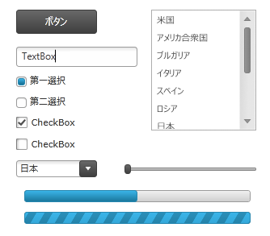
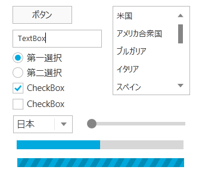
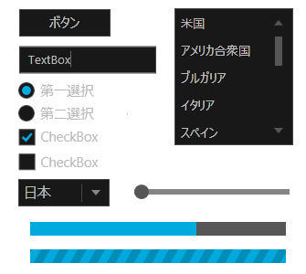
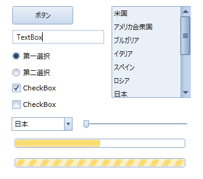
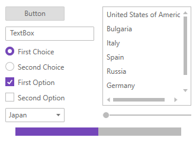

////

|metadata|
{
    "name": "ms-controls-implicit-themes",
    "controlName": [],
    "tags": ["How Do I","Styling","Summaries","Templating","Theming"],
    "guid": "1edce14d-b754-4890-b6c7-033a0c96b177",  
    "buildFlags": ["sl","wpf"],
    "createdOn": "2013-09-20T08:45:29.7971324Z"
}
|metadata|
////

= MS コントロールの暗黙のテーマ

== トピックの概要

=== 目的

このトピックは、Microsoft コントロールの暗黙のテーマについて説明します。

=== 前提条件

このトピックを理解するためには、以下のトピックを理解しておく必要があります。

[options="header", cols="a,a"]
|====
|トピック|目的

| link:designers-guide-what-is-a-theme.html[テーマとは]
|このトピックは、テーマの概要について説明します。

|====

=== このトピックの内容

このトピックは、以下のセクションで構成されます。

* <<_Ref357524354,はじめに>>
* <<_Ref357524361,IG テーマ>>
* <<_Ref357524367,Metro テーマ>>
* <<_Ref357524373,Metro Dark テーマ>>
* <<_Ref357524378,Office 2010 Blue テーマ>>

ifdef::wpf[]
* <<_Ref357524379,Office 2013 テーマ>>

endif::wpf[]

ifdef::wpf[]
* <<_Ref357524380,Royal Dark テーマ>>
* <<_Ref357524381,Royal Light テーマ>>

endif::wpf[]

* <<_Ref357524391,関連コンテンツ>>

[[_Ref357524354]]
== はじめに

=== 概要

すべての {ProductName} コントロールに提供されているテーマに加え、Infragistics では一部の Microsoft コントロールの暗黙のテーマをサポートしています。これらのテーマを使用すると、Infragistics と Microsoft の両方のコントロールを同じアプリケーションで使用する場合に、アプリケーションのスタイルに統一性を持たせることができます。テーマの定義は、テーマを実装するためにプロジェクトに含む必要がある複数のファイル間で伝搬されます。含める必要があるファイルは、使用する Microsoft コントロールに依存します。たとえば、主要な Microsoft コントロールとツールキット コントロールには、独自のファイルで定義された Infragistics のテーマがあります。

[[_Ref357524361]]
== IG テーマ

以下のスクリーンショットは、IG テーマを使用する複数の Microsoft コントロールを示します。

=== リソース ディクショナリ

このテーマを使用する場合は、以下のリソース ディクショナリをプロジェクトに含める必要があります。

*  *IG.MSControls.Core.Implicit.xaml*  (`http://schemas.microsoft.com/winfx/2006/xaml/presentation` XML 名前空間のコントロール用)
*  *IG.MSControls.Toolkit.Implicit.xaml*  (`http://schemas.microsoft.com/winfx/2006/xaml/presentation/toolkit` XML 名前空間のコントロール用)
*  *Styles.Shared.xaml* 
*  *Styles.WPF.xaml* 
*  *Theme.Colors.xaml* 

=== コード例

以下のコード スニペットは、テーマを使用するためにリソース ディクショナリを含める方法を示します。

*XAML の場合:*

[source,xaml]
----
<Grid x:Name="LayoutRoot">
  <Grid.Resources>
    <ResourceDictionary>
      <ResourceDictionary.MergedDictionaries>
        <ResourceDictionary Source="IG.MSControls.Core.Implicit.xaml" />
        <ResourceDictionary Source="IG.MSControls.Toolkit.Implicit.xaml" />
      </ResourceDictionary.MergedDictionaries>
    </ResourceDictionary>
  </Grid.Resources>
  <!-- Put controls here -->
</Grid>
----

[[_Ref357524367]]
== Metro テーマ

=== 概要

以下のスクリーンショットは、Metro テーマを使用する複数の Microsoft コントロールを示します。

=== プロパティ設定

このテーマを使用する場合は、以下のリソース ディクショナリをプロジェクトに含める必要があります。

*  *Metro.MSControls.Core.Implicit.xaml*  (`http://schemas.microsoft.com/winfx/2006/xaml/presentation` XML 名前空間のコントロール用)
*  *Metro.MSControls.Toolkit.Implicit.xaml*  (`http://schemas.microsoft.com/winfx/2006/xaml/presentation/toolkit` XML 名前空間のコントロール用)
*  *Styles.Shared.xaml* 
*  *Styles.WPF.xaml* 
*  *Theme.Colors.xaml* 

=== コード例

以下のコード スニペットは、テーマを使用するためにリソース ディクショナリを含める方法を示します。

*XAML の場合:*

----
<Grid x:Name="LayoutRoot">
  <Grid.Resources>
    <ResourceDictionary>
      <ResourceDictionary.MergedDictionaries>
        <ResourceDictionary Source="Metro.MSControls.Core.Implicit.xaml" />
        <ResourceDictionary Source="Metro.MSControls.Toolkit.Implicit.xaml" />
      </ResourceDictionary.MergedDictionaries>
    </ResourceDictionary>
  </Grid.Resources>
  <!-- Put controls here -->
</Grid>
----

[[_Ref357524373]]
== Metro Dark テーマ

=== 概要

以下のスクリーンショットは、Metro Dark テーマを使用する複数の Microsoft コントロールを示します。

=== プロパティ設定

このテーマを使用する場合は、以下のリソース ディクショナリをプロジェクトに含める必要があります。

*  *MetroDark.MSControls.Core.Implicit.xaml*  (`http://schemas.microsoft.com/winfx/2006/xaml/presentation` XML 名前空間のコントロール用)
*  *MetroDark.MSControls.Toolkit.Implicit.xaml*  (`http://schemas.microsoft.com/winfx/2006/xaml/presentation/toolkit` XML 名前空間のコントロール用)
*  *Styles.Shared.xaml* 
*  *Styles.WPF.xaml* 
*  *Theme.Colors.xaml* 

=== コード例

以下のコード スニペットは、テーマを使用するためにリソース ディクショナリを含める方法を示します。

*XAML の場合:*

----
<Grid x:Name="LayoutRoot">
  <Grid.Resources>
    <ResourceDictionary>
      <ResourceDictionary.MergedDictionaries>
        <ResourceDictionary Source="MetroDark.MSControls.Core.Implicit.xaml" />
        <ResourceDictionary Source="MetroDark.MSControls.Toolkit.Implicit.xaml" />
      </ResourceDictionary.MergedDictionaries>
    </ResourceDictionary>
  </Grid.Resources>
  <!-- Put controls here -->
</Grid>
----

[[_Ref357524378]]
== Office 2010 Blue テーマ

=== 概要

以下のスクリーンショットは、Office 2010 Blue テーマを使用する複数の Microsoft コントロールを示します。

=== リソース ディクショナリ

このテーマを使用する場合は、以下のリソース ディクショナリをプロジェクトに含める必要があります。

*  *Office2010Blue.MSControls.Core.Implicit.xaml*  (`http://schemas.microsoft.com/winfx/2006/xaml/presentation` XML 名前空間のコントロール用)
*  *Office2010Blue.MSControls.Toolkit.Implicit.xaml*  (`http://schemas.microsoft.com/winfx/2006/xaml/presentation/toolkit` XML 名前空間のコントロール用)
*  *Styles.Shared.xaml* 
*  *Styles.WPF.xaml* 
*  *Theme.Colors.xaml* 

=== コード例

以下のコード スニペットは、テーマを使用するためにリソース ディクショナリを含める方法を示します。

*XAML の場合:*

----
<Grid x:Name="LayoutRoot">
  <Grid.Resources>
    <ResourceDictionary>
      <ResourceDictionary.MergedDictionaries>
        <ResourceDictionary Source="Office2010Blue.MSControls.Core.Implicit.xaml" />
        <ResourceDictionary Source="Office2010Blue.MSControls.Toolkit.Implicit.xaml" />
      </ResourceDictionary.MergedDictionaries>
    </ResourceDictionary>
  </Grid.Resources>
  <!-- Put controls here -->
</Grid>
----

[[_Ref357524379]]
== Office 2013 テーマ

=== 概要

以下のスクリーンショットは、Office 2013 テーマを使用する複数の Microsoft コントロールを示します。

image::images/MS_Controls_Implicit_Themes_5.png[]

=== リソース ディクショナリ

このテーマを使用する場合は、以下のリソース ディクショナリをプロジェクトに含める必要があります。

*  *Office2013.MSControls.Core.Implicit.xaml*  (`http://schemas.microsoft.com/winfx/2006/xaml/presentation` XML 名前空間のコントロール用)
*  *Office2013.MSControls.Toolkit.Implicit.xaml*  (`http://schemas.microsoft.com/winfx/2006/xaml/presentation/toolkit` XML 名前空間のコントロール用)
*  *Styles.Shared.xaml* 
*  *Styles.WPF.xaml* 
*  *Theme.Colors.xaml* 

=== コード例

以下のコード スニペットは、テーマを使用するためにリソース ディクショナリを含める方法を示します。

*XAML の場合:*

[source,xaml]
----
<Grid x:Name="LayoutRoot">
  <Grid.Resources>
  <ResourceDictionary>
  <ResourceDictionary.MergedDictionaries>
  <ResourceDictionary Source="Office2013.MSControls.Core.Implicit.xaml" />
  <ResourceDictionary Source="Office2013.MSControls.Toolkit.Implicit.xaml" />
  </ResourceDictionary.MergedDictionaries>
    </ResourceDictionary>
  </Grid.Resources>
  <!-- ここにコントロールを追加します -->
</Grid>
----

[[_Ref357524380]]
== Royal Dark テーマ

=== 概要

以下のスクリーンショットは、Royal Dark テーマを使用する複数の Microsoft コントロールを示します。

image::images/MS_Controls_Implicit_Themes_6.png[]

=== リソース ディクショナリ

このテーマを使用する場合は、以下のリソース ディクショナリをプロジェクトに含める必要があります。

*  *RoyalDark.MSControls.Core.Implicit.xaml*  (`http://schemas.microsoft.com/winfx/2006/xaml/presentation` XML 名前空間のコントロール用)
*  *RoyalDark.MSControls.Toolkit.Implicit.xaml*  (`http://schemas.microsoft.com/winfx/2006/xaml/presentation/toolkit` XML 名前空間のコントロール用)
*  *Styles.Shared.xaml* 
*  *Styles.WPF.xaml* 
*  *Theme.Colors.xaml* 

=== コード例

以下のコード スニペットは、テーマを使用するためにリソース ディクショナリを含める方法を示します。

*XAML の場合:*

[source,xaml]
----
<Grid x:Name="LayoutRoot">
  <Grid.Resources>
    <ResourceDictionary>
      <ResourceDictionary.MergedDictionaries>
        <ResourceDictionary Source="RoyalDark.MSControls.Core.Implicit.xaml" />
        <ResourceDictionary Source="RoyalDark.MSControls.Toolkit.Implicit.xaml" />
  </ResourceDictionary.MergedDictionaries>
  </ResourceDictionary>
  </Grid.Resources>
  <!-- ここにコントロールを追加します -->
  </Grid>
----

[[_Ref357524381]]
== Royal Light テーマ

=== 概要

以下のスクリーンショットは、Royal Light テーマを使用する複数の Microsoft コントロールを示します。

=== リソース ディクショナリ

このテーマを使用する場合は、以下のリソース ディクショナリをプロジェクトに含める必要があります。

* *RoyalLight.MSControls.Core.Implicit.xaml* - 以下の XML 名前空間のコントロール用
+
----
http://schemas.microsoft.com/winfx/2006/xaml/presentation
----
* *RoyalLight.MSControls.Toolkit.Implicit.xaml* - 以下の XML 名前空間のコントロール用
+
----
http://schemas.microsoft.com/winfx/2006/xaml/presentation/toolkit
----
* *Styles.Shared.xaml* 
* *Styles.WPF.xaml* 
* *Theme.Colors.xaml* 

=== コード例

以下のコード スニペットは、テーマを使用するためにリソース ディクショナリを含める方法を示します。

XAML の場合:

[source,xaml]
----
<Grid x:Name="LayoutRoot">
  <Grid.Resources>
    <ResourceDictionary>
      <ResourceDictionary.MergedDictionaries>
        <ResourceDictionary Source="RoyalLight.MSControls.Core.Implicit.xaml" />
        <ResourceDictionary Source="RoyalLight.MSControls.Toolkit.Implicit.xaml" />
      </ResourceDictionary.MergedDictionaries>
    </ResourceDictionary>
  </Grid.Resources>
  <!-- Put controls here -->
</Grid>
----

[[_Ref357524391]]
== 関連コンテンツ

=== トピック

このトピックの追加情報については、以下のトピックも合わせてご参照ください。

[options="header", cols="a,a"]
|====
|トピック|目的

| link:designers-guide-using-themes.html[テーマの使用]
|このトピックはテーマを適用する方法について説明します。

| link:designersguide-location-of-generic-xaml-file.html[Generic.xaml ファイルの場所]
|このトピックではデフォルト テーマの現在の場所をリストしています。

|====

=== リソース

以下の資料は、このトピックに関連する情報を提供します。

[options="header", cols="a,a"]
|====
|タイトル|目的

| link:http://www.infragistics.com/community/blogs/blagunas/archive/2013/05/25/free-metro-light-and-dark-themes-for-wpf-and-silverlight-microsoft-controls.aspx[WPF および Silverlight Microsoft コントロール用の FREE Metro Light および Dark テーマ]
|Metro Light および Metro Dark テーマの説明が掲載されたブログです。

|====