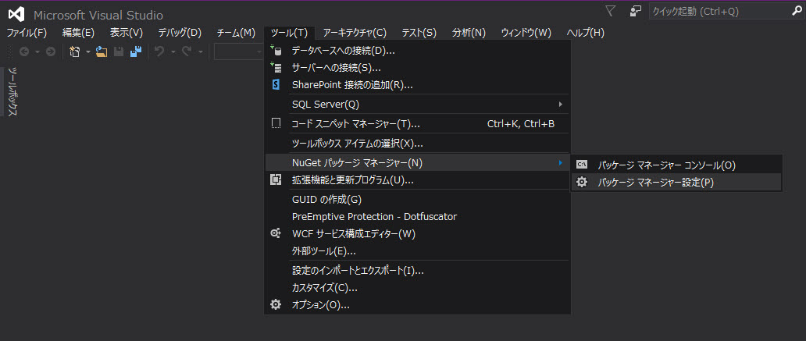
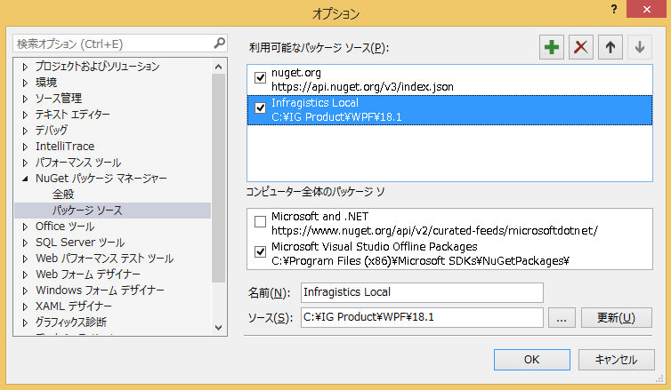
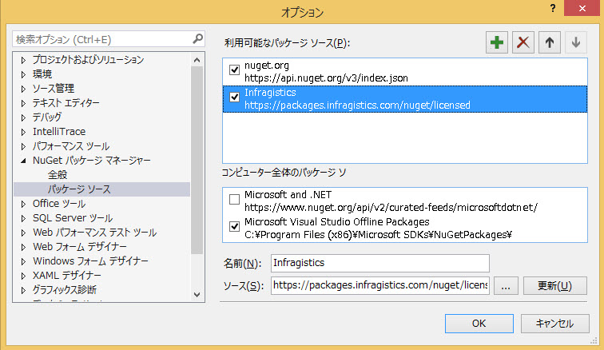
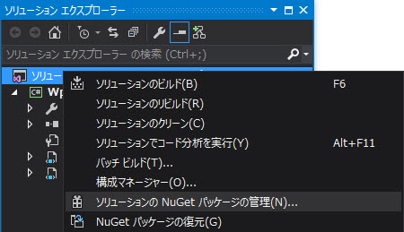
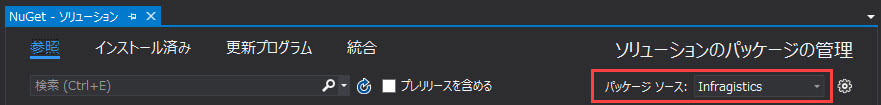
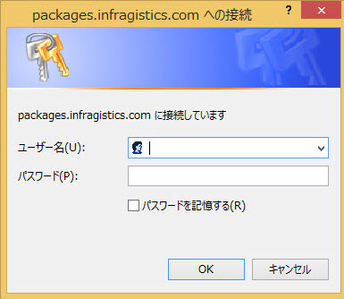

= Infragistics NuGet パッケージ ソース

NuGet はツールおよびサービスを提供するパッケージ マネージャーです。2010 年に .NET などの Microsoft 開発プラットフォームのオープンソース パッケージ マネージャーとして公開されました。NuGet は、開発プラクティスを向上、自動化することができます。

NuGet でパッケージをインストールすると、ライブラリ ファイルがソリューションにコピーされ、プロジェクトを自動的に更新します。つまり、参照を追加、構成ファイルを変更、更に以前のバージョンのスクリプト ファイルを置き換えます。

NuGet が Visual Studio 2012 以後デフォルトで含まれています。NuGet を使用した作業の開始については、link:http://docs.nuget.org/ndocs/guides/install-nuget[Nuget ヘルプ]を参照してください。

=== このトピックの内容

このトピックは、以下のセクションで構成されます。

* <<adding_package_source,ローカル パッケージ ソースの追加>>
* <<adding_infragistics_feed,Infragistics NuGet フィードの追加>>
* <<use_in_project,パッケージをアプリケーションで使用>>

[[adding_package_source]]
=== ローカル パッケージ ソースの追加

NuGet パッケージをシステム ディレクトリに保存した場合、そのディレクトリへ参照するパッケージ ソースを追加できます。Visual Studio でツール -> NuGet パッケージ マネージャー -> パッケージ マネージャー設定を選択します。

次、「パッケージ ソース」メニューで新しいパッケージ ソースを追加します。「ソース」フィールドをパッケージが保存されるディレクトリの場所に設定します。

これで完了しました。パッケージが準備完了です。

[[adding_infragistics_feed]]
=== Infragistics NuGet フィードの追加

Infragistics は製品版を使用するユーザーにパブリック NuGet フィードを提供し、製品版の Infragistics Ultimate UI コントロール パッケージを NuGet パッケージマネージャーを介して追加します。

フィードを使用するには、Nuget パッケージ マネージャーにパッケージ ソースとして追加する必要があります。ツール -> NuGet パッケージ マネージャー -> パッケージ マネージャー設定を開きます。

パッケージ ソース セクションで新しいパケージ ソースを追加します。*名前*フィールドに Infragistics などの名前、*ソース* フィールドに Infragistics NuGet フィードのアドレス (URL: https://packages.infragistics.com/nuget/licensed) を入力し、更新ボタンをクリックします。

注: NuGet プロトコル バージョン 3 以降では、この更新されたフィード (URL: https://packages.infragistics.com/nuget/licensed/v3/index.json) を使用してください。v3 またはそれ以前のバージョンを使用するかどうかの詳細については、次の Web サイト (英語) をご覧ください: **https://devblogs.microsoft.com/nuget/nuget-3-what-and-why/**。プロトコル v3 は、新しいバージョンの NuGet クライアント (2015 以降) を使用する場合にのみ適用されます。古い NuGet クライアントは、v3 と互換性がない場合があります。

Infragistics NuGet フィードを使用する準備が整いました。

[[use_in_project]]
=== パッケージをアプリケーションで使用

パッケージ ソース設定後、パッケージをプロジェクトに追加します。ソリューションの NuGet パッケージ マネージャー開きます。

パッケージ ソースとして Infragistics NuGet フィードを選択します。

プロンプトに資格情報を入力します。

以下の手順で Infragistics コントロール パッケージを検索してソリューションにインストールします。

. Infragistics コントロール パッケージを検索します。
. 見つかったパッケージを選択します。
. パッケージをインストールするソリューションのプロジェクトを選択します。
. パッケージ バージョンを選択してインストールをクリックします。

image::images/nuget-manage-packages-ig-server-wpf-vs.jpg[]