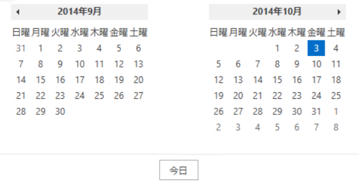

////
|metadata|
{
    "name": "thememanager-applying-theme-to-control",
    "tags": ["Getting Started","How Do I","Theming"],
    "controlName": ["IG Theme Manager"],
    "guid": "a9a0642d-8bd3-456b-97c7-fdfaaf0cc29f",
    "buildFlags": [],
    "createdOn": "2014-09-03T11:24:34.5470117Z"
}
|metadata|
////

= FrameworkElement レベルのテーマの適用 (ThemeManager)

== トピックの概要

=== 目的

このトピックでは、_Infragistics ThemeManager_™ を使用して FrameworkElement にテーマを適用する方法について説明します。

=== 前提条件

このトピックを理解するために、以下のトピックを参照することをお勧めします。

[options="header", cols="a,a"]
|====
|トピック|目的

| link:xamcalendar-using.html[xamCalendar の使用]
|このトピックは、 _xamCalendar_ コントロールとそのモードおよびプロパティについて説明します。

| link:thememanager-overview.html[機能の概要 (ThemeManager)]
|このトピックでは、 _Infragistics ThemeManager_ およびその機能の概要を説明します。

|====

=== このトピックの内容

このトピックは、以下のセクションで構成されます。

* <<_Ref398018602, xamCalendar へのテーマの適用 - 例>>
* <<_Ref398018613, 関連コンテンツ>>

[[_Ref398018602]]
== xamCalendar へのテーマの適用 - 例

=== 概要

以下は、_ThemeManager_ を使用して Office2013 テーマを _xamCalendar_ コントロールに適用する手順です。

アプリケーションで `Window`、`Page`、`Grid` または他の `FrameworkElement` にテーマを適用する場合も、同様の手順を使用します。

=== プレビュー

以下のスクリーンショットは最終結果のプレビューです。

[[_Ref397962631]]

=== 要件

以下は、Office2013 テーマを _XamCalendar_ コントロールに適用する場合の一般的な要件です。

* NuGet パッケージの参照:

** Infragistics.WPF.Calendar
** Infragistics.WPF.Themes.Office2013

NuGet フィードのセットアップと NuGet パッケージの追加の詳細については、link:nuget-feeds.html[NuGet フィード] ドキュメントを参照してください。

* 名前空間:

** Infragistics® 名前空間への参照: (xmlns:ig="http://schemas.infragistics.com/xaml")

=== 前提条件

この手順を実行するには、以下が必要です。

* ページがある Microsoft® Visual Studio® WPF プロジェクト
* プロジェクトに追加した必要なアッセンブリ参照および名前空間 (<<_Ref397962631, 要件>>を参照)

=== 概要

以下はプロセスの概要です。

[start=1]
. <<_Ref398019441, _xamCalendar_ コントロールの追加>>

[start=2]
. <<_Ref398019447, Office2013 テーマを適用>>

=== 手順

以下の手順では、_ThemeManager_ を使用して Office2013 テーマを _xamCalendar_ コントロールに適用する方法を説明します。

[[_Ref398019441]]
=== xamCalendar コントロールの追加

_xamCalendar_ コントロールを `GridContainer` という名前のルートの `Grid` コンテナーに追加します。

*XAML の場合:*
[source,xaml]
----
<ig:XamCalendar>                
    <!-- Office2013のテーマをここに適用します ...-->
</ig:XamCalendar>
----

*C# の場合:*
[source,csharp]
----
var calendar = new XamCalendar();
GridContainer.Children.Add(calendar);
----

*Visual Basic の場合:*
[source,vb]
----
Dim calendar = New XamCalendar()
GridContainer.Children.Add(calendar)
----

[[_Ref398019447]]
=== Office2013 テーマを適用

Office2013 テーマを _xamCalendar_ コントロールに適用します。

*XAML の場合:*
[source,xaml]
----
<ig:ThemeManager.Theme>
    <ig:Office2013Theme />
</ig:ThemeManager.Theme>
----

*C# の場合:*
[source,csharp]
----
ThemeManager.SetTheme(calendar, new Office2013Theme());
----

*Visual Basic の場合:*
[source,vb]
----
ThemeManager.SetTheme(calendar, New Office2013Theme())
----

[[_Ref398018613]]
== 関連コンテンツ

このトピックの追加情報については、以下のトピックも合わせてご参照ください。

[options="header", cols="a,a"]
|====
|トピック|目的

| link:thememanager-applying-theme-to-application.html[アプリケーション レベルへのテーマの適用]
|このトピックでは、_Infragistics ThemeManager_ を使用してアプリケーションにテーマを適用する方法について説明します。

| link:thememanager-applying-theme-to-supported-ms-wpf-controls.html[サポートされる Microsoft の WPF コントロールへのテーマの適用]
|このトピックでは、サポートされるマイクロソフトの WPF コントロールのテーマ設定を、_Infragistics ThemeManager_ を使用して有効または無効にする方法を説明します。

| link:thememanager-creating-new-custom-theme.html[新規のカスタム テーマの作成]
|このトピックでは、_Infragistics ThemeManager_ を使用して、新しいカスタム テーマを作成し適用する方法について説明します。

| link:thememanager-extending-existing-control-theme.html[既存のコントロール テーマの拡張]
|このトピックでは、_Infragistics ThemeManager_ を使用して既存のコントロール テーマを拡張する方法について説明します。

|====