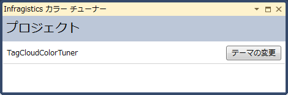
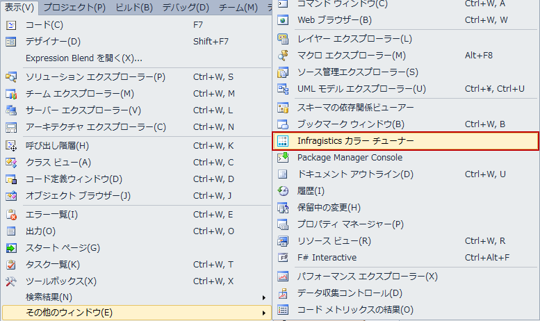
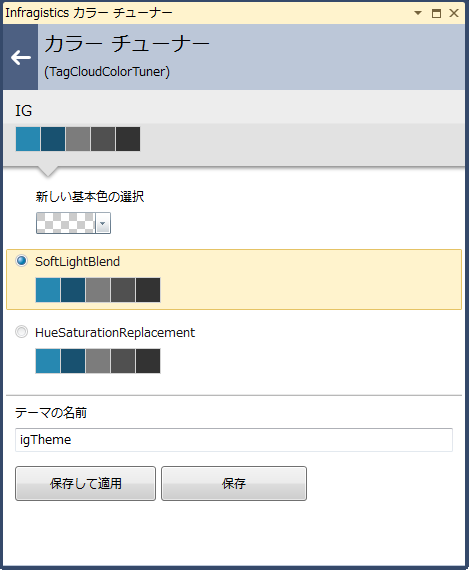
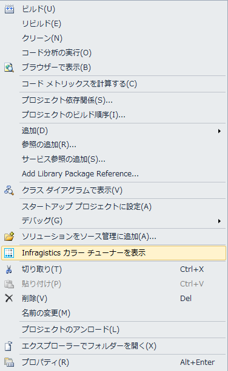

////

|metadata|
{
    "name": "using-infragistics-color-tuner",
    "controlName": ["Infragistics Color Tuner"],
    "tags": ["Design Environment","Getting Started","How Do I","Styling","Templating","Theming"],
    "guid": "f90eac72-6e7a-40f9-810a-a7d16b138d6a",  
    "buildFlags": [],
    "createdOn": "2016-05-25T18:22:00.2844055Z"
}
|metadata|
////

= Infragistics Color Tuner を使用

== トピックの概要

=== 目的

このトピックは、Microsoft Visual Studio® 2010 の拡張機能である、Infragistics Color Tuner™ を説明します。このトピックは、便利な UI を使用して、 pick:[sl="Silverlight"]  pick:[wpf="WPF"]  コントロールの XAML テーマを適用して色を調節する詳細を提供します。

=== 前提条件

以下の表に、このトピックを理解するための前提条件として求められる素材をリストします。

[options="header", cols="a,a"]
|====
|タイプ|コンテンツ

|概念
|以下の概念を理解する必要があります。 

* XAML リソース ディクショナリ 

* XAML アプリケーションのスタイル設定 

|トピック
| link:reswash-using.html[リソース ウォッシャーの使用]

|====

=== 本トピックの内容

このトピックには次のセクションがあります。

* <<_Introduction, 概要 >>
* <<_Minimum_Requirements, 最低要件 >>
* <<_Accessing_the_XAML_Color_Tuner, Infragistics Color Tuner にアクセス >>
* <<_Related_Content, 関連コンテンツ >>

[[_Introduction]]
== 概要

=== Infragistics Color Tuner の概要

Infragistics Color Tuner Microsoft Visual Studio 拡張機能は、Infragistics テーマをカラー調整するための便利なグラフィカル ユーザー インターフェイスを提供することを意図しています。

Infragistics Color Tuner は Resource Washer™ コンポーネントを使用して機能します。基本的に、Infragistics Color Tuner が実行する機能を以下のコード サンプルに示します。Infragistics Color Tuner は以下を実行します。

* Resource Washers を App.xaml アプリケーション リソースに追加します。`Application.Resources` が定義されていない場合は自動的に追加されます。
* Resource Washers は `ResourceDictionary` 内に追加されます。

----
<Application.Resources>
 <ResourceDictionary>
  <ResourceDictionary.MergedDictionaries>
   <!--Resource Washers がここに挿入されます-->
  </ResourceDictionary.MergedDictionaries>
 </ResourceDictionary>
</Application.Resources>
----

[[_Minimum_Requirements]]
== 最低要件

=== インストール

Infragistics Color Tuner は {ProductName} 製品と一緒にインストールする必要があります。

=== 要件の概要表

以下の表で、Infragistics Color Tuner の要件を簡単に説明します。Infragistics Color Tuner は以下のルールが実行される場合のプロジェクトをリストします。

[options="header", cols="a,a"]
|====
|要件|説明

|少なくとも 1 つの Infragistics ( pick:[wpf="WPF"] pick:[sl="Silverlight"] ) アセンブリが存在する。
|作業するプロジェクトは Infragistics アセンブリを使用しなければなりません。

|App.xaml ファイルが存在する。
|作業するプロジェクトに App.xaml ファイルがなければなりません (つまり Build Action が ApplicationDefinition に設定された xaml ファイル)。

|====

注:

有効なプロジェクトが見つかりました。

[NOTE]
====
Infragistics コントロールを含むプロジェクトがあり、上記の表に述べられた要件が実行されるとき、Infragistics Color Tuner はそれを表示します。そのようなプロジェクトがない場合はエラー メッセージが表示されます。
====

[[_Accessing_the_XAML_Color_Tuner]]
== Infragistics Color Tuner にアクセス

=== 機能の概要

Microsoft Visual Studio Standard Toolbar を使用して [表示] $$->$$ [その他のウィンドウ] $$->$$ [Infragistics Color Tuner] の順に選択してツールを開きます。

WPF アセンブリを含むプロジェクトで、コンテキスト メニューからツールを開くこともできます。

=== Infragistics Color Tuner ウィンドウを表示

Infragistics Color Tuner は Infragistics コントロール パッケージと一緒にインストールされます。これは Visual Studio ツールバーに配置され、*[他の Windows]* > [*表示]* メニューをクリックし、ドロップダウンから選択することで表示できます。

Infragistics Color Tuner をクリックします。

プロジェクトのコンテキスト メニューから [Infragistics Color Tuner を表示] をクリックできます。

== 主要機能

=== 機能の概要

以下の表で、Infragistics Color Tuner の拡張機能の主要機能を簡単に説明します。詳細については、概要表の後をご覧ください。

[options="header", cols="a,a"]
|====
|機能|説明

|アプリケーション レベルで適用するテーマを選択
|Infragistics Color Tuner の [テーマ] ウィンドウを使用して、表示されるテーマから適用するテーマを選択できます。

|選択されたテーマを適用するコントロールを選択
|[テーマを適用] ウィンドウを使用して、選択されたテーマを適用したいコントロールを指定できます。

|固有のテーマを作成
|[テーマ] ウィンドウを使用して、インストールされたテーマから色を調整したいテーマを選択できます。

|色を調整したテーマのベース カラーを指定
|[カラー チューナー] ウィンドウを使用して、ドロップダウンから色調整したテーマのベース カラーを選択できます。

|色調整モードを指定
|[カラー チューナー] ウィンドウを使用して、ドロップダウンから使用する色調整モードを選択できます。

|カラー調整したテーマの名前を指定
|[カラー チューナー] ウィンドウを使用して、色調整したテーマの名前を指定できます。

|カスタム カラー調整したテーマを削除
|[カラー チューナー] ウィンドウを使用して、[削除] ボタンを使用して色調整したテーマをを削除できます。

|====

=== 固有のテーマを作成

デフォルトの Infragistics テーマの色を調整することによって固有のテーマを作成できます。これを実行するには、インストールされたテーマ パネルで、[テーマ] ウィンドウに表示されるデフォルトのテーマの 1 つを選択して、[色調整...] ボタンをクリックします。

[カラー チューナー] ウィンドウを指定して新しく作成したテーマのベース カラー、色調整モード、名前をカスタマイズします。テーマを保存して使用するには、[保存 & 使用] ボタンをクリックするか、[保存] をクリックして後でテーマを使用します。

[[_Related_Content]]
== 関連コンテンツ

=== トピック

以下のトピックでは、このトピックに関連する情報を提供しています。

[options="header", cols="a,a"]
|====
|トピック|目的

| link:reswash-using.html[リソース ウォッシャーの使用]
|このトピックでは、ResourceWasher コンポーネントを紹介します。これを使用して、アプリケーションの配色全体を変更することができます。

| link:creating-and-applying-color-tuning-configurations.html[色調整の構成を作成および適用]
|このトピックは、 Infragistics Color Tuner を使用してカスタム カラー調整されたテーマを作成および適用する方法を説明します。

|====