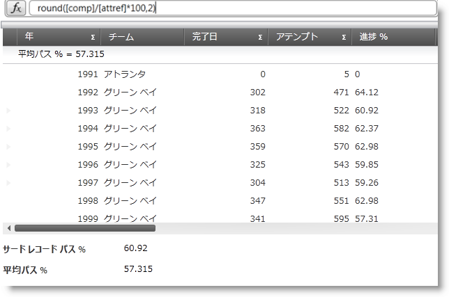
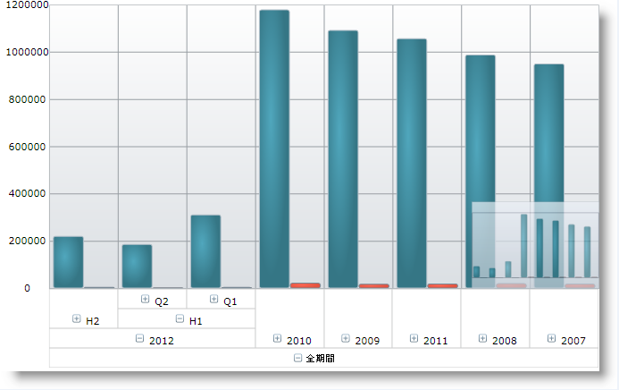
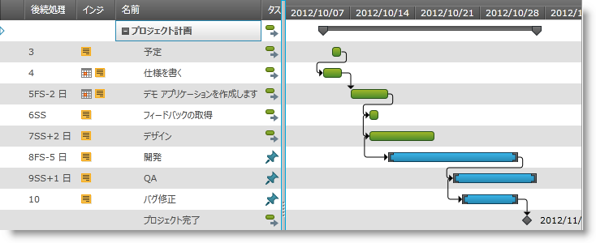
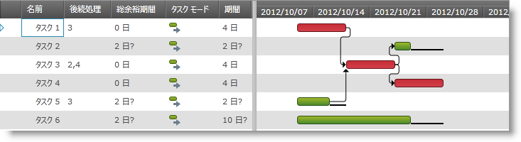
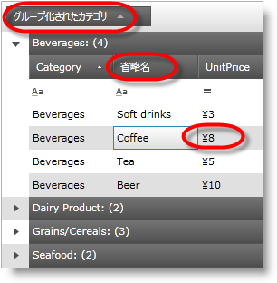
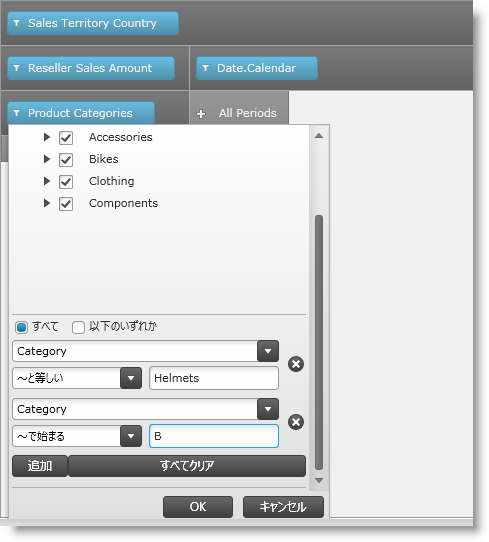
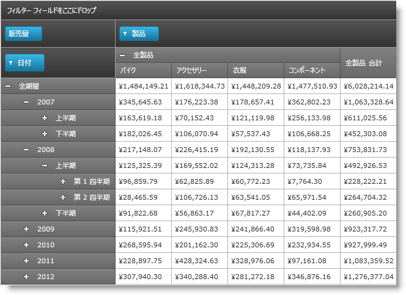

////

|metadata|
{
    "name": "whats-new-in-2012-volume-2",
    "controlName": [],
    "tags": ["How Do I"],
    "guid": "8d832bb3-8e9f-4d19-84d9-3def0d40325a",  
    "buildFlags": [],
    "createdOn": "2012-09-20T13:09:48.4794517Z"
}
|metadata|
////

= 2012 Volume 2 の新機能

== 2012 Volume 2 の最新情報

=== 機能の概要

以下の表は、{ProductName} 2012 Volume 2 新機能の概要を示します。その他の詳細情報については、以下の要点チャートの後を参照してください。

[options="header", cols="a,a,a"]
|====
|コントロール|機能|解説

| _<<Ref335896300, XamCalculationManager >>_ 
|<<_Ref335896301,xamCalculationManager の xamDataGrid との使用>>
|このトピックでは、xamCalculationManager コントロールを xamDataGrid コントロールと組み合わせて使用して、フィールドの値をソースおよびターゲットとして使用して計算を実行する方法を説明します。

| _<<Ref335896308, xamDataChart >>_
|<<_Ref335896330,多次元データの操作 (OLAP データ)>>
|_xamDataChart_ コントロールで多次元のオンライン解析処理 (OLAP) データを表示します。

|
|<<_Ref335896346,マルチ タッチ サポート>>
|_xamDataChart_ コントロールのマルチ タッチ操作のサポートを提供します。

| _<<Ref335896418, XamDataGrid >>_ 
|<<_Ref335896433,データの外部処理>>
|このトピックは、CollectionView と内部処理を使用したデータの外部処理について説明します。

| _<<Ref335896466, xamGantt >>_ 
|<<_Ref335896480,クロス プラットフォーム コントロール>>
|_xamGantt_ コントロールは、Microsoft Project のようなガント機能を提供するクロス プラットフォーム コントロールです。

| _<<Ref335896496, XamGeographicMap >>_ 
|<<_Ref335896507,概要と詳細ペイン>>
|_xamGeographicMap_ コントロールのコンテンツの概要を含むインタラクティブなナビゲーション コントロールを提供します。

|
|<<_Ref335896523,地理的シリーズの新しいタイプ>>
|地理マップでスキャッターまたは複雑なデータを表示する新しいシリーズ タイプを提供します。

|
|<<_Ref335896539,データの三通貨換算およびマップ描画のパフォーマンスの向上>>
|_xamGeographicMap_ コントロールのデータ描画のパフォーマンスを向上するためにデータの三通貨換算機能を提供します。

| _<<Ref335896550, XamGrid >>_ 
|<<_Ref335896559,データの注釈>>
|データ注釈を使用して _xamGrid_ のデータ クラスに属性を 適用できます。

| _<<Ref335896576, XamPivotGrid >>_
|<<_Ref335896586,Excel フィルタリング>>
|_xamPivotGrid_ に値およびラベル フィルターを MS Excel PivotTables のように追加する機能を提供します。

|
|<<_Ref335896597,SSAS サーバーで定義されるフォルダー パスと一致するメジャー>>
|データ セレクターのメタデータ ツリーのメジャーは、SSAS サーバーで定義されるフィルター構造と一致します。

|
|<<_Ref335896611,スーパー コンパクト レイアウト>>
|xamPivotGrid の構造をツリー構造に表示する新しいレイアウトです。

| _<<_Ref335896622,xamSyntaxEditor>>_ 
|<<_Ref335896634,クロス プラットフォーム コントロール>>
|_xamSyntaxEditor_ は、Microsoft の Visual Studio 統合開発環境 (IDE) コード ウィンドウに似たコード編集の操作性を備えたクロス プラットフォーム コントロールです。

|<<_Ref335896649,{PlatformName} (すべてのコントロール)>>
|<<_Ref335896659,バージョンフリー アセンブリ>>
|2012 Volume 2 リリースでバージョンフリー アセンブリを提供します。バージョンフリー アセンブリにバージョン番号 (v.12.2 など) はありません。コードやアップグレードする必要はありません。アプリケーションは常に最新の Infragistics アセンブリを参照します。このアセンブリは _{ProductName}_ 製品で ZIP ファイルとして提供されます。

|<<_Ref335896671,Metro UI アイコン>>
|<<_Ref335896680,Visual Studio の Metro UI アイコンのサポート>>
|Microsoft の Visual Studio 12 統合開発環境 (IDE), すべての XAML コントロールはデザイン タイム ダイアログで Metro スタイルの UI アイコンをサポートします。

|<<_Ref335896692,Infragistics Syntax Parsing Engine>>
|<<_Ref335896701,クロス プラットフォーム ライブラリ>>
|構文解析エンジンはスタンドアロンまたは新しい _xamSyntaxEditor_ エディター コントロールと共に使用可能なテキスト解析エンジンです。構文解析エンジンは EBNF 言語を取得し、言語のトークン、キーワード、コンストラクトに解析します。

|====

[[_Ref335896300]]
== _XamCalculationManager_

[[_Ref335896301]]

=== xamCalculationManager の xamDataGrid との使用

このトピックでは、xamCalculationManager と xamDataGrid コントロールの統合について扱いますが、同じ手順をその他の DataPresenter コントロールに適用することができます。xamCalculationManager コンポーネントによって実行される計算に関連するのに適した他のコントロールは、DataPresenterBase クラスから派生します。

==== 関連トピック:

* link:xamcalculationmanager-using-xamcalculationmanager-with-xamdatagrid.html[xamCalculationManager の xamDataGrid との使用]

[[_Ref335896308]]
== _xamDataChart_

[[_Ref335896330]]

=== 多次元データの操作 (OLAP データ)

_xamDataChart_   の OlapXAxis は OLAP データの視覚化のためにデザインされます。データにドリルダウンし、軸 (列または行) を選択して値をプロットするシリーズを選択できます。

==== 関連トピック:

* link:datachart-working-with-multi-dimensional-data-(olap-data)-(xamdatachart).html[多次元データの操作 (OLAP データ)]

[[_Ref335896346]]

=== マルチ タッチ サポート

タッチ ジェスチャは、タッチ サポート画面でインタラクティブに  _xamDataChart_   コントロールのコンテンツを操作できます。{ProductName} 2012 Volume 2 リリースは、ストレッチ、ピンチ、タップ、ドラッグなどのジェスチャをサポートするチャートが含まれます。

image::images/Whats_New_in_2012_Volume_2_02.png[]

==== 関連トピック:

* link:datachart-navigating-chart-using-touch-gestures.html[タッチ ジェスチャによるチャートの操作]

[[_Ref335896418]]
== _XamDataGrid_

[[_Ref335896433]]

=== データの外部処理

外部処理は、並べ替え、フィルタリング、グループ化、集計計算などの機能を CollectionView を使用して外部で行うことができます。通常、コントロールの DataPresenter は内部で処理を実行します。ただし、外部処理では CollectionView オブジェクトがコントロール外で要求された処理を行います。その後、コントロールの DataPresenter に結果を反映し、その結果コントロール ビューに表示されます。

==== 関連トピック:

* link:xamdatagrid-external-processing-of-data.html[データの外部処理]

[[_Ref335896466]]
== _xamGantt_

[[_Ref335896480]]

=== クロス プラットフォーム コントロール

_xamGantt_   コントロールはプロジェクトのタスク、関係、依存を視覚化します。このクロス プラットフォーム コントロールは、プロジェクト プランの作成、製品処理、およびプロジェクトの進行状況を表示するために Microsoft Project 2010 のようなユーザー インターフェイスを提供します。

==== 関連トピック:

* link:xamgantt-xamgantt-overview.html[xamGantt の概要]

[[_Ref335896550]]
== _XamGrid_

[[_Ref335896559]]

=== データの注釈

_xamGrid_   のデータの注釈を使用すると、データ クラスで属性を適用できます。注釈は、検証ルールの指定、データを描画する方法の決定、クラス間の関係の設定などの操作で便利です。

スクリーンショットは、以下のフィールドの属性に設定したデータ属性を示します。

* カテゴリ (グループ化されたカテゴリ)

* 名前 (短い名前)

* UnitPrice (通貨の書式)

==== 関連トピック:

* link:xamgrid-data-annotations.html[データの注釈]

[[_Ref335896496]]
== _XamGeographicMap_

[[_Ref335896507]]

=== 概要と詳細ペイン

_xamGeographicMap_   コントロールは xamOverviewPlusDetailPane コントロールを使用してマップ コンテンツの概要を提供します。このコントロールはマップのサムネイルを表示し、マップ コントロールのナビゲーション機能を提供します。

image::images/Whats_New_in_2012_Volume_2_06.png[]

==== 関連トピック:

* link:geographicmap-navigating-map-content-using-overview-plus-detail-pane.html[概要と詳細ペインを使用してマップ コンテンツをナビゲート]

[[_Ref335896523]]

=== 地理的シリーズの新しいタイプ

xamGeographicMap コントロールは以下の地理シリーズの新しいタイプを提供します。

[options="header", cols="a,a"]
|====
|地理的シリーズのタイプ|説明

| link:{ApiPlatform}controls.maps.xamgeographicmap{ApiVersion}~infragistics.controls.maps.geographicscatterareaseries_members.html[GeographicScatterAreaSeries]
|このシリーズは、地理コンテキストで色付きのサーフェイスを描画します。経度と緯度データの三通貨換算に基づいて描画します。各ポイントに数値が割り当てます。

| link:{ApiPlatform}controls.maps.xamgeographicmap{ApiVersion}~infragistics.controls.maps.geographiccontourlineseries_members.html[GeographicContourLineSeries]
|このシリーズは、地理コンテキストで色付きの等高線を描画します。経度と緯度データの三通貨換算に基づいて描画します。各ポイントに数値を割り当てます。

| link:{ApiPlatform}controls.maps.xamgeographicmap{ApiVersion}~infragistics.controls.maps.geographicshapecontrolseries_members.html[GeographicShapeControlSeries]
|このシリーズは、地理コンテキストで link:{DataChartLink}.shapecontrol_members.html[ShapeControl] テンプレートを使用して地理的データの図形を描画する地理シリーズを表します。地理的シリーズの描画のパフォーマンスが低下する場合がありますが、 link:http://msdn.microsoft.com/ja-jp/library/system.windows.visualstatemanager(v=vs.95).aspx[VisualStateManager] などの機能を link:http://msdn.microsoft.com/ja-jp/library/system.windows.forms.control.aspx[Control] 要素に追加できます。

|====

image::images/Whats_New_in_2012_Volume_2_07.png[]

image::images/Whats_New_in_2012_Volume_2_08.png[]

image::images/Whats_New_in_2012_Volume_2_09.png[]

==== 関連トピック:

* link:geographicmap-using-geographic-scatter-area-series.html[地理散布シリーズの使用]
* link:geographicmap-using-geographic-contour-line-series.html[地理等高線シリーズの使用]
* link:geographicmap-using-geographic-shape-control-series.html[地理図形コントロール シリーズの使用]

[[_Ref335896539]]

=== データの三通貨換算およびマップ描画のパフォーマンスの向上

xamGeographicMap コントロールは、地理データの三通貨換算の作成、読み込み、および ITF ファイルへの保存のために TriangulationSource クラスを提供します。この機能はマップ描画のランタイム パフォーマンスを向上します。

==== 関連トピック:

* link:geographicmap-triangulating-geographic-data.html[地理データの三通貨換算]

[[_Ref335896576]]
== _XamPivotGrid_

[[_Ref335896586]]

=== Excel フィルタリング

Excel フィルタリング機能は、 _xamPivotGrid_   に値およびラベル フィルターを MS Excel PivotTables のように追加する機能を提供します。行および列階層のメンバーの検索機能も提供します。

==== 関連トピック:

* link:xampivotgrid-excel-style-filtering.html[Excel フィルタリング]

[[_Ref335896597]]

=== SSAS サーバーで定義されるフォルダー パスと一致するメジャー

12.2 以前のリリースでは、 _xamPivotDataSelector_   のメタデータ ツリーのメジャーのフォルダー構造は SSAS サーバーに定義される構造と一致しませんでした。次回  _XmlaDataSource_   を使用する際にサーバーのフォルダー構造と一致します。

[[_Ref335896611]]

=== スーパー コンパクト レイアウト

ピボット グリッドのスーパー コンパクト レイアウトは、 _xamPivotGrid_   コントロールの水平方向スペースを削減するレイアウトです。標準レイアウトの行階層の子レベルを親ヘッダー セルの左に配置されるヘッダー セルに表示する代わりに、子レベルのヘッダー セルは親の上または下に表示されます。階層のレベルを識別するために、指定した距離によって右にインデントされます。

==== 関連トピック:

* link:xampivotgrid-super-compact-layout.html[スーパー コンパクト レイアウト]

[[_Ref335896622]]
== _xamSyntaxEditor_

[[_Ref335896634]]

=== クロス プラットフォーム コントロール

_xamSyntaxEditor_   は、Microsoft Visual Studio のコード エディターのようなコード編集エクスペリエンスを提供するテキスト編集コントロールです。新しい構文解析エンジンで作成されました。言語固有の文法ルールを設定すると、言語の部分を表示し、テキストが構文ルールに合わせない場合にエラー情報を表示します。

image::images/Whats_New_in_2012_Volume_2_12.png[]

==== 関連トピック:

* link:xamsyntaxeditor-overview.html[xamSyntaxEditor の概要]

[[_Ref335896649]]
== {PlatformName} (すべてのコントロール)

[[_Ref335896659]]

=== バージョンフリー アセンブリ

バージョンフリー アセンブリは、アセンブリ名にバージョン番号またはフレームワーク バージョン識別子がないライブラリです。たとえば、 _InfragisticsSL5.v12.2.dll_   は  _InfragisticsSL.dll_   として読み込みます。バージョンフリー アセンブリは常に最新の共通言語ランタイム (CLR) バージョンと一致します。

==== 関連トピック:

* link:version-free-assemblies.html[バージョンフリー アセンブリ]

[[_Ref335896671]]
== Metro UI アイコン

[[_Ref335896680]]

=== Visual Studio の Metro UI アイコンのサポート

Microsoft の Visual Studio 12 統合開発環境 (IDE), Infragistics のすべての XAML コントロールはデザイン タイム ダイアログで Metro スタイルの UI アイコンをサポートします。

image::images/Whats_New_in_2012_Volume_2_13.png[]

[[_Ref335896692]]
== Infragistics Syntax Parsing Engine

[[_Ref335896701]]

=== クロス プラットフォーム ライブラリ

構文解析エンジンはスタンドアロンまたは新しい  _xamSyntaxEditor_   エディター コントロールと共に使用可能なテキスト解析エンジンです。構文解析エンジンは EBNF 言語を取得し、言語のトークン、キーワード、コンストラクトに解析します。

==== 関連トピック:

* link:ig-spe-overview.html[Syntax Parsing Engine の概要]