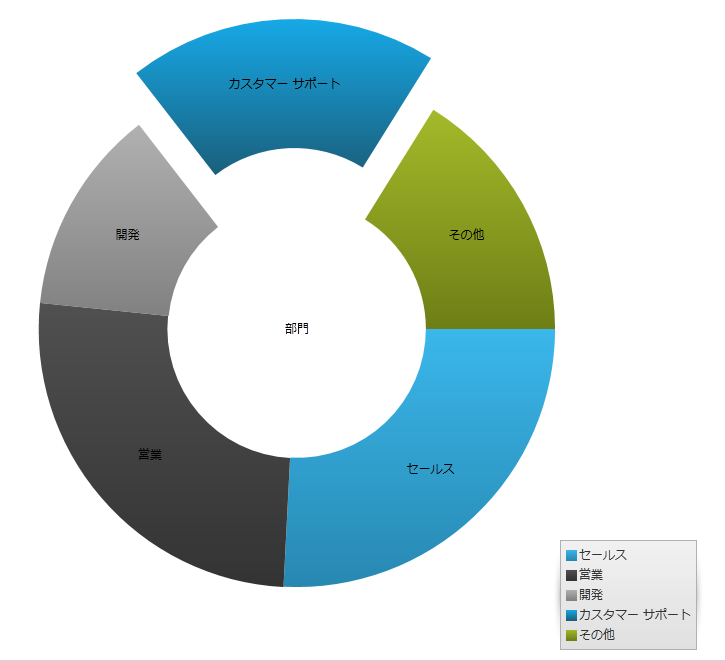
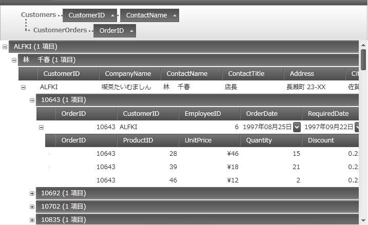
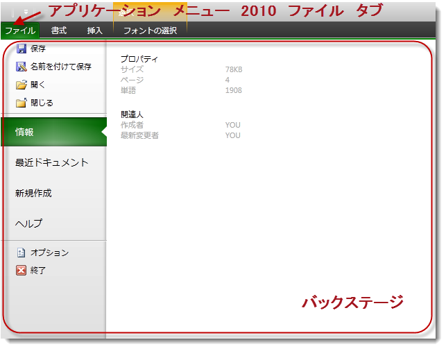
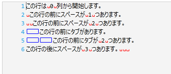
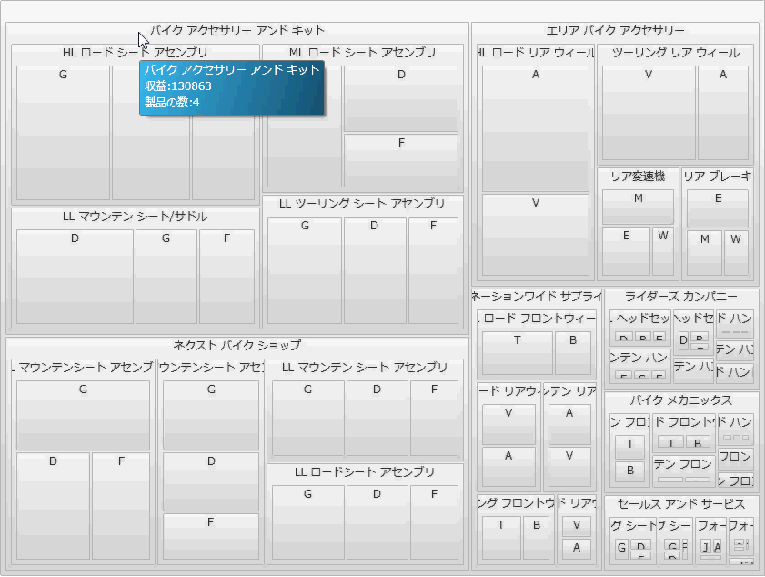

////
|metadata|
{
    "name": "whats-new-in-2013-volume-1",
    "controlName": [],
    "tags": [],
    "guid": "eabd4644-a8e6-4ade-8c97-53bd4d0bcf5b",
    "buildFlags": [],
    "createdOn": "2013-02-12T07:40:29.8433378Z"
}
|metadata|
////

= 2013 Volume 1 の新機能

== 新しい機能の概要

==== 新しい機能の概要

以下の表は、{ProductName} 2013 Volume 1 新機能の概要を示します。その他の詳細情報については、以下の要点チャートの後を参照してください。

[options="header", cols="a,a,a"]
|====
|コントロール|機能|説明

|<<InfragisticsSyntaxParsingEngine,Infragistics Syntax Parsing Engine>>
|<<NewParsingEngine,新しい解析エンジン>>
|Infragistics Syntax Parsing Engine は、EBNF に定義されるカスタム プログラミング言語の文法を読み込み、カスタムに定義される文法によってファイルを解析して処理するクラスのセットです。

| _<<xamDataChart, xamDataChart >>_ 
|<<HighDensityScatterSeries,ギャラリー - 高密度散布シリーズ>>
|_xamDataChart_ コントロールの link:{ApiPlatform}controls.charts.xamdatachart{ApiVersion}~infragistics.controls.charts.highdensityscatterseries_members.html[HighDensityScatterSeries] シリーズを使用すると、高いパフォーマンスで複数万のデータ ポイントを含む散布データをバインドして表示できます。大量のデータ ポイントがあるため、シリーズは散布データをマーカーではなく小さいドットとして表示します。データが大量にある領域は、データ ポイントを高い色密度で表示します。

|
|<<HoverInteractions,ホバー操作>>
|ホバー操作は、ホバーレイヤーを介して実装されます。これらのレイヤーは、実際のシリーズでシリーズ コレクションに追加され、カーソル位置に依存します。_xamDataChart_ コントロールにホバー操作レイヤーを追加すると、追加されたレイヤー タイプに基づいて十字ポインターおよびツールチップのデフォルト動作を無効にします。

| _<<Ref351394689, xamDoughnutChart >>_ 
|<<_Ref351394696,クロス プラットフォーム コントロール>>
|ドーナツ型チャートを表すクロス プラットフォーム コントロールです。

.2| _<<xamDataGrid, xamDataGrid >>_ 
|<<NewSortingBehavior,新しい並べ替え動作>>
|このコントロールは、 UI やコードによる並べ替え機能を提供します。

|
|<<NewGroupingBehavior,新しいグループ化動作>>
|この新しいグループ化動作は、ユーザーがデータをより読みやすくナビゲーションしやすくグループ化できます。

| _<<xamGantt, xamGantt >>_ 
|<<_Ref346271621,プロジェクトを XML として保存>>
|このコントロールは現在のプロジェクト計画を MS Project XML ファイルに保存する機能を提供します。

| _<<xamGeographicMap, xamGeographicMap >>_ 
|<<DisplayingGeographicImageryfromArcGISOnlineServers,ArcGIS Online サーバーから地理的画像を表示>>
|ArcGIS オンラインは、Esri 製品です。マップを作成して公開またはプライベートで共有できます。Esri およびその他の ArcGIS ユーザーによって作成されたマップにアクセスできます。 

パブリック マップのリストを参照できます: link:http://www.arcgis.com/home/group.html?owner=esri&title=ESRI%20Maps%20and%20Data[Esri マップとデータ グループ]。

|
|<<GeographicProportionalSymbolSeries,地理比例シンボル シリーズ>>
| link:{ApiPlatform}controls.maps.xamgeographicmap{ApiVersion}~infragistics.controls.maps.geographicproportionalsymbolseries_members.html[GeographicProportionalSymbolSeries] はデータ駆動型の記号サイズを持つ散布シリーズです。link:{ApiPlatform}controls.maps.xamgeographicmap{ApiVersion}~infragistics.controls.maps.geographicsymbolseries_members.html[GeographicSymbolSeries] を実装し、 _xamDataChart_ コントロールの link:{ApiPlatform}controls.charts.xamdatachart{ApiVersion}~infragistics.controls.charts.bubbleseries_members.html[BubbleSeries] の基本機能があります。

|
|<<SimplifiedSupportforBingMapsImagery,Bing Maps 画像のサポート>>
|Bing Maps インターフェイスがシンプルになりました。最小限の設定で Bing Maps にアクセスできます。以前のリリースでは、Bing Maps にアクセスする REST サービスを構成し、タイルに必要な URI を取得する必要がありました。13.1 バージョンでは、この機能が _xamGeographicMap_ コントロールに既に定義されています。

|
|<<UsingGeographicTileSeries,地理タイル シリーズの使用>><<UsingGeographicTileSeries,>>
| link:{ApiPlatform}controls.maps.xamgeographicmap{ApiVersion}~infragistics.controls.maps.geographictileseries_members.html[GeographicTileSeries] は、 _xamGeographicMap_ コントロールのマップ視覚要素で、追加のタイル画像を _xamGeographicMap_ コントロールの link:{ApiPlatform}controls.maps.xamgeographicmap{ApiVersion}~infragistics.controls.maps.xamgeographicmap~backgroundcontent.html[BackgroundContent] プロパティで定義されたベース タイル画像に重ね合わせます。 

link:{ApiPlatform}controls.maps.xamgeographicmap{ApiVersion}~infragistics.controls.maps.geographictileseries_members.html[GeographicTileSeries] は link:{ApiPlatform}controls.maps.xamgeographicmap{ApiVersion}~infragistics.controls.maps.geographicpolylineseries_members.html[GeographicPolylineSeries] に似ていますが、ポリラインを描画する代わりに、ポリラインはタイル ビジュアルをクリップします。

| _<<Ref351395743, xamPivotGrid: >>_ 
|<<_Ref351395827,グリッド カスタマイズの保存と読み込み>>
|この機能は、 _xamPivotGrid_ の特定の状態 (列、行、フィルターに使用された階層、展開されたメンバーの状態など) を保存および復元します。

| _<<xamRibbon, xamRibbon >>_ 
|<<ApplicationMenu2010,アプリケーション メニュー 2010>>
|アプリケーション メニュー 2010 機能は、すべての他のタブおよび Backstage の前のファイル タブ、つまり xamRibbon グループと xamRibbon を含むウィンドウ サイズを拡張します。

| _<<Ref346271560, xamSyntaxEditor >>_ 
|<<_Ref346271568,Clipboard イベント>>
|このコントロールは、クリップボード操作をサポートする新しいイベントを公開します。

|
|<<_Ref346271581,現在行の強調表示>>
|この機能は、カレットを含む行を強調表示します。

|
|<<_Ref346271588,カスタム装飾>>
|装飾は、コントロールのテキスト編集領域に表示される視覚要素でユーザーに視覚的な合図を提供します。

|
|<<_Ref346271595,ルーラー マージン>>
|ルーラー マージンは、現在行のカレットの位置を赤いドットで示します。

|
|<<_Ref346271603,空白の強調表示>>
|この機能は、ドキュメント内のすべてのスペースとタブを識別します。

|
|<<_Ref346271604,Transact-SQL>>
|Transact-SQL 言語のサポート

| _<<Ref351395987, xamTreemap >>_ 
|<<_Ref351395991,ツールチップ>>
|このコントロールは定義済みで、ツールチップをサポートします。

|====

[[InfragisticsSyntaxParsingEngine]]
== Infragistics Syntax Parsing Engine

[[NewParsingEngine]]
==== 新しい解析エンジン

Infragistics Syntax Parsing Engine は、ドキュメントのタイプの文法的な構造の定義を取得し、ドキュメントを読み込み、そして処理するアナライザーを生成するクラスのセットです。

主要機能:

* アナライザーの作成
* 解析の実行

その他の機能

* 文章校正
* エラーとあいまいさの識別

C# および Visual Basic クラス ファイルの生成

==== 関連トピック:

link:ig-spe-overview.html[Syntax Parsing Engine 概要]

[[xamDataChart]]
== _xamDataChart_

[[HighDensityScatterSeries]]

=== ギャラリー - 高密度散布シリーズ

_xamDataChart_   コントロールの link:{ApiPlatform}controls.charts.xamdatachart{ApiVersion}~infragistics.controls.charts.highdensityscatterseries_members.html[HighDensityScatterSeries] は、高いパフォーマンスで数百から数万のデータ ポイントを含む散布データをバインドして表示できます。大量のデータ ポイントがあるため、シリーズは散布データをマーカーではなく小さいドットとして表示します。データが大量にある領域は、データ ポイントを高い色密度で表示します。

image::images/WPFWhats_New_in_2013_Volume_1_WPF_1.png[]

==== 関連トピック:

link:datachart-scatter-high-density-scatter-series.html[ギャラリー - 高密度散布シリーズ]

[[HoverInteractions]]

=== ホバー操作

ホバー操作は、ホバー操作レイヤーを介して実装されます。シリーズがシリーズコレクションに追加され、カーソル位置に依存します。_xamDataChart_  コントロールにホバー操作レイヤーを追加すると、追加されたレイヤー タイプに基づいて十字ポインターおよびツールチップのデフォルト動作を無効にします。

image::images/WPFWhats_New_in_2013_Volume_1_WPF_2.png[]

==== 関連トピック:

link:datachart-chartannotationlayers.html[ホバー操作]

[[_Ref351394689]]
== _xamDoughnutChart_

[[_Ref351394696]]
==== クロス プラットフォーム コントロール

_xamDoughnutChart_   コントロールは  _xamPieChart_   に似ています。変数または複数の変数の比率を同心リングに表示し、階層データを視覚化するサポートを提供します。

==== 関連トピック:

* link:xamdoughnutchart-overview.html[xamDoughnutChart 概要]

[[xamDataGrid]]
== _xamDataGrid_

[[NewSortingBehavior]]

=== 新しい並べ替え動作

このコントロールは、 UI やコードによる並べ替え機能を提供します。

==== 関連トピック:

link:xamdatagrid-sorting-overview.html[並べ替えの概要 (xamDataGrid)]

link:xamdatagrid-sorting-and-grouping-process-overview.html[並べ替えとグループ化プロセスの概要 (xamDataGrid)]

[[NewGroupingBehavior]]

=== 新しいグループ化動作

この新しいグループ化動作は、ユーザーがデータをより読みやすくナビゲーションしやすくグループ化できます。

==== 関連トピック:

link:xamdatagrid-grouping-overview.html[グループ化の概要 (xamDataGrid)]

link:xamdatagrid-user-interaction-sorting-records.html[レコードの並べ替えとグループ化時のユーザー操作 (xamDataGrid)]

[[xamGantt]]
== _xamGantt_

[[_Ref346271621]]
==== プロジェクトを XML として保存

このコントロールは現在のプロジェクト計画を MS Project XML ファイルに保存する機能を提供します。

==== 関連トピック:

link:xamgantt-saving-project-plan-to-ms-project-xml-file.html[プロジェクトを XML として保存]

[[xamGeographicMap]]
== _xamGeographicMap_

[[DisplayingGeographicImageryfromArcGISOnlineServers]]

=== ArcGIS Online サーバーから地理的画像を表示

ArcGIS オンラインは、Esri 製品です。マップを作成して公開またはプライベートで共有できます。Esri およびその他の ArcGIS ユーザーによって作成されたマップにアクセスできます。

公開されているマップのリストの一部を参照できます: link:http://www.arcgis.com/home/group.html?owner=esri&title=ESRI%20Maps%20and%20Data[Esri マップとデータ グループ]。

image::images/WPFWhats_New_in_2013_Volume_1_WPF_4.png[]

==== 関連トピック:

link:geographicmap-displaying-geographic-imagery-from-arcgis-online-servers.html[ArcGIS Online サーバーから地理的画像を表示]

[[GeographicProportionalSymbolSeries]]

=== 地理比例シンボル シリーズ

link:{ApiPlatform}controls.maps.xamgeographicmap{ApiVersion}~infragistics.controls.maps.geographicproportionalsymbolseries_members.html[GeographicProportionalSymbolSeries] は、記号のサイズがデータ駆動型の散布シリーズです。link:{ApiPlatform}controls.maps.xamgeographicmap{ApiVersion}~infragistics.controls.maps.geographicsymbolseries_members.html[GeographicSymbolSeries] を実装し、 _xamDataChart_   コントロールの link:{ApiPlatform}controls.charts.xamdatachart{ApiVersion}~infragistics.controls.charts.bubbleseries_members.html[BubbleSeries] の基本機能があります。

以下の画像は、 _xamGeographicMap_   コントロールで世界の人口密度の高い都市の位置を表示する link:{ApiPlatform}controls.maps.xamgeographicmap{ApiVersion}~infragistics.controls.maps.geographicproportionalsymbolseries_members.html[GeographicProportionalSymbolSeries] シリーズのプレビューです。記号の link:{ApiPlatform}controls.charts.xamdatachart{ApiVersion}~infragistics.controls.charts.sizescale_members.html[SizeScale] は、比例半径スケールを使用し、人口に基づいて都市のサイズを表示します。

image::images/WPFWhats_New_in_2013_Volume_1_WPF_5.png[]

==== 関連トピック:

link:geographicmap-using-geographic-proportional-symbol-series.html[地理比例シンボル シリーズの使用]

[[SimplifiedSupportforBingMapsImagery]]

=== Bing Maps 画像のサポート

Bing Maps インターフェイスがシンプルになりました。最小限の設定で Bing Maps にアクセスできます。以前のリリースでは、Bing Maps にアクセスする REST サービスを構成し、タイルに必要な URI を取得する必要がありました。13.1 バージョンでは、この機能が  _xamGeographicMap_   コントロールに既に定義されています。

以下のスクリーンショットは、 _xamGeographicMap_   コントロールが Bing Maps サービスの地理画像の Road マップ スタイルを使用して描画する方法を示します。

image::images/WPFWhats_New_in_2013_Volume_1_WPF_6.png[]

==== 関連トピック:

link:geographicmap-displaying-geographic-imagery-from-bing-maps.html[Bing Maps から地理的画像を表示]

[[UsingGeographicTileSeries]]

=== 地理タイル シリーズの使用

link:{ApiPlatform}controls.maps.xamgeographicmap{ApiVersion}~infragistics.controls.maps.geographictileseries_members.html[GeographicTileSeries] は、 _xamGeographicMap_  コントロールのマップ視覚要素で、追加のタイル画像を _xamGeographicMap_  コントロールの link:{ApiPlatform}controls.maps.xamgeographicmap{ApiVersion}~infragistics.controls.maps.xamgeographicmap~backgroundcontent.html[BackgroundContent] プロパティで定義されたベース タイル画像に重ね合わせます。

link:{ApiPlatform}controls.maps.xamgeographicmap{ApiVersion}~infragistics.controls.maps.geographictileseries_members.html[GeographicTileSeries] は link:{ApiPlatform}controls.maps.xamgeographicmap{ApiVersion}~infragistics.controls.maps.geographicpolylineseries_members.html[GeographicPolylineSeries] に似ていますが、ポリラインを描画する代わりに、ポリラインはタイル ビジュアルをクリップします。

image::images/WPFWhats_New_in_2013_Volume_1_WPF_7.png[]

==== 関連トピック:

link:geographicmap-using-geographic-tile-series.html[地理タイル シリーズの使用]

[[_Ref351395743]]
== _xamPivotGrid_

[[_Ref351395827]]
==== グリッド カスタマイズの保存と読み込み

現在の  _xamPivotGrid_  の状態は、主にで使用されるデータ ソース コントロールによって定義されます ( _FlatDataSource_™ および  _XmlaDataSource_™)。この機能は、データソースの現在の状態の保存して、読み込むことが可能です。

==== 関連トピック:

* link:xampivotgrid-saving-and-loading-grid-customizations.html[グリッド (データ ソース) カスタマイズの保存と読み込み (xamPivotGrid)]

[[xamRibbon]]
== _xamRibbon_

[[ApplicationMenu2010]]
==== アプリケーション メニュー 2010

有効な場合、アプリケーション メニュー2010 機能は、xamRibbon コントロールの他のすべてのタブの前にファイル タブを描画します。このタブを押すと、Backstage の前のファイル タブ、つまり xamRibbon グループと xamRibbon をカバーするウィンドウ サイズに拡張します。以下のスクリーンショットは、xamRibbon コントロール内の アプリケーション メニュー 2010 ファイル タブおよび開かれた Backstage の位置を示します。

==== 関連トピック:

link:xamribbon-applicationmenu2010.html[アプリケーション メニュー 2010 (xamRibbon)]

[[_Ref346271560]]
== _xamSyntaxEditor_

[[_Ref346271568]]

=== Clipboard イベント

このコントロールは、クリップボード操作をサポートする新しいイベントを公開します。

==== 関連トピック:

link:xamsyntaxeditor-clipboard-support.html[クリップボードのサポート]

[[_Ref346271581]]

=== 現在行の強調表示

現在の行の強調表示機能はカレットを含む行を強調表示します。

image::images/WPFWhats_New_in_2013_Volume_1_WPF_9.png[]

==== 関連トピック:

link:xamsyntaxeditor-currentlinehl.html[現在行の強調表示]

[[_Ref346271588]]

=== カスタム装飾

装飾は、コントロールのテキスト編集領域に表示される視覚要素でユーザーに視覚的な合図を提供します。

==== 関連トピック:

link:xamsyntaxeditor-custom-adornments.html[カスタム装飾]

[[_Ref346271595]]

=== ルーラー マージン

ルーラー マージンは、現在行のカレットの位置を色のカスタマイズが可能なドットで示します。

image::images/WPFWhats_New_in_2013_Volume_1_WPF_11.png[]

==== 関連トピック:

link:xamsyntaxeditor-ruler-margin.html[ルーラー マージン]

[[_Ref346271603]]

=== 空白の強調表示

空白の強調表示機能は、ドキュメント内のスペースおよびタブの位置をすべて示します。

image::images/WPFWhats_New_in_2013_Volume_1_WPF_12.png[]

==== 関連トピック:

link:xamsyntaxeditor-whitespacehighlighting.html[空白の強調表示]

[[_Ref346271604]]

=== Transact-SQL

Transact-SQL 言語は、xamSyntaxEditor でサポートされます。

image::images/WPFWhats_New_in_2013_Volume_1_WPF_15.png[]

==== 関連トピック:

link:xamsyntaxeditor-supported-languages.html[サポート対象言語]

[[_Ref351395987]]
== _XamTreemap_

[[_Ref351395991]]
==== ツールチップ

このコントロールは、ツールチップを使用およびスタイル設定するための新しいプロパティを公開します。

