////
|metadata|
{
    "name": "whats-new-in-2013-volume-2",
    "controlName": [],
    "tags": ["Getting Started","How Do I"],
    "guid": "140732a7-095c-423c-ab7b-2d4760427fb6","buildFlags": [],
    "createdOn": "2013-10-15T06:54:20.3581857Z"
}
|metadata|
////

= 2013 Volume 2 の新機能

== 新しい機能の概要

=== 新機能の概要表

以下の表は、{ProductName} 2013 Volume 2 新機能の概要を示します。その他の詳細情報については、以下の要点チャートの後を参照してください。

[options="header", cols="a,a,a"]
|====
|コントロール|機能|説明

| _<<_Ref367197745, xamBulletGraph >>_ 
|<<_Ref367197749,新規コントロール>>
|_xamBulletGraph_ は、データをブレット グラフ形式で視覚化するコントロールです。

| _<<_Ref367202841, xamDataChart >>_ 
|<<_Ref367202844,タイトルとサブタイトル>>
|チャート コントロールの上セクションにタイトル、サブタイトル、または両方を追加できます。

|
|<<_Ref367202849,軸のタイトルとサブタイトル>>
|コントロールの x 軸および y 軸にタイトル、サブタイトル、または両方を追加できます。

|
|<<_Ref367202852,系列の強調表示>>
|系列全体を強調表示、または系列内の特定の項目を強調表示することもできます。

|
|<<_Ref367202860,トランジション イン アニメーション>>
|チャートを最初に読み込んだときに、系列をアニメーションで表示できます。

|
|<<_Ref367197826,軸の目盛>>
|垂直軸および水平軸で目盛を表示できます。

|
|<<_Ref367197831,デフォルト ツールチップ>>
|デフォルト ツールチップを使用できます。つまり、プロパティを設定せずに系列でツールチップを表示することが可能です。

|
|<<_Ref367197836,影付き>>
|影付き効果を系列に適用できます。

|
|<<_Ref367197841,新しいスタイル設定>>
|これは _xamDataChart_ の新しいスタイル設定です。チャートの外観を向上します。

| _<<_Ref367202881, xamDoughnutChart と xamPieChart >>_ 
|<<_Ref356571861,引き出し線を曲線に設定>>
|この機能は、 _xamDoughnutChart_ および _xamPieChart_ の引き出し線で曲線を表示します。

| _<<_Ref367202886, xamGeographicMap >>_ 
|<<_Ref367202921,ギャラリー - 高密度散布シリーズ>>
|_xamGeographicMap_ コントロールの link:{ApiPlatform}controls.maps.xamgeographicmap{ApiVersion}~infragistics.controls.maps.geographichighdensityscatterseries.html[GeographicHighDensityScatterSeries] 系列を使用すると、数百から数百万のデータ ポイントから成る散布図データを最短の読み込み時間でバインドして表示できます。

| _<<_Ref367197863, xamLinearGauge >>_ 
|<<_Ref367197859,新規コントロール>>
|_xamLinearGauge_ コントロールはリニア ゲージでデータを視覚化します。スケールおよび 1 つ以上の比較範囲と比較したパフォーマンス値をシンプルで簡潔に表示します。

| _<<_Ref367202940, xamRadialGauge >>_ 
|<<_Ref367202945,新規コントロール>>
|_xamRadialGauge_ は、ゲージおよび複数の視覚要素を表示するクロス プラットフォーム コントロールです。

| _<<_Ref367202950, xamRichTextEditor >>_ 
|<<_Ref367202953,新規コントロール>>
|_xamRichTextEditor_ は、テキスト、リスト、画像およびテーブルに限定せず、全般的なリッチ テキスト コンテンツの機能の表示および編集をするクロス プラットフォーム コントロールです。

| _<<_Ref367202956, xamSyntaxEditor >>_ 
|<<_Ref367202961,XAML での分類型の定義>>
|_xamSyntaxEditor_ コントロールは、XAML の分類型の定義をサポートします。

| _<<_Ref367710344, Metro Dark テーマ >>_ 
|<<_Ref367710345,Metro Dark テーマ>>
|コントロールの新しいタッチフレンドリーなダーク テーマ。

| _<<_Ref367710352, MS コントロールの暗黙のテーマ >>_ 
|<<_Ref367710353,MS コントロールの暗黙のテーマ>>
|すべての Microsoft コントロールのための Infragistics テーマのバージョン。

|====

[[_Ref367197745]]
== _xamBulletGraph_

[[_Ref367197749]]

=== 新規コントロール

_xamBulletGraph_ は、データをブレット グラフ形式で視覚化する {ProductName} コントロールです。このコントロールは、複数の他のメジャーと比較した主要なメジャーをリニア デザインでシンプルに表示します。

image::images/Whats_New_in_2013_Volume_2_WPF_1.png[]

==== 関連トピック:

link:bulletgraph.html[xamBulletGraph]

[[_Ref367202841]]
== _xamDataChart_

[[_Ref367202844]]

=== タイトルとサブタイトル

チャート コントロールの上セクションにタイトル、サブタイトル、または両方を追加できます。

チャート コントロールにタイトルまたはサブタイトルを追加すると、チャートのコンテンツが情報に合わせて自動的にサイズ変更されます。

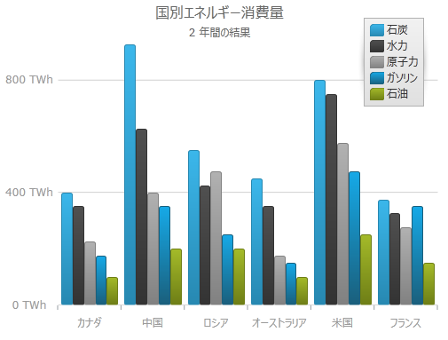

==== 関連トピック:

link:datachart-chart-title-and-subtitle.html[チャートのタイトルとサブタイトル]

[[_Ref367202849]]

=== 軸のタイトルとサブタイトル

x 軸および y 軸に情報を追加できます。

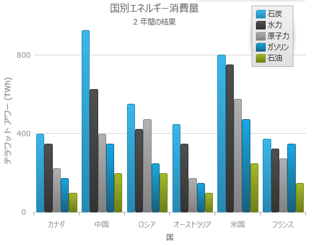

==== 関連トピック:

link:datachart-axis-title.html[軸タイトル]

[[_Ref367202852]]

=== 系列の強調表示

系列全体を強調表示、または系列内の特定の項目を強調表示することもできます。

強調表示は、系列固有の機能です。Line 系列などの単一図形系列では、折れ線全体が強調表示されます。Column 系列などの複数の図形から成る系列は、個々の図形 (柱状) が強調表示されます。サポートされるすべての系列で、個々のマーカーを強調表示できます。

系列強調表示機能は、以下の系列タイプをサポートします。

* Category 系列
* RangeCategory 系列
* Financial 系列
* 財務指標

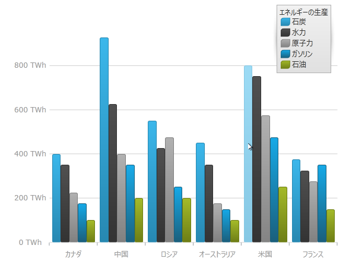

==== 関連トピック

link:datachart-series-highlighting.html[系列の強調表示]

[[_Ref367202860]]

=== トランジション イン アニメーション

この機能は、xamDataChart コントロールの初期化でシリーズのアニメーションを可能にします。

==== 関連トピック

link:datachart-transition-in-animations.html[トランジション イン アニメーション]

[[_Ref367197826]]

=== 軸の目盛

チャート プロット領域の外側に軸目盛を表示できます。これによって、各ラベルに目盛を表示でき、軸グリッドラインを目盛で置き換えることによってチャート外観を簡素化します。

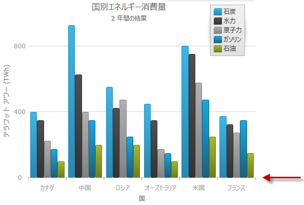

==== 関連トピック

link:datachart-axis-tick-marks.html[軸の目盛]

[[_Ref367197831]]

=== デフォルト ツールチップ

追加設定せずにデフォルトのツールチップを系列に表示でき、より有益な情報を提供できるようになりました。デフォルト ツールチップ テンプレートは、系列タイプによって情報を最適化します。

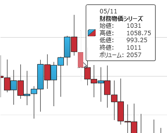

==== 関連トピック

link:datachart-chart-tooltips.html[チャート ツールチップ]

[[_Ref367197836]]

=== 影付き

この機能は、系列で影付き効果を設定するシンプルな API を公開します。

image::images/Whats_New_in_2013_Volume_2_WPF_4.png[]

==== 関連トピック

link:datachart-styling-the-chart-series.html[チャート系列のスタイル設定]

[[_Ref367197841]]

=== 新しいスタイル設定

新しい  _xamDataChart_   スタイルは、多数のビジュアルの変更やチャートの全体的なルック アンド フィールが向上した新しいプロパティ設定を提供します。

以下のスクリーン ショットは、デフォルト スタイルと新しいスタイルを比較しています。

===== デフォルト スタイル

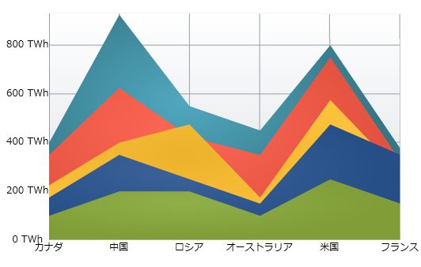

===== 新しいスタイル設定

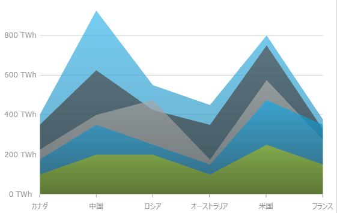

==== 関連トピック

新しいスタイルの適用 - 14.1 リリースでデフォルト スタイルになりました。詳細については、「 link:whats-new-in-2014-volume-1.html[2014 Volume 1 の新機能]」トピックを参照してください。

[[_Ref367202881]]
== xamDoughnutChart と xamPieChart

[[_Ref356571861]]

=== 引き出し線を曲線に設定

この機能は、 _xamDoughnutChart_   および  _xamPieChart_   で、引き出し線に使用する曲線や直接の 2 つのタイプを追加します。直線または曲線の選択、線のスタイル変更、ラベルと線の端の間のスペースなどを制御できます。

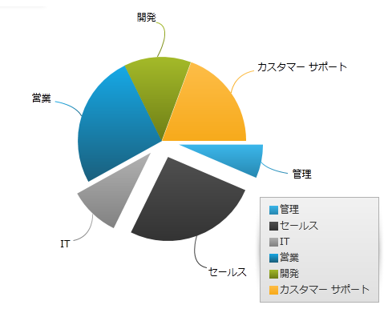

[[_Ref367202886]]
== _xamGeographicMap_

[[_Ref367202921]]

=== ギャラリー - 高密度散布シリーズ

新しいグラフィック高密度系列を使用すると、数百から数百万のデータポイントから広がる散布図データを最短の読み込み時間でバインドして表示できます。

系列ではデータ ポイントが非常に多いため、散布データを通常のマーカーではなく、小さなドットで表示します。最もデータが集約した領域は、データ ポイントのクラスターを高濃度の色で表します。

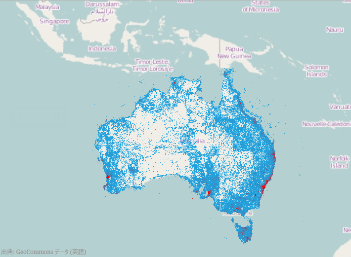

==== 関連トピック

link:geographicmap-using-geographic-high-density-scatter-series.html[ギャラリー - 高密度散布シリーズ]

[[_Ref367197863]]
== _xamLinearGauge_

[[_Ref367197859]]

=== 新規コントロール

_xamLinearGauge_   コントロールは、データをリニア ゲージ形式で視覚化するコントロールです。スケールおよび 1 つ以上の比較範囲と比較した主要な値をシンプルで簡潔に表示します。

image::images/Whats_New_in_2013_Volume_2_WPF_7.png[]

==== 関連トピック

link:lineargauge.html[xamLinearGauge]

[[_Ref367202940]]
== _xamRadialGauge_

[[_Ref367202945]]

_xamRadialGauge_™ コントロールは、ゲージを表示するデータ ビジュアライゼーション ツールです。スケール、目盛、ラベル、針、および範囲などの複数の視覚要素を含むことができます。link:{ApiPlatform}controls.gauges{ApiVersion}~infragistics.controls.gauges.xamradialgauge~minimumvalue.html[MinimumValue] および link:{ApiPlatform}controls.gauges{ApiVersion}~infragistics.controls.gauges.xamradialgauge~maximumvalue.html[MaximumValue] 値を設定してスケールを作成し、 link:{ApiPlatform}controls.gauges{ApiVersion}~infragistics.controls.gauges.xamradialgauge~value.html[Value] プロパティを設定すると、針で値をポイントします。またゲージは、スケールの視覚的な合図を示す範囲もサポートします。詳しくは、 link:radialgauge-configuring-ranges.html[範囲の構成] のトピックをご覧ください。

image::images/Whats_New_in_2013_Volume_2_WPF_8.png[]

==== 関連トピック

link:radialgauge.html[xamRadialGauge]

[[_Ref367202950]]
== _xamRichTextEditor_

[[_Ref367202953]]

_xamRichTextEditor_   は、テキスト、リスト、画像およびテーブルに限定せず、全般的なリッチ テキスト コンテンツの機能の表示および編集をするクロス プラットフォーム コントロールです。

以下のスクリーンショットは、リッチ コンテンツを編集するスプリット モードの  _xamRichTextEditor_   を示しています。

image::images/Whats_New_in_2013_Volume_2_WPF_9.png[]

==== 関連トピック

link:xamrichtexteditor.html[xamRichTextEditor]

[[_Ref367202956]]
== _xamSyntaxEditor_

[[_Ref367202961]]

=== XAML での分類型の定義

_xamSyntaxEditor_   コントロールでは、XAML で分類型の定義をサポートするようになりました。

image::images/Whats_New_in_2013_Volume_2_WPF_13.png[]

==== 関連トピック

link:xamsyntaxeditor-changing-default-classification-types-appearance.html[デフォルト分類タイプの外観の変更]

[[_Ref367710344]]
== _Metro Dark テーマ_

[[_Ref367710345]]

=== Metro Dark テーマ

コントロールの新しいタッチフレンドリーなダーク テーマ。

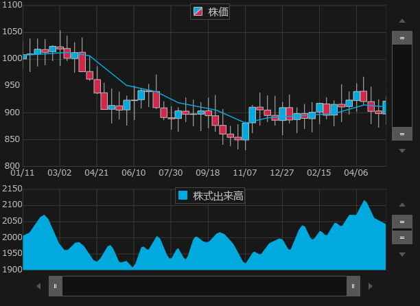

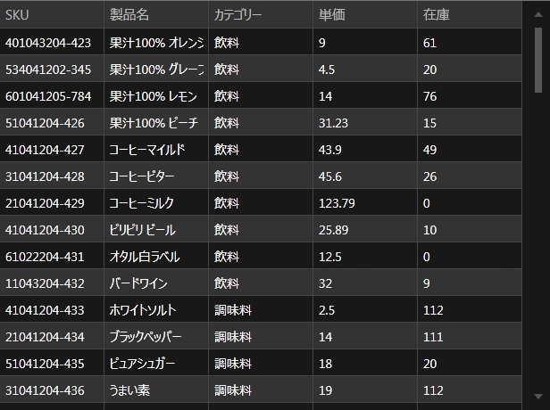

==== 関連トピック

link:designers-guide-using-themes.html[テーマの使用]

[[_Ref367710352]]
== _MS コントロールの暗黙のテーマ_

[[_Ref367710353]]

=== MS コントロールの暗黙のテーマ

すべての {ProductName} コントロールに提供されるテーマに加え、Infragistics はすべての Microsoft コントロールに暗黙のテーマを提供します。これらのテーマは、アプリケーションで Infragistics コントロールと Microsoft コントロールの両方を使用する場合もアプリケーションのスタイルを統一に保つことができます。

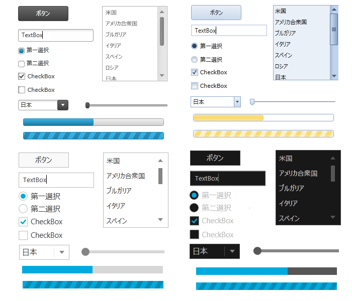

==== 関連トピック

link:ms-controls-implicit-themes.html[MS コントロールの暗黙のテーマ]