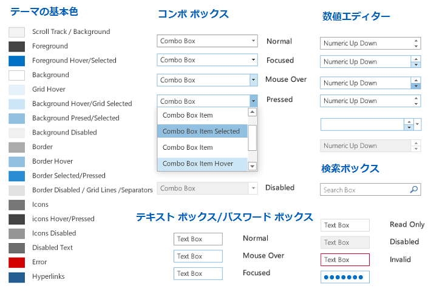
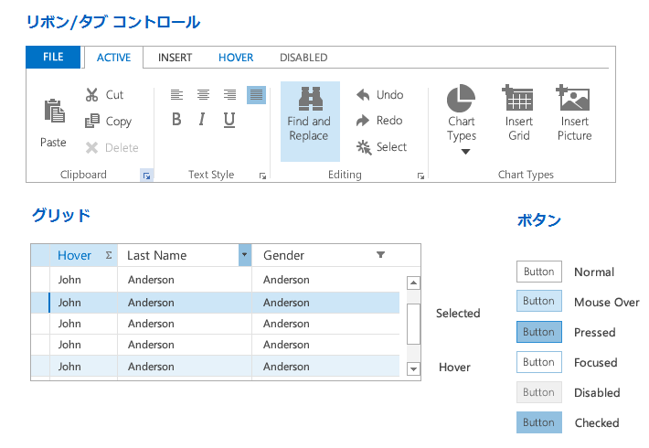
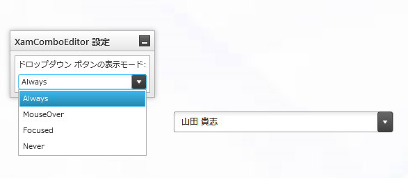
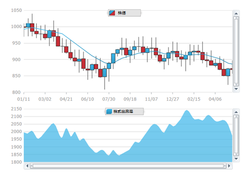
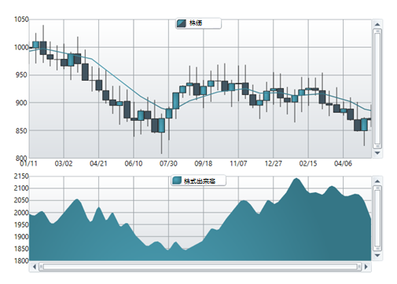
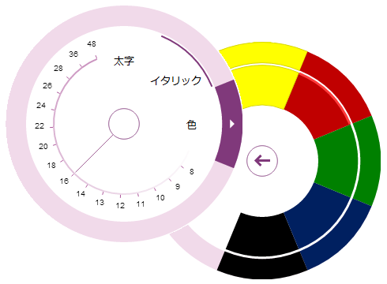

////
|metadata|
{
    "name": "whats-new-in-2014-volume-1",
    "controlName": [],
    "tags": ["Getting Started"],
    "guid": "ee77dd74-771b-470e-ae31-19e8749c40b3",
    "buildFlags": [],
    "createdOn": "2014-03-12T08:49:24.9357442Z"
}
|metadata|
////

= 2014 Volume 1 の新機能

== トピックの概要

=== 目的

このトピックでは、{ProductName} 2014 Volume 1 リリースで導入された新しいコントロールと機能の概要について説明します。

== 新機能の概要

=== 新機能の概要表

以下の表は、{ProductName} 2014 Volume 1 の新機能の概要を示します。詳細については、概要表の後をご覧ください。

====  _<<Ref383000576, Excel Engine >>_ 

[options="header", cols="a,a"]
|====
|機能|説明

|<<_Ref382985468,パスワード サポート>>
|この機能によって、パスワードで暗号化 / 保護されたブックを扱うことができます。

|====

====  _<<Ref382989956, Office 2013 のテーマ >>_ 

[options="header", cols="a,a"]
|====
|機能|説明

|<<_Ref382989968,新しいテーマ>>
|MS Office 2013 をモデルにした新しい "Office 2013" のテーマは、小奇麗なルック アンド フィールを与えます。

|====

====  _<<Ref383000599, xamComboEditor,   xamMultiColumnComboEditor >>_ 

[options="header", cols="a,a"]
|====
|機能|説明

|<<_Ref382846221,構成可能な選択された値および選択された値のコレクション>>
|この機能により、選択した値をコントロールでフレキシブルに設定 / 取得できます。

|<<_Ref382846679,構成可能な選択されたデータ項目コレクション>>
|この機能により、選択した項目をコントロールでフレキシブルに設定 / 取得できます。

|<<_Ref382846687,データ モデル プロパティの値による構成可能な選択されたデータ項目コレクション>>
|この機能により、コントロールのデータ モデル プロパティ値を使用して、選択された項目をフレキシブルに設定 / 取得できます。

|<<_Ref382846798,構成可能なドロップダウン ボタンの表示状態>>
|この機能により、ドロップダウン ボタンの表示状態を構成するオプションをコントロールで使用できます。

|<<_Ref382846892,構成可能なドロップダウン最小 / 最大幅>>
|この機能により、コントロールのドロップダウンの最大 / 最小幅をカスタマイズできます。

|<<_Ref382896266,カスタム項目のフィルタリング>>
|この機能により、より複雑なデータ項目フィルターを実装できます。

|<<_Ref382896361,SelectionChangedEventArgs の選択された / 選択されていない項目の公開>>
|この機能により、SelectionChanged イベントの引数に保持されている選択された / 選択されていない項目について、追加情報が得られます。

|====

====  _<<Ref383000610, xamComboEditor >>_ 

[options="header", cols="a,a"]
|====
|機能|説明

|<<_Ref382895799,ドロップダウンのサイズ変更ハンドル>>
|サイズ変更ハンドルがコントロールに追加され、コントロールのドロップダウンのサイズ変更を実行できます。

|====

====  _<<Ref382895884, xamDataChart >>_ 

[options="header", cols="a,a"]
|====
|機能|説明

|<<_Ref383095602,新しいデフォルトのスタイル>>
|これは _xamDataChart_ コントロールの新しいデフォルトのスタイルです。チャートの外観を向上させるため、視覚的に複数の変更が行われています。

|====

====  _<<Ref383000731, xamDataGrid >>_ 

[options="header", cols="a,a"]
|====
|機能|説明

|<<_Ref382984899,レコード番号設定>>
|この機能は、 _xamDataGrid_ のレコード セレクター列でいくつかの番号設定タイプから 1 つを選択する新しいプロパティを提供します。

|<<_Ref382984913,選択されたデータ項目プロパティ>>
|この機能は、現在選択されている _xamDataGrid_ の項目を操作する新しい `SelectedDataItems` プロパティを提供します。

|====

====  _<<Ref383000626, xamDataTree >>_ 

[options="header", cols="a,a"]
|====
|機能|説明

|<<_Ref382895891,構成可能なアクティブ データ項目>>
|この機能は、コントロールで現在アクティブなデータ項目を設定 / 取得する新しいプロパティを提供します。

|====

====  _<<Ref383000636, xamDiagram (CTP) >>_ 

[options="header", cols="a,a"]
|====
|機能|説明

|<<_Ref382908052,新規コントロール>>
|新しいダイアグラム作成コントロールです。

|====

====  _<<Ref383000645, xamInputs >>_

[options="header", cols="a,a"]
|====
|機能|説明

|<<_Ref382908048,元に戻す / やり直しを有効 / 無効にする>>
|この機能は、xamInputs コントロールで元に戻す / やり直し操作を有効 / 無効にする新しいプロパティを提供します。

|====

====  _<<Ref383000650, xamPivotGrid >>_

[options="header", cols="a,a"]
|====
|機能|説明

|<<_Ref382908057,KPI 視覚エフェクト サポート>>
|_xamPivotGrid_ および _xamPivotDataSelector_ コントロールは、KPI (キー パフォーマンス インジケーター) のグラフィカルな視覚エフェクトをサポートします。

|====

====  _<<Ref382982190, xamRadialMenu >>_

[options="header", cols="a,a"]
|====
|機能|説明

|<<_Ref382982211,新規コントロール>>
|_xamRadialMenu_ コントロールは、中央ボタンの周りに項目を表示するコンテキスト メニューです。

|====

====  _<<Ref382987387, xamRibbon >>_

[options="header", cols="a,a"]
|====
|機能|説明

|<<_Ref382987462,Backstage 2013>>
|この機能により、新しい "Office 2013" のテーマを使用したときに表示される _xamRibbon_ のバックステージの外観が新しくなります。

|<<_Ref382987474,タブ項目領域ツール バー>>
|この機能により、 _xamRibbon_ のタブの隣にツール バーを作成できます。

|====

====  _<<Ref382986857, xamRichTextEditor >>_

[options="header", cols="a,a"]
|====
|機能|説明

|<<_Ref382986881,HTML インポート / エクスポート>>
|この機能により、 _xamRichTextEditor_ コントロールとの間で HTML データをインポート / エクスポートできます。

|<<_Ref382986886,IME サポート>>
|この機能により、 _xamRichTextEditor_ コントロールの編集領域にアジア言語を直接入力できます。

|====

====  _<<Ref382986870, xamSyntaxEditor >>_

[options="header", cols="a,a"]
|====
|機能|説明

|<<_Ref382986894,IME サポート>>
|この機能により、 _xamSyntaxEditor_ コントロールの編集領域にアジア言語を直接入力できます。

|====

[[_Ref382985454]]
[[_Ref382833905]]
[[_Ref382836652]]

[[_Ref383000576]]
== _Excel Engine_

[[_Ref382985468]]

=== パスワード サポート

この機能によって、パスワードで暗号化 / 保護されたブックを扱うことができます。

==== 関連するトピック:

link:excelengine-password-support.html[パスワード サポート]

[[_Ref382989956]]
== _Office 2013 のテーマ_

[[_Ref382989968]]

=== 新しいテーマ

MS Office 2013 をモデルにした新しい "Office 2013" のテーマは、小奇麗なルック アンド フィールを与えます。この新しい Office 2013 テーマは、Infragistics のすべてのコントロールに適用できるだけでなく、一般的なマイクロソフトのコントロールにも適用できます。

==== 関連するトピック:

* link:designers-guide-using-themes.html[テーマ]
* link:ms-controls-implicit-themes.html[MS コントロールの暗黙のテーマ]

[[_Ref383000599]]
== _xamComboEditor_  _,_   _xamMultiColumnComboEditor_

[[_Ref382846221]]

=== 構成可能な選択された値と選択された値のコレクション

この機能により、開発者は以下の新しいプロパティを使用して、コントロールで選択されている値や選択された値のコレクションを設定 / 取得できます。

* `SelectedValue`
* `SelectedValues`
* `SelectedValuePath`

==== 関連するトピック:

* link:xamcomboeditor-performing-selection-programmatically.html[選択をプログラムで実行 (xamComboEditor)]
* link:xammulticee-performing-selection-programmatically.html[選択をプログラムで実行 (xamMultiColumnComboEditor)]

[[_Ref382846679]]

=== 構成可能な選択されたデータ項目コレクション

この機能により、開発者は機能拡張された `SelectedItems` プロパティを使用して、コントロールで選択されたデータ項目コレクションを設定 / 取得できます。

==== 関連するトピック:

* link:xamcomboeditor-performing-selection-programmatically.html[選択をプログラムで実行 (xamComboEditor)]
* link:xammulticee-performing-selection-programmatically.html[選択をプログラムで実行 (xamMultiColumnComboEditor)]

[[_Ref382846687]]

=== データ モデル プロパティの値による構成可能な選択されたデータ項目コレクション

この機能により、開発者は新しい `IsSelectedMemberPath` プロパティを使用して、コントロールのデータ項目の選択 / 選択解除状態をブール値で定義するデータ モデル プロパティ名を構成できます。

==== 関連するトピック:

* link:xamcomboeditor-performing-selection-programmatically.html[選択をプログラムで実行 (xamComboEditor)]
* link:xammulticee-performing-selection-programmatically.html[選択をプログラムで実行 (xamMultiColumnComboEditor)]

[[_Ref382846798]]

=== 構成可能なドロップダウン ボタンの表示状態

この機能により、開発者は新しい `DropDownButtonDisplayMode` プロパティを使用してコントロールのドロップダウン ボタンを表示する時期を構成できます。オプションは、常に表示 (既定値)、マウスが置かれたときに表示、フォーカスが置かれたときに表示、常に非表示です。

==== 関連するトピック:

* link:xamcomboeditor-adding-xamcomboeditor-to-your-page.html[xamComboEditor をページに追加]
* link:xammulticce-adding.html[xamMultiColumnComboEditor をページに追加]

[[_Ref382846892]]

=== 構成可能なドロップダウン最小 / 最大幅

この機能により、開発者は以下の新しいプロパティを使用してコントロールのドロップダウンの最大幅と最小幅を構成できます。

* `MinDropDownWidth`
* `MaxDropDownWidth`

==== 関連するトピック:

* link:xamcomboeditor-dropdown-resizing.html[ドロップダウン サイズの構成 (xamComboEditor)]
* link:xammulticee-configuring-the-drop-down.html[ドロップダウンの構成 (xamMultiColumnComboEditor)]

[[_Ref382896266]]

=== カスタム項目のフィルタリング

この機能により、開発者は項目のフィルタリングをカスタマイズできます。より複雑なフィルターの作成、フィルタリング対象となるデータ フィールドの複数指定、または複数のフィルター条件のデータ フィールドごとの追加ができるようになりました。

image::images/WhatsNew_14.1_WPF_2.png[]

==== 関連するトピック:

* link:xamcomboeditor-custom-filtering.html[項目のフィルタリングの構成 (xamComboEditor)]
* link:xammulticee-configuring-item-filtering.html[項目のフィルタリングの構成 (xamMultiColumnComboEditor)]

[[_Ref382896361]]

=== SelectionChangedEventArgs の選択された / 選択されていない項目の公開

この機能により、開発者は `SelectionChanged` イベントの引数や AddedItems および RemovedItems コレクションに保持されている選択された / 選択されていない項目について、追加情報が得られます。

==== 関連するトピック:

* link:xamcomboeditor-performing-selection-programmatically.html[選択をプログラムで実行 (xamComboEditor)]
* link:xammulticee-performing-selection-programmatically.html[選択をプログラムで実行 (xamMultiColumnComboEditor)]

[[_Ref382895789]]

[[_Ref383000610]]
== _xamComboEditor_

[[_Ref382895799]]

=== ドロップダウンのサイズ変更ハンドル

サイズ変更ハンドルが  _xamComboEditor_   ドロップダウンに追加されたため、実行時にドロップダウンのサイズを簡単に変更できます。

==== 関連するトピック:

* link:xamcomboeditor-dropdown-resizing.html[ドロップダウン サイズの構成 (xamComboEditor)]

[[_Ref382984879]]
[[_Ref382895884]]
== _xamDataChart_

[[_Ref383095602]]

=== 新しいデフォルトのスタイル

新しい xamDataChart スタイルは、多数のビジュアルな変更およびチャートの全体的なルック アンド フィールが向上した新しいプロパティ設定を提供します。

以下のスクリーンショットは、チャートの新しいデフォルト スタイルとこれまでのスタイルを比較しています。

*新しいデフォルト スタイル:*

*これまでのデフォルト スタイル:*

[[_Ref383000731]]
== _xamDataGrid_

[[_Ref382984899]]

=== レコード番号設定

レコード番号設定機能を使用すると、さまざまな番号設定タイプから 1 つを  _xamDataGrid_   のレコード セレクター列に表示できます。

==== 関連するトピック:

link:xamdatagrid-record-numbering.html[レコード番号]

[[_Ref382984913]]

=== 選択されたデータ項目プロパティ

この機能により新しい `SelectedDataItems` プロパティが導入され、モデル ビュー ビューモデル (MVVM) アーキテクチャを使用しながら現在選択されている  _xamDataGrid_   の項目を操作できます。

==== 関連するトピック:

link:xamdatagrid-selected-data-items.html[選択されたデータ項目]

[[_Ref383000626]]
== _xamDataTree_

[[_Ref382895891]]

=== 構成可能なアクティブ データ項目

この機能により、開発者は新しい `ActiveDataItem` プロパティを使用して、モデル ビュー ビューモデル (MVVM) アーキテクチャを使用しながら現在アクティブな  _xamDataTree_   データ項目を識別および操作できます。

==== 関連するトピック:

* link:xamdatatree-active-data-item.html[アクティブ データ項目の構成]

[[_Ref382895914]]
[[_Ref382908033]]

[[_Ref383000636]]
== _xamDiagram (CTP)_

[[_Ref382908052]]

=== 新規コントロール

WPF の  _xamDiagram_   を使用すると、Visio などのダイアグラム作成ツールに求められる機能をすべて備えた独自のダイアグラム作成ソリューションを作成できます。_xamDiagram_   には、簡単なフローチャート、アクティビティ図から複雑な LinqToSQL 関係図まで、あらゆる図を描くうえで必要なすべての機能がはじめから搭載されています。

image::images/WhatsNew_14.1_WPF_7.png[]

==== 関連するトピック:

* link:xamdiagram-overview.html[xamDiagram の概要]

[[_Ref382908037]]

[[_Ref383000645]]
== _xamInputs_

[[_Ref382908048]]

=== 元に戻す / やり直しを有効 / 無効にする

この機能により、開発者は新しい `IsUndoEnabled` プロパティを使用して、入力コントロールで元に戻す / やり直し操作を有効 / 無効にすることができます。

[[_Ref382908040]]

[[_Ref383000650]]
== _xamPivotGrid_

[[_Ref382908057]]

=== KPI 視覚エフェクト サポート

KPI データは、 _xamPivotDataSelector_   と  _xamPivotGrid_   コントロールを一緒に使用し、グラフィックとして表示できます。_xamPivotDataSelector_   コントロールには、サーバーで計算された KPI のメンバーが含まれる別のフォルダーが表示されます。_xamPivotGrid_   は、KPI またはその実際の値をグラフィックで表示します。カスタム KPI のセル テンプレートもサポートされます。

image::images/WhatsNew_14.1_WPF_8.png[]

==== 関連するトピック:

* link:xampivotgrid-kpis-visualization-overview.html[KPI 視覚エフェクトの概要 (xamPivotGrid, xamPivotDataSelector)]

[[_Ref382982190]]
== _xamRadialMenu_

[[_Ref382982211]]

=== 新規コントロール

_xamRadialMenu_   コントロールは、中央ボタンの周りに項目を表示するコンテキスト メニューです。項目を円形に配置することで項目をすばやく選択できます。各項目は中央に対して均等に配置されます。_xamRadialMenu_   は、数値、色値、または操作を実行する項目タイプをサポートします。サブ項目もサポートします。

==== 関連するトピック:

link:xamradialmenu.html[xamRadialMenu]

[[_Ref382987387]]
== _xamRibbon_

[[_Ref382987462]]

=== Backstage 2013

この機能により、新しい "Office 2013" のテーマを使用したときに表示される  _xamRibbon_   のバックステージの外観が新しくなります。

==== 関連するトピック:

link:xamribbon-applicationmenu2010-overview.html[アプリケーション メニュー 2010 の概要]

[[_Ref382987474]]

=== タブ項目領域ツールバー

この機能により、 _xamRibbon_   のタブの隣にツールバーを作成できます。

==== 関連するトピック:

link:xamribbon-tab-item-area-toolbar.html[タブ項目領域ツールバー]

[[_Ref382986857]]
== _xamRichTextEditor_

[[_Ref382986881]]

=== HTML インポート / エクスポート

この機能により、HTML シリアライザーのメソッドを呼び出す、または HTML ドキュメント アダプターをバインドすることで  _xamRichTextEditor_   コントロールとの間で HTML データをインポート / エクスポートできます。

==== 関連するトピック:

link:xamrichtexteditor-import-export-html.html[HTML のインポート / エクスポート]

[[_Ref382986886]]

=== IME サポート

この機能により、入力メソッド構成と候補リストを使用して  _xamRichTextEditor_   コントロールの編集領域にアジア言語を直接入力できます。

==== 関連するトピック:

link:xamrichtexteditor-ime-support.html[IME サポート]

[[_Ref382986870]]
== _xamSyntaxEditor_

[[_Ref382986894]]

この機能により、入力メソッド構成と候補リストを使用して  _xamSyntaxEditor_   コントロールの編集領域にアジア言語を直接入力できます。

==== 関連するトピック:

link:xamsyntaxeditor-ime-support.html[IME サポート]