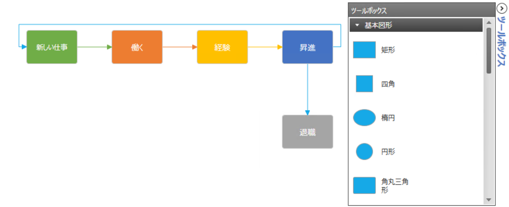
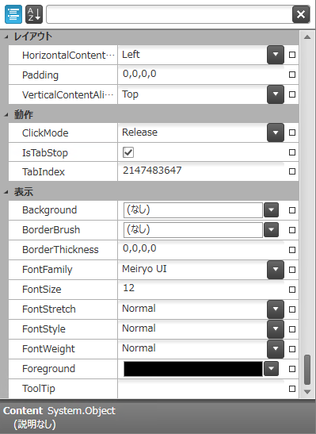
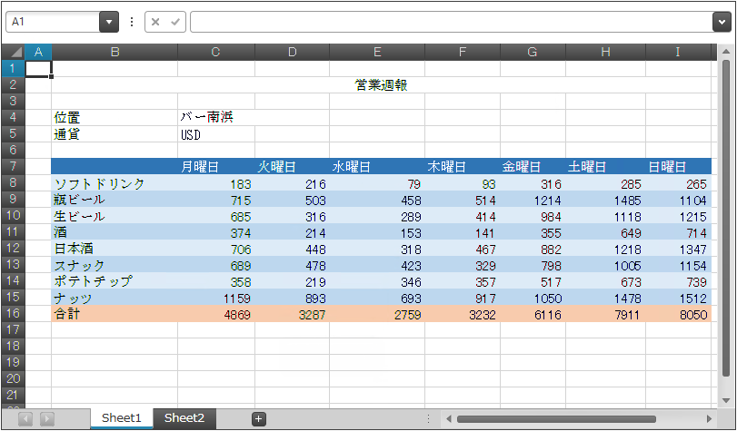

////
|metadata|
{
    "name": "whats-new-in-2014-volume-2",
    "controlName": [],
    "tags": ["Getting Started"],
    "guid": "3986ab37-5ca6-4d4a-9dd4-acedde68f6ca",
    "buildFlags": [],
    "createdOn": "2014-09-11T10:10:12.9875132Z"
}
|metadata|
////

= 2014 Volume 2 の新機能

== トピックの概要

=== 目的

このトピックでは、{ProductName} 2014 Volume 2 リリースで導入された新しいコントロールと機能の概要について説明します。

== 新機能の概要

=== 新機能の概要表

以下の表は、{ProductName} 2014 Volume 2 の新機能の概要を示します。詳細については、概要表の後をご覧ください。

====  _<<Ref398190917, Infragistics Excel Engine >>_ 

[options="header", cols="a,a"]
|====
|機能|説明

|<<_Ref398192011,バインドを容易にする機能>>
|MVVM のバインドを容易にする機能が追加されました。

|<<_Ref398192020,セル、列および行の処理>>
|セル、列および行の処理操作が追加されました。

|<<_Ref398192028,元に戻す/やり直しのサポート>>
|元に戻す / やり直しのサポート機能 ( _xamSpreadsheet_ コントロールで使用した場合) が追加されました。

|====

====  _<<Ref398198437, Infragistics ThemeManager >>_ 

[options="header", cols="a,a"]
|====
|機能|説明

|<<_Ref398198876,新規コントロール>>
|_Infragistics Theme Manager_ は、テーマを Infragistics のすべてのコントロールおよび Microsoft の一般的な WPF コントロールに、迅速かつ簡単に適用する手段となります。

|====

====  _<<Ref398199259, xamColorPicker >>_ 

[options="header", cols="a,a"]
|====
|機能|説明

|<<_Ref398205955,選択した色をプレビュー>>
|新しい SelectedColorPreview プロパティは、現在ホバーされている色を取得し設定します。

|====

====  _<<Ref398213088, xamDataPresenter >>_ 

[options="header", cols="a,a"]
|====
|機能|説明

|<<_Ref398216063,Field および FieldLayout Objects の DataContext へのバインド>>
|MVVM のバインドを容易にする機能が追加されました。

|<<_Ref398216071,Field、FieldSettings、FieldLayout および FieldLayoutSettings の MVVM プロパティへのバインド>>
|新しい FieldBinding マークアップ拡張子は、Field、FieldSettings、FieldLayout および FieldLayoutSettings の MVVM プロパティへのバインドを容易にします。

|<<_Ref398216082,セル設定のデータ項目プロパティへのバインド>>
|新しい CellBindings コレクション プロパティは、関連付けられたデータ項目から公開されたプロパティへのセル設定のバインドを容易にします。

|<<_Ref398216090,特定のエディター フィールド>>
|新しいエディター フィールドは、特定のデータ型を処理するための特定のエディターを簡単に指定する手段となります。

|<<_Ref398216097,テンプレート フィールド>>
|テンプレート フィールドは、 _xamDataPresenter_ コントロールで、表示モードおよび編集モード用のカスタム データ テンプレートを指定する機能を提供します。

|<<_Ref398216105,非バインド フィールド>>
|_xamDataPresenter_ コントロールの各フィールドは、非バインド フィールドとして構成できるようになりました。

|<<_Ref398216112,IsTabStop、IsEnabled、IsEnabledInAddRecord および IsReadOnly が新しいプロパティとして追加されました。>>
|フィールドおよびセルのオブジェクトを構成するための新しいプロパティが追加されました。

|====

====  _<<Ref398206270, xamDataTree >>_ 

[options="header", cols="a,a"]
|====
|機能|説明

|<<_Ref398207086,選択されたデータ項目>>
|新しい SelectedDataItems プロパティは選択したデータ項目を取得または設定します。

|<<_Ref398207093,データ モデルのブール値プロパティの値で項目選択の変更>>
|新しい IsSelectedMemberPath プロパティは、データ項目が選択されるかどうかを決定するデータ モデルのブール値プロパティへのパスを構成します。

|====

====  _<<Ref396728561, xamDiagram >>_ 

[options="header", cols="a,a"]
|====
|機能|説明

|<<_Ref382908052,新規コントロール>>
|新しいダイアグラム作成コントロールです。

|====

====  _<<Ref398131332, xamPropertyGrid >>_ 

[options="header", cols="a,a"]
|====
|機能|説明

|<<_Ref398131389,新規コントロール>>
|このコントロールでは、プロパティが簡単に編集できます。

|====

====  _<<Ref398131340, xamSpreadSheet >>_ 

[options="header", cols="a,a"]
|====
|機能|説明

|<<_Ref398131381,新規コントロール>>
|スプレッドシート データの表示と編集ができるコントロールです。

|====

====  _<<Ref398131341, xamPivotGrid >>_ 

[options="header", cols="a,a"]
|====
|機能|説明

|<<_Ref398131382,印刷>>
|OLAP データを印刷するための組み込み機能

|====

[[_Ref398190917]]
== _Infragistics Excel Engine_

[[_Ref398192011]]

=== バインドを容易にする機能

_Infragistics Excel Engine_   の `Workbook` クラスと `Worksheet` クラスは、プロパティへのバインドを容易にするために、`INotifyPropertyChanged` インターフェイスを実装しています。

==== 関連するトピック:

* link:{ApiPlatform}documents.excel{ApiVersion}~infragistics.documents.excel.workbook.html[ワークブック]
* link:{ApiPlatform}documents.excel{ApiVersion}~infragistics.documents.excel.worksheet.html[ワークシート]

[[_Ref398192020]]

=== セル、列および行の処理

_Infragistics Excel Engine_   は、セル、列、行を追加、削除するメソッドをサポートします。

==== 関連するトピック:

link:excelengine-inserting-and-deleting-cells.html[セル、列、行の挿入と削除 (Infragistics Excel Engine)]

[[_Ref398192028]]

=== 元に戻す/やり直しのサポート

_Infragistics Excel Engine_   は、 _xamSpreadsheet_   コントロールで使用した場合、元に戻す / やり直し操作をサポートします。

==== 関連するトピック:

link:spreadsheet-features.html[機能の概要 (xamSpreadsheet)]

[[_Ref398198437]]
== _Infragistics ThemeManager_

[[_Ref398198876]]

=== 新規コントロール

_Infragistics ThemeManager_   の主な目的は、1 行のコードを使用して、指定されたテーマをアプリケーションまたはコントロールに簡単に適用する方法を提供することです。

==== 関連するトピック:

link:thememanager-overview.html[機能の概要 (ThemeManager)]

[[_Ref398199259]]
== _xamColorPicker_

[[_Ref398205955]]

=== 選択した色をプレビュー

新しい `SelectedColorPreview` プロパティは、現在ホバーされている色を取得または設定します。

==== 関連するトピック:

link:xamcolorpicker-selected-color.html[選択した色の構成]

[[_Ref398213088]]
== _xamDataPresenter_

[[_Ref398216063]]

=== Field および FieldLayout Objects の DataContext へのバインド

Field/FieldLayout `DataContext` プロパティは、MVVM のバインドを容易にします。

==== 関連するトピック:

link:xamdatapresenter-binding-field-fieldlayout-to-mvvm.html[Field、FieldSettings、FieldLayout および FieldLayoutSettings の MVVM プロパティへのバインド]

[[_Ref398216071]]

=== Field、FieldSettings、FieldLayout および FieldLayoutSettings の MVVM プロパティへのバインド

新しい `FieldBinding` マークアップ拡張子は、Field、FieldSettings、FieldLayout および FieldLayoutSettings の MVVM プロパティへのバインドを容易にします。

==== 関連するトピック:

link:xamdatapresenter-binding-field-fieldlayout-to-mvvm.html[Field、FieldSettings、FieldLayout および FieldLayoutSettings の MVVM プロパティへのバインド]

[[_Ref398216082]]

=== セル設定のデータ項目プロパティへのバインド

新しい `CellBindings` コレクション プロパティは、関連付けられたデータ項目から公開されたプロパティへのセル設定のバインドを容易にします。

==== 関連するトピック:

link:xamdatapresenter-binding-cell-settings-data-item-properties.html[セル設定のデータ項目プロパティへのバインド]

[[_Ref398216090]]

=== 特定のエディター フィールド

新しい特定のエディター フィールドは、特定のデータ型を処理するための特定のエディターを簡単に指定する手段となります。

以下のエディター フィールドがあります。

* チェックボックス フィールド
* コンボ ボックス フィールド
* 通貨フィールド
* 日付 / 時刻フィールド
* マスクされたテキスト フィールド
* 数値フィールド
* テキスト フィールド

==== 関連するトピック:

link:xamdatapresenter-configuring-specific-editor-fields.html[特定のエディター フィールドの構成]

[[_Ref398216097]]

=== テンプレート フィールド

テンプレート フィールドは、 _xamDataPresenter_   コントロールで、表示モードおよび編集モード用のカスタム データ テンプレートを指定する機能を提供します。

==== 関連するトピック:

link:xamdatapresenter-configuring-template-field.html[テンプレート フィールドの構成]

[[_Ref398216105]]

=== 非バインド フィールド

`BindingType` プロパティを `Unbound` に設定することで、すべての`フィールド`を非バインド フィールドとして構成できるようになりました。

==== 関連するトピック:

link:xamdatapresenter-add-unbound-fields-to-a-datapresenter-control.html[非バインド フィールドの構成]

[[_Ref398216112]]

=== IsTabStop、IsEnabled、IsEnabledInAddRecord および IsReadOnly が新しいプロパティとして追加されました。

以下の新しいプロパティが、`Field` オブジェクトに追加されました。`IsReadOnly`、`IsEnabledInAddRecord`、`IsEnabled` および`セル`または`フィールド`用の `IsTabStop` プロパティ。

==== 関連するトピック:

* link:xamdatapresenter-configuring-readonly-fields-disabling-cells.html[読み取り専用フィールドの構成およびフィールドのセルの無効化]
* link:xamdatapresenter-configuring-custom-tab-navigation.html[カスタム タブのナビゲーションの構成]

[[_Ref398206270]]
== _xamDataTree_

[[_Ref398207086]]

=== 選択されたデータ項目

新しい `SelectedDataItems` プロパティは選択したデータ項目のコレクションを取得または設定します。

==== 関連するトピック:

link:xamdatatree-performing-selection-programmatically.html[プログラムによる選択の実行]

[[_Ref398207093]]

=== データ モデルのブール値プロパティの値で項目選択の変更

_xamDataTree_   コントロールで項目の現在の状態を決定するために基本データ モデルのブール値プロパティを使用して、選択済み/未選択のデータ項目を構成します。このデータ モデル プロパティ名は新しい `IsSelectedMemberPath` プロパティによって設定されます。

==== 関連するトピック:

link:xamdatatree-performing-selection-programmatically.html[プログラムによる選択の実行]

[[_Ref396728561]]
== _xamDiagram_

[[_Ref382908052]]

=== 新規コントロール

_xamDiagram_   コントロール (WPF 2014 Volume 1 リリースの CTP としてリリース) を使用すると、高度なダイアグラム作成ツールに求められる機能をすべて備えた独自のダイアグラム作成ソリューションを作成できます。_xamDiagram_   には、簡単なフローチャート、アクティビティ図から複雑な LinqToSQL 関係図まで、あらゆる図を描く際に必要なすべての機能と、データ バインドおよび MVVM のサポート機能が搭載されています。

==== 関連するトピック:

link:xamdiagram-overview.html[xamDiagram の概要]

[[_Ref398131332]]
== _xamPropertyGrid_

[[_Ref398131389]]

_xamPropertyGrid_   コントロールでは、単一のオブジェクトまたは複数のオブジェクトを簡単に編集できます。以下のスクリーンショットは、カテゴリによりグループ化された多数のオブジェクトのプロパティを表示 / 編集する際の  _xamPropertyGrid_   を示しています。

==== 関連するトピック:

link:xampropertygrid.html[xamPropertyGrid]

[[_Ref398131340]]
== _xamSpreadSheet_

[[_Ref398131381]]

_xamSpreadsheet_   コントロールでは、 _Infragistics Excel Engine_   でサポートされるデータ モデルによって表されるスプレッドシートを表示、編集できます。

以下のスクリーンショットは、複数のスプレッドシート データを表示する  _xamSpreadsheet_   コントロールを示します。

==== 関連するトピック:

link:spreadsheet.html[xamSpreadSheet]

[[_Ref398131341]]
== _xamPivotGrid_

[[_Ref398131382]]

=== 印刷

WPF レポート作成フレームワークを使用すると、xamPivotGrid の印刷、または XPS ドキュメントへのエクスポートができます。

==== 関連するトピック:

link:xampivotgrid-printing.html[xamPivotGrid の印刷]